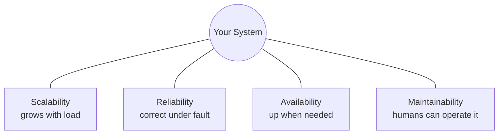
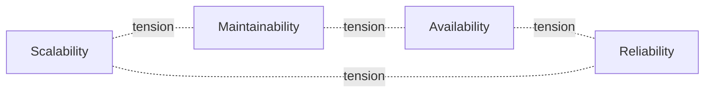

# Scalability, Reliability, Availability, Maintainability

> **TL;DR** — Every system is judged on four "ilities":
> - **Scalability** — handles more load by growing.
> - **Reliability** — does the right thing, even when things go wrong.
> - **Availability** — is up when users need it.
> - **Maintainability** — humans can keep it running and evolving.
>
> These four are independent (a reliable system can be unscalable, a highly available system can be unmaintainable) and they trade off against each other. Naming which property you're optimizing for is the foundation of every design decision.

---

## 1. Why These Four?

Software has hundreds of qualities. These four are the ones that matter at scale, in production, over time. Martin Kleppmann opens *Designing Data-Intensive Applications* with this exact framing — and almost every cloud provider's "well-architected framework" is some flavor of it (with security and cost tacked on).



---

## 2. Scalability

### Definition
The ability to handle increased load — more users, more data, more requests, more events — **without a proportional increase in complexity or cost**.

### What "load" actually means
Pick the right load parameter for your system. The *wrong* parameter leads to optimizing the wrong thing.

| System type | Load parameter |
| --- | --- |
| Web app | Requests per second |
| Database | Reads/sec, writes/sec |
| Cache | Hit ratio, working-set size |
| Chat | Active connections, messages/sec, fan-out factor |
| Twitter | Followers per user (the *fan-out factor* is the real load) |
| Analytics | Rows ingested/sec, query complexity |

The Twitter example matters: the average tweet → 200 follower writes is fine. A celebrity tweet → 100 M follower writes can melt a naive design. **Load is rarely just "users".**

### Vertical vs Horizontal Scaling
- **Vertical (scale up)** — give the same box more CPU, RAM, disk. Simple but hits hardware limits and is expensive at the top end.
- **Horizontal (scale out)** — add more boxes. Cheap, theoretically unlimited, but every box adds coordination complexity.

Most modern systems use *both*: scale up to a sensible box size, then scale out.

See: [Vertical vs Horizontal Scaling →](./vertical-vs-horizontal-scaling.md)

### Common scaling techniques
- **Replication** — copies for redundancy and read scaling.
- **Sharding/Partitioning** — splits data across nodes.
- **Caching** — short-circuits the expensive path.
- **Load balancing** — spreads requests evenly.
- **Async processing** — moves work to queues.
- **CDN / edge** — serve closer to users.
- **Read replicas** — many readers, one writer.
- **Denormalization** — precompute joins.

### Measuring scalability
- *How does latency change as load increases?* (the Throughput–Latency curve)
- *What is the **scalability ceiling**?* (the point where adding hardware stops helping)
- *Is scaling linear, sub-linear, or super-linear?* (sub-linear = diminishing returns; super-linear = coordination explosion)

> **Senior move:** never just say "we'll scale horizontally". Say *what* gets sharded, *by what key*, and *what consistency you give up.*

---

## 3. Reliability

### Definition
The system **continues to work correctly** even when things go wrong — hardware fails, software bugs trigger, networks blip, humans make mistakes.

Notice "correctly" — reliability is about *doing the right thing*. A system can be highly available (always responding) but unreliable (returning wrong answers). They are distinct.

### Faults vs Failures
- **Fault** — a single component deviates from spec (a disk dies, a packet drops, a process crashes).
- **Failure** — the system as a whole stops providing service to users.

**Goal: faults should not become failures.** That's the engineering work.

### Categories of faults

| Category | Examples | Defenses |
| --- | --- | --- |
| **Hardware faults** | Disk dies, CPU error, machine reboots | Replication, redundancy, hot spares |
| **Software faults** | Bug, memory leak, runaway query | Tests, canary deploys, rate limits, circuit breakers |
| **Human errors** | Wrong config push, accidental DROP TABLE | Pre-prod env, code review, IaC, immutable infra |
| **Network faults** | Partition, packet loss, latency spike | Retries, timeouts, idempotency, region failover |

### Building reliable systems
- **Redundancy** — N+1 (or N+2) of every component.
- **Idempotency** — operations safe to retry.
- **Graceful degradation** — when X breaks, you still serve a degraded experience.
- **Circuit breakers** — stop hammering a sick downstream.
- **Bulkheads** — fault isolation between subsystems.
- **Chaos engineering** — break things on purpose to find weaknesses.
- **Postmortems** — learn from every incident.

### Reliability metrics
- **MTBF** (Mean Time Between Failures) — how long between bad days.
- **MTTR** (Mean Time To Recovery) — how long bad days last.
- **MTTD** (Mean Time To Detect) — how fast you know something's wrong.
- **Failure rate (per million ops)** — how rare the bad events are.

---

## 4. Availability

### Definition
The fraction of time the system is **responsive to user requests**. Usually expressed as a percentage:

```
Availability = uptime / (uptime + downtime)
```

### The "Nines" Table

| Availability | Downtime per year | Downtime per month | Downtime per week |
| --- | --- | --- | --- |
| 90% (one nine) | 36.5 days | 72 hours | 16.8 hours |
| 99% (two nines) | 3.65 days | 7.2 hours | 1.68 hours |
| 99.9% ("three nines") | 8.76 hours | 43.2 minutes | 10.1 minutes |
| 99.99% ("four nines") | 52.6 minutes | 4.32 minutes | 1.01 minutes |
| 99.999% ("five nines") | 5.26 minutes | 25.9 seconds | 6.05 seconds |
| 99.9999% ("six nines") | 31.5 seconds | 2.59 seconds | 0.6 seconds |

Most internet services target **99.9–99.99%**. Five nines is hyperscaler/telco territory and costs an order of magnitude more.

### Availability ≠ Reliability
A system that returns "500 Internal Server Error" within 100 ms is *available* (responding) but *unreliable* (wrong answer). A system that returns correct answers but only 90% of the time is reliable when up but not available.

### Boosting availability
- **Eliminate single points of failure (SPOFs)** — every component has a backup.
- **Multi-AZ** — survives one datacenter failure.
- **Multi-region** — survives one region failure.
- **Load balancing + health checks** — bad nodes get pulled.
- **Graceful degradation** — partial functionality > total outage.
- **Fast detection + automated failover** — drives MTTR down.
- **Reduce deploy risk** — canaries, blue-green, feature flags.

### Compound availability
If your service depends on N independent services, each with availability `a`:
```
Total availability = a₁ × a₂ × ... × aₙ
```
Five 99.9% dependencies in series → 99.5% total. That's why **decoupling matters** (queues, fallbacks, caches) and **redundancy matters** (a × b in parallel = `1 − (1−a)(1−b)`, much higher).

### SLA, SLO, SLI (the contract triplet)

- **SLI (Indicator)** — what you actually measure ("p99 latency", "% successful requests").
- **SLO (Objective)** — internal target ("p99 < 200 ms for 99.9% of minutes").
- **SLA (Agreement)** — external contract with customer ("99.9% monthly uptime or we refund X").

**Always SLO < SLA.** Internal targets must be stricter than external promises, so you have buffer.

See: [SLA, SLO, SLI →](../11-reliability/sla-slo-sli.md)

---

## 5. Maintainability

### Definition
The ability of **future engineers** (often: you, in six months) to operate, modify, and extend the system without pain.

Maintainability is the least glamorous "ility" and the one that quietly destroys companies. A system that no one understands is a ticking clock.

### Three sub-properties (Kleppmann)
1. **Operability** — easy for ops to run. Good monitoring, predictable behavior, simple deploys.
2. **Simplicity** — easy for new engineers to understand. Hide accidental complexity behind clean abstractions.
3. **Evolvability** — easy to change. Loose coupling, clear contracts, low coordination cost.

### Practices that boost maintainability
- **Strong observability** — logs, metrics, traces. You can't fix what you can't see.
- **Documentation that lives next to the code** — READMEs, runbooks, decision records (ADRs).
- **Automated testing** — unit, integration, contract, end-to-end.
- **Infrastructure as Code** — environments are reproducible.
- **Boring tech** — well-known tools have well-known failure modes.
- **Small services with clear contracts** — but not so many that you've built a distributed monolith.
- **Pre-prod / staging environments** — risky changes get tested somewhere safe.
- **Deprecation discipline** — old paths get removed, not just left.
- **Postmortems and learning** — institutional memory.

### Anti-patterns
- The "we'll document it later" trap (you won't).
- Custom framework no one outside the original team understands.
- 17-step manual deploy runbook.
- "Tribal knowledge" — only Alice knows how the payments service fails over.
- Excessive cleverness — magic ORMs, dynamic typing in critical paths, code golf.
- "Boring tech is for losers" energy — there is a reason your bank still runs on COBOL.

---

## 6. The Trade-Offs Between Them

These four properties **pull against each other**:



- **Scalability vs Maintainability** — More moving parts to scale = more moving parts to understand.
- **Availability vs Reliability** — During a partition, do you stay up with potentially stale data (AP), or refuse to respond rather than lie (CP)? See [CAP](../08-distributed-systems/cap-theorem.md).
- **Scalability vs Reliability** — Adding shards adds failure modes.
- **Availability vs Maintainability** — Multi-region failover is great until you have to debug it at 3 AM.

> **The discipline:** name the property you're optimizing, name what you're giving up, and *defend why.*

---

## 7. How to Bring Up These Properties in an Interview

Once you've gathered functional requirements, walk through these four explicitly:

> *"Let's talk non-functional. I'm hearing this system needs to scale to ~50k peak QPS, with p99 < 200ms. It's user-facing so availability needs to be at least 99.99% — five 9s would be overkill for a feed. For reliability, we cannot lose user posts: we'll need synchronous replication on the write path. And for maintainability, since this is a small team, I'll prefer one well-understood database over four exotic ones."*

You've just framed the entire rest of the design.

---

## 8. The Hidden Fifth: Cost

Cloud bills are real. Many "great" designs are great until the CFO sees them.

- Each property has a cost dimension.
- Five nines is ~10× more expensive than four.
- Multi-region is ~2× the bill.
- Egress is the silent killer.
- **Cost-per-request and cost-per-active-user are the metrics that scale teams obsess over.**

A senior design names cost as a constraint and shows awareness of where the money goes.

---

## 9. Putting It Together: The Same System, Three Bars

Imagine: *"design a notification service."*

### Startup (10k users)
- Scalability: handle 100 RPS. One server.
- Reliability: best-effort delivery, retry once.
- Availability: 99% is fine. Brief outages OK.
- Maintainability: one engineer, one repo, no exotic infra.
- Cost: <$100/month.

### Mid-size (10M users)
- Scalability: 10k RPS, sharded by user ID.
- Reliability: at-least-once delivery via Kafka, idempotent consumers.
- Availability: 99.9%, multi-AZ.
- Maintainability: 2–3 services, IaC, dashboards.
- Cost: ~$10k–50k/month.

### Hyperscaler (1B users)
- Scalability: 1M RPS, regional sharding, edge fan-out.
- Reliability: exactly-once where possible, full audit trail, durable across regions.
- Availability: 99.99%+, multi-region active-active.
- Maintainability: many teams, strict contracts, internal platform tooling.
- Cost: millions/month — cost engineering is its own team.

**Same problem statement. Three completely different designs.** Picking the right *bar* is the senior move.

---

## 10. The Cheat Card

```
┌──────────────────────────────────────────────────────────────┐
│  SCALABILITY     ─ grows with load (sharding, caching, async)│
│  RELIABILITY     ─ correct under fault (redundancy, retries) │
│  AVAILABILITY    ─ up when needed (HA, multi-AZ/region)       │
│  MAINTAINABILITY ─ humans cope (observability, boring tech)  │
│                                                              │
│  NINES:  99% → 99.9% → 99.99% → 99.999%                      │
│  COMPOUND AVAIL: serial multiplies, parallel adds            │
│  SLA  > SLO > SLI                                            │
│  FAULTS ≠ FAILURES — design so faults don't become failures  │
│                                                              │
│  TRADE-OFFS:                                                 │
│   • Strong consistency ↔ availability (CAP)                  │
│   • Performance ↔ cost                                       │
│   • Scale ↔ complexity (which hurts maintainability)         │
└──────────────────────────────────────────────────────────────┘
```

---

## 11. Resources

### Foundational
- *Designing Data-Intensive Applications*, Ch. 1 — Kleppmann's chapter is *the* canonical treatment of these four.
- **Google SRE Book** — free online: <https://sre.google/sre-book/table-of-contents/>
- **Google SRE Workbook** — practical companion: <https://sre.google/workbook/table-of-contents/>
- *Release It!* — Michael Nygard. The patterns book for reliability.

### Articles
- "What is reliability engineering?" — Google SRE: <https://sre.google/sre-book/introduction/>
- "Embracing Risk" (SRE book, error budgets): <https://sre.google/sre-book/embracing-risk/>
- AWS Well-Architected Framework: <https://aws.amazon.com/architecture/well-architected/>
- Azure Reliability Pillar: <https://learn.microsoft.com/en-us/azure/well-architected/reliability/>

### Videos
- ByteByteGo: "Availability vs Reliability" — <https://www.youtube.com/@ByteByteGo>
- Adrian Cockcroft's talks on Netflix architecture — YouTube.

### Tools (operational maturity)
- **Prometheus + Grafana** — metrics & dashboards.
- **OpenTelemetry** — tracing standard.
- **PagerDuty / Opsgenie** — incident response.
- **Chaos Mesh / Gremlin / Chaos Monkey** — chaos engineering.

---

*Previous:* [← Throughput vs Latency vs Bandwidth](./throughput-latency-bandwidth.md)  |  *Next:* [Vertical vs Horizontal Scaling →](./vertical-vs-horizontal-scaling.md)
