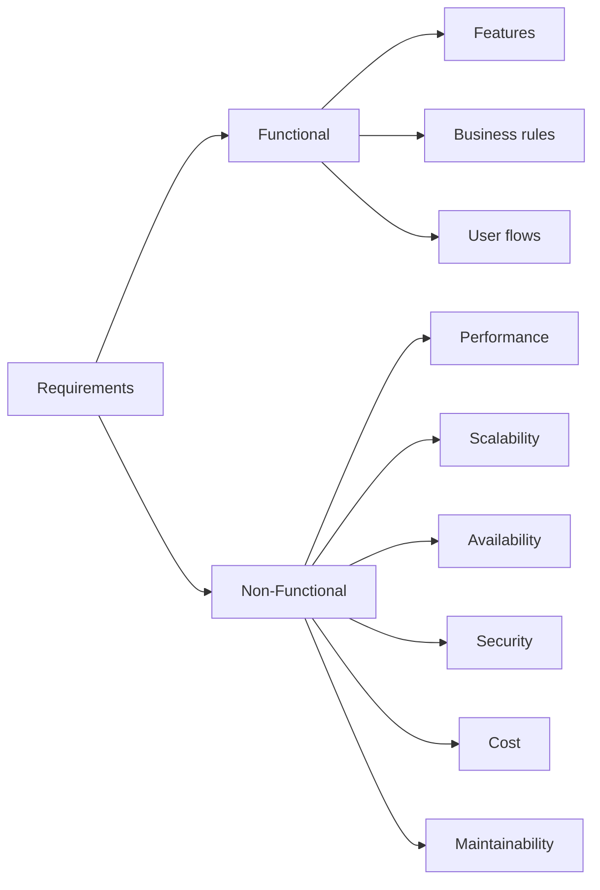

# Functional vs Non-Functional Requirements

> **TL;DR** — *Functional requirements* describe **what** a system does (features, behaviors, business rules). *Non-functional requirements* describe **how well** it does them (latency, scale, availability, security, cost). You cannot design a system from one without the other. In interviews and in real life, spending the first 5 minutes pinning both down is the single highest-leverage habit you can build.

---

## 1. Definitions

### Functional Requirement (FR)
A statement of behavior. Something a user (or another system) can *do*.
- "A user can post a tweet up to 280 characters."
- "An admin can refund any order within 90 days."
- "The system emails a receipt within 1 minute of payment."

### Non-Functional Requirement (NFR)
A statement of *quality* — how the system behaves under load, failure, and time.
- "The system serves p99 read latency under 200 ms."
- "The system maintains 99.99% availability."
- "The system handles 50,000 writes per second."
- "User data is encrypted at rest with AES-256."
- "Monthly infrastructure cost stays under $50,000."



---

## 2. Why Both Matter

A system that meets only its FRs but fails its NFRs is a broken system:

- A pizza-ordering site that *can* place orders but takes 30 seconds per click is unusable.
- A chat app that *can* deliver messages but loses 1 in 100 of them is worse than no chat app.
- A bank that *can* transfer money but goes down every Friday is a lawsuit.

A system that meets only its NFRs but no FRs is a *fast empty box*. You wouldn't believe how often interview candidates spend 30 minutes optimizing the cache layer of a feature they never defined.

> **Rule:** *Functional requirements tell you what to build. Non-functional requirements tell you how to build it.*

---

## 3. The Canonical NFR Categories

Memorize this list. It's your checklist for every system design question.

| Category | Question to ask | Typical metric |
| --- | --- | --- |
| **Performance** | How fast must responses be? | p50/p95/p99 latency, time-to-first-byte |
| **Scalability** | How much load? Growth rate? | QPS, concurrent users, data volume |
| **Availability** | Tolerable downtime? | 99.9% / 99.99% / 99.999% |
| **Reliability / Durability** | Can we lose data? | RPO, RTO, data loss probability |
| **Consistency** | How fresh must reads be? | Strong / eventual / causal |
| **Security** | Sensitivity of data? | Encryption, authn/authz, compliance |
| **Maintainability** | Who operates it? | Deploys/day, MTTR |
| **Cost** | Budget? Cost per user? | $/month, $/request |
| **Compliance** | Regulatory constraints? | GDPR, HIPAA, PCI-DSS, SOC2 |
| **Observability** | How do we debug it? | Logs, metrics, traces |

---

## 4. Functional Requirements — How to Gather Them

In an interview you have 5 minutes. In real life you have 5 weeks. Either way the technique is the same: **ask, list, prioritize, freeze.**

### Ask
- *Who* uses the system? (end users, admins, internal services, batch jobs)
- *What* do they do? (the verbs — post, search, refund, schedule)
- *What* triggers events? (user action, schedule, webhook, sensor)
- *What's in scope, what's not?* (the most powerful sentence in design: "we are NOT building X")

### List
Write each FR as a single sentence with an actor and a verb.
- ✅ "A driver can mark themselves online."
- ❌ "Drivers." (too vague)

### Prioritize
**MoSCoW** is the simplest method:
- **M**ust — without this, the product fails.
- **S**hould — important but the launch survives without it.
- **C**ould — nice to have.
- **W**on't (this release) — explicitly out of scope.

### Freeze
Out-of-scope items become *non-goals*. Writing non-goals down is a senior-engineer habit — it stops scope creep later.

---

## 5. Non-Functional Requirements — How to Quantify Them

Vague NFRs are useless. "Fast" and "scalable" are not requirements. *Numbers* are.

| Vague | Useful |
| --- | --- |
| "It should be fast." | "p99 read latency < 150 ms at 10k QPS." |
| "It should scale." | "Handle 10× current peak (currently 5k RPS), 5 TB/month growth." |
| "It should be highly available." | "99.99% monthly availability; single-AZ failure must not be customer-visible." |
| "It should be secure." | "All PII encrypted at rest (AES-256-GCM) and in transit (TLS 1.3); SOC2 Type II." |

If you can't put a number on it, you can't design for it and you can't test whether you achieved it.

### The big-five questions (memorize)
1. **Scale** — How many users / requests / GBs?
2. **Latency** — How fast?
3. **Availability** — How much downtime is okay?
4. **Consistency** — How stale can a read be?
5. **Durability** — Can we lose data, and if so, how much?

---

## 6. A Worked Example: "Design a URL Shortener"

### Functional requirements
- Users can submit a long URL and receive a short URL (~7 characters).
- Visiting the short URL redirects (HTTP 301/302) to the long URL.
- Users can (optionally) provide a custom alias.
- Users can see basic click analytics on their links.

**Non-goals:** user accounts/auth (assume separate service), link expiry UI, A/B-testable redirects, abuse/spam detection.

### Non-functional requirements
- **Scale:** 100 M new URLs/month → ~40 writes/sec average, ~400 writes/sec peak. 10× more reads → ~4k reads/sec peak.
- **Latency:** p99 redirect latency < 100 ms.
- **Availability:** 99.99% for reads (redirects); 99.9% for writes.
- **Consistency:** Strong for writes (a freshly created short link must resolve immediately). Eventual for analytics counters is fine.
- **Durability:** Zero tolerance for losing a created short link. Replicated to 3 AZs.
- **Cost:** Stay under $X/month at projected scale.

Notice how the *NFRs* force the design choices: 4k reads/sec + 100ms p99 → you need a cache layer in front of the database; durability + multi-AZ → managed RDB or DynamoDB with multi-AZ replication; eventual consistency on counters → use a separate analytics pipeline (Kafka → ClickHouse or similar).

The FRs alone would let you ship a single SQLite file. The NFRs are what make it a "system".

---

## 7. The Hidden Third Category: Constraints

Some "requirements" are really *constraints* — limits imposed by the world rather than goals chosen by the team.

- **Technical:** "must run on AWS", "must work without JavaScript", "must integrate with our existing Postgres".
- **Regulatory:** GDPR (EU data residency), HIPAA (medical), PCI-DSS (cards), SOX (finance).
- **Organizational:** "team has 3 engineers", "must ship by Q3", "no new vendors this year".
- **Physical:** speed of light (≈100 ms to cross the Atlantic on a good day), single-disk IOPS limits.

In an interview, surface constraints alongside requirements. They're often what makes the problem *interesting*.

---

## 8. Trade-Offs Between NFRs

NFRs fight each other. Naming the tension is the move that signals seniority.

- **Latency ↔ Cost** — Tighter latency usually means more replicas, more memory, more regions.
- **Consistency ↔ Availability** — CAP. During a network partition you choose one.
- **Durability ↔ Write throughput** — `fsync` after every write is durable but slow.
- **Security ↔ Usability** — More auth factors = fewer angry users... and fewer phished ones.
- **Feature velocity ↔ Stability** — Faster shipping = more incidents, all else equal.

> **Senior move:** when you choose one side of a trade-off, *say so out loud and say why.*
> "I'm choosing eventual consistency on the follower list because user-visible staleness up to a few seconds is acceptable, and it lets me horizontally scale reads without coordination."

---

## 9. Anti-Patterns

- **Designing before gathering requirements.** "Let's put Kafka in front of it" — for what?
- **Listing NFRs without numbers.** "It should be highly available" is not a requirement.
- **Designing for fantasy scale.** Building for 1B users when you have 1k is a great way to never ship.
- **Confusing features with requirements.** "We'll use Redis" is a solution, not a requirement.
- **Skipping non-goals.** Without them, every stakeholder will add "and also...".
- **Treating NFRs as static.** They evolve — last year's "scale" is this year's "minor blip".

---

## 10. Quick-Reference Checklist

When the interviewer says "Design X", spend 3–5 minutes filling in:

```
FUNCTIONAL
  □ Actors (who):
  □ Top 3–5 user flows:
  □ Out-of-scope (non-goals):

NON-FUNCTIONAL
  □ Scale (users, QPS, data, growth):
  □ Latency targets (p50 / p99):
  □ Availability target (e.g., 99.99%):
  □ Consistency requirement (strong / eventual / mixed):
  □ Durability / data loss tolerance:
  □ Security / compliance constraints:
  □ Cost ceiling / budget:

CONSTRAINTS
  □ Tech stack constraints:
  □ Regulatory constraints:
  □ Team / timeline constraints:
```

If you walk into every design with this card filled in, you'll be ahead of 80% of candidates and most working engineers.

---

## 11. Resources

### Books
- *Designing Data-Intensive Applications* — Martin Kleppmann. Chapter 1 ("Reliable, Scalable, Maintainable Applications") is the canonical treatment.
- *Software Architecture in Practice* (4th ed.) — Bass, Clements, Kazman. Whole book is essentially about quality attributes (= NFRs).
- *Building Evolutionary Architectures* — Ford, Parsons, Kua. NFRs as "fitness functions".

### Online
- ISO/IEC 25010 software quality model — <https://iso25000.com/index.php/en/iso-25000-standards/iso-25010>
- Atlassian: Functional vs non-functional requirements — <https://www.atlassian.com/agile/project-management/functional-requirements>
- AWS Well-Architected Framework (its 6 pillars are NFRs in disguise) — <https://aws.amazon.com/architecture/well-architected/>
- Microsoft: Non-functional requirements — <https://learn.microsoft.com/en-us/azure/architecture/framework/>

### Videos
- ByteByteGo: "How to answer 'Design X' in a system design interview" — <https://www.youtube.com/@ByteByteGo>
- Jordan has no life: walkthroughs always begin with FR + NFR — <https://www.youtube.com/@jordanhasnolife5163>

---

*Previous:* [← What is System Design](./what-is-system-design.md)  |  *Next:* [How to Approach a System Design Interview →](./interview-approach.md)
