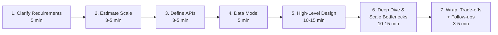
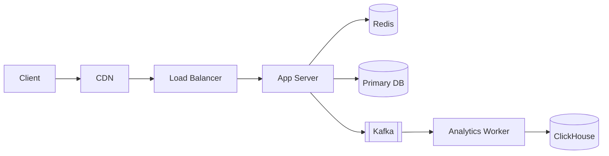

# How to Approach a System Design Interview

> **TL;DR** — A system design interview is a 45–60 minute *conversation*, not a coding exam. You're being judged on whether you can (1) clarify a vague problem, (2) make and *defend* trade-offs, and (3) communicate clearly under pressure. Follow a repeatable 7-step playbook, manage time aggressively, and narrate your thinking the entire way.

---

## 1. What Interviewers Are Really Measuring

Companies don't care if you can recite Kafka internals. They care about:

| Signal | What it looks like |
| --- | --- |
| **Problem framing** | You ask clarifying questions before drawing anything. |
| **Structured thinking** | You move through the problem in a clear, repeatable order. |
| **Trade-off reasoning** | When you pick X over Y, you explain *why*. |
| **Scaling instincts** | You spot bottlenecks and resolve them with the right tool. |
| **Communication** | You narrate, draw, and check in with the interviewer. |
| **Pragmatism** | You don't over-engineer. You scope ruthlessly. |
| **Depth on demand** | When asked to zoom in, you can go deep without panicking. |

A staff-level candidate is one who **drives the conversation**: setting the agenda, calling out trade-offs unprompted, and steering toward the interesting parts. A junior candidate waits to be asked the next question.

---

## 2. The 7-Step Playbook

This is the loop. Memorize the *order*; the timing will flex with the question.



### Step 1 — Clarify Requirements (5 min)
Ask before you draw.

- **Functional:** *Who* uses it, *what* are the top 3–5 flows, *what's out of scope?*
- **Non-functional:** *Scale* (DAU/MAU, QPS), *latency targets*, *availability*, *consistency*, *durability*, *cost ceiling*.
- **Constraints:** existing infra, regulatory, team size.

Write the answers in a corner of the whiteboard. Reference them later.

> **Phrase to use:** *"Before I jump in, can I make sure I understand the scope? I'm imagining... is that right?"*

### Step 2 — Estimate Scale (3–5 min)
Translate vague scale into concrete numbers.

- Users → DAU → QPS (assume 10× peak/avg).
- Storage per record × records/day × retention = total bytes.
- Bandwidth = avg payload × QPS.

Round aggressively. Use [Powers of Two & Latency Numbers](./latency-numbers.md).

> **Phrase to use:** *"100M DAU, avg 10 actions/day → ~1B writes/day → ~12k writes/sec average → ~50k peak. Let's design for 50k."*

### Step 3 — Define APIs (3–5 min)
A handful of endpoint signatures, request/response shapes.

```
POST  /v1/links            { url, custom_alias? } → { short_url }
GET   /{short_code}         → 301 to long URL
GET   /v1/links/{id}/stats  → { clicks, ts_series, ... }
```

You don't need full OpenAPI. You need to pin down the *contract* so the rest of the design has a target.

### Step 4 — Data Model (5 min)
The single hardest-to-change choice. Show:

- Core entities and their fields.
- Primary keys and important indexes.
- Which datastore (SQL? Key-value? Document? Wide-column?) — and *why*.
- Sharding key if relevant.

> **Phrase to use:** *"I'll use Postgres for users because we need transactions and joins, and DynamoDB for the link table because access is purely by short code and we need single-digit-ms lookups at high QPS."*

### Step 5 — High-Level Design (10–15 min)
Now you draw. Start simple, then add. Name every component.



Walk the interviewer through *one full user request* end-to-end. Then a second flow (e.g., the write path vs. the read path).

### Step 6 — Deep Dive & Scale Bottlenecks (10–15 min)
This is where seniority shows. Pick the *hot path* and zoom in.

Ask yourself out loud:
- "Where does this fall over at 10× scale?"
- "What happens if the cache goes down?"
- "What happens if a region goes down?"
- "What's the consistency model under partition?"
- "Where is the hot key risk?"

Resolve each with the right tool: cache, shard, queue, replicate, denormalize, fan-out, fan-in, batch, async, idempotency keys.

The interviewer will often pick a component and say *"go deeper on this"* — be ready.

### Step 7 — Wrap: Trade-offs & Follow-ups (3–5 min)
Summarize:

- What you'd build first vs. later.
- Trade-offs you made and what you'd reconsider with more time.
- Failure modes you're most worried about.
- What you'd add for observability, security, and cost control.

> **Phrase to use:** *"If I had another hour, I'd dig into multi-region failover and the abuse-detection pipeline. The biggest risk in the design as drawn is the single Kafka cluster — I'd want a DR plan there."*

---

## 3. Time Budget (45-Minute Round)

| Phase | Time | Cumulative |
| --- | --- | --- |
| Requirements | 5 min | 5 |
| Estimation | 4 min | 9 |
| APIs | 4 min | 13 |
| Data model | 5 min | 18 |
| High-level design | 12 min | 30 |
| Deep dive | 12 min | 42 |
| Wrap | 3 min | 45 |

Keep a clock in your head. The most common failure mode is **spending 20 minutes on requirements**, leaving no time for the part the interviewer actually wants to see (the deep dive).

---

## 4. The Whiteboard / Excalidraw Layout

Discipline on the canvas helps the interviewer follow you.

```
┌─────────────────────────────────────────────────────────────┐
│  REQUIREMENTS                  │  ESTIMATES                 │
│  - FR1, FR2, FR3               │  - DAU, QPS, storage       │
│  - NFRs (with numbers)         │  - Bandwidth               │
├─────────────────────────────────┴─────────────────────────────┤
│                                                              │
│                      HIGH-LEVEL DIAGRAM                      │
│                                                              │
├──────────────────────────────────────────────────────────────┤
│  DATA MODEL                    │  APIS                      │
│  - tables / collections        │  - endpoints + shapes      │
└──────────────────────────────────────────────────────────────┘
```

Don't erase. The interviewer will reference your earlier numbers and diagrams.

---

## 5. Phrases to Have in Your Pocket

These small phrases signal seniority and keep the interviewer with you.

- *"Let me make sure I have the scope right before I draw anything."*
- *"I'm going to optimize for X, accepting that Y will be worse."*
- *"At this scale, [thing] becomes a bottleneck — let me address that."*
- *"Two reasonable options here are A and B. I'd lean A because..."*
- *"That's a great point — let me revise the design."*
- *"I'll deliberately leave [thing] out of scope; happy to dive in if you want."*
- *"What's the failure mode I'm most worried about? It's..."*

And avoid:
- *"It depends."* (without explaining what it depends on)
- *"I'd just use Kafka."* (without saying why)
- *"This is exactly how Twitter does it."* (you don't know that)

---

## 6. Common Failure Modes (and Fixes)

| Failure | Why it happens | Fix |
| --- | --- | --- |
| Diving into design before clarifying | Anxiety, eagerness to show off | Force yourself: spend the first 5 min on Q&A. |
| Listing tech without justification ("just use Cassandra") | Pattern matching | For each choice say *"because..."* |
| Designing for 1B users when problem is 1k | Premature scaling | Mirror the interviewer's scale. |
| Getting stuck on one component | Perfectionism | Time-box yourself. Move on. |
| Silence during thinking | Anxiety | Narrate. *"I'm weighing X vs Y..."* |
| Defensive when pushed back on | Ego | Welcome it. *"Great point. Here's how I'd adjust."* |
| Skipping NFRs entirely | Inexperience | Always quantify: latency, scale, availability. |
| Ignoring the interviewer's hints | Tunnel vision | If they ask "are you sure?" — re-examine. |

---

## 7. Drawing Tools

For remote interviews, almost every company uses one of:

- **Excalidraw** (most popular) — <https://excalidraw.com/>
- **Whimsical** — <https://whimsical.com/>
- **Miro** — <https://miro.com/>
- **Google Drawings / Jamboard**
- **Coderpad sketch tool** (built into the platform)

**Practice with Excalidraw before the interview.** Know the keyboard shortcuts: `R` for rectangle, `A` for arrow, `T` for text. Fumbling with the tool eats clock.

---

## 8. Levels & What's Expected at Each

Different bars at different levels:

### Mid (L4 / SDE II)
Hits all 7 steps. Doesn't make egregious mistakes. Knows the building blocks. May need prompting for deep dives.

### Senior (L5 / SDE III)
Drives the conversation. Quantifies NFRs unprompted. Identifies bottlenecks before being asked. Explains trade-offs clearly.

### Staff (L6 / Principal)
Pushes back on the problem itself ("is this even the right thing to build?"). Brings up failure modes, operational concerns, blast radius. Discusses org/team trade-offs alongside technical ones. Identifies the *one* decision that matters and goes deep on it.

### Principal+ (L7+)
Treats the design as one piece of a larger architecture. Talks about migration paths, deprecation, cost modeling, team boundaries. Has strong opinions, loosely held.

The same problem ("design Twitter") can be a passing answer at L4 and a failing answer at L6 — what changes is the *depth* and *agency*.

---

## 9. Practice Routine (4–6 Weeks Out)

### Weeks 1–2 — Foundations
Read this whole `01-foundations` section. Read [System Design Primer](https://github.com/donnemartin/system-design-primer) front-to-back.

### Weeks 3–4 — Case studies
Pick 2 case studies per week from [Section 18 of the README](../README.md). For each:
1. Design it yourself on paper, 45 minutes, **without looking**.
2. Watch a YouTube walkthrough (ByteByteGo, Jordan, Gaurav Sen).
3. Note what you missed. Redo the design.

### Weeks 5–6 — Mock interviews
- Pair with a friend.
- Use [Pramp](https://www.pramp.com/), [Exponent](https://www.tryexponent.com/), or [interviewing.io](https://interviewing.io/).
- Record yourself. Watch it back. (Painful, effective.)

### Day of
- Rest. No new material.
- Re-read the [Cheat Card](./what-is-system-design.md#15-cheat-card--print-this-tape-it-to-your-monitor).
- 10-minute warm-up problem.
- Bathroom, water, deep breath.

---

## 10. The Day-Of Mental Model

You're not being tested on knowing the answer. **You're being tested on how you think when you don't.**

- *Curiosity* — ask questions.
- *Structure* — follow the loop.
- *Honesty* — say "I don't know, but here's how I'd approach it."
- *Pragmatism* — ship the simplest thing first; scale when justified.
- *Collaboration* — treat the interviewer as a teammate, not a judge.

A candidate who follows this and gets a "B-" answer often beats one who gets an "A" answer in solitary silence.

---

## 11. Quick-Reference Card

```
0. Listen. Don't draw yet.
1. Clarify  (5)   — FR, NFR, scope, non-goals.
2. Estimate (4)   — QPS, storage, bandwidth.
3. APIs     (4)   — endpoints + shapes.
4. Schema   (5)   — entities, keys, indexes, store choice.
5. HLD     (12)   — boxes, arrows, one happy path.
6. Deep    (12)   — bottlenecks, failures, scale to 10x.
7. Wrap     (3)   — trade-offs, what's next.

NARRATE every step.
QUANTIFY every NFR.
DEFEND every choice.
```

---

## 12. Resources

### Books
- *System Design Interview – An Insider's Guide* Vol 1 & 2 — Alex Xu.
- *Cracking the System Design Interview* — Various authors (Educative).
- *Acing the System Design Interview* — Zhiyong Tan.

### Courses
- **Grokking the System Design Interview** (Educative) — <https://www.educative.io/courses/grokking-the-system-design-interview>
- **Grokking the Advanced System Design Interview** — case studies of Netflix, YouTube, etc.
- **Exponent System Design** — <https://www.tryexponent.com/courses/system-design-interview>

### Mock interview platforms
- **Pramp** — free peer-to-peer, <https://www.pramp.com/>
- **interviewing.io** — anonymous mocks with FAANG engineers, <https://interviewing.io/>
- **Exponent mocks** — <https://www.tryexponent.com/>

### YouTube
- **ByteByteGo** — <https://www.youtube.com/@ByteByteGo>
- **Gaurav Sen** — <https://www.youtube.com/@gkcs>
- **Jordan has no life** — <https://www.youtube.com/@jordanhasnolife5163>
- **System Design Fight Club** — <https://www.youtube.com/@SDFC>
- **Tech Dummies (Narendra L)** — <https://www.youtube.com/@TechDummiesNarendraL>
- **Hello Interview** — <https://www.youtube.com/@hello_interview> (excellent FAANG-style walkthroughs)

### Communities
- **r/cscareerquestions** — interview reports.
- **Blind** — leveling and prep stories.
- **LeetCode Discuss → System Design** — recent question dumps.

---

*Previous:* [← Functional vs Non-Functional Requirements](./functional-vs-non-functional.md)  |  *Next:* [Back-of-the-Envelope Estimation →](./estimation.md)
