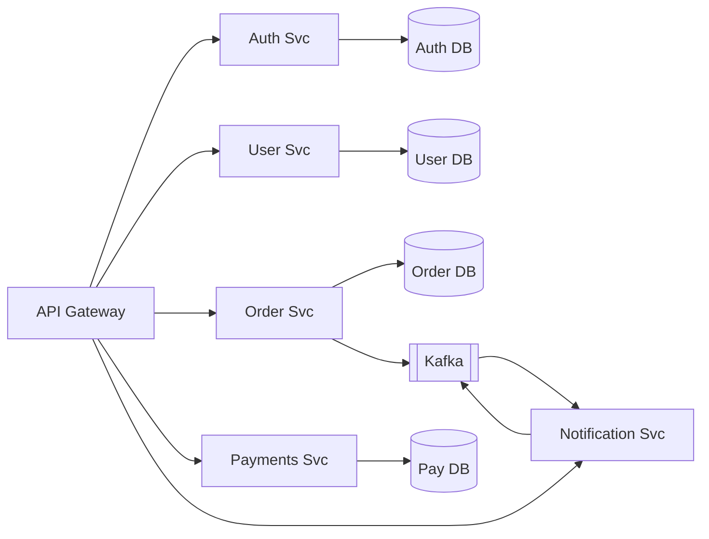
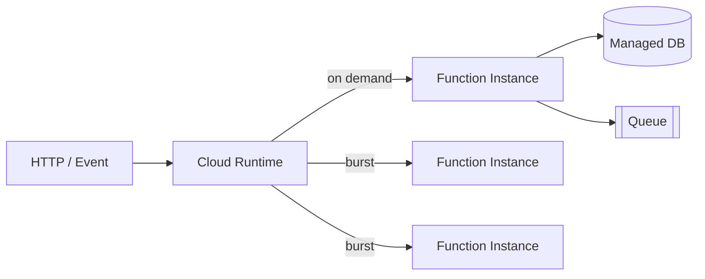
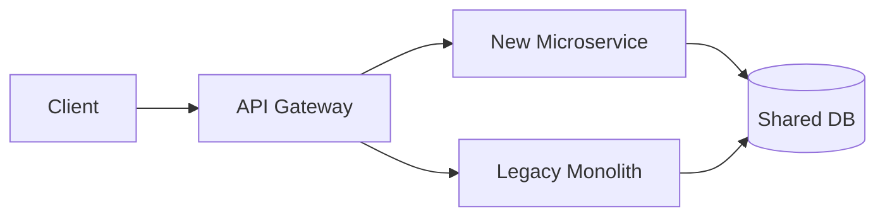

# Monolith vs Microservices vs Serverless

> **TL;DR** — Three deployment archetypes:
> - **Monolith** — one codebase, one deployable. Simple, fast, scales further than you think.
> - **Microservices** — many small services, each owning a slice of the domain. Independent scale & deploy, at the cost of distributed-systems complexity.
> - **Serverless** — code without long-lived servers; the cloud runs functions/containers on demand. Zero-ops scaling, with cold-start, vendor-lock-in, and observability trade-offs.
>
> None is "best." The right choice depends on team size, scale, change rate, and operational maturity. Most successful systems are **modular monoliths that became selective microservices**.

---

## 1. The Three at a Glance

```
MONOLITH                  MICROSERVICES                 SERVERLESS
────────                  ─────────────                 ──────────

┌───────────────┐         ┌────┐ ┌────┐ ┌────┐          ┌─┐ ┌─┐ ┌─┐  ← cold-started
│ Auth          │         │Auth│ │User│ │Pay │          └─┘ └─┘ └─┘    on demand
│ Users         │         └────┘ └────┘ └────┘
│ Payments      │         ┌────┐ ┌────┐ ┌────┐          managed runtime
│ Notifications │         │Noti│ │Feed│ │Search           (Lambda, Cloud Run,
│ Search        │         └────┘ └────┘ └────┘            Cloud Functions)
└───────────────┘         + service mesh + API gw
   one deployable          many deployables               no deployables
```

| | Monolith | Microservices | Serverless |
| --- | --- | --- | --- |
| **Deployables** | 1 | N (often 10–100s) | Per function |
| **Inter-process comms** | Function calls | Network (HTTP, gRPC, queues) | HTTP / events |
| **Data** | Usually one DB | One DB per service ("polyglot persistence") | Managed DBs (DynamoDB, Aurora, Firestore) |
| **Scaling unit** | Whole app | Per service | Per function invocation |
| **Deploys** | One pipeline | N pipelines | Per function (often instantaneous) |
| **Coupling** | Tight (process boundary = none) | Loose (network) | Loose (event-driven) |
| **Org cost** | Low | High (Conway's Law) | Low to medium |
| **Operational cost** | Low | High | Low (until very high scale or weird workload) |
| **Latency floor** | In-process call (~µs) | Network call (~ms) | Cold start (ms–seconds) + invocation |
| **Best for** | Early/medium teams, predictable scale | Large orgs, independent teams, varied scale per domain | Spiky / event-driven workloads, small teams |

---

## 2. Monolith

### What it is
**One codebase. One process. One deployable.** All features live in the same binary; they call each other as functions, not over a network. Usually backed by **one shared database**.

### Why it's good
- **Simple.** One CI, one repo, one dashboard, one place to look.
- **Fast.** In-process calls are nanoseconds, not milliseconds.
- **Easy to refactor.** Cross-feature changes are local edits, not distributed migrations.
- **Atomic transactions** across the whole domain — no sagas, no eventual consistency.
- **Cheap to operate.** One service to monitor, one to deploy, one to debug.
- **Scales further than people admit.** Stack Overflow, Shopify, Basecamp, GitHub all run monoliths at huge scale.

### Why it can hurt
- **Long compile / test cycles** as code grows.
- **One team's bug crashes everyone.**
- **Hard to scale specific hot paths independently** — you scale the whole thing.
- **Risky deploys** — every release touches everything.
- **Tech-stack lock-in** — everything's in the same language/framework.
- **Coordination cost** as the team grows past ~30–50 engineers.

### The "modular monolith"
A best-practice flavor: a *monolithic deployable* internally organized into clean modules with explicit, narrow APIs between them. You get monolith simplicity *plus* clear seams you can later extract if needed.

> *Shopify openly runs a "majestic monolith" (their term). Stack Overflow runs nine .NET servers. Don't underestimate the monolith.*

---

## 3. Microservices

### What it is
The system is decomposed into many **small, independent services**, each:
- Owning one **bounded context** (DDD).
- Owning its own **data**.
- Deployed **independently**.
- Communicating with others over the network (REST, gRPC, async queues).



### Why teams reach for them
- **Independent deploys** — small teams ship without coordinating with everyone.
- **Independent scaling** — the search service can have 100 nodes while auth has 3.
- **Tech diversity** — Python for ML, Go for hot paths, Java for the legacy core.
- **Fault isolation** — one service down doesn't kill the rest (if the design is right).
- **Org alignment** — Conway's Law: services reflect team boundaries.

### What you actually buy
You're trading **simplicity for autonomy**. You buy autonomy with a tax:

- **Network calls** instead of function calls (slower, fail differently, need timeouts/retries).
- **Distributed transactions** are now everyone's problem. You'll learn what a saga is.
- **Observability** must be distributed (tracing across services).
- **Schema changes** become contracts. Breaking changes need coordinated rollouts.
- **Local dev** is harder — running 30 services on a laptop is not fun.
- **CI/CD** must be multi-pipeline.
- **Service discovery, mTLS, retries, circuit breakers** — service mesh (Istio, Linkerd) emerges.
- **You need a platform team** to keep this sane.

### When microservices are the right call
- **Team size > ~30–50 engineers** struggling to coordinate.
- **Different scale profiles per domain** — search needs 100× more nodes than billing.
- **Different change rates per domain** — feature shop ships daily, payments ships weekly.
- **Different compliance scopes** — PCI scope only for payments, not the whole system.
- **You've already exhausted the modular monolith.**

### When microservices are a mistake
- You're a 5-person startup.
- You're chasing a buzzword.
- Your domain boundaries aren't clear yet.
- You don't have the SRE/platform muscle.

The **distributed monolith** is the worst outcome: you paid all the microservices taxes (network, ops complexity) and got none of the benefits (tight coupling means you still deploy everything at once, just over the network).

> **A starting principle:** start monolithic. Extract a service *only* when you can name the tax it's worth paying for (independent scale, fault isolation, team autonomy).

---

## 4. Serverless / FaaS

### What it is
You write a function (or a container) and hand it to the cloud. The cloud:
- Runs zero copies when no one's calling.
- Spins up copies on demand.
- Scales to many copies in parallel.
- Bills you per request and per ms of execution.

Big players:
- **AWS Lambda** (functions), **AWS Fargate** (containers, no server mgmt).
- **GCP Cloud Functions / Cloud Run**.
- **Azure Functions / Container Apps**.
- **Cloudflare Workers** (edge-native, V8 isolates).



### Why it's appealing
- **No servers to operate.** No OS patching, no autoscaling groups.
- **Scale-to-zero.** Pay nothing when idle.
- **Massive parallelism on bursts.** Lambda can scale to thousands of concurrent invocations in seconds.
- **Event-driven by default.** Trigger from queues, object uploads, schedules, HTTP, etc.
- **Tight integration** with cloud event sources (S3, DynamoDB Streams, Kinesis, EventBridge).

### Pain points
- **Cold starts.** First invocation after idle = 100 ms–several seconds. Mitigations: warm pools (provisioned concurrency), small bundles, faster runtimes (Node/Go > JVM/Python for cold start).
- **Vendor lock-in.** Lambda + DynamoDB + EventBridge + IAM is not portable.
- **Local dev** is tricky. Frameworks like SAM/Serverless help.
- **Observability** can be awkward — short-lived, distributed.
- **Long-running work doesn't fit.** Lambda max execution is 15 minutes.
- **Stateful workloads fight the model** — every invocation is fresh.
- **Surprising bills** at high steady-state load — running 24/7 on Lambda is often more expensive than running on EC2/Fargate.
- **Concurrency limits and quotas** — region-wide caps you must monitor.

### Sweet spot
- **Spiky / event-driven workloads** — image resizing, webhook handlers, scheduled jobs, light APIs.
- **Glue code** between services.
- **Prototypes** and small projects.
- **Background workflows** triggered by S3 uploads, DB changes, queue messages.

### Bad fit
- **Steady high-QPS HTTP** at predictable scale (run a container or VM).
- **Long-running connections** (WebSockets — use a different service).
- **Latency-critical hot paths** (cold starts).
- **Workloads that exceed Lambda limits** (memory, time, payload size).

### Serverless containers (the modern middle)
- **AWS Fargate**, **Google Cloud Run**, **Azure Container Apps** — run any container, the platform handles autoscaling and provisioning.
- Combines containerized portability (no vendor lock-in to a function runtime) with hands-off ops.
- Generally a sweeter spot for most production HTTP workloads than raw FaaS.

---

## 5. The Spectrum

These are not three boxes — they're a continuum:

```
Monolith ──► Modular Monolith ──► Service-Oriented ──► Microservices ──► Serverless
   simple                                                                  hands-off
   coupled                                                                  loosely coupled
   in-process                                                              event-driven
```

Most mature systems are **mixed**: a modular monolith owning the core domain, a few extracted microservices for hot paths, and a handful of Lambdas for glue and event-driven tasks.

---

## 6. How They Compare on Specific Concerns

### Latency
- Monolith: ~µs in-process calls.
- Microservices: ~ms per network hop; fan-out amplifies tail.
- Serverless: same as microservices + occasional cold start.

### Cost
- Monolith: cheapest per request at moderate-to-high steady load.
- Microservices: medium; pay for many idle instances.
- Serverless: cheapest at low/spiky load; expensive at high steady load.

```
Cost per request
   │
   │ Serverless ────╲
   │                ╲___
   │ Microservices ─────╲___________
   │                                ╲___
   │ Monolith ──────────────────────────╲___
   │
   └──────────────────────────────────────► Steady QPS
```

### Operations
- Monolith: 1 dashboard, 1 runbook, 1 alert rule per concern.
- Microservices: N of everything. Needs a platform team.
- Serverless: cloud absorbs ops, but observability and quotas are *new* problems.

### Reliability
- Monolith: blast radius = whole app. But fewer moving parts to break.
- Microservices: blast radius can be small *if* designed right. But many more failure modes.
- Serverless: cloud provider runs it; depends on their SLA and your retry/idempotency design.

### Team scale
- Monolith: 1–30 engineers comfortable.
- Microservices: 50+ engineers, multiple teams.
- Serverless: any size; great for small teams.

---

## 7. Migration Paths

### Monolith → Microservices (the classic)
Use the **Strangler Fig pattern**: extract one service at a time, route traffic to the new service while the monolith still owns the rest. Never do a big bang rewrite.



Typical first extractions: auth, notifications, search — relatively bounded.

### Monolith → Serverless
- Move background jobs to Lambda/Fargate.
- Move image / media processing to Lambda triggered by S3.
- Move scheduled batch jobs to EventBridge + Lambda.
- Keep the core HTTP app on a normal server.

### Microservices → Monolith (yes, it happens)
- Amazon Prime Video: famously consolidated services into a monolith and got 90% cost reduction (2023).
- The lesson: if the network calls dominate your costs and the domain is one team, a monolith may win.

---

## 8. Conway's Law (the law you cannot break)

> *Organizations design systems that mirror their communication structures.*  — Melvin Conway, 1968

Three engineers will build one service. Six teams will build six services (whether or not the domain demands it). Architectures and orgs converge.

**Practical takeaways:**
- Don't pick microservices before your org is shaped like microservices.
- If you want a service per team, build the teams first.
- If two services are constantly co-deploying, that's two teams that should merge into one.

---

## 9. Decision Framework

```
Are you < 30 engineers / pre-product-market-fit?
    → Monolith (modular). Don't even discuss alternatives yet.

Is the workload spiky, event-driven, or glue code between cloud services?
    → Serverless (Lambda, Cloud Functions) — pay-per-use wins.

Are you ≥ 50 engineers with clear domain boundaries, different scale per domain,
   and a platform team to support service-mesh, tracing, multi-pipeline CI?
    → Microservices, extracted gradually from the monolith.

Otherwise default to "modular monolith with some serverless glue."
```

---

## 10. Common Mistakes

- **Picking microservices because of "scale" you don't have.** Most teams' "scale" is 100 QPS.
- **Distributed monolith** — many services that all deploy together. You paid the tax for nothing.
- **One DB shared by many services.** Now they're coupled at the schema. That's a distributed monolith with extra steps.
- **Serverless for steady high-QPS HTTP.** Cold starts and per-request billing will hurt.
- **Forgetting Conway's Law.** Service boundaries that fight your org boundaries lose.
- **No platform team for microservices.** You need someone running the service mesh, the CI templates, the secrets, the observability.
- **Cargo-culting AWS Lambda for everything.** Sometimes it's a container on ECS/Fargate; sometimes it's a Postgres function. Match tool to job.

---

## 11. What the Big Players Actually Do

- **Netflix** — pioneered cloud microservices; ~1,000 services on AWS. They also run heavyweight monoliths in places.
- **Amazon** — started monolithic, broke into services in early 2000s, Bezos's famous "API mandate" of 2002. Some teams have walked back to monoliths (Prime Video, 2023).
- **Google** — many services, but lots of work happens in monorepos with shared internal services (Borg, Spanner, etc.).
- **Shopify** — "Majestic Monolith" Ruby app; modularized internally; selective extractions.
- **Stack Overflow** — famously runs the whole site on ~9 .NET servers, one big app, one SQL Server.
- **Cloudflare** — heavy use of Workers (serverless edge) for HTTP edge logic; backend mix.
- **Discord** — Elixir + Rust monoliths-ish per domain (voice, presence, MMS) with services around them.

The lesson: architectures are picked per problem, not per fashion.

---

## 12. Quick-Reference Card

```
MONOLITH        ─ one deployable. start here. scales further than you think.
                  ★ when: small/medium team, single domain, fast iteration

MICROSERVICES   ─ many deployables, distributed-systems complexity included.
                  ★ when: large org, varied scale per domain, mature platform team

SERVERLESS      ─ no servers, pay per invoke, scale-to-zero, cold starts.
                  ★ when: spiky / event-driven / glue / batch / cron

ANTI-PATTERNS
   • microservices in a 5-person team
   • shared DB across services (distributed monolith)
   • serverless for steady high-QPS HTTP
   • picking architecture by buzzword instead of by constraint

LAWS
   Conway: orgs ship their org chart.
   Strangler Fig: never big-bang. Extract gradually.
   Boring tech wins.
```

---

## 13. Resources

### Foundational
- **Sam Newman, *Building Microservices* (2nd ed.)** — the textbook.
- **Sam Newman, *Monolith to Microservices*** — practical extraction playbook.
- *Designing Data-Intensive Applications* — service boundaries chapter (Ch. 4).
- **Martin Fowler, "Microservices"** — the original definition: <https://martinfowler.com/articles/microservices.html>
- **Martin Fowler, "MonolithFirst"** — <https://martinfowler.com/bliki/MonolithFirst.html>
- **Martin Fowler, "Strangler Fig"** — <https://martinfowler.com/bliki/StranglerFigApplication.html>

### Articles
- "Death by a thousand microservices" — Adam Drake.
- "Even Amazon can't make microservices work" (Prime Video case study, 2023): <https://www.primevideotech.com/video-streaming/scaling-up-the-prime-video-audio-video-monitoring-service-and-reducing-costs-by-90>
- Shopify, "The Majestic Monolith": <https://shopify.engineering/the-majestic-monolith>
- Stack Overflow architecture: <https://nickcraver.com/blog/2016/02/17/stack-overflow-the-architecture-2016-edition/>
- Conway's Law (original 1968 paper): <https://www.melconway.com/Home/Committees_Paper.html>

### Serverless
- AWS Lambda docs: <https://docs.aws.amazon.com/lambda/>
- Google Cloud Run: <https://cloud.google.com/run>
- Cloudflare Workers: <https://workers.cloudflare.com/>
- *Serverless Architectures on AWS* — Peter Sbarski.
- "Serverless costs at scale" — many blog posts; search by your provider.

### Videos
- ByteByteGo: "Monolith vs Microservices" — <https://www.youtube.com/@ByteByteGo>
- "Microservices" — Martin Fowler (GOTO talks) — <https://www.youtube.com/watch?v=wgdBVIX9ifA>
- Sam Newman's conference talks on YouTube.

---

*Previous:* [← Stateful vs Stateless Services](./stateful-vs-stateless.md)  |  *Up:* [README ↑](../README.md)
