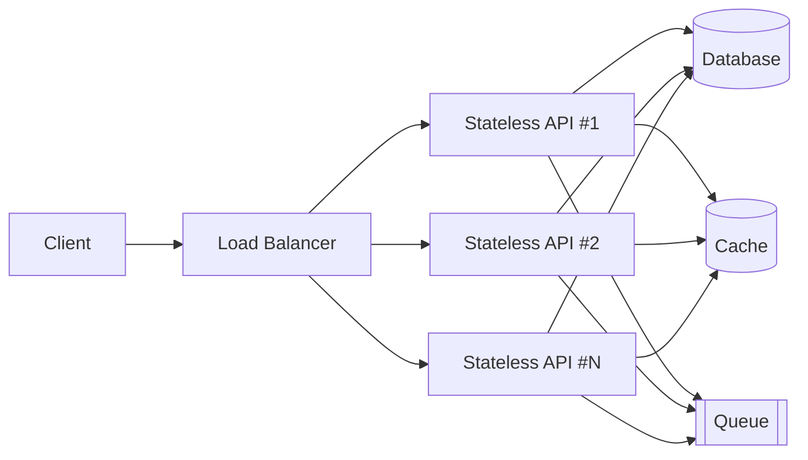
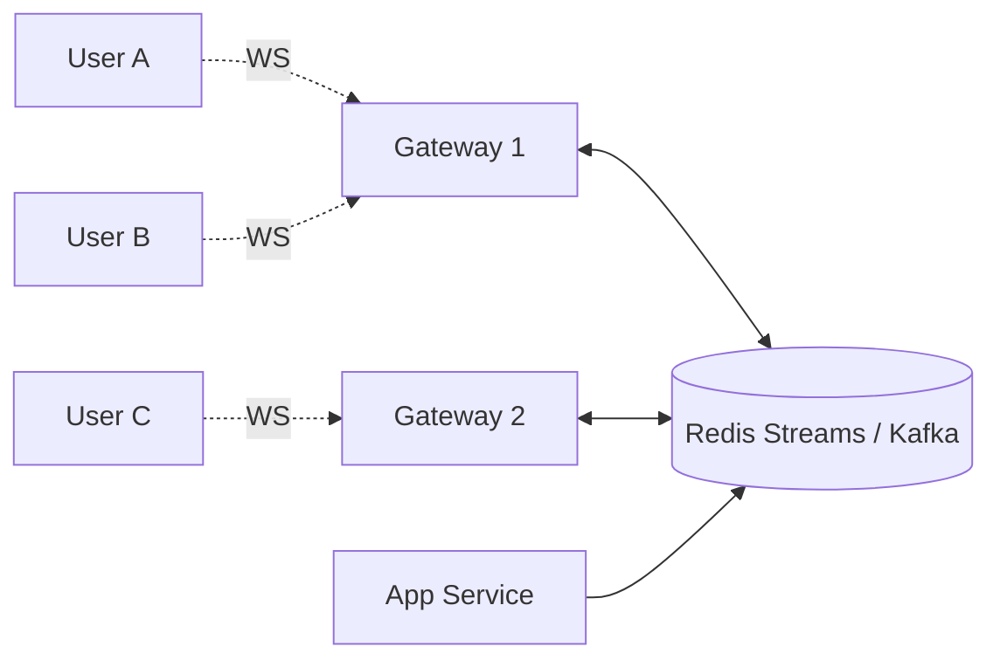

# Stateful vs Stateless Services

> **TL;DR** — A **stateless** service keeps no client-specific data between requests; any node can serve any request. A **stateful** service remembers things across requests (user sessions, in-memory caches, open connections, sharded data). Stateless tiers are trivially horizontally scalable; stateful tiers are where distributed-systems complexity lives. Modern architectures push state *out* of services and into purpose-built stateful systems (databases, caches, queues) — keeping the application layer stateless.

---

## 1. The Core Idea

```
STATELESS                                     STATEFUL
─────────                                     ────────
Each request carries everything               Server holds context between requests
the server needs.                             (in memory, on disk, in connection).

Client ──── req ───►  ┌──────┐                Client ──── req ───►  ┌─────────┐
                      │ Any  │                                       │  This   │
Client ──── req ───►  │ Node │                Client ──── req ───►  │  Same   │
                      │      │                                       │  Node   │
Client ──── req ───►  └──────┘                Client ──── req ───►  └─────────┘
                                                                     ▲ must route here
```

A **stateless** server is like a fast-food counter: anyone can take your order; the kitchen produces the same result no matter who pressed the button.

A **stateful** server is like a barber who's been cutting your hair for years: they remember exactly how short you like your sideburns, and a different barber would need to start over.

---

## 2. Stateless Services

### Properties
- No memory of past requests beyond the request itself.
- Any instance can handle any request.
- Easy to scale **horizontally** — add nodes, balance traffic, done.
- Trivial to restart / replace.
- Failure of any single instance has no user-visible impact (assuming retry).

### How they stay stateless
- **Request carries the context.** Auth token in header, pagination cursor in URL, etc.
- **State lives elsewhere** — DB, cache, object store, external service.
- **Idempotent endpoints** — POST'ing twice has the same effect as POST'ing once (or returns a clear error).

### Examples
- REST API tier (Spring Boot, Express, FastAPI, Rails).
- Lambda / serverless functions.
- CDN edge nodes (technically have caches, but each request is independent).
- Static file servers.
- Most HTTP middleware (rate limiters, auth proxies — sometimes; depends on impl).

### Why teams chase statelessness
- Trivial autoscaling and deployment.
- Trivial failover.
- Easy to reason about (no surprising side effects across requests).
- Cloud-native: K8s, Lambda, Cloud Run, Fargate all assume statelessness.
- Cheap to add observability — every request stands on its own.

---

## 3. Stateful Services

### Properties
- Hold per-client or per-shard data between requests.
- Often pinned to specific clients via **session affinity** ("sticky sessions") or to specific data via **sharding**.
- Hard(er) to scale, replace, and operate.
- Need careful failure handling — losing a node can lose state unless replicated.

### Where state lives
- **In-memory** (most expensive to lose) — connection state, WebSockets, in-flight transactions.
- **On local disk** (lost if the box dies unless replicated) — local KV stores, embedded DBs.
- **On replicated storage** — replicated logs, consensus stores, replicated DBs.

### Examples
- **Databases** — Postgres, MySQL, MongoDB, Cassandra, DynamoDB.
- **Caches** — Redis, Memcached.
- **Message brokers** — Kafka, RabbitMQ.
- **Search engines** — Elasticsearch, Solr.
- **Real-time gateways** — WebSocket servers, chat servers, multiplayer game servers, video conferencing SFUs.
- **Stateful workflow engines** — Temporal, Cadence.

### Cost of statefulness
- **Operational complexity** — backup, restore, replication, failover.
- **Slower scaling** — adding a node requires rebalancing data.
- **Coordinated upgrades** — rolling restarts must preserve quorum.
- **Sticky routing** — load balancers need consistent hashing or session affinity.
- **Cold start cost** — a fresh replica must warm up.

---

## 4. The Modern Pattern: "Stateless App, Stateful Backend"

The dominant architecture today:



The application tier is **stateless** → scale to thousands of nodes with a load balancer. The "hard" stateful stuff is concentrated in **purpose-built systems** (databases, caches, queues), each of which solves replication, sharding, and durability *once*, well, by experts.

This pattern is the reason cloud-native works.

### Implications
- Sessions go in Redis or a JWT, not in app-server memory.
- Caches are external (Redis/Memcached), not in-process LRU (or use both, with the in-process one as L1).
- Background work goes to a queue (Kafka/SQS), not an in-memory queue per server.
- File uploads go to object storage (S3), not the local disk of whichever app box took the upload.
- WebSockets go to a dedicated tier (often horizontally scaled with consistent hashing) — not your main API tier.

---

## 5. Sessions: The Most Common State Pitfall

"How do I authenticate users without keeping session state on my server?" Two patterns:

### Pattern A — Server-side session store
- Store session data in **Redis** (or DB).
- Client sends a session ID cookie.
- Any app node looks up the session ID in Redis.
- App tier is stateless; *Redis* holds the state.

```
Client ─── cookie:sid=abc123 ───► Any App Node ─── GET sid:abc123 ───► Redis
```

### Pattern B — Stateless tokens (JWT)
- Server signs a token containing user info + expiry.
- Client stores it (cookie or local storage), sends with every request.
- Any node verifies the signature; no lookup needed.

```
Client ─── Authorization: Bearer <JWT> ───► Any App Node (verifies signature)
```

Trade-offs:

| | Server-side sessions | JWT |
| --- | --- | --- |
| Revocation | Instant (delete from Redis) | Hard (need blocklist or short TTL) |
| Server lookup per request | Yes | No |
| Token size | Small | Larger (signed payload) |
| Statelessness | App tier yes; Redis is the state holder | Truly stateless on server |
| Security | Easier to keep secrets on server | Don't put secrets in JWT |

Most production systems use a hybrid: **short-lived JWTs for the API tier**, **refresh tokens in Redis** for revocation.

---

## 6. WebSockets, Chat, Real-Time — The Stateful Edge

A WebSocket connection is, by definition, stateful — it's a persistent TCP/TLS connection pinned to one server. You can't be "stateless" about it.

Patterns:

- **Sticky sessions / consistent hashing.** Each user is routed to a specific gateway node based on their user ID hash.
- **External pub/sub.** Gateways subscribe to Redis Streams / Kafka / NATS so any user can be notified regardless of which gateway holds their socket.
- **Connection state is recoverable.** If a node dies, clients reconnect and re-subscribe; the *messages* live in the pub/sub layer, not in the gateway.



So the *connection* is stateful per node, but the *messages* are stateless from the app's point of view — they go to and from pub/sub.

---

## 7. Sticky Sessions — When (Not) To Use

A load balancer can route the same client back to the same server using a cookie or IP hash. Sometimes useful, often a smell.

### Legit reasons
- WebSockets / long-lived connections.
- Local cache warmup that's expensive to lose.
- Server-side gaming session state.

### Smells
- Using sticky sessions because you *forgot* to externalize session state. Externalize it instead.
- Sticky sessions in front of a stateless API tier — this defeats horizontal scaling and creates hot nodes.

> **Rule of thumb:** if you need sticky sessions on a tier that handles ordinary HTTP requests, you've put state in the wrong place.

---

## 8. Scaling Strategies, Side by Side

| Concern | Stateless service | Stateful service |
| --- | --- | --- |
| Add a node | Just spin up + register w/ LB | Coordinated: rebalance shards / replicate |
| Remove a node | Drain in-flight, kill | Drain, hand off state, then kill |
| Auto-scale | Easy (HPA, ASG, Lambda concurrency) | Hard — adding capacity ≠ instant capacity |
| Restart | Free | Costs warm-up; may require failover |
| Region failover | Trivial | Requires data replication & promotion plan |
| Local disk | Use as scratch only | First-class storage |
| Deploy | Rolling, blue-green, canary, all easy | Stagger to preserve quorum |
| Observability | Per-request | Per-request + per-shard health |

---

## 9. How to Decide

### Choose stateless when:
- You're writing the **application / API layer** above a database.
- Requests are independent (REST, GraphQL).
- You want trivial scaling, deploys, failover.
- Cost of per-request lookups to an external store is acceptable (it almost always is).

### Choose stateful when:
- You're building the **storage system itself** (DB, cache, broker, search index).
- You need **long-lived connections** (WebSockets, gRPC streaming, SSH proxies).
- You need **in-memory speed** that can't tolerate a network hop.
- You're building **stream processors** that hold large windowed state (Flink, Kafka Streams).
- You're building **multiplayer games** with tick-based authoritative state.

In practice, most engineers will mostly write stateless services on top of well-engineered stateful systems.

---

## 10. Common Anti-Patterns

- **In-process session memory** that doesn't survive a restart. Now you can't deploy without logging users out.
- **Local file uploads** stored on the API node's disk. Now you can't scale or fail over.
- **Local in-process queue** for background jobs. The queue dies with the process.
- **Caches with no external store and no warm-up plan.** Every restart causes a thundering herd on the DB.
- **Stateful service used as stateless** — running Postgres pretending it's stateless under K8s with no PVC. Restart = data loss.
- **Sticky sessions everywhere** instead of externalizing session state.
- **JWTs with no expiry** and no revocation strategy. Compromise = forever-access.

---

## 11. Stateful Workloads on Kubernetes

K8s started assuming stateless. Stateful workloads on K8s use:
- **StatefulSets** — stable network identity, ordered start, persistent volume claims.
- **PersistentVolumes (PV)** + **PersistentVolumeClaims (PVC)** — durable disks bound to pods.
- **Operators** — purpose-built controllers that understand the stateful system (Patroni for Postgres, Strimzi for Kafka, the Redis Operator, etc.). These automate rebalancing, failover, backups.

Running stateful systems on K8s is *possible* but is genuinely harder than the stateless case. Many teams choose **managed services** (RDS, ElastiCache, MSK) instead — letting the cloud absorb the operational pain.

---

## 12. Quick-Reference Card

```
STATELESS                          STATEFUL
─────────                          ────────
no per-client memory              keeps per-client / per-shard data
any node serves any request       requests pinned to specific node
scale by adding nodes             scale by adding nodes + rebalancing
restart = free                    restart = warm-up + maybe failover
cloud-native default              needs operators, StatefulSets, careful ops

MOST MODERN ARCHITECTURES:
  Stateless API tier  +  Stateful purpose-built systems (DB, cache, queue)

PUSH STATE OUT:
  sessions → Redis / JWT
  cache    → Redis / Memcached
  queue    → Kafka / SQS
  files    → S3 / object store
  WS conn  → dedicated gateway tier with consistent hashing
```

---

## 13. Resources

### Foundational
- *Designing Data-Intensive Applications* — the whole book is about stateful systems done right.
- **Twelve-Factor App, Factor VI (Processes)** — "Execute the app as one or more stateless processes": <https://12factor.net/processes>
- **Twelve-Factor App, Factor IV (Backing Services)** — <https://12factor.net/backing-services>

### Articles
- "Stateless Services: Yes Please" — Heroku: <https://12factor.net/>
- "Running Stateful Workloads on Kubernetes" — Kubernetes blog & CNCF.
- "JWTs vs Session Cookies" — Auth0: <https://auth0.com/blog/cookies-vs-tokens-definitive-guide/>
- "WebSockets at Scale" — Slack engineering: <https://slack.engineering/>

### Videos
- ByteByteGo: "Sessions, cookies, tokens" — <https://www.youtube.com/@ByteByteGo>
- Hussein Nasser: "Stateful vs stateless servers" — <https://www.youtube.com/@hnasr>

### Kubernetes
- StatefulSets — <https://kubernetes.io/docs/concepts/workloads/controllers/statefulset/>
- Operator pattern — <https://kubernetes.io/docs/concepts/extend-kubernetes/operator/>
- OperatorHub — <https://operatorhub.io/>

---

*Previous:* [← Vertical vs Horizontal Scaling](./vertical-vs-horizontal-scaling.md)  |  *Next:* [Monolith vs Microservices vs Serverless →](./monolith-microservices-serverless.md)
