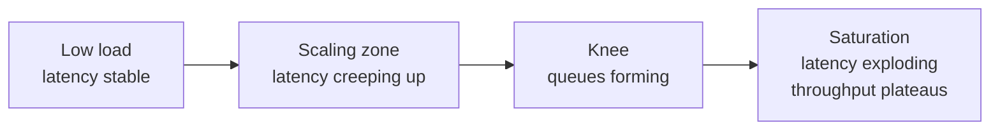

# Throughput vs Latency vs Bandwidth

> **TL;DR** — They're not synonyms.
> - **Latency** = time per operation (how *fast* a single request finishes).
> - **Throughput** = operations per second (how *many* you can do).
> - **Bandwidth** = bits per second (how *fat* the pipe is).
> These three are tied by **Little's Law** and constantly traded against each other. Confusing them is the most common rookie mistake in system design.

---

## 1. The Three Definitions, Side by Side

| Concept | What it measures | Typical unit | Question it answers |
| --- | --- | --- | --- |
| **Latency** | Time elapsed for one operation | ms, µs, ns | *"How long does ONE request take?"* |
| **Throughput** | Number of operations completed in a time window | ops/sec, QPS, RPS, msgs/sec | *"How many requests/sec can the system handle?"* |
| **Bandwidth** | Maximum data rate through a channel | bits/sec (Gbps), bytes/sec (MB/s) | *"How much DATA can the pipe move per second?"* |

```
Latency      = how LONG one car takes to drive from A to B
Throughput   = how MANY cars finish per minute
Bandwidth    = how WIDE the highway is (lanes × speed limit)
```

A 10-lane highway has high *bandwidth*. If every car still has to wait at a toll, *latency* is bad. If 20,000 cars pass per hour, *throughput* is high.

---

## 2. Latency

### What it is
The time between **issuing a request and receiving the response**. For a web service that usually means: the moment the client wrote the first byte of the request to the moment it read the last byte of the response.

### Sub-components
```
Client send  →   Network   →   Server queue   →   Server work   →   Network  →   Client receive
   |              (RTT)         (wait time)       (service time)     (RTT)
   └────────────────────────── End-to-end latency ─────────────────────────────┘
```

- **Service time** — the actual work the server does.
- **Queue time** — time spent waiting in line behind other requests.
- **Network time** — round trip (RTT), TLS handshake, DNS, retransmits.

When a system gets overloaded, **queue time blows up exponentially**, even if service time stays the same. That's why "latency" goes off a cliff under load — not because servers got slower, but because the queue got longer.

### Percentiles, not averages
**Never report "average latency".** Tail behavior is what users feel. Always quote:

- **p50 (median)** — typical user experience.
- **p95** — 1 in 20 users see this or worse.
- **p99** — 1 in 100 users see this or worse.
- **p99.9 / p999** — 1 in 1,000.

p99 can be 10–100× p50 in real systems. Designing to p50 is designing for a fantasy.

```
latency histogram
│        ████
│       ██████
│      ████████
│     ███████████
│   ████████████████
│ █████████████████████████░░░░░░░░░░░░░░░░  ← the tail
│ p50   p95    p99    p99.9
└──────────────────────────────────────────→ time
```

### Why the tail matters
If your page calls 10 backend services in parallel, and each has p99 = 1 s, the *page's* p99 ≈ probability that **at least one** is in its tail ≈ ~10% chance. That's the math behind "fan-out amplifies the tail" — see *The Tail at Scale* by Dean & Barroso.

---

## 3. Throughput

### What it is
Completed operations per unit time. Common variants:
- **RPS / QPS** — HTTP requests or queries per second.
- **TPS** — transactions per second (databases).
- **IOPS** — disk I/O operations per second.
- **msgs/sec** — message queues, streams.

### Throughput ≠ "lots of capacity"
A system can have high throughput AND high latency. A nightly batch job processing a billion rows has enormous throughput but every individual row waits hours.

### Limit
Throughput is bounded by the *slowest* stage. If your web server can do 10k RPS but the DB can do 1k QPS and every request hits the DB, your real throughput is 1k. Find the bottleneck. The whole *theory of constraints* applies.

---

## 4. Bandwidth

### What it is
The maximum data rate of a network link or storage device, expressed in **bits per second** (sometimes bytes per second for storage).

### Units
```
1 Gbps   = 10^9 bits/sec    = 125 MB/s
10 Gbps  = 1.25 GB/s
25 Gbps  = 3.1 GB/s         (typical modern cloud VM NIC)
100 Gbps = 12.5 GB/s        (DC backbone)
1 Tbps   = 125 GB/s         (CDN backbone)
```

### Bandwidth ≠ throughput
A 1 Gbps NIC has 1 Gbps of *bandwidth*. Whether your **throughput** is anywhere near 125 MB/s depends on application-layer overhead, protocol overhead, congestion, retransmissions, encryption cost, and CPU.

### Bandwidth-delay product (BDP)
```
BDP = bandwidth × RTT
```
This is the *in-flight* data needed to keep the pipe full. For a 1 Gbps link with 100 ms RTT, BDP = 12.5 MB. If your TCP window is smaller than that, you'll **never** saturate the pipe — common source of "the bandwidth is there but my transfer is slow".

---

## 5. Little's Law — The One Equation That Ties Them Together

```
L = λ × W
```
- **L** = average number of requests in the system at any moment.
- **λ** = average arrival rate (throughput, in ops/sec).
- **W** = average time each request spends in the system (latency, in seconds).

### Why you care
If a server processes 1,000 RPS and each request takes 100 ms, then on average there are **100 requests in flight**. You need at least 100 concurrent execution slots (threads/connections/goroutines) — otherwise you queue.

### Practical use
- "We want 10k RPS, latency 200 ms → need at least 2,000 in-flight slots."
- "Our thread pool is 50, latency 500 ms → max throughput = 100 RPS, no matter how much CPU we have."
- "DB connection pool is 20, query takes 50 ms → max DB QPS = 400."

If you remember **one equation** from this whole repo, make it this one.

---

## 6. The Relationship Curve

As you increase load, you get a characteristic curve:

```
Latency
  │                                          ╱│
  │                                       ╱   │
  │                                    ╱      │  ← knee: queues blow up
  │                              ___╱
  │              ___________╱
  │   ──────────                                
  └───────────────────────────────────────────────→ Throughput (offered load)
   low load     scaling zone        knee     saturation
```

- **Low load** — latency ≈ service time. Throughput rises linearly with load.
- **Scaling zone** — utilization grows, queue starts to form, latency starts to rise.
- **Knee** — small load increases now cause big latency increases.
- **Saturation** — adding more load doesn't add throughput; it only adds latency (and eventually errors).

Most healthy systems should run **before the knee**, with headroom for spikes.



---

## 7. How They Trade Off Each Other

### Latency ↔ Throughput
- **Batching** increases throughput but adds latency. (Wait 10 ms to collect 100 items, then process them together → 10× throughput, +10 ms latency.)
- **Pipelining** preserves both up to a point — multiple in-flight requests utilize the bottleneck.
- **Concurrency** raises throughput until contention or queueing dominates.

### Throughput ↔ Bandwidth
- A 1 Gbps pipe carrying 1 KB requests can deliver ~125k RPS *if nothing else is the bottleneck*.
- A 1 Gbps pipe carrying 1 MB requests can only deliver ~125 RPS — same bandwidth, vastly different throughput.

### Latency ↔ Bandwidth
- More bandwidth doesn't reduce latency for *small* requests — the bottleneck is RTT, not pipe size.
- More bandwidth *does* reduce latency for *large* transfers (downloading a 1 GB file gets faster).
- **You can't add bandwidth to reduce RTT.** Speed of light is fixed.

---

## 8. Worked Examples

### Example 1 — Web API
- Each request: 200 KB response, 50 ms service time.
- 1 Gbps NIC → max bandwidth-limited RPS = 125 MB/s ÷ 200 KB = **625 RPS**.
- Little's Law: at 625 RPS × 0.05 s = ~31 in-flight requests needed.
- If your worker pool is < 31, you queue → latency rises.

### Example 2 — Database with mixed workload
- 1,000 QPS, p50 = 2 ms, p99 = 50 ms.
- Average concurrency = 1,000 × 0.005 (rough avg) = ~5.
- But at p99 the system has many requests queued → real peak concurrency is much higher.
- Action: size the connection pool above the *peak* concurrent demand, not the average.

### Example 3 — Cross-region replication
- 100 ms RTT between regions.
- Replicating 1 GB of data over a 10 Gbps link.
- Bandwidth-limited: 1 GB / 1.25 GB/s = **0.8 sec**.
- But TCP window starvation can make it **20 sec** if window < BDP (10 Gbps × 0.1 s = 125 MB).
- Need to tune TCP (or use parallel streams / QUIC) to achieve bandwidth-limited time.

---

## 9. How to Talk About Each in an Interview

### Latency
> "I'm targeting p99 < 200 ms for reads. To hit that under 10k QPS, I'll need a hot cache so most reads avoid the DB, and I'll size the worker pool for ~2,000 concurrent in-flight requests."

### Throughput
> "Each Postgres node can absorb ~10k writes/sec; I need 30k peak, so I'll shard 4 ways for headroom."

### Bandwidth
> "Average response is 5 KB; at 50k RPS that's ~2 Gbps egress. A single 25 Gbps NIC handles it, but cross-region cost is non-trivial — I'll keep CDN-cacheable assets at the edge."

Use the *right* word for the *right* metric. Interviewers wince when you say "we need more bandwidth" to fix a latency problem.

---

## 10. Common Pitfalls

- **Quoting averages instead of percentiles** for latency. Stop. Use p95/p99.
- **Assuming throughput rises forever with load.** It hits the knee and falls off.
- **Confusing "fast network" with "low latency".** A fiber across an ocean is still bound by physics.
- **Forgetting concurrency caps.** A small thread pool throttles throughput regardless of CPU.
- **Forgetting protocol overhead.** TLS, HTTP/2 framing, JSON serialization can take a large bite out of raw bandwidth.
- **Conflating client-perceived latency with server-side latency.** The user's bad WiFi is not your server's fault — but it's still your user's experience.

---

## 11. Improving Each

### To lower **latency**
- Cache hot data closer to the client (CDN, edge, in-memory).
- Reduce round trips (HTTP/2, HTTP/3, multiplexing).
- Avoid serial dependencies in fan-out; parallelize.
- Move computation closer to data (data locality).
- Pre-compute (read-heavy denormalization).
- Use faster storage (RAM > NVMe > SSD > HDD).
- Reduce serialization cost (Protobuf > JSON).
- Hedged requests (fire two, take the faster) — *Tail at Scale* trick.

### To raise **throughput**
- Scale horizontally (more replicas).
- Increase concurrency (more threads, async I/O).
- Batch writes.
- Asynchronous processing (move work to background queues).
- Remove serial bottlenecks (locks, single-leader writes).
- Use faster serialization, faster encoding.
- Cache aggressively (cache hits free up downstream throughput).

### To get more **bandwidth**
- Larger NICs / more NICs.
- Compress payloads (gzip, Brotli, Zstd).
- Use efficient encodings (Protobuf, Avro).
- Use CDN — serve from edge, not origin.
- Use HTTP/2 + HTTP/3 for header compression and multiplexing.
- Cut payload size (don't send what the client doesn't need — GraphQL or sparse fieldsets).

---

## 12. Quick-Reference Card

```
LATENCY      ─ time per op      ─ µs / ms        ─ use percentiles
THROUGHPUT   ─ ops per sec      ─ QPS / RPS      ─ bound by slowest stage
BANDWIDTH    ─ bits per sec     ─ Gbps           ─ ≠ throughput

LITTLE'S LAW   L = λ × W
               in-flight = throughput × latency

CURVE:  flat → linear → knee → saturation
TAIL:   p99 can be 10–100× p50
RTT:    you cannot reduce it below speed-of-light minimum
```

---

## 13. Resources

### Foundational
- **"The Tail at Scale"** — Jeff Dean, Luiz Barroso (CACM 2013). The paper that put percentiles on the map: <https://research.google/pubs/the-tail-at-scale/>
- **Little's Law** — original 1961 paper by John D.C. Little. Wikipedia is enough: <https://en.wikipedia.org/wiki/Little%27s_law>
- *Designing Data-Intensive Applications*, Ch. 1 — Kleppmann's treatment of latency vs throughput is the cleanest you'll find.

### Articles
- "Latency Lags Bandwidth" — David Patterson (CACM 2004): why bandwidth grows faster than latency.
- "Numbers Every Programmer Should Know" — <https://gist.github.com/jboner/2841832>
- Marc Brooker (AWS), "Long Tail Latency at Scale" — <https://brooker.co.za/blog/>
- Brendan Gregg, "USE Method" (Utilization, Saturation, Errors) — <https://www.brendangregg.com/usemethod.html>

### Videos
- ByteByteGo: "Latency vs Throughput" — <https://www.youtube.com/@ByteByteGo>
- Hussein Nasser on backend latency: <https://www.youtube.com/@hnasr>

### Tools
- **wrk / wrk2** — HTTP load testing with proper latency histograms.
- **vegeta** — Go HTTP load tester.
- **k6** — modern scripting-friendly load tester.
- **HdrHistogram** — Gil Tene's library for correctly recording latency tails.

---

*Previous:* [← Powers of Two & Latency Numbers](./latency-numbers.md)  |  *Next:* [Core Properties: Scalability, Reliability, Availability, Maintainability →](./core-properties.md)
