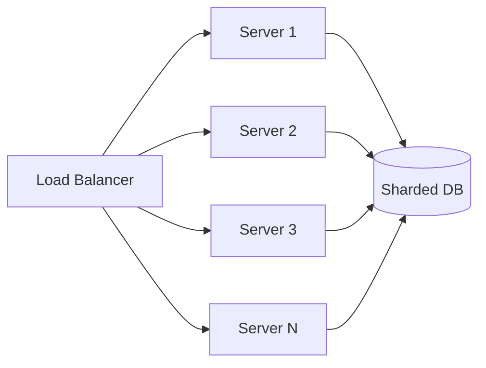

# Vertical vs Horizontal Scaling

> **TL;DR** — **Vertical scaling** (scale *up*) means making a single machine bigger. **Horizontal scaling** (scale *out*) means adding more machines. Vertical is simpler and faster to deploy but hits a hard ceiling and is expensive at the top end; horizontal scales practically forever but introduces distributed-systems complexity (replication, sharding, consistency). Real systems use *both*: scale up to a sensible box, then scale out.

---

## 1. The Two Directions

```
       VERTICAL SCALING                       HORIZONTAL SCALING
       (scale UP)                             (scale OUT)

         ┌─────────┐                          ┌────┐ ┌────┐ ┌────┐
         │         │                          │ S1 │ │ S2 │ │ S3 │
         │  BIGGER │                          └────┘ └────┘ └────┘
         │ SERVER  │       ──────►            ┌────┐ ┌────┐ ┌────┐
         │         │                          │ S4 │ │ S5 │ │ S6 │
         │         │                          └────┘ └────┘ └────┘
         └─────────┘                          + load balancer in front
```

| | Vertical (scale up) | Horizontal (scale out) |
| --- | --- | --- |
| **What changes** | Same node, more CPU / RAM / disk | More nodes, same size each |
| **Complexity** | Low | High (coordination, networking) |
| **Cost curve** | Sub-linear at small sizes, super-linear at top end | Linear (mostly) |
| **Ceiling** | Hardware limits (the biggest VM money can buy) | Practically unlimited |
| **Failure model** | One bigger SPOF | Many smaller nodes; lose some, survive |
| **Best for** | Stateful single-leader systems, RDBMS | Stateless web tier, sharded data |
| **Downtime to scale** | Often requires a restart / failover | Usually zero (add a node) |
| **Latency variance** | Lower (less network) | Higher (more hops, more variance) |

---

## 2. Vertical Scaling

### What it actually means
Take the same machine — same code, same process, same data — and give it more horsepower. In the cloud this is usually:
- Bigger instance type (e.g. AWS `m5.large` → `m5.24xlarge`).
- More vCPUs, more RAM.
- Faster network (10 Gbps → 100 Gbps NIC).
- More IOPS / larger disk.

### Where it shines
- **Relational databases** — Postgres, MySQL, Oracle. They were designed around a single writer.
- **Cache nodes** — Redis is single-threaded; bigger box = more RAM for the working set.
- **Legacy / monolithic apps** — sometimes the cheapest way to buy time.
- **Latency-sensitive workloads** — keeping data in one process avoids network hops.

### The hard ceilings
- Cloud max instance ≈ ~24 TB RAM, ~448 vCPUs, ~3.2 Tbps networking (as of 2025-ish).
- **Cost per unit performance** grows non-linearly at the top of the menu. A 192-vCPU box costs *more than* 24 × 8-vCPU boxes.
- **Single point of failure** — when that one big box dies, everything is down.
- **Restart pain** — vertical scaling often requires a restart and warmup. A 1 TB cache takes time to refill.
- **Tail latency** — bigger boxes share CPU caches across more threads → noisier-neighbor effects within the box.

### When to vertically scale
- You're early-stage and adding complexity isn't worth it yet. ("Just give it more RAM.")
- The workload is **inherently single-node** (a relational DB primary, a Redis master).
- You need to ship *today*.
- Costs are still small in absolute terms.

> **The hidden truth:** vertical scaling is often the *right* answer. Many "we need microservices and Cassandra" decisions could have been "use a beefier Postgres". Boring tech wins.

---

## 3. Horizontal Scaling

### What it actually means
Run the workload across many machines. The total throughput is (ideally) the sum of all the nodes' throughputs.

### Two flavors
1. **Stateless horizontal scaling** — easy. Web tier, API servers, workers. Add a node behind a load balancer. Done.
2. **Stateful horizontal scaling** — hard. You must decide:
   - Where each piece of data lives → **sharding / partitioning**.
   - How many copies → **replication**.
   - How conflicts are resolved → **consistency model**.



### Benefits
- **Practically unlimited scale** — add more nodes for more capacity.
- **No SPOF** — lose any one node, system survives.
- **Geographic distribution** — replicas can live in different regions.
- **Commodity hardware** — cheap small boxes instead of expensive large ones.
- **Independent failure domains** — one node's GC pause doesn't stall the others.

### Costs
- **Coordination overhead** — leader election, consensus, gossip.
- **Network is a first-class concern** — partitions, retries, timeouts.
- **Operational complexity** — more boxes = more pages.
- **Data partitioning is hard to undo** — pick the shard key wrong and you'll be paying for years.
- **Tail latency grows** — fan-out amplifies p99 (see [Throughput vs Latency](./throughput-latency-bandwidth.md)).
- **Distributed-systems theorems apply** — CAP, PACELC, FLP.

### When to horizontally scale
- Load exceeds what one box can do.
- You need fault tolerance (one box dying must not be fatal).
- You need geographic reach.
- You're already at the top of the instance menu.

---

## 4. The Spectrum (real systems are both)

Almost no production system is purely one or the other:

```
Stateless web tier  ─►  Horizontal (50 servers behind ALB)
Cache layer        ─►  Horizontal (Redis Cluster) + vertical (each shard is a big box)
RDBMS primary      ─►  Vertical (one big Postgres)
RDBMS read replicas─►  Horizontal (N read-only replicas)
Object storage     ─►  Horizontal (S3 / GCS, you don't manage nodes)
Analytics warehouse─►  Horizontal MPP (Snowflake, BigQuery)
```

Pattern: **scale up the bottleneck node, scale out the bottleneck tier.**

---

## 5. Diagonal Scaling (the pragmatic middle)

A useful third name: **diagonal scaling**. Start vertical. When the box is uncomfortably full, *clone* it (now horizontal), then keep scaling each clone vertically too. This is how most companies actually grow.

```
Year 1: 1 box, m5.large
Year 2: 1 box, m5.4xlarge   ← vertical
Year 3: 4 boxes, m5.4xlarge ← horizontal
Year 4: 16 boxes, m5.4xlarge ← horizontal
Year 5: 16 boxes, m5.8xlarge ← vertical again
```

---

## 6. The Math: When Does Each Help?

### Amdahl's Law (the ceiling on parallel speedup)
```
Speedup(N) = 1 / ( (1−p) + p/N )
```
- `p` = fraction of work that *can* be parallelized.
- `N` = number of processors/nodes.

If 10% of your workload is inherently sequential (`p = 0.9`), you can never get more than **10× speedup**, no matter how many nodes you add. Distributed systems have a *lot* of "10%" — leader writes, global counters, serial dependencies.

### Universal Scalability Law (Neil Gunther's refinement)
Amdahl ignores *coordination cost*. The USL adds it:
```
C(N) = N / (1 + α(N−1) + βN(N−1))
```
- α = contention (serialization).
- β = coherency / coordination cost.

The β term means **throughput actually decreases past some N**. Adding more nodes makes you slower. This is real and famous — every distributed system has a sweet spot.

```
Throughput
   │             ╭─────╮
   │           ╱        ╲
   │         ╱            ╲___
   │       ╱                  ╲___
   │     ╱                        ╲__
   │   ╱
   │ ╱
   └────────────────────────────────────────►  N (nodes)
       linear      sweet     decline
```

> *More machines is not always more throughput.* Coordination cost can dominate.

---

## 7. What Becomes Hard When You Scale Horizontally

| Challenge | Why | Mitigation |
| --- | --- | --- |
| **Sharding key choice** | Hot keys ruin everything | Hash on a high-cardinality field, plan for re-sharding |
| **Distributed transactions** | 2PC is slow and brittle | Sagas, eventual consistency, idempotency |
| **Consistency** | Replicas can diverge | Pick a model: strong / eventual / causal |
| **Hotspotting** | Some shards see 10× traffic | Rebalance, consistent hashing, hot-key splitting |
| **Joins across shards** | Network roundtrips | Denormalize, replicate dimension tables |
| **Schema migrations** | Coordinated across N nodes | Online migrations, backward-compat changes |
| **Observability** | Many small signals, must correlate | Distributed tracing (OpenTelemetry) |
| **Deploy coordination** | Rolling/canary across many nodes | Orchestration (K8s), feature flags |

---

## 8. Examples From Real Systems

- **MySQL / Postgres primary** — vertical-first. Eventually shard with Vitess or pgcat or manual sharding.
- **DynamoDB / Cassandra / Bigtable** — horizontal-native; everything is partitioned by hash key.
- **Redis** — single node is vertical (use big box). Redis Cluster is horizontal (16,384 hash slots distributed across nodes).
- **Kafka** — horizontal across brokers; each topic partition lives on one broker (replicated).
- **Elasticsearch** — horizontal across nodes; primary + replica shards.
- **S3** — fully horizontal; you can't even tell how many nodes there are.
- **Web tier (Nginx + app servers)** — horizontal behind ALB; stateless makes it trivial.
- **Stateful WebSocket service** — horizontal but tricky (sticky sessions or session affinity).

---

## 9. The Decision Tree

```
Is your bottleneck a single instance type away from being solved?
   ├── Yes → Scale vertically. Ship it. Revisit later.
   └── No → Is the data stateless or trivially partitionable?
              ├── Stateless → Scale horizontally behind a load balancer.
              └── Stateful → Pick a sharding strategy. Pick a consistency model.
                              Plan operations carefully. Decide your shard key
                              like your career depends on it (it might).
```

---

## 10. Common Mistakes

- **Scaling out a database before exhausting vertical.** A single Postgres can take you *very* far. People shard at 1 TB when they could have bought a bigger box.
- **Scaling up a stateless tier.** Stateless tiers should scale *out*. Don't pay for one giant API server.
- **Picking the wrong shard key.** "User ID" works until your celebrity has 100M followers.
- **Ignoring coordination cost.** Past some N, more nodes = less throughput.
- **Assuming "horizontal" means "infinite".** USL says otherwise.
- **Forgetting that some workloads are inherently vertical.** A single relational transaction across many tables doesn't horizontally scale gracefully.

---

## 11. Quick-Reference Card

```
VERTICAL   ─ same node, more horsepower
            + simple, no distributed-systems pain
            − ceiling, cost curve, SPOF
            ★ when: small scale, stateful, time-pressured

HORIZONTAL ─ more nodes, same node size
            + practically unlimited, fault-tolerant
            − coordination cost, sharding pain
            ★ when: load > one box, fault tolerance required

DIAGONAL   ─ alternate the two as you grow
RULE       ─ scale UP the bottleneck node,
            scale OUT the bottleneck tier
LAWS       ─ Amdahl: ceiling from serial work
            USL: throughput can DROP past optimum N
```

---

## 12. Resources

### Foundational
- *Designing Data-Intensive Applications*, Ch. 5 & 6 — Replication & Partitioning.
- **Universal Scalability Law** — Neil Gunther's papers and book *Guerilla Capacity Planning*.
- **Amdahl's Law** — original 1967 paper; Wikipedia is enough: <https://en.wikipedia.org/wiki/Amdahl%27s_law>

### Articles & blogs
- Marc Brooker (AWS) on scaling: <https://brooker.co.za/blog/>
- "Scaling MySQL at Slack" — <https://slack.engineering/scaling-datastores-at-slack-with-vitess/>
- "Vertical vs Horizontal scaling" — IBM: <https://www.ibm.com/cloud/blog/horizontal-vs-vertical-scaling>
- Vitess docs (sharding MySQL) — <https://vitess.io/>
- Citus docs (sharding Postgres) — <https://docs.citusdata.com/>

### Videos
- ByteByteGo: "Vertical vs horizontal scaling" — <https://www.youtube.com/@ByteByteGo>
- Hussein Nasser: "Scaling databases" — <https://www.youtube.com/@hnasr>

### Cloud reference
- AWS instance types — <https://aws.amazon.com/ec2/instance-types/>
- GCP machine types — <https://cloud.google.com/compute/docs/machine-types>
- Auto-scaling groups (AWS), Managed Instance Groups (GCP), Horizontal Pod Autoscaler (Kubernetes).

---

*Previous:* [← Core Properties](./core-properties.md)  |  *Next:* [Stateful vs Stateless Services →](./stateful-vs-stateless.md)
