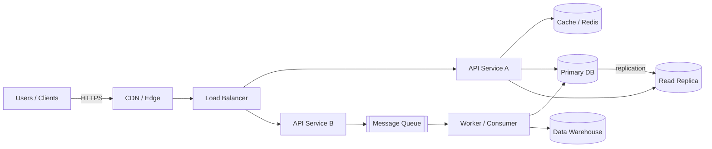
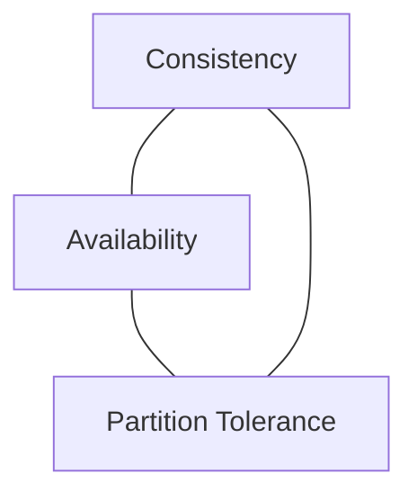
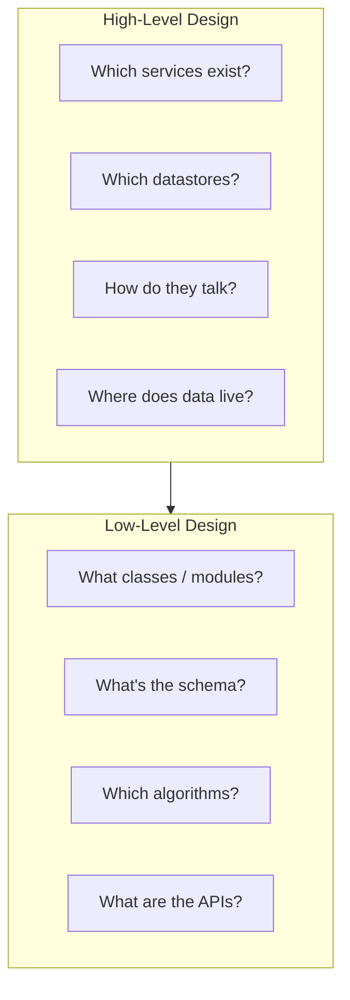
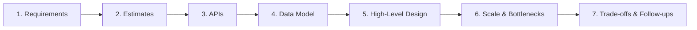

# What is System Design?

> **TL;DR** — System design is the discipline of defining the *architecture, components, interfaces, and data* of a software system so that it meets a set of functional requirements (what it should do) and non-functional requirements (how well it should do them — speed, scale, reliability, cost, security). It is the bridge between a product idea and the code that actually runs at scale.

---

## 1. The One-Line Definition

> **System design = choosing the right building blocks and connecting them in the right way so that the whole thing works under real-world load, failure, and change.**

When you're writing a small script, you only think about *correctness*. The moment your software has multiple users, multiple machines, multiple failures per day, and multiple teams touching it, you have to think about much more than correctness — you have to think about **structure**. That structure is the *system design*.

---

## 2. Why Does It Matter?

Software at scale fails for predictable reasons:

- A single database that worked fine for 1,000 users falls over at 1,000,000.
- A service that ignored timeouts cascades a downstream hiccup into a full outage.
- A feature shipped without idempotency double-charges customers when the network blips.
- A schema chosen without thought makes a future migration a 6-month project.

Good system design **prevents** these problems before code is written. Bad system design is paid for later — in incidents, on-call pages, customer churn, and engineer burnout.

It also matters because:

1. **Interviews.** Almost every senior+ engineering interview has a system design round. It's how companies separate engineers who can *build features* from engineers who can *build platforms*.
2. **Career growth.** Promotion to Senior / Staff / Principal is largely about thinking at the *system* level, not the *function* level.
3. **Real-world impact.** Architecture decisions outlive the people who make them. Choosing PostgreSQL vs DynamoDB on Day 1 echoes for the next decade.

---

## 3. The Mental Model: Inputs → System → Outputs

At its core every system is a function over time:

```
        +--------------------+
Users → |   Your System      | → Responses
Events  |   (services, DBs,  |   Side-effects (emails, payments, logs)
APIs  → |    queues, caches) |   Derived data (analytics, ML features)
        +--------------------+
                  ↑
        Operators (deploys, alerts, dashboards)
```

System design is the practice of deciding *what goes in that box* and *how the pieces talk to each other* so that, under any realistic input pattern and any realistic failure, the outputs remain correct, fast, and cheap enough.

### A more concrete picture



Every component in that diagram is a *deliberate choice*: why a CDN here, why a queue there, why a replica instead of sharding. System design is the rationale behind each arrow.

---

## 4. Functional vs Non-Functional Requirements

Every system design starts here. Skipping this step is the #1 mistake in interviews.

| Type | What it answers | Examples |
| --- | --- | --- |
| **Functional** | *What* the system does | "Users can post a tweet", "Admins can refund an order", "The system sends an email after signup" |
| **Non-Functional** | *How well* it does it | "p99 latency < 200ms", "99.99% availability", "Handles 10k writes/sec", "Survives a region outage", "Costs < $50k/month" |

You **cannot** design a system without knowing both. "Build Twitter" with no scale target is unbuildable — Twitter for 100 users is a single SQLite file; Twitter for 500 million is a multi-region distributed system. Both are correct answers to two very different questions.

---

## 5. The Universal Trade-Off Triangle

Almost every system design decision is a trade-off between three families of concerns. You can usually pick two and pay for the third.



That's the **CAP theorem** in its most famous form, but the trade-off pattern is everywhere:

- **Latency ↔ Throughput ↔ Cost** — Faster responses + more requests/sec usually = more money.
- **Read speed ↔ Write speed ↔ Storage** — Indexes speed reads but slow writes and bloat disk.
- **Simplicity ↔ Flexibility ↔ Performance** — A clever cache is fast but adds an invalidation bug surface.
- **Strong consistency ↔ Low latency ↔ High availability** — Pick two; the third gets worse.

**Good system design is not finding the "right" answer — it's making the trade-off explicit and defensible.**

---

## 6. The Building Blocks (a 60-second tour)

These are the LEGO bricks every system design problem reuses. You'll go deep on each later in this repo.

| Block | Why it exists | Typical examples |
| --- | --- | --- |
| **Load Balancer** | Spread traffic across servers, hide failures | Nginx, HAProxy, AWS ALB, Envoy |
| **CDN** | Serve static and cached content from close to the user | Cloudflare, Akamai, Fastly, CloudFront |
| **Application Server** | Run business logic | Any service running your code |
| **Cache** | Avoid recomputing or refetching hot data | Redis, Memcached, in-process LRU |
| **Database (OLTP)** | Durable source of truth for transactional data | PostgreSQL, MySQL, DynamoDB |
| **Database (OLAP)** | Run heavy analytical queries | Snowflake, BigQuery, ClickHouse |
| **Search Index** | Full-text, relevance, faceted search | Elasticsearch, OpenSearch |
| **Object Store** | Cheap durable storage for blobs | S3, GCS, Azure Blob |
| **Message Queue / Stream** | Decouple producers and consumers, smooth spikes, enable async work | Kafka, RabbitMQ, SQS, Pub/Sub |
| **Worker / Consumer** | Do the async work the API kicked off | Sidekiq, Celery, Kafka consumer |
| **API Gateway** | One door in: auth, rate-limiting, routing | Kong, AWS API Gateway, Apigee |
| **Service Mesh** | Service-to-service networking, retries, mTLS | Istio, Linkerd |
| **Observability Stack** | See what's happening | Prometheus, Grafana, Datadog, Jaeger |

Almost every system design problem can be sketched in 5 minutes by combining these blocks. The *skill* is knowing **which** to use and **why**.

---

## 7. The Two Layers of System Design

There are two distinct conversations engineers call "system design", and great engineers know which one they're in:

### 7.1 High-Level Design (HLD)
*Boxes and arrows.* What services exist, what data they own, how they communicate, where the bottlenecks live, how data flows end-to-end. This is what interviewers usually mean by "design Twitter".

### 7.2 Low-Level Design (LLD)
*Classes, methods, schemas, algorithms.* The internals of a single service — its data model, its key endpoints, its concurrency model, the indexes on each table. Sometimes called "object-oriented design" or "detail design".



A senior interview will usually start at HLD and *drill down* into LLD on one or two components. Watch for the cue — "okay, zoom in on the matching service" means *switch to LLD mode*.

---

## 8. A Repeatable Process

When you sit down to design a system (in an interview or in real life), follow this 7-step loop. We'll revisit it in [Interview Approach](./interview-approach.md).



1. **Clarify requirements** — functional + non-functional. Don't skip this.
2. **Estimate scale** — QPS, storage, bandwidth. Back-of-envelope numbers drive every later choice.
3. **Sketch the APIs** — what does a client call look like? This pins down the contract.
4. **Design the data model** — entities, relationships, the *one* choice that's hardest to change later.
5. **Draw the high-level architecture** — boxes and arrows, naming components.
6. **Identify scale issues** — where is the hot path, what breaks at 10x, how do we shard / cache / queue?
7. **Discuss trade-offs and extensions** — what would you do differently with more time, what failure modes worry you.

---

## 9. What Good System Design Looks Like

A well-designed system feels boring. Boring is a compliment.

- **Predictable performance** — p99 latency doesn't surprise you.
- **Graceful degradation** — when something fails, the *blast radius* is small and the user sees a degraded but functional product, not a 500 page.
- **Observable** — when something goes wrong, you can tell *which* component, *why*, in minutes.
- **Evolvable** — new features fit without rewriting the whole stack.
- **Honest about cost** — engineering, infrastructure, operational.

A poorly designed system feels exciting. Constant fires, surprising outages, "we need to rewrite X by Q3", and a one-person-knows-this-component dependency are all symptoms of paid-down design.

---

## 10. Common Misconceptions

- **"System design = microservices."** No. A well-designed monolith beats a poorly-designed microservices mess every day. Architecture choice is downstream of requirements.
- **"More scalable is always better."** No. Premature scaling burns time, money, and complexity. Designing for 10x your current scale is wise; designing for 1000x usually isn't.
- **"Pick the newest tech."** Boring tech wins. PostgreSQL, Redis, and Kafka have solved the same problems for a decade — there's a reason every interview answer reaches for them.
- **"There's a right answer."** There rarely is. There are well-defended answers and poorly-defended answers.

---

## 11. How to Get Better at It

1. **Read postmortems.** Real outages from real companies are the best teacher. (See resources below.)
2. **Practice case studies.** Pick one from [Section 18 of the README](../README.md) and design it on paper before reading the solution.
3. **Build something small but distributed.** A 3-node Raft toy or a sharded counter teaches more than 10 books.
4. **Read the classics.** *Designing Data-Intensive Applications* by Martin Kleppmann is, hands down, the book.
5. **Reverse-engineer products you use.** Open Twitter; ask yourself how the timeline arrives.

---

## 12. Glossary (you'll see these everywhere)

| Term | Meaning |
| --- | --- |
| **QPS / RPS** | Queries / requests per second |
| **p50 / p95 / p99 / p999** | Latency percentiles. p99 = "99% of requests are faster than X" |
| **SLA / SLO / SLI** | Service Level Agreement / Objective / Indicator |
| **Idempotent** | Doing the operation twice has the same effect as doing it once |
| **Stateless** | The service holds no per-client state between requests |
| **Hot key / Hot partition** | A single key or shard receiving disproportionate traffic |
| **Fan-out** | One write triggers many downstream operations (e.g., posting a tweet to 1M followers' timelines) |
| **Backpressure** | The system pushing back when a downstream component is slower than the upstream |
| **Eventual consistency** | Replicas converge to the same value, given enough time and no new writes |

---

## 13. Where to Go Next in This Repo

- ➡️ [Functional vs Non-Functional Requirements](./functional-vs-non-functional.md) — the discipline of asking "what does *good* look like?"
- ➡️ [How to Approach a System Design Interview](./interview-approach.md) — the 45-minute playbook.
- ➡️ [Back-of-the-Envelope Estimation](./estimation.md) — math that pins down every later choice.
- ➡️ [Scalability, Reliability, Availability, Maintainability](./core-properties.md) — the four properties every design is judged on.

---

## 14. Valuable External Resources

### Books (in priority order)
- **Designing Data-Intensive Applications** — Martin Kleppmann. The single best book on this topic, full stop.
- **System Design Interview – An Insider's Guide (Vol 1 & 2)** — Alex Xu. The most popular interview-focused book.
- **Building Microservices** (2nd ed.) — Sam Newman.
- **Site Reliability Engineering** — Google. Free online: <https://sre.google/books/>
- **Release It!** — Michael Nygard. Stability patterns (circuit breakers, bulkheads) come from here.
- **The Site Reliability Workbook** — Google. Free online: <https://sre.google/workbook/table-of-contents/>

### Free online primers
- **System Design Primer** (Donne Martin) — GitHub: <https://github.com/donnemartin/system-design-primer> — Probably the most-starred system design resource on the internet.
- **High Scalability blog** — <http://highscalability.com/> — Real architectures from real companies.
- **AWS Architecture Center** — <https://aws.amazon.com/architecture/> — Reference architectures and well-architected framework.
- **Google Cloud Architecture Framework** — <https://cloud.google.com/architecture/framework>
- **Azure Architecture Center** — <https://learn.microsoft.com/en-us/azure/architecture/>

### YouTube channels
- **ByteByteGo** — <https://www.youtube.com/@ByteByteGo> — Alex Xu's animated explanations.
- **Gaurav Sen** — <https://www.youtube.com/@gkcs> — Classic system design interview walkthroughs.
- **Hussein Nasser** — <https://www.youtube.com/@hnasr> — Databases & backend internals.
- **Jordan has no life** — <https://www.youtube.com/@jordanhasnolife5163> — Deep, no-nonsense walkthroughs.
- **Tech Dummies (Narendra L)** — <https://www.youtube.com/@TechDummiesNarendraL>

### Engineering blogs (read postmortems and architecture posts)
- Netflix Tech Blog — <https://netflixtechblog.com/>
- Uber Engineering — <https://www.uber.com/blog/engineering/>
- Stripe Engineering — <https://stripe.com/blog/engineering>
- Discord Engineering — <https://discord.com/category/engineering>
- Cloudflare Blog — <https://blog.cloudflare.com/>
- Meta Engineering — <https://engineering.fb.com/>
- AWS Architecture Blog — <https://aws.amazon.com/blogs/architecture/>
- The Pragmatic Engineer — <https://blog.pragmaticengineer.com/>

### Papers worth your time (the canon)
- *The Google File System* (Ghemawat, Gobioff, Leung, 2003)
- *MapReduce: Simplified Data Processing on Large Clusters* (Dean, Ghemawat, 2004)
- *Bigtable: A Distributed Storage System for Structured Data* (Chang et al., 2006)
- *Dynamo: Amazon's Highly Available Key-value Store* (DeCandia et al., 2007)
- *In Search of an Understandable Consensus Algorithm* — Raft (Ongaro, Ousterhout, 2014)
- *Spanner: Google's Globally-Distributed Database* (Corbett et al., 2012)
- *Kafka: a Distributed Messaging System for Log Processing* (Kreps, Narkhede, Rao, 2011)
- Found here: <https://github.com/papers-we-love/papers-we-love>

### Practice & interactive
- **Excalidraw** — <https://excalidraw.com/> — The whiteboard tool every system design YouTuber uses.
- **LeetCode System Design** — discussion forum and curated problems.
- **Pramp / Exponent / interviewing.io** — mock system design interviews.

### Newsletters
- **ByteByteGo Newsletter** — <https://blog.bytebytego.com/>
- **The Pragmatic Engineer** — <https://blog.pragmaticengineer.com/>
- **System Design Newsletter** — <https://newsletter.systemdesign.one/>

---

## 15. Cheat Card — Print this, tape it to your monitor

```
1. Clarify  ─ functional + non-functional + scale.
2. Estimate ─ QPS, storage, bandwidth (powers of 10).
3. APIs     ─ a few signatures, request/response shapes.
4. Schema   ─ entities, keys, relationships, indexes.
5. HLD      ─ boxes & arrows; name every component.
6. Scale    ─ cache / shard / queue / replicate where it hurts.
7. Trade    ─ consistency vs availability, latency vs cost,
              simplicity vs flexibility. Say WHY.
```

That single card, internalised, will get you through 90% of interviews and most real-world design discussions.

---

*Next up:* [Functional vs Non-Functional Requirements →](./functional-vs-non-functional.md)
