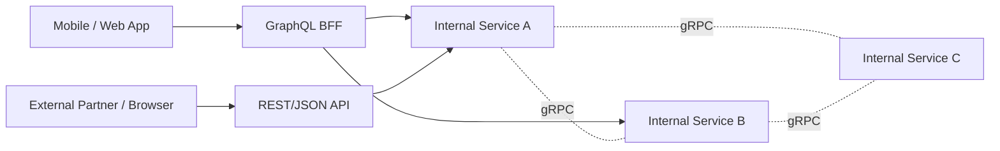
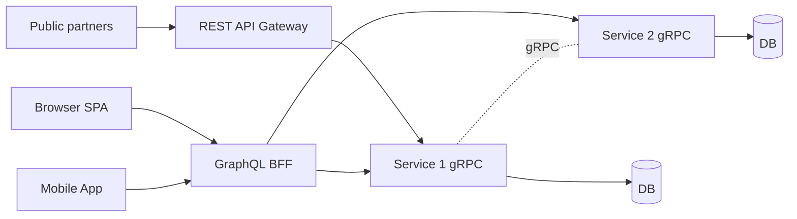

# REST vs GraphQL vs gRPC

> **TL;DR** — Three dominant API styles for HTTP-era systems:
> - **REST/JSON** — resources + HTTP verbs, human-readable, browser-native, the lingua franca of public APIs.
> - **GraphQL** — one endpoint, the client declares what fields it wants, the server resolves it. Great for aggregating data and avoiding over/under-fetching.
> - **gRPC** — schema-first RPC over HTTP/2 + protobuf. Fast, strict, with streaming. The standard for internal service-to-service.
>
> None is "best." Most production systems use **all three**: REST for external partners, GraphQL for BFFs/mobile apps, gRPC inside the platform.

---

## 1. The Picture



Each API style is good at a different job. The job dictates the choice.

---

## 2. REST/JSON — The Universal Default

### The idea
**Re**presentational **S**tate **T**ransfer — coined by Roy Fielding (2000). Resources have URLs; HTTP methods are the verbs.

```
GET    /users/42              ← read
POST   /users                  ← create
PUT    /users/42               ← replace
PATCH  /users/42               ← partial update
DELETE /users/42               ← remove

GET    /users/42/orders        ← nested resource
GET    /users?role=admin       ← query
```

Responses are JSON. Caching, content negotiation, auth — all handled by HTTP itself.

### Strengths
- **Everyone speaks it.** Every language, every dev, every tool.
- **HTTP semantics for free** — caching, conditional requests, status codes, redirects.
- **Browser-native** — no extra clients needed.
- **Easy to debug** — `curl`, browser DevTools, log files.
- **Loose coupling.** Clients consume only the fields they care about.
- **Versioning is straightforward** (`/v1/`, `/v2/`).

### Weaknesses
- **Over-fetching / under-fetching.** Endpoint returns more than you need, or you need 3 calls to assemble a screen.
- **No built-in schema.** OpenAPI/Swagger helps but is opt-in.
- **Verbose.** Text JSON + repeated keys per record.
- **No streaming primitive.** SSE/WS bolt on.
- **Conventions ≠ standards.** "REST" in practice ranges from clean Roy-Fielding-style to "JSON over HTTP."
- **N+1 patterns common.** "Get user, then for each user get their orders…" → many round trips.

### When to choose REST
- **Public APIs** for third parties. Universally understood.
- **CRUD-shaped resources** with simple relationships.
- **Browser-direct calls** without a gateway.
- **Caching matters** (HTTP caching primitives are great).
- **Tooling matters more than perf** — Stripe, GitHub, Twilio all expose REST.

### Conventions worth standardizing
- Resource names are nouns, plural (`/users`, not `/getUser`).
- Errors return appropriate status codes (`4xx` client, `5xx` server).
- Standard error body: `{ "error": { "code": "NOT_FOUND", "message": "..." } }`.
- Pagination via cursor (`?cursor=abc`) over `?page=N` for stability.
- Idempotency keys on `POST` for safe retries.
- Use `PATCH` over `PUT` for partial updates.

See [REST API Design Principles →](../03-apis/rest-design.md).

---

## 3. GraphQL — Client-Declared Queries

### The idea
A **single endpoint** (`/graphql`) accepts a **query** describing exactly what the client wants. The server resolves each field, possibly fan-ing out to multiple data sources, and returns a single JSON response shaped like the query.

```graphql
query {
  user(id: 42) {
    name
    email
    orders(last: 5) {
      id
      total
      items { sku, quantity }
    }
  }
}
```

Response:
```json
{
  "data": {
    "user": {
      "name": "Ada",
      "email": "ada@example.com",
      "orders": [ { "id": "o-1", "total": 4200, "items": [...] }, ... ]
    }
  }
}
```

### Strengths
- **No over/under-fetching.** Client gets exactly the fields it asked for.
- **One round trip** assembles a screen that would take 5 REST calls.
- **Strong schema.** Single source of truth for types, with introspection.
- **Great for mobile clients** — small payloads, fewer round trips.
- **Tooling is excellent** — GraphiQL, Apollo Studio, schema diffing.
- **Subscriptions** for realtime push (over WS).
- **Federated schemas** (Apollo Federation, Hot Chocolate, GraphOS) compose services into one graph.

### Weaknesses
- **Caching is harder.** HTTP caches don't understand `POST /graphql`. You need per-field caching (Apollo Client, dataloader, persisted queries + CDN).
- **N+1 inside the server.** Naively resolving each field calls the DB many times. **DataLoader**-style batching is mandatory.
- **Performance complexity.** Arbitrary client queries make capacity planning hard. Cost analysis / max depth / max nodes are essential.
- **Schema sprawl.** With many teams contributing, the graph becomes a swamp.
- **Mutation ergonomics** are awkward compared to REST.
- **Auth and rate limiting** at the field level are non-trivial.
- **Browser tooling.** Not as casual as `curl /endpoint`; need GraphiQL or a client.

### When to choose GraphQL
- **BFF (Backend-for-Frontend)** for mobile and web — aggregating multiple services per screen.
- **Mobile clients** where each extra request hurts (latency, battery).
- **Complex domains** with deeply nested relationships.
- **Multiple consumers** wanting different slices of the same data.
- **A schema-first culture** with the resources to maintain it.

### When *not* to choose GraphQL
- Public APIs where consumers expect REST.
- Resource-shaped CRUD where REST is plenty.
- High-throughput service-to-service (use gRPC).
- Small teams not ready for federation, persisted queries, query complexity analysis.

### Example: with persisted queries
Instead of clients sending arbitrary queries, register queries by ID at deploy time. Clients send `{queryId: "abc123", vars: {...}}`. Gives you caching, rate limiting, security in one move.

---

## 4. gRPC — Fast, Strict, Service-to-Service

(Detailed in [gRPC, Protocol Buffers, Thrift](./grpc-protobuf.md).)

### The idea
Schema-first **RPC** over **HTTP/2** with **protobuf** payloads. Define methods, generate strongly-typed clients and servers in every language.

```proto
service UserService {
  rpc GetUser    (GetUserRequest) returns (GetUserResponse);
  rpc StreamFeed (StreamReq)      returns (stream FeedItem);
}
```

### Strengths
- **Fastest of the three** — binary, multiplexed, HTTP/2.
- **Strict schema** with backward-compatibility rules.
- **Code generation** — clients and servers in any language.
- **Streaming** — server, client, bidirectional, all native.
- **Built-in deadlines, cancellation, flow control.**
- **Best fit for internal service mesh** — mTLS, retries, tracing fit naturally.

### Weaknesses
- **Not browser-friendly** without grpc-web / Connect.
- **Public adoption is low** — partners expect REST.
- **Debugging requires tooling** (`grpcurl`, `bloomrpc`).
- **HTTP caching doesn't apply.**
- **Schema sharing logistics** — buf or a monorepo of `.proto` files.

### When to choose gRPC
- **Internal service-to-service** at scale.
- **Polyglot teams** that want one schema for many languages.
- **High-throughput, low-latency** paths.
- **Streaming RPCs** (replication, log shipping, telemetry).
- **You control both ends.**

---

## 5. Side-by-Side Feature Matrix

| | REST/JSON | GraphQL | gRPC |
| --- | --- | --- | --- |
| Wire format | JSON (text) | JSON (text) | Protobuf (binary) |
| Transport | HTTP/1.1, H/2 | HTTP/1.1, H/2 (WS for subs) | HTTP/2 (or H/3) |
| Schema | Optional (OpenAPI) | Mandatory | Mandatory (`.proto`) |
| Code gen | Optional | Yes (clients) | Yes (clients + servers) |
| Browser-native | ✅ | ✅ | ⚠️ via grpc-web/Connect |
| Streaming | SSE / WS bolted on | Subscriptions over WS | Native, 3 modes |
| Caching | HTTP caching (great) | Per-field / persisted queries | None built-in |
| Discoverability | Docs / OpenAPI | Introspection (built-in) | Reflection (opt-in) |
| Versioning | URL / header | Schema evolves; deprecate fields | proto3 evolution rules |
| Best for | Public APIs, simple CRUD, browser | BFF, mobile, aggregated data | Internal service-to-service |
| Typical perf | Baseline | Same or worse (resolver fan-out) | 2–10× faster end-to-end |
| Operational maturity needed | Low | Medium-high | Medium |

---

## 6. Common Architecture: All Three Together



A real platform usually has:
- **Public REST** for documented external APIs (the contract you sell or open-source).
- **GraphQL BFF** for first-party web and mobile apps (one query → one response, aggregated across services).
- **Internal gRPC** between services for speed, strict typing, streaming.

You can mix as needed; no rule forces purity.

---

## 7. Choosing — A Decision Tree

```
Who is the caller?
  External partners or browsers without your client?
    → REST/JSON
  First-party apps with rich UIs (mobile, SPA)?
    → GraphQL BFF on top of gRPC services
  Another service that you own?
    → gRPC
  IoT / embedded?
    → REST or MQTT (out of scope here)
```

Then sanity-check:
- Is performance critical? → lean gRPC.
- Is caching critical? → lean REST.
- Is "give me exactly this shape of data" critical? → lean GraphQL.
- Is dev-experience-for-strangers critical? → lean REST.

---

## 8. Performance — Apples-to-Apples

Rough numbers, single-machine localhost benchmarks. Real-world depends on payload, fan-out, network:

| | Latency (p50) | Throughput | Payload size |
| --- | --- | --- | --- |
| REST/JSON | ~1× | ~1× | ~1× |
| GraphQL | similar or worse (resolver fan-out) | ~0.7–1× | ~1× (still JSON) |
| gRPC | **0.3–0.5×** (faster) | **2–5×** | **0.3× protobuf is ~3× smaller than JSON for typical records |

The gap widens with:
- Higher request rates (gRPC's HPACK / multiplexing helps).
- Larger payloads (binary > text parsing).
- Streaming workloads (gRPC pure native).

It narrows when:
- Networks dominate (cross-region — speed of light, not format).
- Per-call costs are tiny (overhead is overhead).

---

## 9. Backwards Compatibility & Versioning

| | REST | GraphQL | gRPC |
| --- | --- | --- | --- |
| Default approach | URL versioning (`/v1`) | Deprecate fields, evolve schema | proto3 evolution rules |
| Renaming | Done at the version boundary | Add new field, deprecate old | Add new field tag, keep old reserved |
| Removing | Bump version | Deprecate then remove (long horizon) | Reserve the tag number forever |
| Hardest mistake | Forgetting to keep `/v1` running | Breaking change in a non-deprecated field | Reusing a tag number |

GraphQL gets praise for "versionless" APIs — that works only if you have the discipline to deprecate and never break.

---

## 10. Caching, Per Style

- **REST** — first-class. ETag/Last-Modified, Cache-Control, CDN-friendly. Use sparingly per-resource.
- **GraphQL** — `POST` defeats HTTP caching. Patterns:
  - **Persisted queries + GET** (so a CDN can cache responses by URL).
  - **Apollo Client** in-memory normalized cache.
  - **DataLoader** batching to dedupe per-request.
  - **Per-resolver caching** (Redis behind a resolver).
- **gRPC** — no built-in caching. Cache at the service boundary or call site explicitly.

---

## 11. Authentication & Authorization

| | Where it usually lives |
| --- | --- |
| REST | Header (`Authorization: Bearer ...`), sometimes cookies, OAuth, API keys |
| GraphQL | Same as REST at the HTTP layer; **field-level authz** inside resolvers |
| gRPC | mTLS (service mesh), or token via interceptor metadata |

GraphQL adds the **per-field authz** problem: a query may touch fields with different access rules. Field-level checks must run during resolution, not just at the request gate.

---

## 12. Common Mistakes Across All Three

### REST
- Verbs in URLs (`/getUser`) — use HTTP methods.
- Inconsistent error envelopes.
- No pagination, no rate limiting, no versioning.
- Forgetting idempotency keys for POSTs.
- Treating every endpoint as `application/json` with no schema.

### GraphQL
- No query cost / depth limiting → expensive queries DoS your DB.
- No DataLoader → N+1 everywhere.
- Exposing internal DB shape directly as the schema.
- Letting any client send arbitrary queries (use persisted queries).
- Federation without governance → giant unmaintained graph.

### gRPC
- No deadlines on calls.
- Reusing field tag numbers.
- Exposing to the public internet without a gateway.
- Streaming when unary is fine.
- Sharing `.proto` by copy-paste instead of a registry.

---

## 13. Real-World Examples

| Company | Public | Internal |
| --- | --- | --- |
| **Stripe** | REST | mix |
| **GitHub** | REST + GraphQL (v4) | mix |
| **Shopify** | REST + GraphQL | mix |
| **Netflix** | GraphQL Federation | gRPC |
| **Uber** | REST + Thrift / gRPC | gRPC / Thrift |
| **Google** | REST + gRPC | gRPC |
| **Twitter / X** | REST (+ now GraphQL internally) | mix |
| **Discord** | REST + WebSockets | gRPC |
| **Anthropic / OpenAI** | REST (+ SSE for streaming) | mix |

The pattern repeats: REST for the world, gRPC inside.

---

## 14. Cheat Card

```
REST/JSON      universal, HTTP-native, easy to cache, simple to debug.
                ★ public APIs, browser-direct, CRUD resources.

GRAPHQL        one endpoint, client picks fields, single round-trip aggregation.
                ★ mobile + web BFFs, complex nested data.
                ⚠ caching, N+1, cost analysis are your job.

gRPC           HTTP/2 + protobuf, fast + strict, streaming native.
                ★ internal service-to-service.
                ⚠ not browser-native; needs grpc-web / Connect.

CHOOSE BY
  Who calls it? (browser / partner → REST or GraphQL; service → gRPC.)
  How much fan-out? (lots → GraphQL/BFF.)
  How much throughput? (high → gRPC.)
  How much tooling does the consumer have? (low → REST.)

REAL ARCH
  Public REST  +  GraphQL BFF  +  Internal gRPC = the modern stack.
```

---

## 15. Resources

### Foundational
- *RESTful Web APIs* — Leonard Richardson, Mike Amundsen.
- *Production-Ready GraphQL* — Marc-Andre Giroux.
- *gRPC: Up and Running* — Kasun Indrasiri.

### REST
- Roy Fielding's dissertation (the original REST source): <https://www.ics.uci.edu/~fielding/pubs/dissertation/top.htm>
- "API Design Patterns" — JJ Geewax (Manning).
- Google API Design Guide: <https://cloud.google.com/apis/design>
- Stripe API docs (best-in-class REST): <https://stripe.com/docs/api>

### GraphQL
- GraphQL spec: <https://spec.graphql.org/>
- Apollo docs: <https://www.apollographql.com/docs/>
- "Production-Ready GraphQL" guide: <https://book.productionreadygraphql.com/>
- Schema federation (Apollo): <https://www.apollographql.com/docs/federation/>
- DataLoader: <https://github.com/graphql/dataloader>

### gRPC
- gRPC docs: <https://grpc.io/docs/>
- Connect (gRPC for browser): <https://connectrpc.com/>
- Buf (proto tooling): <https://buf.build/>

### Talks & comparisons
- ByteByteGo: "REST vs GraphQL vs gRPC" — <https://www.youtube.com/@ByteByteGo>
- Hussein Nasser API style series — <https://www.youtube.com/@hnasr>
- "Why Discord Switched from Go to Rust" — internal gRPC anecdotes.
- "GraphQL at Netflix" — Federation case study (KubeCon / GraphQL Summit talks).

### Tooling
- `curl`, Postman, Insomnia, Hoppscotch — REST.
- GraphiQL, Apollo Studio, GraphQL Codegen — GraphQL.
- `grpcurl`, `evans`, BloomRPC, Buf Studio — gRPC.
- Hasura, PostGraphile — DB → GraphQL.

---

*Previous:* [← gRPC, Protocol Buffers, Thrift](./grpc-protobuf.md)  |  *Next:* [Webhooks →](./webhooks.md)
