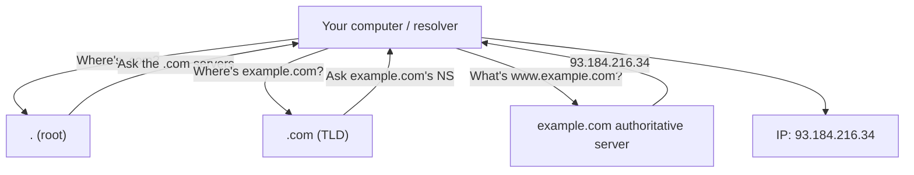
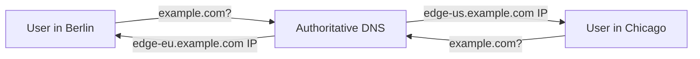

# DNS — How It Works

> **TL;DR** — **DNS** (Domain Name System) is the internet's phonebook: it translates names humans type (`example.com`) into IP addresses computers need (`93.184.216.34`). It's a hierarchical, globally distributed, heavily cached, mostly UDP-based system that handles trillions of queries per day. DNS is also the **most frequently broken thing** in production — "it's always DNS" is a meme because it's usually true. Understanding the resolver chain, record types, TTLs, and caching layers is essential for any backend engineer.

---

## 1. The Problem DNS Solves

Computers route by IP address. Humans remember names. DNS is the lookup that bridges the two.

```
Browser asks: "What's the IP for example.com?"
DNS replies:  "93.184.216.34"
Browser then opens a TCP connection to that IP.
```

Every interaction with a website, API, mail server, or game server starts with a DNS lookup.

---

## 2. The Hierarchy

DNS names are read **right-to-left**, from most general to most specific:

```
www.api.example.com.
└┬─┘└┬─┘└──┬───┘└┘
host subd  domain  root (the implicit final dot)
```

A query walks the hierarchy:



Three tiers:
1. **Root servers** (`.`) — 13 logical clusters, hundreds of physical servers, run by various orgs (Verisign, ICANN, NASA, etc.).
2. **TLD servers** (`.com`, `.org`, `.io`, country codes like `.uk`) — run by registries.
3. **Authoritative servers** — owned by whoever runs the domain, hold the actual records.

Above all this is a **resolver** (caching layer) that does the walking for you — usually run by your ISP, your laptop, or a public service (`8.8.8.8`, `1.1.1.1`).

---

## 3. The Full Resolution Walk

When you type `www.example.com`:

```
1. Browser checks its in-process DNS cache.        ── hit? return.
2. OS resolver cache (e.g., systemd-resolved, mDNSResponder).
3. Local "stub" resolver sends a query to its
   recursive resolver (8.8.8.8 / 1.1.1.1 / ISP).
4. Recursive resolver checks its cache.            ── hit? return.
5. Cache miss → it queries:
      a. A root server.        "Where is .com?"
      b. A .com TLD server.    "Where is example.com?"
      c. example.com's NS.     "What's www.example.com?"
6. Recursive resolver caches the answer for its TTL.
7. Returns the IP to the browser.
8. Browser caches it too.
```

Steps 5a–c look like a chain, but in practice most are *cached* — root and TLD answers change rarely, so the recursive resolver hits its cache for those almost every time.

---

## 4. Record Types

A DNS "record" is a typed entry in a zone. The big ones:

| Type | What it stores | Example |
| --- | --- | --- |
| **A** | IPv4 address | `example.com → 93.184.216.34` |
| **AAAA** | IPv6 address | `example.com → 2606:2800:220:1::` |
| **CNAME** | Alias to another name | `www.example.com → example.com` |
| **MX** | Mail server | `example.com → mail.example.com (priority 10)` |
| **TXT** | Free-form text | SPF, DKIM, domain verification |
| **NS** | Nameserver for a zone | `example.com → ns1.example-dns.com` |
| **SOA** | Start of authority (zone metadata) | Serial, refresh, expiry |
| **PTR** | Reverse lookup (IP → name) | `34.216.184.93.in-addr.arpa → example.com` |
| **SRV** | Service location (host + port) | `_xmpp._tcp.example.com → port 5222 on chat.example.com` |
| **CAA** | Which CAs can issue certs for this domain | `example.com → letsencrypt.org` |
| **ALIAS / ANAME** | "CNAME at the apex" (provider-specific, not standard) | `example.com → loadbalancer.cloud.com` |
| **DNSKEY / RRSIG / DS** | DNSSEC signing data | |

### A vs CNAME (the most-confused pair)
- **A** points to an *IP*.
- **CNAME** points to *another name*. Resolvers follow it transparently.
- A CNAME is **not allowed at the root** (apex) of a domain — you can't do `CNAME example.com → x.y.com`. That's why providers invented **ALIAS / ANAME** (resolved server-side).

### When to use CNAME
- Pointing `www.example.com` at a load balancer hostname like `my-elb-123.elb.amazonaws.com` — when the ELB's IP changes, your CNAME still works.
- Pointing a custom domain at a SaaS hostname.

---

## 5. TTL — Time To Live

Every DNS record carries a TTL (in seconds). Resolvers cache the answer for that long.

```
example.com.    300    IN  A   93.184.216.34
                ▲
                └── TTL: cache for 300 seconds (5 minutes)
```

Trade-offs:
- **Long TTL** (hours, days) — fewer queries, faster avg lookup, but slower to switch IPs (failover, migration).
- **Short TTL** (30–60 s) — quick failover, but more lookups, slightly higher latency.

Pre-migration, drop your TTL to ~60s **24 hours in advance**, then change the record. After cutover, raise the TTL back. (Note: many resolvers ignore TTLs shorter than 30 s or longer than a few days. Behavior is *not* guaranteed.)

---

## 6. Recursive vs Iterative vs Authoritative

| Role | Who | What it does |
| --- | --- | --- |
| **Stub resolver** | Your OS | Sends the query upstream, caches answer |
| **Recursive resolver** | `8.8.8.8`, `1.1.1.1`, your ISP | Walks the hierarchy on your behalf |
| **Authoritative server** | The domain owner's DNS (Route 53, Cloudflare DNS, NS1) | Holds the actual records, answers definitively |

Most clients only talk to a recursive resolver. The recursive resolver does the legwork.

---

## 7. Public Recursive Resolvers

You don't have to use your ISP's resolver. Common public ones:
- **Google Public DNS** — `8.8.8.8`, `8.8.4.4`
- **Cloudflare** — `1.1.1.1`, `1.0.0.1` (privacy-focused, very fast)
- **Quad9** — `9.9.9.9` (security filtering)
- **OpenDNS** — `208.67.222.222` (filtering options)

All support DNS-over-HTTPS (DoH) and DNS-over-TLS (DoT) for encrypted queries.

---

## 8. Where DNS Lives in the Stack

DNS is a **Layer 7 application protocol** that runs over:
- **UDP port 53** — default; almost all queries.
- **TCP port 53** — used when responses exceed 512 bytes (or for zone transfers).
- **DoT (DNS over TLS)** — TCP 853.
- **DoH (DNS over HTTPS)** — HTTPS to a special URL.
- **DoQ (DNS over QUIC)** — newer, used by some mobile clients.

Encrypted DNS (DoH/DoT) is increasingly the default in browsers (Firefox, Chrome with appropriate settings).

---

## 9. Caching, Caching, Caching

DNS scales because everyone caches:

```
Browser cache    ── seconds (Chrome: ~60s)
OS resolver cache ── follows TTL
Recursive resolver cache ── follows TTL, often hundreds of millions of clients hit the same cache
ISP cache        ── often aggressive, sometimes ignores TTL
CDN edge cache   ── sometimes returns cached A records to clients near them
```

Each layer multiplies the chance you never hit the authoritative server. That's both the reason DNS works at internet scale *and* the reason migrations feel slow ("it should have propagated by now!").

---

## 10. CDN & GeoDNS

Modern DNS isn't just "domain → IP". Authoritative servers can return **different answers for different queries** based on:

- **Geographic location** — return the nearest CDN edge.
- **Latency** — measure RTT, return the fastest.
- **Health** — return only healthy endpoints.
- **Weighted** — split traffic A/B.
- **EDNS Client Subnet (ECS)** — pass a hint of the client's network to the authoritative server for better routing.

This is how Akamai, Cloudflare, Fastly, AWS Route 53 (with traffic policies), and Google Cloud DNS implement *global server load balancing* (GSLB) via DNS.



DNS-based load balancing has limits:
- Resolution is cached, so users stay "stuck" to one endpoint for the TTL.
- Failover is slow — clients only retry after the TTL.
- IP-based geolocation isn't always accurate (mobile networks, VPNs).
- For tight failover, prefer anycast (one IP routed to nearest datacenter by BGP) or an L7 load balancer.

---

## 11. Anycast: The Trick That Makes Root DNS Work

The 13 root server "IP addresses" aren't actually 13 machines. They're **anycast** addresses — the same IP advertised from hundreds of physical locations worldwide. BGP routes you to the *nearest* one.

The same trick is used by:
- All major recursive resolvers (`1.1.1.1` is in 300+ cities).
- CDNs and DDoS scrubbers.
- Some authoritative DNS providers.

Anycast is "let the network solve the locality problem for you."

---

## 12. DNSSEC

DNS responses are easy to forge: it's UDP, source-spoofable, and cached widely (cache poisoning attacks). **DNSSEC** adds cryptographic signatures to records so resolvers can verify authenticity.

- Each zone signs its records (RRSIG).
- Parent zone signs a hash of the child's key (DS record).
- Chain of trust ends at the (signed) root.

DNSSEC adoption is meaningful but not universal. It prevents *some* attacks but doesn't encrypt the queries (DoH/DoT handle that). Many sites still don't enable it.

---

## 13. Common DNS Records for a Real-World App

For `mycompany.com`:
```
A      mycompany.com           93.184.216.34
A      mycompany.com           93.184.216.35   (round-robin)
CNAME  www.mycompany.com       mycompany.com
CNAME  api.mycompany.com       my-elb.elb.amazonaws.com
CNAME  status.mycompany.com    statuspage.io
MX     mycompany.com           10 mail.mycompany.com
TXT    mycompany.com           "v=spf1 include:_spf.google.com ~all"
TXT    _dmarc.mycompany.com    "v=DMARC1; p=reject; ..."
TXT    google._domainkey.mycompany.com  "k=rsa; p=MIG..."
CAA    mycompany.com           0 issue "letsencrypt.org"
NS     mycompany.com           ns-123.awsdns-12.com  ns-456.awsdns-34.net (etc.)
SOA    mycompany.com           ns1.awsdns.com. hostmaster@... serial: 2026...
```

This is what every production domain looks like under the hood.

---

## 14. Debugging DNS

A standard toolbox.

### `dig` — the canonical query tool
```bash
dig example.com                # default A query
dig example.com AAAA           # IPv6
dig example.com MX             # mail
dig example.com NS             # nameservers
dig example.com ANY            # everything (often refused now)
dig @8.8.8.8 example.com       # query a specific resolver
dig +trace example.com         # walk the hierarchy
dig +short example.com         # just the answer
```

### `nslookup`
Older tool, works similarly. Default on Windows.

### `host`
Simpler output.

### `kdig` (knot DNS)
DoH/DoT-capable.

### `dog`
Modern, prettier output.

### Browser tools
- Chrome: `chrome://net-internals/#dns`
- Firefox: `about:networking#dns`

### See it on the wire
```bash
sudo tcpdump -ni any port 53
```

### Sanity-check propagation globally
- <https://www.whatsmydns.net/> — query 20+ public resolvers worldwide.

---

## 15. Common Failure Modes

| Symptom | Likely cause |
| --- | --- |
| "No such host" / NXDOMAIN | Typo, expired domain, record not created |
| Resolves to old IP | Cached TTL hasn't expired (yours or upstream) |
| Resolves locally but not for users | Negative caching, anycast routing, ISP cache lag |
| Email being rejected | Missing/bad SPF, DKIM, DMARC, PTR (reverse DNS) |
| SSL cert errors after switching CDN | Forgot to update CAA records |
| API returns wrong region | EDNS Client Subnet not configured, or resolver doesn't pass it |
| Intermittent failures | One nameserver in the NS list is unhealthy |
| All your services down | DNS provider outage. Use two providers for critical domains. |

The 2020 Cloudflare/Slack outages, the 2021 Facebook/WhatsApp/Instagram 6-hour outage (DNS withdrawal via BGP) — DNS underlies almost every major internet outage.

---

## 16. DNS at Scale: Practical Patterns

- **Use two providers** for critical zones (e.g., Route 53 + NS1, or Cloudflare + Dyn). DNS is *the* single point of failure.
- **Keep TTLs sensible.** 5 min for app records; 24 h for nameservers (rarely change).
- **Use ALIAS / ANAME / CNAME flattening** for apex records pointing at load balancers.
- **Don't rely on DNS for fast failover.** Use anycast or L7 LBs for sub-second failover.
- **Monitor every record.** Drift breaks email and SSL silently.
- **Use service discovery** (Consul, CoreDNS, K8s Service) inside a network instead of static DNS records.

---

## 17. DNS in Microservices / Kubernetes

Inside a service mesh or K8s cluster, DNS is typically:
- **CoreDNS** (default in K8s) — provides `<service>.<namespace>.svc.cluster.local` resolution.
- Pod IPs are tracked dynamically; the service record returns the cluster IP or list of pod IPs.
- Combined with **client-side load balancing** (gRPC) or **service mesh** (Envoy) for routing.

CoreDNS plugins handle conditional forwarding, caching, rewrites — and CoreDNS misconfig is a top cause of intra-cluster flakes.

---

## 18. Cheat Card

```
┌────────────────────────────────────────────────────────────────┐
│ HIERARCHY:   root  →  TLD  →  authoritative                    │
│ RESOLVER:    stub → recursive (8.8.8.8, 1.1.1.1)               │
│              recursive walks hierarchy, caches result          │
│                                                                │
│ RECORDS:                                                       │
│   A     IPv4    AAAA    IPv6     CNAME    alias                │
│   MX    mail    TXT     verify   NS       nameserver           │
│   SRV   port    PTR     reverse  CAA      cert authority        │
│                                                                │
│ A vs CNAME:                                                    │
│   A → IP.    CNAME → another name. No CNAME at the apex.        │
│                                                                │
│ TTL:        seconds the answer is cached.                      │
│   Lower for fast changes; higher for fewer queries.            │
│                                                                │
│ PROTOCOL:   UDP 53 (default), TCP 53 (large), DoT/DoH/DoQ.     │
│                                                                │
│ TOOLS:      dig +trace, dig @8.8.8.8, nslookup, whatsmydns.net │
│                                                                │
│ RULES:                                                         │
│   • Always two DNS providers for critical zones.                │
│   • Don't rely on DNS for fast failover — use anycast or LBs.   │
│   • "It's always DNS." (Test DNS first.)                       │
└────────────────────────────────────────────────────────────────┘
```

---

## 19. Resources

### Foundational
- **DNS and BIND** (5th ed.) — Liu & Albitz. The canonical book.
- **RFC 1034 / 1035** — DNS specs: <https://datatracker.ietf.org/doc/html/rfc1035>
- **RFC 8484** — DNS over HTTPS: <https://datatracker.ietf.org/doc/html/rfc8484>

### Online
- Cloudflare Learning: "What is DNS?" — <https://www.cloudflare.com/learning/dns/what-is-dns/>
- "How DNS Works" comic — <https://howdns.works/>
- AWS Route 53 docs — practical patterns: <https://docs.aws.amazon.com/Route53/latest/DeveloperGuide/>
- Julia Evans' "How DNS works" zine: <https://wizardzines.com/zines/dns/>

### Videos
- ByteByteGo: "How DNS Works" — <https://www.youtube.com/@ByteByteGo>
- Hussein Nasser DNS deep dives — <https://www.youtube.com/@hnasr>
- "It's always DNS" — Cloudflare TV / various conferences.

### Tools
- **`dig`** — already on your machine.
- **`mtr`** — combined traceroute + ping.
- **whatsmydns.net** — global propagation check.
- **dnsviz.net** — DNSSEC chain visualization.
- **intodns.com** — health checks on your zone.

### Postmortems worth reading
- Facebook BGP/DNS outage, Oct 2021.
- AWS Route 53 incidents — search the AWS post-event summaries page.
- Cloudflare DNS incident, July 2020.

---

*Previous:* [← TCP vs UDP](./tcp-vs-udp.md)  |  *Next:* [HTTP/1.1 vs HTTP/2 vs HTTP/3 →](./http-versions.md)
