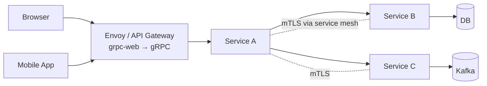

# gRPC, Protocol Buffers, Thrift

> **TL;DR** — **gRPC** is a high-performance RPC framework from Google: schema-first, binary, multiplexed over HTTP/2, supports streaming in both directions. **Protocol Buffers** (protobuf) is the schema + serialization format that powers it — compact, fast, strongly typed, with code generation in every major language. **Thrift** (originally Facebook, now Apache) is an older cousin that does both — schema + RPC — in a single project. For modern service-to-service systems, **gRPC + protobuf is the de-facto standard** for internal APIs at scale.

---

## 1. Why "Just JSON Over REST" Eventually Hurts

JSON-over-HTTP is fine for many things — public APIs, browser clients, debugging. But for **service-to-service traffic at scale**, it has real costs:
- **Verbose payloads.** Field names repeated for every record.
- **Slow to parse.** Text parsing, runtime type checks.
- **No schema.** Contract lives in docs and code comments; drift is constant.
- **No streaming primitive.** Bi-directional streams are a hack.
- **No code generation.** Every client hand-writes models.

A schema-first binary protocol fixes all of these. Enter **Protocol Buffers** and **gRPC**.

---

## 2. Protocol Buffers — The Schema + Wire Format

A `.proto` file defines the schema:

```proto
syntax = "proto3";
package user.v1;

message User {
  int64 id = 1;
  string email = 2;
  string name = 3;
  repeated string roles = 4;
  google.protobuf.Timestamp created_at = 5;
}

message GetUserRequest {
  int64 id = 1;
}

message GetUserResponse {
  User user = 1;
}
```

Then you **compile** it with `protoc` (or `buf`) and get type-safe code in Go, Java, Python, TS, Rust, C++, etc.

### How it serializes
Each field is tagged with a number (`= 1`, `= 2`) — that number is what goes on the wire, *not* the field name. Encoding is a compact **tag + varint length + value** scheme.

```
field: id = 42        → bytes:  08 2a       (tag 1, varint 42)
field: email = "a@b"  → bytes:  12 03 61 40 62  (tag 2, length 3, "a@b")
```

Compared to JSON:
```json
{"id": 42, "email": "a@b"}            ← 25 bytes
```
Protobuf for the same data: **9 bytes** (~3× smaller). For records with many small fields, the ratio is often 3–10×.

### Schema evolution rules
- **Adding** an optional field with a new number → safe.
- **Removing** a field → safe (but reserve the number to prevent reuse).
- **Renaming** a field name → safe (wire format uses tag numbers).
- **Changing a field number** → **never safe**.
- **Changing a field type** → safe only for compatible types (`int32 ↔ int64` for positive values, `string ↔ bytes`, etc.).

Following these rules, you can evolve services independently — old and new clients keep working.

### proto3 vs proto2
- **proto3** (current default) — simpler. No required fields, no field presence by default (`optional` keyword added later for explicit "set or unset").
- **proto2** — still alive in legacy systems and parts of Google internal infra.

---

## 3. gRPC — The RPC Framework

gRPC = Google + Remote Procedure Call. It's the RPC layer on top of protobuf.

```proto
service UserService {
  rpc GetUser    (GetUserRequest)  returns (GetUserResponse);
  rpc ListUsers  (ListUsersReq)    returns (stream User);          // server stream
  rpc UploadLogs (stream LogEntry) returns (UploadResp);            // client stream
  rpc Chat       (stream ChatMsg)  returns (stream ChatMsg);        // bidi stream
}
```

You define methods, then `protoc-gen-grpc-*` produces:
- Server **stubs** — abstract base classes you implement.
- Client **clients** — strongly typed methods you call.

Calling `userClient.GetUser(req)` over the wire becomes:
```
POST /user.v1.UserService/GetUser
Content-Type: application/grpc+proto
TE: trailers
grpc-encoding: gzip            (optional)
authorization: Bearer ...

<protobuf bytes>
```

Response framing uses HTTP/2 trailers to carry the gRPC status (success/error code, message).

---

## 4. The Four Call Types

| Kind | Client sends | Server sends | Use case |
| --- | --- | --- | --- |
| **Unary** | 1 message | 1 message | RPC like REST |
| **Server streaming** | 1 message | stream | List large result, server-push |
| **Client streaming** | stream | 1 message | Upload logs, telemetry batch |
| **Bidirectional streaming** | stream | stream | Chat, real-time sync |

All four ride on a single HTTP/2 connection — multiplexed alongside other RPCs.

---

## 5. Why gRPC Is Fast

- **HTTP/2 multiplexing** — many calls share one TCP connection, no head-of-line blocking at the HTTP layer.
- **Binary framing** — no string parsing.
- **Protobuf** — small + fast to serialize.
- **Compression** — built-in (gzip, deflate, snappy).
- **Header compression (HPACK)** — repeated metadata is cheap.
- **Connection reuse** — long-lived channels with keep-alive.
- **Native streaming** — no framing-on-top-of-HTTP gymnastics.

At Google, gRPC handles **tens of billions of internal RPCs per second** across services.

---

## 6. Status Codes & Error Model

gRPC defines a small set of status codes (not HTTP status codes!):

| Code | Meaning |
| --- | --- |
| OK (0) | Success |
| CANCELLED (1) | Client cancelled |
| UNKNOWN (2) | Unknown error |
| INVALID_ARGUMENT (3) | Bad request |
| DEADLINE_EXCEEDED (4) | Deadline expired |
| NOT_FOUND (5) | Resource not found |
| ALREADY_EXISTS (6) | Conflict |
| PERMISSION_DENIED (7) | Forbidden |
| UNAUTHENTICATED (16) | Authn required |
| RESOURCE_EXHAUSTED (8) | Quota / rate limit |
| FAILED_PRECONDITION (9) | State doesn't permit |
| ABORTED (10) | Concurrency conflict |
| OUT_OF_RANGE (11) | Out of valid range |
| UNIMPLEMENTED (12) | Method not implemented |
| INTERNAL (13) | Server bug |
| UNAVAILABLE (14) | Try again (retryable) |
| DATA_LOSS (15) | Unrecoverable data loss |

`UNAVAILABLE` is the most important one — clients should **retry with backoff** on it.

For richer errors, gRPC uses the `google.rpc.Status` proto with details — typed payloads attached to errors.

---

## 7. Deadlines, Cancellation, Backpressure

gRPC bakes in things REST usually leaves to convention:

- **Deadlines** — every call carries a deadline (an absolute time). Servers see how long they have left and can stop work early. *Use deadlines on every call.*
- **Cancellation** — if the client cancels (deadline or explicit), the server's context fires; long-running work should stop.
- **Flow control** — HTTP/2 windows. A slow consumer slows the producer (backpressure for free in streaming).

These three together make gRPC much more "correct under load" than a hand-rolled JSON API.

---

## 8. Service Discovery, Load Balancing, Auth

- **Service discovery** — gRPC clients resolve names via DNS, Consul, etcd, K8s, or a service mesh. They typically establish a *single channel per server* and round-robin / least-request across them (client-side load balancing).
- **Auth** — mTLS for service-to-service, or token-based (OAuth) via interceptors.
- **Interceptors** — middleware (logging, tracing, retries, auth) wrap every RPC.
- **Reflection** — servers can expose schemas for tools like `grpcurl` to discover methods at runtime.

---

## 9. gRPC vs REST vs GraphQL

(See also: [REST vs GraphQL vs gRPC →](./api-styles.md))

| | REST/JSON | GraphQL | gRPC |
| --- | --- | --- | --- |
| Schema | Loose (OpenAPI optional) | Strict | Strict (protobuf) |
| Wire format | Text JSON | Text JSON | Binary protobuf |
| Code gen | Optional | Yes (clients) | Yes (clients + servers) |
| Performance | Good | Good | Great |
| Streaming | Awkward (SSE/WS) | Subscriptions (over WS) | Native (4 patterns) |
| Browser support | Native | Native | grpc-web (via proxy) |
| Caching | HTTP caching | Per-query | None built-in |
| Debugging | curl-friendly | GraphiQL | grpcurl, bloomrpc |
| Best for | Public APIs, browser clients | Aggregating data, mobile clients | Service-to-service |

The honest rule: **REST/JSON for anything browsers or external partners hit, gRPC for internal service-to-service.**

---

## 10. gRPC From the Browser: grpc-web

Browsers can't speak raw gRPC (no access to HTTP/2 frames + trailers). **grpc-web** solves it:

```
Browser ─── HTTP/1.1 or H/2 ───► Envoy / gRPC-web proxy ─── HTTP/2 gRPC ───► gRPC server
```

The browser sends an "almost gRPC" request; a proxy (Envoy, Nginx, gRPC-web gateway) translates to real gRPC. Limitations: bi-di streaming isn't fully supported in all browsers — server-streaming usually works fine.

Alternatives:
- **Connect** (from buf.build) — protobuf-RPC that works seamlessly from browser and server, gRPC-compatible: <https://connectrpc.com/>
- **tRPC** — different beast (TypeScript-only, no protobuf), but a great option for full-stack TS shops.

---

## 11. Tooling

- **`protoc`** — the canonical protobuf compiler.
- **`buf`** — modern protobuf workflow: linting, breaking-change detection, build/publish to a schema registry. Almost a must for serious shops: <https://buf.build/>
- **`grpcurl`** — `curl` for gRPC. Reflective; great for poking services.
- **`evans`** — interactive gRPC REPL.
- **BloomRPC / Kreya / Insomnia / Postman** — GUI clients.
- **gRPC server reflection** — turn on for these tools to work.
- **`prototool` / `clang-format`** — formatting and linting `.proto` files.

---

## 12. Apache Thrift — The Other Schema-First RPC

Thrift predates gRPC (Facebook, 2007; Apache project since 2008). It's roughly:

- IDL (`.thrift` file) → code-gen for many languages.
- Multiple **protocols** (Binary, Compact, JSON) and **transports** (TSocket, TFramedTransport, THttp).
- Synchronous + async server modes.
- Strong polyglot support.

```thrift
struct User {
  1: i64 id,
  2: string email,
  3: optional string name,
}

service UserService {
  User getUser(1: i64 id) throws (1: NotFound nf);
}
```

### Thrift vs gRPC
- **Older ecosystem, less momentum** today. Facebook moved on to internal forks (fbthrift); Apache Thrift sees less active development.
- **More transport choices** but less ergonomic than HTTP/2 multiplexing.
- **Pre-dates HTTP/2** so its streaming story is bolted on later.
- **Used heavily in big tech** that adopted it before gRPC existed (Facebook, Twitter via Finagle, some Hadoop / HBase tooling).

If you're starting fresh in 2026: **gRPC is the default**. If you've already invested in Thrift, it still works fine — don't migrate just for fashion.

---

## 13. Other Schema/RPC Formats Worth Knowing

| Format | Notes |
| --- | --- |
| **Apache Avro** | Schema-evolution-friendly, common in the Kafka ecosystem. JSON-defined schemas, binary wire. |
| **MessagePack** | "JSON in binary" — no schema, but smaller and faster than JSON. |
| **CBOR** | RFC-standard binary JSON-ish format. Used by IoT and WebAuthn. |
| **FlatBuffers / Cap'n Proto** | Zero-copy formats; faster than protobuf but less ergonomic. |
| **MQTT / AMQP** | Messaging protocols (not RPC), often used alongside protobuf as the payload. |

---

## 14. When Not to Use gRPC

- **Public APIs** for third-party developers — REST/OpenAPI is still expected.
- **Browser-only apps** with no proxy infrastructure — overhead of grpc-web isn't always worth it.
- **Very simple internal tools** — adding `.proto` files for a 10-line script is over-engineering.
- **Webhooks** — receivers expect HTTP+JSON.

---

## 15. A Real-World gRPC Setup



- Browsers go through a gateway that translates grpc-web.
- Internal services speak native gRPC over HTTP/2.
- Service mesh (Istio / Linkerd) provides mTLS, retries, observability.
- All schemas live in a shared `proto/` monorepo or a **schema registry** (buf, Confluent).
- CI checks: lint, breaking-change detection, generated-code consistency.

---

## 16. Common Mistakes

- **Reusing field numbers.** Wire incompatibility, silent data corruption.
- **No deadlines on calls.** A slow downstream pegs your goroutines/threads forever.
- **No retry policy on UNAVAILABLE.** Transient errors look like outages to users.
- **Streaming for everything.** Unary RPCs are usually fine.
- **Exposing gRPC to the public internet** without an API gateway.
- **Sharing `.proto` by copy-paste** instead of a registry. Drift is inevitable.
- **Putting business logic in interceptors.** Keep them thin (logging, auth, retry, trace).
- **Server reflection enabled in prod for untrusted users.** Information disclosure.

---

## 17. Cheat Card

```
PROTOBUF        schema + binary wire format. compact + fast + typed.
                .proto → protoc / buf → typed code in N languages.
                Tag numbers (= 1, = 2) are the wire IDs — never reuse.

gRPC            RPC over HTTP/2 with protobuf payloads.
                4 call types: unary, server-stream, client-stream, bidi.
                Deadlines, cancellation, flow control baked in.
                Status codes (UNAVAILABLE, DEADLINE_EXCEEDED, …) not HTTP codes.

USE FOR         service-to-service inside your platform.
                streaming RPCs you'd otherwise hack onto HTTP.

AVOID FOR       public APIs and browser-only direct access (use grpc-web or REST).

TOOLING         buf (lint, registry, breaking-change),
                grpcurl (curl for gRPC),
                Envoy / Istio (proxy + mesh + grpc-web).

SCHEMA RULES
  add new field: OK (use a fresh tag number).
  remove field: OK (reserve the tag).
  change tag: NEVER.
  change type: only between compatible types.

THRIFT          older alternative. Still works. Don't start new projects in it.

CONNECT (buf)   modern gRPC-compatible RPC that works natively in browsers.
                worth a serious look.
```

---

## 18. Resources

### Official
- gRPC docs — <https://grpc.io/docs/>
- protobuf docs — <https://protobuf.dev/>
- gRPC status codes — <https://grpc.io/docs/guides/status-codes/>
- gRPC error model — <https://cloud.google.com/apis/design/errors>

### Books / extended guides
- *gRPC: Up and Running* — Kasun Indrasiri & Danesh Kuruppu (O'Reilly).
- *Practical gRPC* — Joshua Humphries et al. (Bleeding Edge Press).

### Articles
- "What is gRPC?" — Cloudflare Learning: <https://www.cloudflare.com/learning/what-is-grpc/>
- Buf's "gRPC for everything" series: <https://buf.build/blog/>
- "Why we ditched JSON for protobuf" — many engineering blogs (LinkedIn, Square, Discord).
- "Choosing between gRPC, REST, and GraphQL" — Google Cloud blog.

### Videos
- ByteByteGo: "What is gRPC?" — <https://www.youtube.com/@ByteByteGo>
- Hussein Nasser gRPC deep dive — <https://www.youtube.com/@hnasr>
- "gRPC: A Deep Dive" — KubeCon talks on YouTube.

### Ecosystem tools
- **Buf** — <https://buf.build/> (lint, breaking-change, schema registry).
- **grpc-web** — <https://github.com/grpc/grpc-web>.
- **Connect** — <https://connectrpc.com/> (gRPC for the browser, done right).
- **Envoy** — <https://www.envoyproxy.io/> (the gRPC gateway of choice).
- **prost / tonic** (Rust), **grpc-go**, **grpc-java**, **grpc-node**, **grpcio** (Python).

### Schema registries
- **Buf Schema Registry** — <https://buf.build/>
- **Confluent Schema Registry** — primarily Avro / Kafka, but supports protobuf.

---

*Previous:* [← Long Polling vs Short Polling](./polling.md)  |  *Next:* [REST vs GraphQL vs gRPC →](./api-styles.md)
