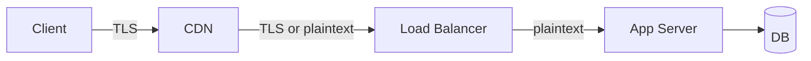

# HTTPS, TLS/SSL Handshake

> **TL;DR** — **HTTPS** is HTTP over **TLS** (formerly called SSL). TLS gives you three things on the same connection: **confidentiality** (encryption), **integrity** (no one tampered), and **authentication** (you're talking to the real server, via certificates). The handshake costs 1–2 round trips depending on version. TLS 1.3 is the modern default — drop everything older.

---

## 1. SSL vs TLS — A Name Note

- **SSL 1.0/2.0/3.0** — Netscape, 1995–1996. All insecure; do not use.
- **TLS 1.0** (1999), **1.1** (2006) — also broken / deprecated. Disabled in modern stacks.
- **TLS 1.2** (2008) — still common, secure with good config.
- **TLS 1.3** (2018, RFC 8446) — current. Faster, simpler, more secure.

People still say "SSL" colloquially. It is always TLS in modern practice. *Disable everything below TLS 1.2.*

---

## 2. What TLS Provides

| Property | How TLS does it |
| --- | --- |
| **Confidentiality** | Symmetric encryption (AES-GCM, ChaCha20-Poly1305) of all bytes after handshake. |
| **Integrity** | AEAD ciphers + per-record MACs detect any modification. |
| **Authentication** | X.509 certificates + chain of trust (CAs) prove the server is who it claims. Optional mutual TLS authenticates the client too. |
| **Forward secrecy** | Ephemeral Diffie-Hellman keys — past traffic stays safe even if the long-term key is stolen later. |

The encryption uses **symmetric** keys for speed; the negotiation of those keys uses **asymmetric** (public-key) crypto.

---

## 3. The TLS 1.2 Handshake — 2 RTT

```
Client                                          Server
  │                                                │
  │ ── ClientHello ──────────────────────────────► │  versions, ciphers, random
  │                                                │
  │ ◄── ServerHello ────────────────────────────── │  chosen version + cipher, random
  │ ◄── Certificate ────────────────────────────── │  server's cert chain
  │ ◄── ServerKeyExchange ───────────────────────── │  DH params signed
  │ ◄── ServerHelloDone ────────────────────────── │
  │                                                │
  │ ── ClientKeyExchange ────────────────────────► │  client's DH share
  │ ── ChangeCipherSpec ─────────────────────────► │
  │ ── Finished (encrypted) ──────────────────────► │
  │                                                │
  │ ◄── ChangeCipherSpec ──────────────────────── │
  │ ◄── Finished (encrypted) ──────────────────── │
  │                                                │
  ────── encrypted application data ────────────────
```

Two round trips before the first byte of HTTP. On a 100 ms cross-Atlantic link, that's **200 ms** just for crypto setup.

---

## 4. The TLS 1.3 Handshake — 1 RTT (or 0)

TLS 1.3 collapses the back-and-forth into one round trip.

```
Client                                          Server
  │                                                │
  │ ── ClientHello ──────────────────────────────► │
  │    + key_share, supported_versions, etc.       │
  │                                                │
  │ ◄── ServerHello ────────────────────────────── │
  │    + key_share, certificate, finished          │
  │                                                │
  │ ── Finished (encrypted) ──────────────────────► │
  │                                                │
  ────── application data ──────────────────────────
```

After 1 RTT, the connection is up. Even better: a returning client can use **0-RTT** data with a previously cached session ticket — the very first packet can carry encrypted application data. (0-RTT has replay caveats — not suitable for non-idempotent requests.)

### Why TLS 1.3 is also more secure
- Removed weak / legacy ciphers (RSA key transport, CBC, RC4, MD5, SHA-1).
- Forward secrecy is mandatory.
- Encrypts more of the handshake itself.
- Fewer knobs = fewer ways to misconfigure.

---

## 5. The Certificate Chain & Why It Works

A certificate is essentially:
```
{
  subject:     "CN=example.com",
  public key:  <server's public key>,
  issuer:      "CN=Let's Encrypt R3",
  signature:   <signed by issuer's private key>,
  validity:    Jan 1 → Apr 1,
  SAN:         "example.com, www.example.com"
}
```

A chain ties this back to a **root CA** the OS or browser already trusts:
```
example.com cert  →  signed by  →  "Let's Encrypt R3" intermediate
"Let's Encrypt R3" intermediate  →  signed by  →  "ISRG Root X1"
"ISRG Root X1"  →  pre-installed in the trust store (your OS / browser)
```

During the handshake the server sends the chain (its cert + intermediates). The client verifies each signature up to a root it already trusts. If any link breaks (expired, untrusted issuer, name mismatch), TLS fails.

### How browsers know what to trust
- Each OS / browser ships a **trust store** of root CAs.
- ~100 root CAs operated by ~50 organizations.
- Browsers and OSes audit CAs and remove ones that misbehave (Symantec was distrusted in 2018; DigiNotar in 2011).

### SAN, CN, and wildcards
- **CN (Common Name)** — historic, the name the cert is for.
- **SAN (Subject Alternative Name)** — modern; lists all valid names. Browsers ignore CN if SAN is present.
- **Wildcard certs** (`*.example.com`) — match one label of subdomain (`api.example.com` yes, `foo.bar.example.com` no).

---

## 6. SNI — "Which Site Should I Serve?"

When you connect to `203.0.113.10:443`, the server might host hundreds of sites. **SNI** (Server Name Indication) is a TLS extension where the client tells the server in the *ClientHello* which hostname it wants — so the server can pick the right certificate.

```
ClientHello includes: "server_name = example.com"
Server sends back the example.com cert.
```

Without SNI, every hostname needed its own IP. With SNI, one IP serves thousands.

**Caveat:** SNI is *plaintext* (in TLS 1.2 and 1.3). Observers can see *which site* you're visiting even though the content is encrypted. **Encrypted SNI (ECH)** is rolling out to fix this — Cloudflare/Firefox/Chrome support it.

---

## 7. mTLS — Mutual TLS

In normal TLS, the *server* proves its identity; the *client* is anonymous (or authenticates at the HTTP layer via cookies/tokens).

**mTLS** flips this: the client also presents a certificate. The server verifies it before allowing the connection.

```
ClientHello                       ServerHello
                                  Certificate (server)
                                  CertificateRequest    ← "show me yours"
ClientCertificate                Certificate verify
```

Used for:
- **Service-to-service auth** inside a mesh (Istio, Linkerd auto-issue and rotate certs).
- **VPN / zero-trust networks** (BeyondCorp).
- **API authentication** where shared secrets aren't enough.

---

## 8. Cipher Suites (the menu of crypto choices)

A "cipher suite" in TLS 1.2 looked like:
```
TLS_ECDHE_RSA_WITH_AES_256_GCM_SHA384
└───┘└───┘└───┘    └──────────┘└────┘
proto key-ex auth    sym/AEAD   PRF/MAC
```
TLS 1.3 simplified this radically — only AEADs survive:
```
TLS_AES_128_GCM_SHA256
TLS_AES_256_GCM_SHA384
TLS_CHACHA20_POLY1305_SHA256
TLS_AES_128_CCM_SHA256
TLS_AES_128_CCM_8_SHA256
```

Key exchange (ECDHE) and authentication (RSA / ECDSA) are negotiated separately. **ChaCha20-Poly1305** is preferred on devices without AES hardware acceleration (mobile).

---

## 9. Certificate Lifecycle

```
1. Generate keypair on the server.
2. Create a CSR (Certificate Signing Request) with public key + subject.
3. Submit CSR to a CA (Let's Encrypt, DigiCert, etc.).
4. Prove control of the domain (HTTP-01 / DNS-01 / TLS-ALPN-01 challenge).
5. CA issues signed cert.
6. Install cert + private key on server.
7. Rotate before expiry (90 days for Let's Encrypt).
```

**Let's Encrypt** + **certbot** / **acme.sh** / **caddy** auto-handles steps 2–7 for free, at internet scale.

---

## 10. TLS Termination & "Where It Ends"

You need to decide where TLS is decrypted in your architecture:



| Termination point | Pros | Cons |
| --- | --- | --- |
| **CDN** (Cloudflare, CloudFront) | Free certs, edge-cached, DDoS protection | CDN sees your plaintext |
| **Load balancer** (ALB, Nginx, Envoy) | Single cert mgmt, offloads CPU from app | Internal hop is plaintext unless re-encrypted |
| **App server** | True end-to-end encryption | Each app handles certs, more CPU |
| **End-to-end (mTLS everywhere)** | Zero-trust internal network | Operational complexity, latency |

Many companies do **TLS at the CDN/LB**, then **mTLS for internal service-to-service** (via a service mesh). That balances ops simplicity with security inside the perimeter.

---

## 11. Performance Tips

### Speed up handshakes
- **Prefer TLS 1.3.** 1 RTT instead of 2.
- **Session resumption** — clients reuse session tickets to skip key derivation (1-RTT or 0-RTT).
- **OCSP stapling** — server pre-fetches certificate revocation status, avoiding a separate OCSP lookup by the client.
- **HTTP/3 (QUIC)** — combines TCP + TLS into a single 1-RTT handshake.
- **Keep connections alive.** Reusing a TLS session is free.

### Reduce CPU cost
- Use **AES-NI** capable hardware (~all modern x86/ARM cores).
- Prefer **ChaCha20-Poly1305** on mobile / low-end CPUs without AES-NI.
- Terminate TLS at a dedicated tier (LB) instead of every app box.

### Optimize cert size
- Drop legacy SHA-1 / intermediate-heavy chains. Modern chains are ~2 certs (leaf + intermediate).
- Use ECDSA P-256 keys over RSA — smaller signatures, faster verification, comparable security.

---

## 12. Common Misconfigurations & Vulnerabilities

| Issue | What it is | Fix |
| --- | --- | --- |
| Expired cert | Most common outage | Auto-renew (Let's Encrypt + ACME) |
| Missing intermediate | Browser shows error on some clients | Always send full chain |
| Weak ciphers enabled | Allowing RC4, 3DES, EXPORT, etc. | Restrict to TLS 1.2+ with modern suites |
| TLS 1.0 / 1.1 still on | PCI-DSS and others forbid them | Disable |
| Self-signed in prod | Users get scary warnings | Use a real CA |
| Mixed content | HTTPS page loading HTTP resources | Force HTTPS everywhere; use HSTS |
| No HSTS | Downgrade to HTTP possible | `Strict-Transport-Security: max-age=63072000; includeSubDomains; preload` |
| Wildcard misuse | One stolen wildcard cert = many domains compromised | Limit scope, rotate aggressively |
| Common Name only | Modern clients require SAN | Always include SANs |
| BEAST / POODLE / Heartbleed / CRIME | Old TLS / OpenSSL bugs | Keep stack patched, modern TLS |

**Test your server**: <https://www.ssllabs.com/ssltest/> — gives an A–F rating.

---

## 13. HSTS — Forcing HTTPS

`Strict-Transport-Security` tells browsers to **never** go to your domain over HTTP again, for the specified duration.

```
Strict-Transport-Security: max-age=63072000; includeSubDomains; preload
```

`preload` opts you into the **HSTS preload list** baked into browsers — even the *first* visit goes over HTTPS. Once you preload a domain, it's very hard to undo.

---

## 14. mTLS for Service Mesh (a quick concrete example)

Inside a Kubernetes cluster with Istio:
- A controller issues each pod a short-lived (24 h) X.509 cert signed by a cluster CA.
- Envoy sidecars perform mTLS between pods.
- The application code doesn't have to know — Envoy handles it.
- Rotation, revocation, and policy ("only finance pods may talk to billing-db") are managed centrally.

Service mesh + mTLS turns your internal network from "trusted" to **zero-trust**.

---

## 15. Debugging TLS

```bash
# Full handshake details
openssl s_client -connect example.com:443 -servername example.com -tls1_3

# Check cert chain
openssl s_client -connect example.com:443 -showcerts

# Verify a cert file
openssl x509 -in cert.pem -text -noout

# Test with curl
curl -v --cacert chain.pem https://example.com
curl -v --resolve example.com:443:1.2.3.4 https://example.com

# Probe ALPN (what HTTP versions does it speak?)
openssl s_client -connect example.com:443 -alpn h3,h2,http/1.1

# Online testers
# - https://www.ssllabs.com/ssltest/
# - https://testssl.sh/
```

---

## 16. Cheat Card

```
SSL = old. TLS = current. TLS 1.3 = default.

GIVES YOU
  Confidentiality  (encryption)
  Integrity        (no tampering)
  Authentication   (cert chain)
  Forward secrecy  (past traffic safe)

HANDSHAKE
  TLS 1.2 = 2 RTT     TLS 1.3 = 1 RTT  (0 on resumption)
  HTTP/3 + QUIC = 1 RTT total (no separate TLS round)

CERTS
  X.509 chain → ends at a CA in the trust store
  SAN lists valid names (CN is legacy)
  Let's Encrypt = free, 90-day, auto-renew via ACME

mTLS
  client also presents a cert ─ used inside meshes and zero-trust nets

KEY OPS DOS
  enable TLS 1.3 + 1.2 only
  HSTS with preload
  short-lived certs, auto-renew, monitor expiry
  test with ssllabs.com → aim for A or A+
  terminate at the edge, re-encrypt to origin if zero-trust
  prefer ECDSA + ChaCha20 + AES-GCM
```

---

## 17. Resources

### Specs
- **RFC 8446** — TLS 1.3: <https://datatracker.ietf.org/doc/html/rfc8446>
- **RFC 5246** — TLS 1.2.
- **RFC 9001** — Using TLS with QUIC.

### Books
- *Bulletproof SSL and TLS* — Ivan Ristić. The definitive reference.
- *Network Security with OpenSSL* — Viega, Messier, Chandra.
- *Cryptography Engineering* — Ferguson, Schneier, Kohno.

### Online resources
- **Mozilla SSL Configuration Generator** — best-practice configs for Nginx, Apache, HAProxy: <https://ssl-config.mozilla.org/>
- **SSL Labs Test** — grade your server: <https://www.ssllabs.com/ssltest/>
- **testssl.sh** — CLI scanner: <https://testssl.sh/>
- **Cloudflare Learning Center on TLS**: <https://www.cloudflare.com/learning/ssl/>
- "The illustrated TLS 1.3 connection": <https://tls13.xargs.org/>
- "The illustrated TLS 1.2 connection": <https://tls12.xargs.org/>

### Videos
- ByteByteGo: "How HTTPS Works" — <https://www.youtube.com/@ByteByteGo>
- Hussein Nasser TLS deep dives — <https://www.youtube.com/@hnasr>
- Computerphile on TLS — <https://www.youtube.com/@Computerphile>

### Free certs
- **Let's Encrypt** — <https://letsencrypt.org/>
- **certbot** — <https://certbot.eff.org/>
- **acme.sh** — <https://acme.sh/>
- **Caddy** — web server with automatic HTTPS by default.

### Service-mesh mTLS
- Istio docs — <https://istio.io/latest/docs/concepts/security/>
- Linkerd — <https://linkerd.io/2/features/automatic-mtls/>
- SPIFFE / SPIRE — workload identity standard: <https://spiffe.io/>

---

*Previous:* [← HTTP/1.1 vs HTTP/2 vs HTTP/3](./http-versions.md)  |  *Next:* [WebSockets →](./websockets.md)
