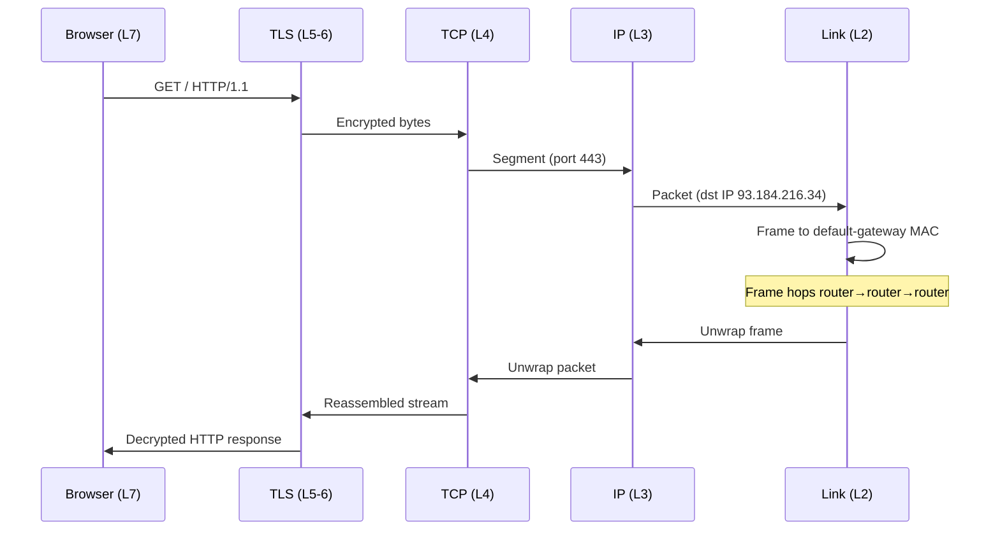

# OSI Model & TCP/IP Stack

> **TL;DR** — The **OSI model** is a 7-layer reference for thinking about networks (Physical → Application). The **TCP/IP stack** is the 4-layer model the internet actually uses (Link → Internet → Transport → Application). Each layer adds a header and treats the layer below as an opaque pipe. Knowing which layer a problem lives at is half of debugging any network issue.

---

## 1. Why Layered Networking Exists

Networks span everything from copper wires to JavaScript fetch calls. Trying to design one giant protocol for all of it would be impossible. Instead, networking is **layered**:

- Each layer solves *one* problem (move bits, route packets, deliver reliably, format messages).
- Each layer treats the layers below as a *black box*.
- Each layer can be swapped out without breaking the others (replace Ethernet with WiFi — TCP doesn't care).

That separation is why "send a tweet" works the same whether you're on 5G in Tokyo or fiber in Berlin.

---

## 2. The OSI 7-Layer Model

The textbook reference. Useful for *thinking*, even though no real network is built exactly to it.

```
┌─────────────────────────────────────────────────────────┐
│ 7. Application   │  HTTP, gRPC, DNS, SMTP, SSH          │
├─────────────────────────────────────────────────────────┤
│ 6. Presentation  │  TLS, character encoding, compression│
├─────────────────────────────────────────────────────────┤
│ 5. Session       │  RPC session, NetBIOS                │
├─────────────────────────────────────────────────────────┤
│ 4. Transport     │  TCP, UDP, QUIC                      │
├─────────────────────────────────────────────────────────┤
│ 3. Network       │  IP, ICMP, routers                   │
├─────────────────────────────────────────────────────────┤
│ 2. Data Link     │  Ethernet, WiFi, MAC, switches       │
├─────────────────────────────────────────────────────────┤
│ 1. Physical      │  Cables, radio, fiber, NICs, voltages│
└─────────────────────────────────────────────────────────┘
```

### Mnemonics
- Bottom-up: **P**lease **D**o **N**ot **T**hrow **S**ausage **P**izza **A**way.
- Top-down: **A**ll **P**eople **S**eem **T**o **N**eed **D**ata **P**rocessing.

### What each layer does

**1. Physical** — Move bits as electrical / optical / radio signals across a medium. Voltages, modulation, frequencies. (Cat6 cable, fiber optics, WiFi radios.)

**2. Data Link** — Move frames between *adjacent* devices on the same physical network. Handles MAC addressing, framing, error detection (CRC). (Ethernet, WiFi 802.11, ARP.)

**3. Network** — Move packets across *multiple* networks (the internet). Handles addressing (IP) and routing. Best-effort: no guarantee of delivery or order. (IP, ICMP, OSPF, BGP.)

**4. Transport** — Provide *end-to-end* delivery between processes on two hosts. Choose between reliable+ordered (TCP) or fast+unreliable (UDP). Ports identify which process on the host. (TCP, UDP, QUIC, SCTP.)

**5. Session** — Manage a "conversation" between two endpoints — open, maintain, tear down. (Largely subsumed by Layer 7 today; SOCKS, RPC sessions are remnants.)

**6. Presentation** — Translate between application data and a wire-friendly format: encoding (UTF-8), compression, encryption (TLS). (Mostly TLS today.)

**7. Application** — What the actual app speaks. HTTP, gRPC, DNS, SMTP, FTP, SSH. The layer engineers spend 95% of their time in.

---

## 3. The TCP/IP 4-Layer Model (the one that actually runs the internet)

The internet was designed by people more pragmatic than the OSI committee. It collapses OSI's 7 into 4:

```
┌─────────────────────────────────────────────────────────────────────┐
│ Application      │ HTTP, gRPC, DNS, TLS, SMTP, SSH       (OSI 5-7)  │
├─────────────────────────────────────────────────────────────────────┤
│ Transport        │ TCP, UDP, QUIC                        (OSI 4)    │
├─────────────────────────────────────────────────────────────────────┤
│ Internet         │ IP, ICMP                              (OSI 3)    │
├─────────────────────────────────────────────────────────────────────┤
│ Link             │ Ethernet, WiFi, ARP                   (OSI 1-2)  │
└─────────────────────────────────────────────────────────────────────┘
```

OSI is what we *teach*; TCP/IP is what we *use*. When you see "Layer 4 load balancer", they mean OSI 4 = Transport (TCP/UDP). "Layer 7 load balancer" = Application (HTTP).

---

## 4. Encapsulation: How One Packet Crosses All Layers

When you send an HTTP request, it gets wrapped, layer by layer, like Russian dolls:

```
At sender                                        At receiver
┌──────────────────┐                            ┌──────────────────┐
│   HTTP payload   │ ◄────────────────────────► │   HTTP payload   │
├──────────────────┤                            ├──────────────────┤
│   TLS record     │                            │   TLS record     │
├──────────────────┤                            ├──────────────────┤
│  TCP header      │ port 443 → port 54312      │  TCP header      │
├──────────────────┤                            ├──────────────────┤
│  IP header       │ src 10.0.0.5 → dst 1.2.3.4 │  IP header       │
├──────────────────┤                            ├──────────────────┤
│  Ethernet header │ MAC → MAC                  │  Ethernet header │
├──────────────────┤                            ├──────────────────┤
│  Physical bits   │ ────signal────────────►    │  Physical bits   │
└──────────────────┘                            └──────────────────┘
```

Each layer **adds its own header** on the way out and **strips it** on the way in. The layer above never sees the layers below — it just treats them as a working pipe.

---

## 5. Headers & PDUs At Each Layer

| Layer | PDU (Protocol Data Unit) | Header has... |
| --- | --- | --- |
| Application | Message | (Whatever the protocol says — HTTP method, URL, headers) |
| Transport | Segment (TCP), Datagram (UDP) | Src port, dst port, seq #, ack #, flags |
| Network | Packet | Src IP, dst IP, TTL, protocol |
| Data Link | Frame | Src MAC, dst MAC, EtherType, CRC |
| Physical | Bits / Symbols | (No header — raw bits on the wire) |

---

## 6. Where Things Plug In (Layer Cheat Sheet)

You'll constantly need to answer "where does X live?" Here's a working map.

| Tool / Concept | Layer |
| --- | --- |
| Ethernet / WiFi | L2 |
| MAC address | L2 |
| Switch | L2 |
| ARP | L2 (between L2 and L3) |
| IP address | L3 |
| Router | L3 |
| ICMP (ping, traceroute) | L3 |
| BGP, OSPF | L3 (routing protocols) |
| TCP, UDP, QUIC | L4 |
| Port number | L4 |
| NAT | L3+L4 (rewrites IP+port) |
| TLS | L5-6 (logically); runs on top of L4 |
| HTTP, gRPC, DNS | L7 |
| Load balancer (L4) | L4 (forwards by IP/port) |
| Load balancer (L7) | L7 (parses HTTP, can route by URL/header) |
| WAF | L7 |
| CDN | L7 (and edge L3 routing) |
| Firewall — packet filter | L3-L4 |
| Firewall — next-gen | L7 |
| VPN (IPsec) | L3 |
| VPN (TLS / WireGuard) | L3-L4 |
| API Gateway | L7 |

---

## 7. A Concrete Example: Visiting `https://example.com`

Walk through every layer:



1. **L7 — Browser** builds an HTTP request: `GET / HTTP/1.1\r\nHost: example.com\r\n...`.
2. **L5-6 — TLS** wraps it in a TLS record, encrypted.
3. **L4 — TCP** segments it; chooses port 443 (HTTPS) on the destination; assigns a sequence number.
4. **L3 — IP** wraps the segment in a packet with destination IP `93.184.216.34` and your source IP.
5. **L2 — Ethernet** wraps the packet in a frame with your laptop's MAC as source and your *default gateway's* MAC as destination — frames go one hop at a time.
6. **L1 — Physical** transmits the bits over WiFi/copper.
7. Each router strips the L2 frame, looks up the next hop in its routing table, rewraps in a new frame, sends it.
8. At the destination, layers unwrap in reverse, and `example.com`'s web server eventually sees the HTTP request.

A single page load is dozens of these round trips. The fact that we don't notice is a triumph of layered design.

---

## 8. Common Tools & Which Layer They Operate At

| Tool | Use | Layer |
| --- | --- | --- |
| `ping` | Reachability + RTT | L3 (ICMP) |
| `traceroute` | Hop path | L3 |
| `dig` / `nslookup` | DNS queries | L7 |
| `tcpdump` / `wireshark` | Packet capture | L2–L7 (sees all) |
| `mtr` | Continuous traceroute | L3 |
| `netstat` / `ss` | Open sockets | L4 |
| `curl -v` | HTTP request inspection | L7 |
| `openssl s_client` | TLS handshake debug | L5-6 |
| `nmap` | Port scan | L4 |
| `iptables` / `nftables` | Packet filter | L3-L4 |
| `ip` / `ifconfig` | Interfaces & IPs | L2-L3 |

If you can name the *layer*, you can pick the right tool. "DNS isn't resolving" → `dig`. "Service unreachable" → start with `ping`, then `traceroute`. "TLS errors" → `openssl s_client`.

---

## 9. Layer 4 vs Layer 7 Load Balancing

The most common place engineers get asked "which layer?" in interviews.

| | L4 Load Balancer | L7 Load Balancer |
| --- | --- | --- |
| Operates on | TCP/UDP packets | HTTP/gRPC requests |
| Knows about | IPs and ports only | URLs, headers, cookies, methods |
| Speed | Faster (no parsing) | Slower (parses each request) |
| Features | Connection forwarding, basic health checks | Routing by URL, header rewrites, TLS termination, WAF, A/B routing |
| Examples | AWS NLB, HAProxy (L4 mode), IPVS | AWS ALB, Nginx, Envoy, Cloudflare, Kong |

See: [L4 vs L7 Load Balancing →](../06-load-balancing/l4-vs-l7.md)

---

## 10. Where Each Layer's Pain Shows Up

When something breaks, the layer tells you the kind of problem:

| Symptom | Likely layer |
| --- | --- |
| Cable unplugged, light off on NIC | L1 |
| "Network unreachable", ARP failures, wrong VLAN | L2 |
| "No route to host", TTL exceeded, BGP issues | L3 |
| Connection refused, port closed, SYN unanswered | L4 |
| TLS handshake fails, cert errors | L5-6 |
| 4xx/5xx, malformed request, API contract issue | L7 |

Knowing the layer is half the fix.

---

## 11. Common Mistakes / Misconceptions

- **"It's a network issue"** — be specific. Almost every "network" issue is actually L4 (TCP timeout), L3 (route), L7 (HTTP error), or DNS (also L7).
- **TLS is not Layer 7.** It runs *underneath* HTTP, providing encryption to whatever app is on top. (In OSI terms it's 5-6; in practice, just "below HTTP".)
- **NAT is not just an IP thing.** It also rewrites ports → L3+L4.
- **HTTP is not the only L7 protocol.** DNS, SMTP, SSH, gRPC, AMQP, MQTT are all L7.
- **A switch is L2, a router is L3.** A *modern* "L3 switch" does both. Cloud load balancers blur these distinctions.

---

## 12. Cheat Card

```
┌────────────────────────────────────────────────────────────────┐
│ OSI 7-LAYER          TCP/IP        EXAMPLES                    │
│ 7. Application       Application   HTTP, gRPC, DNS, SMTP       │
│ 6. Presentation       │            TLS, encoding, compression  │
│ 5. Session            │            (mostly historical)         │
│ 4. Transport         Transport     TCP, UDP, QUIC              │
│ 3. Network           Internet      IP, ICMP, routers           │
│ 2. Data Link         Link          Ethernet, WiFi, MAC, ARP    │
│ 1. Physical                        Cables, fiber, radio        │
│                                                                │
│ MNEMONIC (1→7): Please Do Not Throw Sausage Pizza Away         │
│                                                                │
│ ENCAPSULATION ─ each layer wraps the one above with a header.  │
│ DEBUG ORDER  ─ start from the bottom (L1) and work up.         │
│ LB layers    ─ L4 = transport, L7 = HTTP-aware.                │
└────────────────────────────────────────────────────────────────┘
```

---

## 13. Resources

### Foundational
- **Tanenbaum & Wetherall, *Computer Networks*** — the textbook.
- **Kurose & Ross, *Computer Networking: A Top-Down Approach*** — used in most uni courses; very approachable.
- **W. Richard Stevens, *TCP/IP Illustrated Vol. 1*** — the canonical deep dive on the protocols themselves.

### Online primers
- Cloudflare Learning Center — clear, free articles on every layer: <https://www.cloudflare.com/learning/>
- Julia Evans' zines — beautifully clear introductions: <https://wizardzines.com/>
- High Performance Browser Networking — Ilya Grigorik, free online: <https://hpbn.co/>

### Videos
- **PowerCert Animated Videos** — OSI model animations: <https://www.youtube.com/@PowerCertAnimatedVideos>
- **Hussein Nasser** — networking deep dives: <https://www.youtube.com/@hnasr>
- **NetworkChuck** — friendlier intro pace: <https://www.youtube.com/@NetworkChuck>

### Specs
- RFC 791 (IP), RFC 793 (TCP), RFC 768 (UDP) — the original specs.
- IETF datatracker — search any RFC: <https://datatracker.ietf.org/>

---

*Up:* [README ↑](../README.md)  |  *Next:* [IP Addressing, Subnets, CIDR →](./ip-subnets-cidr.md)
