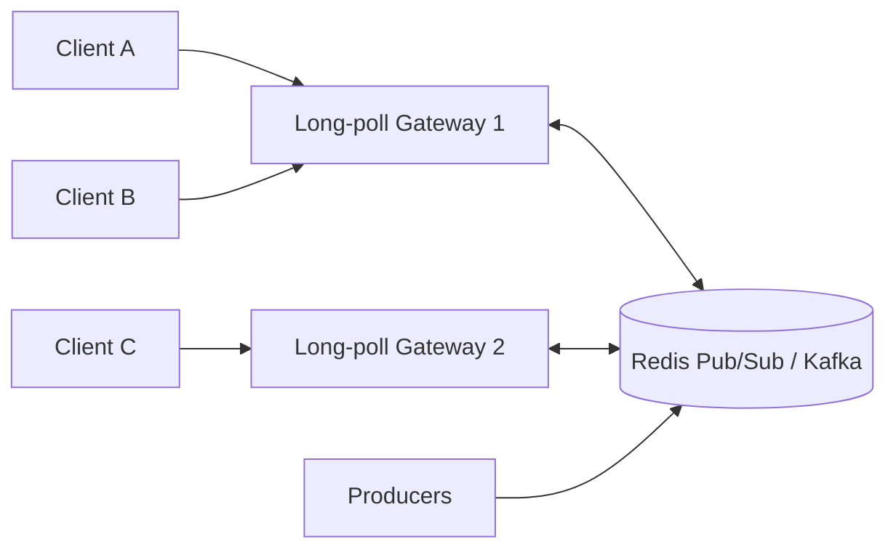

# Long Polling vs Short Polling

> **TL;DR** — **Short polling** = client asks "anything new?" on a fixed interval. Simple, wasteful, high latency. **Long polling** = client sends a request, server *holds it open* until new data appears (or a timeout), then responds and the client immediately reissues. Long polling approximates server push using only plain HTTP, and was the standard "real-time" trick before WebSockets and SSE existed. Both still appear in real systems — usually for legacy reasons or where WebSockets aren't an option.

---

## 1. The Two Models

### Short polling
```
Client                       Server
  │ ─ GET /msgs?since=42 ──► │ nothing
  │ ◄── [] ─────────────── │
  ── wait 5 s ──
  │ ─ GET /msgs?since=42 ──► │ nothing
  │ ◄── [] ─────────────── │
  ── wait 5 s ──
  │ ─ GET /msgs?since=42 ──► │ {id:43, body:"hi"}
  │ ◄── [{id:43,...}] ───── │
```

The client never stops asking. Even when nothing is happening.

### Long polling
```
Client                       Server                  Producer
  │ ─ GET /msgs?since=42 ──► │  (holds the request)   │
  │                          │ ◄────────── new msg ── │
  │ ◄── [{id:43, body:"hi"}] │
  │ ─ GET /msgs?since=43 ──► │  (holds again)         │
  │ ◄── [{id:44, body:"yo"}] │ ◄────────── new msg ── │
```

The server doesn't reply until either (a) something is available, or (b) a timeout (~30 s) expires.

---

## 2. Why Either One Still Exists

You'd think WebSockets and SSE killed both. They didn't. Reasons polling still ships:

- **Simplicity** — it's just HTTP. No upgrade, no framing, no connection lifecycle.
- **Works through every proxy and firewall** — corporate networks that block long-lived connections still allow this.
- **Easy to debug** — every interaction is a normal request you can `curl`.
- **Caches gracefully** — short polling responses with no new data are tiny.
- **Legacy systems** — webhooks-from-the-future for clients that aren't WS-capable.
- **Mobile considerations** — sometimes a clean periodic poll plays better with OS background limits.

You'll still meet polling in: status pages, build dashboards, IoT firmware, some chat fallbacks (Comet), payment-status checks, and most BFFs reading from queues.

---

## 3. Short Polling — Properties

### Pros
- Trivial to implement.
- Stateless on the server side.
- Each request is independent — load-balancer-friendly.
- Easy to rate-limit, cache, observe.
- Fits HTTP/REST mental model perfectly.

### Cons
- **Wasteful.** Most requests return nothing.
- **Latency = polling interval / 2 on average.** Want 1 s latency? You're sending 60 req/min per client when there's no activity.
- **Headers dwarf payload** when responses are usually empty. Multiply by your user count and your bandwidth bill grows fast.
- **No way to push** when things move faster than the interval.

### Sweet spot
- Data changes **slowly** or you can tolerate **multi-second latency** (status, queue lengths, build dashboards).
- Read endpoint is cheap and CDN-cacheable.
- You don't want to maintain any state.

### Sizing the interval
```
Interval too short → wasted requests, server cost, possible rate-limit
Interval too long  → users wait
Reasonable values  → 1 s (urgent UI), 5 s (status), 30 s (rarely changes), 60 s+ (analytics)
```

### Optimization tricks
- **Conditional requests**: `If-None-Match` / `If-Modified-Since` → 304 saves bytes.
- **ETag / Last-Modified** headers from server.
- **Compressed responses** (gzip).
- **Backoff when nothing's changing** — start at 1 s, increase to 30 s after N empty polls, reset on activity.
- **Pagination cursor** (`since=42`) so each poll returns only deltas.

---

## 4. Long Polling — Properties

### How the server holds the connection
- The server doesn't respond until either (a) new data arrives via an internal pub/sub or queue, or (b) a timeout (~25–55 s) expires.
- On timeout, server returns 200 with empty body (or 204). Client immediately reissues — keeping the loop tight.

### Pros
- **Near-real-time latency** — sub-second from event to client.
- **Server controls the cadence** — fewer requests when idle.
- **HTTP-only** — works anywhere a normal API works.
- **Auto-reconnect** is just "issue another request."
- **Cheap on the wire** when idle (no traffic until something happens).

### Cons
- **Server holds connections open.** Concurrent connection count = active clients. Same headache as WebSockets/SSE for scaling.
- **Each event still costs one full HTTP request.** Many small events = many round trips with full headers (HPACK on H/2 helps).
- **Timeouts everywhere.** LBs, NATs, proxies, browsers all have idle limits. You must hold *less* than those (~25–30 s is common).
- **Tricky to mix with auth** if you require fresh tokens — token expiry vs hold time.
- **Reverse proxies with output buffering will break it.** Same gotcha as SSE.
- **Reconnection storms** — when something fan-outs a million events, every client returns, every client reconnects, every client returns, …

### Sweet spot
- You need "almost realtime" push, you can't use WebSockets/SSE for some reason (legacy client, hostile network, IoT firmware), and your event rate is **low to moderate**.

---

## 5. Long Polling vs SSE vs WebSockets

| | Short Polling | Long Polling | SSE | WebSocket |
| --- | --- | --- | --- | --- |
| Direction | Client → server (asks) | Client → server (asks) | Server → client | Full duplex |
| Latency | Interval/2 | Sub-second | Sub-second | Sub-second |
| Server holds open conn? | No | Yes, until event/timeout | Yes, indefinitely | Yes, indefinitely |
| Auto-reconnect | DIY | DIY (loop) | Built-in | DIY |
| Auto-resume | Cursor in URL | Cursor in URL | Last-Event-ID | DIY |
| Browser API | `fetch` | `fetch` (loop) | `EventSource` | `WebSocket` |
| Binary | ❌ | ❌ | ❌ | ✅ |
| Backwards-compatible | ✅✅ | ✅ | ✅ | Mostly |
| Proxy / corporate-firewall friendly | ✅✅ | ✅ | ✅ | sometimes |

**Decision shortcut:**
- "Anything new?" UX, slow-moving data → **short poll**.
- Server push, no WS/SSE possible → **long poll**.
- Server push, one direction → **SSE**.
- Full duplex, low latency → **WebSocket**.

---

## 6. A Concrete Long-Polling Server (Node / Express)

```js
const events = new EventEmitter();
let nextId = 1;

// producer pushes events
function publish(payload) {
  const evt = { id: nextId++, payload };
  history.push(evt);
  events.emit("evt", evt);
}

// long-poll endpoint
app.get("/poll", async (req, res) => {
  const since = Number(req.query.since || 0);

  // Already have new events? Return them immediately.
  const ready = history.filter(e => e.id > since);
  if (ready.length) return res.json(ready);

  // Otherwise wait for one or for timeout.
  const timeout = setTimeout(() => {
    events.off("evt", onEvent);
    res.status(204).end();   // "no content, please retry"
  }, 25000);

  function onEvent(evt) {
    clearTimeout(timeout);
    events.off("evt", onEvent);
    res.json([evt]);
  }
  events.on("evt", onEvent);

  req.on("close", () => {
    clearTimeout(timeout);
    events.off("evt", onEvent);
  });
});
```

### Client
```js
async function poll() {
  let since = 0;
  while (true) {
    const r = await fetch(`/poll?since=${since}`);
    if (r.status === 204) continue;          // timeout, retry
    const events = await r.json();
    for (const e of events) {
      console.log("got", e);
      since = Math.max(since, e.id);
    }
  }
}
poll();
```

Notes:
- **`since=` cursor** keeps the protocol idempotent and replayable.
- 204 keeps the loop tight without parsing JSON.
- A pub/sub bus (Redis, NATS) replaces the in-memory `EventEmitter` for multiple gateway nodes.

---

## 7. Scaling Long Polling

Same architecture as WebSockets / SSE:



- Each gateway holds N open requests.
- Memory per connection is small (Node, Go, Erlang routinely do 10k–100k+).
- The pub/sub bus decouples producers from gateways.
- **No sticky routing required** — clients can reconnect to any gateway and resume from their cursor.

---

## 8. Operational Pitfalls

- **Buffering proxies** — Nginx by default buffers responses. Disable for the poll endpoint:
  ```
  proxy_buffering off;
  proxy_read_timeout 35s;
  ```
- **Hold time must be < every intermediary's idle timeout.** AWS ALB default is 60 s; pick a hold around 25–30 s.
- **Connection limits on the LB / load balancer-NAT** — long polling pins connections; provision accordingly.
- **Watch out for token / cookie expiry** during the hold.
- **Burst storms after a fan-out** — when a big event triggers everyone, every client comes back at once. Add jitter to client retry.
- **Avoid coupling long-poll endpoints to long DB transactions** — you'll hold DB locks the whole time.

---

## 9. Variants

### "Hanging GET" / "Comet"
Old name for long polling. Mostly the same; sometimes refers to chunked-transfer streaming (closer to SSE).

### "Forever frame" (legacy)
A `<iframe>` whose body streams `<script>` blocks indefinitely. Pre-WebSocket browser hack. Don't use.

### Long polling with chunked transfer
Server keeps the response open and sends multiple chunks before closing. Effectively SSE-without-the-spec. If you find yourself doing this, just use SSE.

### Webhook + poll hybrid
Some systems primarily use **webhooks** (server pushes to a client's HTTP endpoint), and let the client **poll for missed events** on startup or after gaps. Common in B2B integrations (Stripe, GitHub, Twilio).

---

## 10. Common Mistakes

- **Short polling at 100 ms intervals** because someone said "real-time" — that's 600 requests/min per user. Switch to SSE/WS or long polling.
- **No cursor / dedup** — clients see the same event many times or miss events.
- **Hold time > LB idle timeout** — your "long poll" turns into 504 Gateway Timeout.
- **Poll endpoint returns full state every time** — return *deltas* using the cursor.
- **Forgetting to handle client disconnects** — server leaks subscriptions to dead connections.
- **Mixing long polling with caching layers** — caches expect short responses, not hanging requests.
- **Reinventing reconnection storms** — always add jitter.

---

## 11. When to Pick What

```
Latency target?
  • Many seconds OK    → SHORT POLL
  • Sub-second needed  → LONG POLL or SSE or WS
Bidirectional?
  • Yes                → WEBSOCKET
  • No                 → SSE (or LONG POLL fallback)
Browser API constraint?
  • Need EventSource simplicity   → SSE
  • Need WebSocket binary frames → WS
Can you use long-lived connections at all?
  • Yes               → SSE / WS
  • No (strict corp net) → LONG POLL
```

The interview-friendly framing: *"I'd use SSE for this notification stream. If we needed a fallback for clients that can't keep streams open, we'd add long polling on a second endpoint with the same `since=` cursor."*

---

## 12. Cheat Card

```
SHORT POLL  ─ client asks on a timer. Simple, wasteful, high-latency.
LONG POLL   ─ server holds request open until event or timeout.
              Near-real-time, HTTP-only.

POLL ≈ FALLBACK ≠ DEFAULT
  Prefer SSE / WS in 2025. Use polling when those can't.

PROTOCOL
  Always include a cursor (?since=ID) so polls are idempotent + resumable.
  Long-poll hold time = 25–30 s (< LB idle timeout).
  Empty response = 204 (no content) so the client retries fast.

SCALE
  Same as WS/SSE: a gateway tier + pub/sub bus.
  No sticky routing needed; cursor drives correctness.

PITFALLS
  Proxy buffering kills it.
  Hold time too long → 504 Gateway Timeout.
  Storm after fan-out — add jitter to client retry.
```

---

## 13. Resources

### Articles
- MDN — Server-sent events vs Polling vs WebSockets: <https://developer.mozilla.org/en-US/docs/Web/API/Server-sent_events>
- Ably: "WebSockets vs Long Polling vs SSE": <https://ably.com/blog/websockets-vs-long-polling>
- Cloudflare Learning Center on long polling.
- "Long Polling vs WebSockets" — many Stack Overflow Q&A's well worth reading.

### Books
- *High Performance Browser Networking* — Ilya Grigorik. Chapter on "Push Technologies for the Web". Free online: <https://hpbn.co/>
- *Real-Time Web Apps with Node.js and Socket.IO* — older but still useful.

### Videos
- ByteByteGo: "Polling vs Long Polling vs WebSockets" — <https://www.youtube.com/@ByteByteGo>
- Hussein Nasser real-time series — <https://www.youtube.com/@hnasr>

### Real-world references
- The Bayeux protocol (Comet) — historical reference: <https://docs.cometd.org/>
- Atmosphere framework (Java, supports polling/long-polling/WS/SSE fallback): <https://github.com/Atmosphere/atmosphere>
- Stripe webhooks docs — webhooks-with-poll-fallback pattern: <https://stripe.com/docs/webhooks>

---

*Previous:* [← Server-Sent Events](./sse.md)  |  *Next:* [gRPC, Protocol Buffers, Thrift →](./grpc-protobuf.md)
