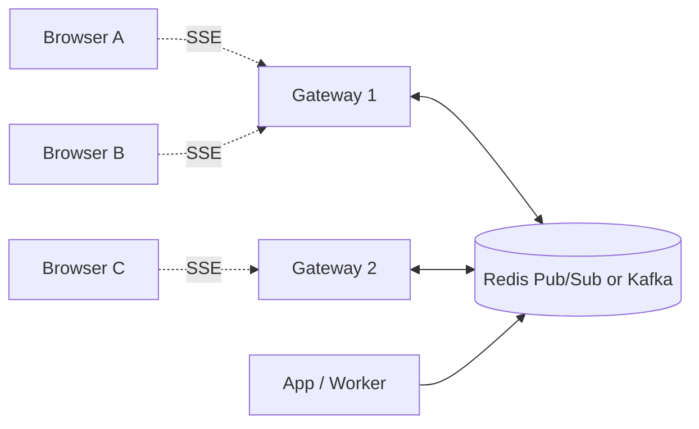

# Server-Sent Events (SSE)

> **TL;DR** — **SSE** is a one-way streaming protocol from server to client built on plain HTTP. The server holds the response open and writes UTF-8 text events as they happen, separated by blank lines. The client uses the built-in `EventSource` API in the browser, which **auto-reconnects** and **auto-resumes** from the last received ID. It's the simplest possible "server push" — perfect for notifications, live feeds, status updates, and (recently) **LLM token streaming**.

---

## 1. Why SSE Exists

You want the server to push to the browser, but you don't need full duplex (you don't need the client to send realtime data over the same channel). WebSockets are overkill: stateful, custom protocol, manual reconnection. **SSE keeps everything on plain HTTP** — your CDN, proxy, load balancer all understand it for free.

```
              ┌──────────┐                       ┌──────────┐
   client     │ Browser  │ ◄─ events ─ events ─ │  Server  │
              │EventSource│ ◄────────────────── │          │
              └──────────┘                       └──────────┘
                     ▲                                  ▲
                     │  one long-lived HTTP response   │
                     └──────────────────────────────────┘
```

---

## 2. The Wire Format

The simplest text protocol in modern web:

```
HTTP/1.1 200 OK
Content-Type: text/event-stream
Cache-Control: no-store

data: hello world

data: {"type":"price","sym":"AAPL","val":190.43}

event: notification
data: You have a new message

id: 1234
data: This event is numbered

retry: 5000
data: Reconnect after 5s if connection drops
```

Rules:
- Each event is one or more lines, terminated by a **blank line**.
- `data:` lines accumulate (joined with newlines). Most events use one line.
- `event:` — optional event name; client dispatches as a named event.
- `id:` — sets the "last event ID"; on reconnect the client sends this back as `Last-Event-ID`.
- `retry:` — server tells client how long to wait before reconnecting.
- Lines starting with `:` are comments (often used as keep-alives).

That's the entire protocol.

---

## 3. The Client API

In browsers it's a one-liner:

```js
const es = new EventSource("/stream");

es.onmessage = (event) => {
  console.log("default event:", event.data);
};

es.addEventListener("notification", (event) => {
  console.log("notification:", event.data);
});

es.onerror = () => console.log("connection problem");

// later
es.close();
```

The browser automatically:
- Reconnects on disconnect (with the `retry` interval).
- Sends `Last-Event-ID` header on reconnect so the server can resume.
- Buffers partial events at line boundaries.

You write zero reconnection logic.

---

## 4. A Server Example (Node / Express)

```js
app.get("/stream", (req, res) => {
  res.writeHead(200, {
    "Content-Type": "text/event-stream",
    "Cache-Control": "no-store",
    "Connection": "keep-alive",
  });
  res.flushHeaders();

  // Resume if Last-Event-ID provided
  const lastId = Number(req.headers["last-event-id"] || 0);

  const send = (event) => {
    if (event.id)   res.write(`id: ${event.id}\n`);
    if (event.name) res.write(`event: ${event.name}\n`);
    res.write(`data: ${JSON.stringify(event.data)}\n\n`);
  };

  // Replay any events since lastId
  for (const e of getEventsSince(lastId)) send(e);

  // Subscribe to future events
  const unsub = eventBus.on("update", send);

  // Heartbeat so proxies don't kill the connection
  const heartbeat = setInterval(() => res.write(": ping\n\n"), 15000);

  req.on("close", () => { clearInterval(heartbeat); unsub(); });
});
```

That's a full production-quality SSE endpoint in ~25 lines.

---

## 5. SSE vs WebSockets

| | SSE | WebSocket |
| --- | --- | --- |
| Direction | Server → client only | Full duplex |
| Transport | Plain HTTP | HTTP/1.1 upgrade → custom binary |
| Auto-reconnect | ✅ Built into spec | ❌ DIY |
| Auto-resume | ✅ Last-Event-ID | ❌ DIY |
| Binary payloads | ❌ UTF-8 text only | ✅ |
| Browser native | ✅ EventSource | ✅ WebSocket |
| Works through proxies/CDN | ✅ It's just HTTP | ⚠️ Usually yes, but more setup |
| HTTP/2 multiplexing | ✅ Single connection serves many streams | ❌ One conn per WS |
| Max concurrent connections (HTTP/1.1) | 6 per origin (the classic limit) | Same per origin |
| Best for | Notifications, feeds, LLM token streams | Chat, games, collab editing |

The "**SSE is simpler**" answer wins more often than people realize. Many real systems that don't actually need bidirectional channels use WebSockets out of habit; SSE would be a better fit.

---

## 6. SSE vs Long Polling

| | SSE | Long Polling |
| --- | --- | --- |
| Per event | 1 HTTP response, never closed | 1 HTTP request/response per event |
| Latency | Sub-second | Sub-second to several seconds |
| Server resource per client | 1 open connection | 1 open connection only while polling |
| Auto-reconnect | Built-in | DIY |
| Browser API | EventSource (one line) | Manual fetch loop |
| HTTP overhead | Low (no repeat headers) | High (headers every request) |

If you can use SSE, prefer it over long polling. Reserve long polling for legacy clients or environments where SSE doesn't work.

---

## 7. Where SSE Shines

- **Notifications** — "you have a new message", "your build finished".
- **Live dashboards** — metrics ticking, deploy status, queue depth.
- **Sports / financial tickers** — many readers, one source of truth.
- **Live activity feeds** — followers' posts, comments.
- **LLM token streaming** — OpenAI, Anthropic, Google AI all stream completions over SSE. The Anthropic Messages API streaming uses SSE. Even ChatGPT.com uses SSE for token-by-token streaming.
- **CI / CD logs** — tail running build logs.
- **Webhooks ingress** for the user — show events as they arrive.

---

## 8. Where SSE Falls Short

- **Bidirectional** chat / collab — use WebSockets.
- **Binary payloads** at high volume — Base64 inflates 33%; use WS or gRPC.
- **Mobile background** — connections drop when the app backgrounds; you'll need extra logic.
- **Very high write volume from many gateways** — SSE's one-connection-per-client doesn't scale specially well past WebSockets, but the model is essentially equivalent.
- **HTTP/1.1 6-connections-per-origin** limit. A user with multiple SSE streams on one site can hit this. HTTP/2 / HTTP/3 fix it (single multiplexed connection).

---

## 9. Scaling SSE

The architecture is identical to WebSockets:



- Each gateway holds many SSE connections.
- A pub/sub bus distributes events.
- Adding gateways adds capacity.
- Sticky routing is *not* required (client can reconnect to any gateway and resume via `Last-Event-ID`).

A modern Linux server tuned for many open connections can hold tens of thousands of SSE clients.

---

## 10. Operational Pitfalls

### Buffering / proxies that "wait for the whole response"
- **Nginx** buffers responses by default. Disable per route:
  ```
  proxy_buffering off;
  X-Accel-Buffering: no  (header from the app also disables it)
  ```
- **Compression** middleware (gzip) may buffer chunks. Either disable for `text/event-stream` or explicitly flush.
- **AWS CloudFront / ALB** — supports SSE but check timeouts.

### Idle timeouts
- Some load balancers (AWS ALB defaults to 60 s) close idle connections.
- Send a **heartbeat comment** (`: ping\n\n`) every 15–30 s to keep the connection visibly active.

### CORS
Same-origin policy applies. For cross-origin streams:
```
Access-Control-Allow-Origin: https://app.example.com
Access-Control-Allow-Credentials: true
```
The browser's EventSource has no header customization, so cookies must flow.

### Authentication
- **Cookies** work transparently if same-origin.
- **Bearer tokens** — `EventSource` doesn't let you set headers. Options:
  - Pass token in URL query (`?token=...`) — be careful with logs.
  - Use **`EventSourcePolyfill`** or **`fetch` + ReadableStream** to set Authorization.
  - The Fetch streaming approach is becoming the modern way to do SSE with full header control:
    ```js
    const resp = await fetch("/stream", { headers: { Authorization: `Bearer ${tok}` }});
    const reader = resp.body.getReader();
    // parse SSE frames yourself
    ```

### Reconnection storms
On big outages, all your clients reconnect at once. The `retry:` field + per-client jitter prevents thundering herds.

### Last-Event-ID accuracy
Your backend must reliably reconstruct events since a given ID. Use a monotonic counter or timestamp. If you can't, document "may miss events on reconnect" and design the client to refetch state.

---

## 11. SSE With Modern Stacks

### Spring / Java
```java
@GetMapping(value = "/stream", produces = MediaType.TEXT_EVENT_STREAM_VALUE)
public Flux<ServerSentEvent<String>> stream() {
    return Flux.interval(Duration.ofSeconds(1))
        .map(i -> ServerSentEvent.builder("tick-" + i).build());
}
```

### Go (`net/http`)
```go
http.HandleFunc("/stream", func(w http.ResponseWriter, r *http.Request) {
    w.Header().Set("Content-Type", "text/event-stream")
    flusher := w.(http.Flusher)
    for {
        fmt.Fprintf(w, "data: %s\n\n", time.Now())
        flusher.Flush()
        time.Sleep(time.Second)
    }
})
```

### Python (FastAPI)
```python
from fastapi import FastAPI
from sse_starlette.sse import EventSourceResponse

@app.get("/stream")
async def stream():
    async def gen():
        for i in range(100):
            yield {"data": f"tick {i}"}
            await asyncio.sleep(1)
    return EventSourceResponse(gen())
```

### LLM token streaming (OpenAI-style)
```
data: {"choices":[{"delta":{"content":"Hello"}}]}

data: {"choices":[{"delta":{"content":" world"}}]}

data: [DONE]
```
That's literally SSE.

---

## 12. Common Mistakes

- **Forgetting the blank line** between events — clients buffer them as one giant unfinished event.
- **Sending non-UTF-8 data** — SSE is text only.
- **No heartbeats** — idle connections die silently behind proxies.
- **Compression on `text/event-stream`** — kills streaming because it buffers chunks.
- **Trying to push large binary** — Base64-in-SSE is a smell. Use WS or signed-URL downloads.
- **Reinventing reconnection** — the browser does it for you.
- **Not implementing `Last-Event-ID`** server-side — clients lose data on every blip.

---

## 13. Cheat Card

```
SSE = server-push over a long-lived HTTP response, plain text.

WHAT YOU GET (for free, in the browser):
  EventSource API     auto-reconnect     auto-resume (Last-Event-ID)

FORMAT
  Content-Type: text/event-stream
  data: <text>
  event: <name>         (optional)
  id: <id>              (optional, sets Last-Event-ID)
  retry: <ms>           (optional, reconnection delay)
  : comment             (often used as heartbeat)
  (blank line ends event)

USE FOR
  notifications, feeds, dashboards, LLM token streaming, CI logs.

AVOID FOR
  bidirectional (use WS), binary (use WS/gRPC), large files (use HTTP/CDN).

OPS
  heartbeat every ~20s    disable proxy buffering    bump LB idle timeout
  no gzip on event-stream  use HTTP/2 to skip 6-conn limit
```

---

## 14. Resources

### Specs
- **WHATWG HTML spec, Server-Sent Events**: <https://html.spec.whatwg.org/multipage/server-sent-events.html>
- (Historical) W3C SSE spec, RFC nothing — it's a browser API spec.

### Articles
- MDN — Using Server-Sent Events: <https://developer.mozilla.org/en-US/docs/Web/API/Server-sent_events/Using_server-sent_events>
- "SSE vs WebSockets" — many good comparisons; see <https://ably.com/blog/websockets-vs-sse>
- "Implementing SSE in Node.js" — DigitalOcean, MDN.
- OpenAI / Anthropic streaming docs — practical, real-world SSE: <https://platform.openai.com/docs/api-reference/streaming>

### Videos
- ByteByteGo: "Server-Sent Events vs WebSockets vs Long Polling": <https://www.youtube.com/@ByteByteGo>
- Hussein Nasser SSE deep dive: <https://www.youtube.com/@hnasr>

### Libraries
- **sse-starlette** (Python / FastAPI)
- **express-sse**, **eventsource** (Node)
- **gorilla/websocket** alternative: just use `http.Flusher` (Go stdlib is enough)
- **spring-webflux** `ServerSentEvent` (Java)
- **EventSourcePolyfill** (browser) — for adding Authorization headers
- **fetch + ReadableStream** — the modern client approach

### Real-world examples
- Anthropic Claude API streaming response.
- OpenAI Chat Completions streaming.
- GitHub live builds.
- Many financial tickers (Bloomberg, IEX).

---

*Previous:* [← WebSockets](./websockets.md)  |  *Next:* [Long Polling vs Short Polling →](./polling.md)
