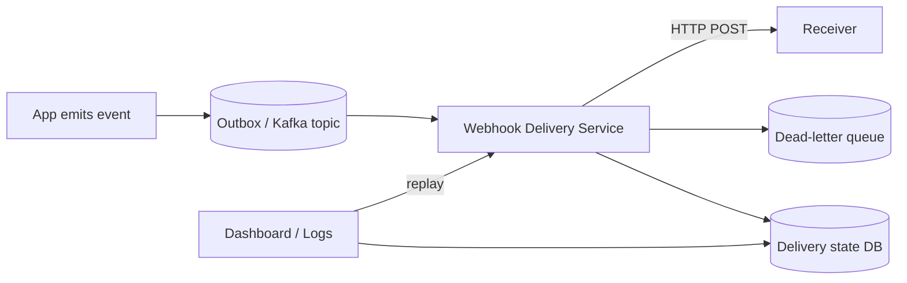
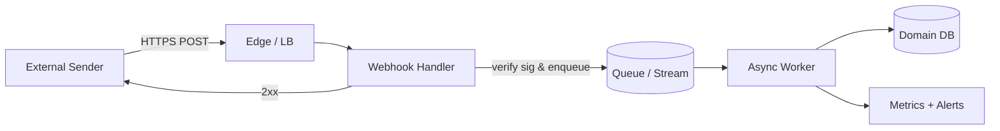

# Webhooks

> **TL;DR** — A **webhook** is a reversed-direction HTTP call: instead of *your* app polling *their* API, *they* call *your* HTTP endpoint when an event happens. The receiver registers a URL, the sender POSTs JSON to it, the receiver acks with `2xx`. Webhooks are the de-facto event-delivery mechanism between systems on the internet (Stripe, GitHub, Slack, Twilio, Shopify, PagerDuty — everyone has them). They're simple to consume, deceptively tricky to build correctly: you need signing, retries, idempotency, ordering, and a queue.

---

## 1. The Idea in One Picture

```
                          event happens
Sender Service  ────────────────────────────► Their event store
   │
   │ POST /events           HTTP request to YOUR endpoint
   ▼
You — Webhook Receiver ──► your queue / DB / app logic
   │
   └── 2xx response ────────► sender marks delivered
```

The flow is just "an HTTP request, but the *other* direction." That's it. All the interesting design is in the details.

---

## 2. Webhooks vs Polling vs Streaming

| | Polling | Webhooks | Server-Sent / WebSocket |
| --- | --- | --- | --- |
| Who initiates | You (client) | Sender | Long-lived conn |
| Latency | Polling interval | Sub-second | Sub-second |
| Receiver state | Stateless requests | Must expose a public URL | Stateful connections |
| Reliability | If you ask, you get | Sender retries on your failure | Best-effort over conn |
| Scale | Wasteful at scale | Efficient — only fires on event | Efficient |
| Internet-friendly | Yes | Yes (if you have a public URL) | Sometimes blocked by firewalls |

Webhooks are usually the simplest **integration** primitive between two unrelated systems on the public internet. Stream/WS is preferred when both ends are yours and bandwidth is high.

---

## 3. A Typical Webhook Payload

```
POST /webhooks/stripe HTTP/1.1
Host: api.example.com
Content-Type: application/json
Stripe-Signature: t=1716072000,v1=5257a869e7ecebeda32affa62cdca3fa51cad7e77a0e56ff536d0ce8e108d8bd
User-Agent: Stripe/1.0

{
  "id": "evt_1NXh...",
  "type": "checkout.session.completed",
  "created": 1716072000,
  "data": {
    "object": {
      "id": "cs_test_...",
      "customer": "cus_...",
      "amount_total": 4200,
      "currency": "usd"
    }
  }
}
```

Notable elements:
- **Event ID** — for idempotency on your side.
- **Event type** — what happened.
- **Signature header** — for proving authenticity.
- **Timestamp** — for replay protection.
- **Body** — the event payload.

Your job: verify the signature, store/process the event, respond with `2xx` quickly.

---

## 4. The Receiver's Five Responsibilities

### 1. Verify the signature
Senders sign the body with an HMAC secret (shared with you at setup):

```
expected = HMAC-SHA256(secret, timestamp + "." + raw_body)
header   = "t=<timestamp>,v1=<expected>"
```

Your code:
- Reads the raw body (do **not** parse JSON first — encoding changes can break the signature).
- Recomputes the HMAC.
- Compares in **constant time** to avoid timing attacks.
- Rejects if mismatch or if timestamp is too old (e.g. > 5 min).

### 2. Be fast
Senders expect a `2xx` within a few seconds. If you're slow, you'll get retried — or rate-limited. Do the *minimum* synchronously:
- Verify signature.
- Persist the raw event to a queue or DB.
- Return `2xx`.

Then process *asynchronously* (worker reads from queue). Never run business logic synchronously inside the webhook handler. (You'll thank yourself when your DB has a 5-minute hiccup.)

### 3. Be idempotent
You **will** see the same event more than once. Reasons:
- Sender retried because your `2xx` was lost in the network.
- Sender retried because you timed out.
- Sender's "at-least-once" delivery is by design.

Always key your processing by the event ID:
```sql
INSERT INTO webhook_events (event_id, ...) VALUES (?, ...)
ON CONFLICT DO NOTHING;  -- duplicate? skip silently.
```
Or use Redis SETNX with a TTL.

### 4. Respond with the right status
- `2xx` = success, please don't retry.
- `4xx` (especially `400`/`401`/`403`) = "broken request" — sender may stop retrying, alert humans.
- `5xx` = transient failure, sender retries with backoff.
- `429` = rate limit, sender retries after `Retry-After`.

Mis-using statuses is one of the top webhook bugs. If signature is invalid, return `401` and stop. If you can't store the event, return `5xx` so the sender retries.

### 5. Don't trust the source IP
Webhooks come from many IPs and they rotate. Don't allowlist by IP unless the sender publishes a stable list. Rely on the **signature** for authenticity.

---

## 5. The Sender's Five Responsibilities

Building a webhook-delivery system on the sending side has its own list.

### 1. Retries with exponential backoff
Receivers fail. Retry on `5xx` / timeouts. A typical schedule:
```
1m → 5m → 30m → 2h → 8h → 24h → 3d → fail / disable endpoint
```
Don't retry on `2xx` or non-retryable `4xx`.

### 2. Signed payloads
HMAC every request. Rotate the secret on demand. Document the signing scheme clearly.

### 3. An outgoing queue
Build webhook delivery as an **async worker** with a durable queue (Postgres outbox, Kafka, SQS). Never call the receiver in the same transaction that creates the event.

### 4. Ordering — or explicit lack of it
Webhooks are usually delivered **out of order** (because of retries). Document this. Provide event timestamps and sequence numbers so receivers can re-order if needed.

For strict in-order delivery, sequence per-tenant / per-stream and pause delivery of later events when an earlier one is failing. (Most senders don't do this; receivers must cope.)

### 5. Replay & history
Let receivers replay events by ID or time range from your dashboard. Bugs and outages happen. Stripe, GitHub, Shopify, Twilio — all expose a "resend webhook" UI.

---

## 6. Reference Architecture (Sending)



- **Outbox pattern**: the event is written to your DB in the *same* transaction as the business change. A separate process publishes to the queue. Guarantees the event exists if and only if the business event did.
- **Delivery service**: workers pull events, sign + POST, retry on failure.
- **Dead-letter queue** for events that fail forever (receiver is dead, secret rotated, etc.).
- **Dashboard** for engineers and customers to see deliveries, replay, rotate secrets.

---

## 7. Reference Architecture (Receiving)



- **Edge** (Cloudflare / WAF / API Gateway) — basic abuse protection.
- **Webhook handler** does the *minimum*: verify signature, persist raw event, return 200. Should be tiny and lightning-fast.
- **Async worker** does business logic, with idempotency on the event ID.
- **Dashboard / metrics** so a noisy webhook is observable.

---

## 8. Security Considerations

| Threat | Defense |
| --- | --- |
| Forged events | HMAC signature on raw body, constant-time compare |
| Replay attacks | Reject if timestamp older than ~5 min; dedupe by event ID |
| SSRF (your receiver fetching attacker URLs) | Never fetch URLs in the payload without strict allowlist |
| Slow loris / payload flooding | Body size limit; request timeout |
| Leaked secret | Rotate (sender supports key rotation overlap) |
| Public URL exposure | Make path unguessable, but **don't** rely on it for auth — use signature |
| Cross-tenant data | Validate event payload belongs to expected account |

If you're the **sender**, watch for:
- Customer-controlled URLs hitting *your internal* network (SSRF-from-webhooks). Many CVEs here. Resolve hostnames in advance, deny private IP ranges, prefer a hardened outbound proxy.

---

## 9. Common Patterns

### "Thin webhook + fetch"
Payload is just an event ID and a URL. Receiver acknowledges quickly, then fetches the full event from your API at its leisure.
- Pros: tiny payloads, sender doesn't expose data on every retry.
- Cons: extra round trip; receiver needs API credentials.

Used by Slack events, GitHub `installation` webhooks.

### "Full payload"
Webhook body contains the entire event. Common with Stripe, Twilio.
- Pros: no extra fetch.
- Cons: payload size, harder to evolve schema, harder to keep secrets out of logs.

### "Push + poll fallback"
Sender pushes events; receiver can also poll an `/events?since=ID` endpoint to catch up. Modern integration style — guarantees no loss even if webhook delivery is broken. Stripe, GitHub do this.

### Verification handshake on registration
When you register a URL, the sender sends a challenge:
- Slack: includes a `challenge` field in the first body; you echo it back.
- AWS SNS: sends a `SubscriptionConfirmation` URL that you must visit.
- This prevents random hosts being subscribed by attackers.

---

## 10. Idempotency in Practice

The two most common implementations:

### Database upsert
```sql
INSERT INTO processed_events (event_id, received_at)
VALUES ($1, NOW())
ON CONFLICT (event_id) DO NOTHING
RETURNING *;
-- if no row returned → duplicate, skip work
```

### Redis SETNX
```python
ok = redis.set(f"webhook:{event_id}", "done", nx=True, ex=86400)
if not ok:
    return  # duplicate within last 24 h
```

Both are fine. Pick one based on where authoritative state lives. **Always** key by the *sender-provided* event ID, never by something you derive yourself.

---

## 11. Observability for Webhooks

You can't fix what you can't see.

Track on every webhook:
- Time received → time queued → time processed.
- Verification result (pass/fail).
- HTTP status returned.
- Retry count (from sender's `Webhook-Retry-Count` header where supplied).
- Processing duration.
- Idempotency hits (how often we deduped).

Dashboards: success rate, p95 processing time, dead-letter count, top event types, top senders.

Alerts: 5xx rate > X, lag > Y minutes, dead-letter > Z events.

---

## 12. Testing Webhooks

### Locally
- **ngrok** / **localtunnel** / **smee.io** / **Cloudflare Tunnel** — expose your localhost over a public URL. Senders can POST to it from their cloud.
- **Webhook.site** — get a free public URL, see incoming requests.
- **Hookdeck / Svix / Postmark webhook tools** — observability and replay.

### In CI
- Mock the sender by POSTing canned payloads. Test signature failure, replay attack, duplicate event ID.

### Replay from prod
- The dashboard "resend" button is your friend. Reproduce by re-firing the event with the original ID.

---

## 13. Hosted Webhook-as-a-Service

If you're sending webhooks at scale, libraries like:
- **Svix** — open-source / hosted webhook sender (open-sourced their internal infra): <https://www.svix.com/>
- **Hookdeck** — webhook gateway: <https://hookdeck.com/>
- **Convoy** — open-source webhook delivery: <https://getconvoy.io/>
- **Cloud-native**: AWS SNS+SQS, EventBridge → HTTP target; GCP Eventarc; Azure Event Grid.

If you're receiving, you mostly just need a small handler + a queue + a worker.

---

## 14. Common Mistakes

### Sending
- No retries → "delivered exactly never" the moment your receiver burps.
- Retrying forever on `4xx` errors that won't change.
- No signing → attackers can forge events.
- Synchronous webhook delivery in your main request path → user-facing latency.
- No backoff/jitter on retries → DDoS your own customers.
- One global ordering across all tenants → one slow receiver stalls everyone.

### Receiving
- Verifying signature on parsed JSON instead of raw body.
- Processing inline in the request handler → timeouts → unintended retries.
- No idempotency → double-charging, double-emailing, double-shipping.
- Returning `200` even when you failed → silent data loss.
- Returning `500` for invalid signature → infinite retries from sender.
- Logging the full webhook payload (PII, signatures) → leaks.
- Trusting source IPs in a world where they rotate.

---

## 15. Designing a Webhook System: A Mini-Spec

For your own outbound webhook product, ship at least:
- **Multiple endpoints per customer**, with selectable event types per endpoint.
- **Signing secret** with **rotation** (overlap window of N hours).
- **At-least-once** delivery with retries (1m / 5m / 30m / 2h / 8h / 24h / 3d).
- **Per-endpoint queue** so one slow customer doesn't starve others.
- **Dead-letter handling** + alerting.
- **Replay UI** by event ID or time range.
- **Health view** — recent success/failure rates per endpoint.
- **Disable endpoint** after sustained failure with email to customer.
- **Documentation** including signature scheme, retry policy, IP ranges (if applicable), example bodies.

---

## 16. Cheat Card

```
WEBHOOK = HTTP POST from a sender to your URL on each event.

RECEIVER
  Verify HMAC on RAW body.    Constant-time compare.   Reject old timestamps.
  Persist to queue.            Return 2xx FAST.
  Process async + IDEMPOTENT keyed on event_id.
  Return 4xx for bad request, 5xx for transient (gets retried).

SENDER
  Sign every payload (HMAC-SHA256 of body + ts).
  Async delivery from a durable outbox.
  Exponential backoff with jitter; cap at a few days.
  Don't retry on 2xx or non-retryable 4xx.
  Provide replay + dashboard.
  Watch SSRF when customers can pick the URL.

DELIVERY GUARANTEES
  At-least-once is the rule. Plan for duplicates and reordering.

WHEN NOT TO USE
  You control both ends and need very low latency → use streaming / gRPC.
  Receiver has no public URL → use polling.
  Real-time bidirectional → WebSocket.
```

---

## 17. Resources

### Articles
- "How to design a webhook API" — Stripe engineering: <https://stripe.com/blog/online-migrations>
- "Webhooks doneright" — Svix docs: <https://www.svix.com/resources/>
- "Webhooks the definitive guide" — Hookdeck.
- GitHub Webhooks docs: <https://docs.github.com/en/webhooks>
- Stripe Webhooks docs: <https://stripe.com/docs/webhooks>
- Slack Events API: <https://api.slack.com/apis/connections/events-api>
- Twilio Webhooks docs.
- AWS SNS HTTP/S subscription docs.

### Videos
- ByteByteGo: "What is a Webhook" — <https://www.youtube.com/@ByteByteGo>
- Hussein Nasser webhook deep dives — <https://www.youtube.com/@hnasr>

### Tools
- **ngrok** — <https://ngrok.com/> (local tunnel).
- **smee.io** — free GitHub webhook proxy.
- **webhook.site** — quick public bin.
- **Svix Play** — debug webhook payloads.
- **Postman** / **Insomnia** — fire test webhooks easily.

### Open-source senders
- **Svix** — <https://github.com/svix/svix-webhooks>
- **Convoy** — <https://github.com/frain-dev/convoy>
- **Hookrelay** — <https://www.hookrelay.dev/>

### Adjacent reading
- [Outbox Pattern →](../07-messaging/outbox-pattern.md)
- [Idempotency →](../03-apis/idempotency.md)
- [Retry, Timeout, Exponential Backoff →](../11-reliability/retry-timeout-backoff.md)
- [Dead Letter Queues →](../07-messaging/dead-letter-queues.md)

---

*Previous:* [← REST vs GraphQL vs gRPC](./api-styles.md)  |  *Next:* [CORS, CSRF, Same-Origin Policy →](./cors-csrf.md)
