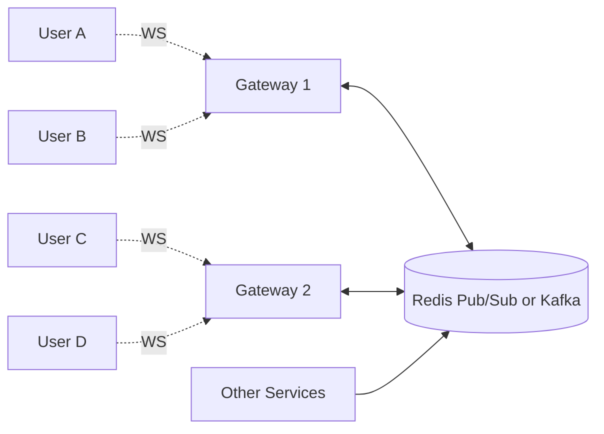

# WebSockets

> **TL;DR** — **WebSocket** (RFC 6455) is a Layer-7 protocol that upgrades an HTTP/1.1 connection into a **full-duplex, bidirectional, long-lived TCP channel** between client and server. Once upgraded, either side can send messages at any time without the request/response overhead. The protocol of choice for chat, live dashboards, multiplayer games, collaborative editing, financial tickers, and notifications — anywhere you need *push from server to client* with low latency.

---

## 1. Why WebSockets Exist

Plain HTTP is **request/response**: the client asks, the server replies. For pushing data from the server to the client in real-time, that model is wrong.

Workarounds people tried before WebSockets:
- **Short polling** — client asks every X seconds. Wasteful.
- **Long polling** — client request, server holds it open until data arrives. Still one connection per message.
- **Comet / hanging GET / iframe streaming** — hacky.

WebSockets fix this properly: one persistent connection, either side can talk whenever, full duplex.

---

## 2. The Upgrade Handshake

A WebSocket connection *starts* as an HTTP/1.1 request with `Upgrade: websocket`:

```
Client                                              Server
  │ GET /chat HTTP/1.1                                 │
  │ Host: example.com                                  │
  │ Upgrade: websocket                                 │
  │ Connection: Upgrade                                │
  │ Sec-WebSocket-Key: dGhlIHNhbXBsZSBub25jZQ==        │
  │ Sec-WebSocket-Version: 13                          │
  │ Origin: https://example.com                        │
  │ ─────────────────────────────────────────────────► │
  │                                                    │
  │ ◄──────────────────────────────────────────────── │
  │ HTTP/1.1 101 Switching Protocols                   │
  │ Upgrade: websocket                                 │
  │ Connection: Upgrade                                │
  │ Sec-WebSocket-Accept: s3pPLMBiTxaQ9kYGzzhZRbK+xOo= │
  │                                                    │
  │ ══════════════════ WebSocket frames now ═══════════│
```

After the `101 Switching Protocols` response, the TCP connection is *no longer HTTP* — both sides speak the WebSocket framing protocol. Either side can send a message at any time.

**`Sec-WebSocket-Accept`** is a SHA-1 of the client's key + a fixed magic string. Its only purpose is to prove the server understood the upgrade (preventing cross-protocol attacks).

---

## 3. The Frame Format

WebSocket messages are sent as **frames**. A frame's header is 2–14 bytes:

```
0                   1                   2                   3
0 1 2 3 4 5 6 7 8 9 0 1 2 3 4 5 6 7 8 9 0 1 2 3 4 5 6 7 8 9 0 1
+-+-+-+-+-------+-+-------------+-------------------------------+
|F|R|R|R| opcode|M| Payload len |  Extended payload length      |
|I|S|S|S|  (4)  |A|     (7)     |   (16/64, if needed)          |
|N|V|V|V|       |S|             |                               |
| |1|2|3|       |K|             |                               |
+-+-+-+-+-------+-+-------------+-------------------------------+
|     Masking-key (32 bits, only if MASK=1, client→server)     |
+--------------------------------------------------------------+
|                       Payload Data                            |
+--------------------------------------------------------------+
```

Opcodes:
- `0x1` — text frame (UTF-8).
- `0x2` — binary frame.
- `0x8` — close.
- `0x9` — ping.
- `0xA` — pong.

Key points:
- **FIN bit** lets you fragment large messages.
- **Masking**: client → server frames are XOR-masked with a per-frame random key. This is a security measure against intermediary attacks on caching proxies. Server → client frames are *not* masked.

Most application code never sees this — your library (Socket.io, ws, gorilla/websocket, signalr) handles framing.

---

## 4. Pings, Pongs, and Keep-Alive

The standard defines `ping` and `pong` control frames. Either side can ping; the other must pong.

You need them because:
- **NAT / proxy timeouts** drop idle TCP connections (often after 60–120 s).
- **Load balancer** idle timeouts (AWS ALB defaults to 60 s).
- Without keep-alives, the connection silently dies and the client only finds out next time it tries to send.

Typical practice: send a ping every 20–30 seconds. If no pong returns within a deadline, close and reconnect.

---

## 5. WebSockets vs Alternatives

| | WebSocket | SSE | Long Polling | gRPC streaming | WebRTC |
| --- | --- | --- | --- | --- | --- |
| Direction | Full duplex | Server → client | Server → client (sim.) | Full duplex (H/2) | Full duplex (P2P) |
| Transport | TCP (HTTP/1.1 upgrade) | TCP (HTTP) | TCP (HTTP) | TCP (HTTP/2) | UDP (mostly) |
| Browser native | ✅ | ✅ | ✅ | ⚠️ via grpc-web | ✅ (P2P media) |
| Binary payload | ✅ | ❌ (text) | ❌ | ✅ | ✅ |
| Reconnection logic | DIY | Built into spec | DIY | DIY | Complex |
| Backpressure | Manual | Limited | None | Built-in (windows) | Built-in |
| Best for | Chat, games, dashboards | Notifications, feeds | Legacy | Server-to-server, gRPC clients | Voice/video/P2P |

See: [SSE](./sse.md) · [Long Polling](./polling.md) · [gRPC](./grpc-protobuf.md)

---

## 6. Architecture: WebSockets at Scale

A WebSocket connection is **stateful** — it lives on a single server. That has consequences.



Pattern:
- **WebSocket gateway tier** — many small stateful servers, each holding tens of thousands of open connections.
- **Pub/sub bus** between gateways — when User A sends a message to User D, gateway 1 publishes it on the bus and gateway 2 (which holds D's connection) consumes and forwards.
- **Load balancer with sticky-ish routing** — clients should reconnect to *some* gateway, not necessarily the same one. The pub/sub bus glues things together.
- **App services** publish events to the bus without knowing where the user's socket lives.

This decouples *connection state* (stateful, in the gateway) from *application state* (in the app/DB/queue).

### How many connections per box?
On a tuned Linux box with epoll/kqueue, **tens of thousands to a few hundred thousand** WebSocket connections per server is reasonable. Limits:
- File descriptors (`ulimit -n`) — set to >> 65k.
- TCP buffers — modest per-conn memory adds up.
- Ephemeral ports for outbound, if proxying.
- CPU for TLS termination.

The famous Discord / Phoenix / WhatsApp benchmarks pushed past 1M conns per server with Erlang/Elixir or Go.

### Load balancers
- **Layer 4** (AWS NLB, GCP TCP LB) — best for WebSocket. Pass-through TCP, long timeouts.
- **Layer 7** (ALB, Nginx) — supports WebSocket but you must:
  - Use HTTP/1.1 (not H/2 unless your LB supports WS-over-H/2 via RFC 8441).
  - Set very long idle timeouts (AWS ALB defaults to 60 s — bump to 4000 s).
  - Route correctly across deploys (no premature termination of in-flight connections).

---

## 7. Authentication

The `Sec-WebSocket-Protocol` header carries a subprotocol negotiation. The Upgrade request is a normal HTTP request, so:
- **Cookies** from the same origin are sent automatically — good for session-based auth.
- **Tokens** can be passed in the URL `?token=...` (visible in logs — careful), or in the `Sec-WebSocket-Protocol` header as a bearer.
- **Bearer header** is *not* settable from the browser WebSocket API (`new WebSocket(url)`), which is a frequent annoyance.

After upgrade, the server can also enforce a "send your token in the first message" handshake at the application protocol layer.

---

## 8. Reconnection Logic (You Have to Build It)

Clients drop connections all the time — switching WiFi, going through tunnels, sleeping. The spec doesn't auto-reconnect; you must:

1. Detect close (`onclose` / `onerror`).
2. **Exponential backoff with jitter** — don't slam the server.
3. Try a new connection.
4. Resume application state: re-subscribe to channels, fetch any missed events (sequence numbers help).
5. After a long offline period, do a full state refresh.

Libraries like `reconnecting-websocket`, Socket.io, Pusher, Ably handle this.

### Resumability
Server should expose a way to say *"give me everything since message ID 1234"* on reconnect, otherwise users lose data. This is one of the hardest correctness problems in chat-style systems.

---

## 9. Backpressure

A slow client can fall behind the server. Without backpressure:
- Server's send buffer fills.
- TCP slows down (flow control).
- Per-connection memory grows.
- Eventually OOM.

Mitigations:
- Measure send-queue depth per connection; drop or close when threshold exceeded.
- Rate-limit messages per user (especially fan-out scenarios).
- Apply **last-write-wins** semantics where possible (drop intermediate state updates).
- Use binary frames instead of bloated JSON.

---

## 10. Securing WebSockets

- **`wss://`** is WebSocket over TLS — *always* use this in production. `ws://` is plaintext.
- **Origin check** — the `Origin` header tells the server which page opened the socket. Reject unexpected origins to mitigate Cross-Site WebSocket Hijacking (CSWSH).
- **Authenticate at upgrade time.** Don't accept a socket and worry about auth later.
- **Rate limit per user/IP** — WebSockets bypass the typical per-request limits.
- **Validate every message.** Treat each frame as untrusted input.
- **Don't put secrets in URLs** — proxies log them.

---

## 11. Code Examples

### Browser (JavaScript)
```js
const ws = new WebSocket("wss://example.com/chat");

ws.onopen = () => {
  ws.send(JSON.stringify({ type: "subscribe", room: "lobby" }));
};
ws.onmessage = (event) => {
  const msg = JSON.parse(event.data);
  console.log("got:", msg);
};
ws.onclose = (e) => console.log("closed", e.code, e.reason);
ws.onerror = (e) => console.error(e);

// later
ws.send(JSON.stringify({ type: "msg", body: "hi" }));
```

### Node.js server (`ws` library)
```js
import { WebSocketServer } from "ws";
const wss = new WebSocketServer({ port: 8080 });

wss.on("connection", (socket, req) => {
  socket.on("message", (data) => {
    const msg = JSON.parse(data);
    // broadcast
    wss.clients.forEach(c => c.readyState === 1 && c.send(JSON.stringify(msg)));
  });
  socket.on("close", () => console.log("client gone"));
});
```

### Go server (`gorilla/websocket`)
```go
var upgrader = websocket.Upgrader{}
http.HandleFunc("/ws", func(w http.ResponseWriter, r *http.Request) {
    c, _ := upgrader.Upgrade(w, r, nil)
    defer c.Close()
    for {
        mt, msg, err := c.ReadMessage()
        if err != nil { break }
        c.WriteMessage(mt, msg)
    }
})
```

---

## 12. Common Libraries & Hosted Services

### Libraries
- **JS / browser**: native `WebSocket`, `reconnecting-websocket`, **Socket.io** (adds rooms, fallback, reconnection), **Phoenix Channels** (Elixir), **SignalR** (.NET).
- **Server**: `ws` (Node), **gorilla/websocket** (Go), **tokio-tungstenite** (Rust), **aiohttp**/`websockets` (Python), **Spring WebFlux** (Java), `cowboy` (Erlang).

### Managed services
- **Pusher**, **Ably**, **PubNub** — drop-in real-time messaging.
- **AWS API Gateway WebSocket API** — serverless WebSocket routing.
- **Cloudflare Durable Objects** + WebSockets — stateful at the edge.
- **Soketi** — open-source Pusher protocol-compatible.

---

## 13. Common Mistakes

- **Holding too much state in the gateway.** If a node dies, you lose conversations. State should be recoverable via DB / Kafka / Redis.
- **No reconnect logic.** Clients lose data on every blip.
- **No heartbeat.** Idle conns die silently in NATs and LBs.
- **Polling inside a WebSocket.** "I'll send `{"type":"ping"}` every 5s and the server responds." Just use HTTP if you're going to do that.
- **Long-lived connections behind ALB with default 60s timeout.** Bump the idle timeout.
- **Sticky sessions are not enough for HA.** A user must be able to reconnect to *any* gateway and continue.
- **Massive JSON frames per tick.** Use binary + delta encoding.
- **No backpressure → OOM.** Set send-queue limits.
- **Forgetting to authorize each message** — auth at upgrade is necessary, not sufficient.

---

## 14. When *Not* to Use WebSockets

- **One-way server → client streams** (notifications, ticker) — use **SSE** (simpler, auto-reconnect built in).
- **Request/response APIs** — REST or gRPC, not a hand-rolled RPC over WS.
- **Large file transfers** — HTTP range requests, S3, signed URLs.
- **Realtime media (voice/video)** — WebRTC.

---

## 15. Cheat Card

```
WEBSOCKET = full-duplex, persistent TCP, after an HTTP/1.1 Upgrade.
            text or binary frames, opcode-based, masked client→server.
            opens on /ws path; status 101 Switching Protocols.

USES        chat, live dashboards, games, collab editors, tickers.

ARCHITECTURE
  Gateway tier holds connections (stateful).
  Pub/Sub bus glues gateways together.
  App services publish, gateways forward.

KEEP-ALIVE  ping/pong every ~20–30 s; LB idle timeout > that.

AUTH        cookie + Origin check, or first-message auth.
            wss:// always.

RECONNECT   DIY: exponential backoff + jitter + resume-from-seq.

BACKPRESSURE  monitor send queue, drop or close on overflow.

NOT FOR     one-way push (use SSE), file transfer (use HTTP), media (use WebRTC).

LIBS       ws (Node), Socket.io, gorilla/websocket, Phoenix, SignalR,
            Pusher, Ably, AWS API GW WS.
```

---

## 16. Resources

### Specs
- **RFC 6455** — The WebSocket Protocol: <https://datatracker.ietf.org/doc/html/rfc6455>
- **RFC 8441** — WebSocket over HTTP/2: <https://datatracker.ietf.org/doc/html/rfc8441>

### Articles
- MDN — WebSocket API & Writing WS servers: <https://developer.mozilla.org/en-US/docs/Web/API/WebSockets_API>
- "WebSockets at Scale" — Slack engineering: <https://slack.engineering/>
- "Phoenix LiveView and Channels" — 2M concurrent connections: <https://www.phoenixframework.org/>
- Cloudflare on Durable Objects + WebSockets: <https://developers.cloudflare.com/durable-objects/>
- "How Discord Handles Two and a Half Million Concurrent Voice Users": <https://discord.com/blog/>

### Books
- *High Performance Browser Networking* — Ilya Grigorik. WebSockets chapter is excellent. Free online: <https://hpbn.co/>

### Videos
- ByteByteGo: "WebSockets vs SSE vs Polling" — <https://www.youtube.com/@ByteByteGo>
- Hussein Nasser: WebSocket deep dives — <https://www.youtube.com/@hnasr>

### Tools
- **wscat** — `wscat -c wss://example.com/ws` (CLI WebSocket client).
- **websocat** — Rust-based, very full-featured.
- **Postman** — has a WebSocket request type.
- **Chrome DevTools** — Network → WS tab shows every frame.
- **k6** — load-test WebSocket endpoints.

---

*Previous:* [← HTTPS, TLS/SSL Handshake](./https-tls.md)  |  *Next:* [Server-Sent Events (SSE) →](./sse.md)
