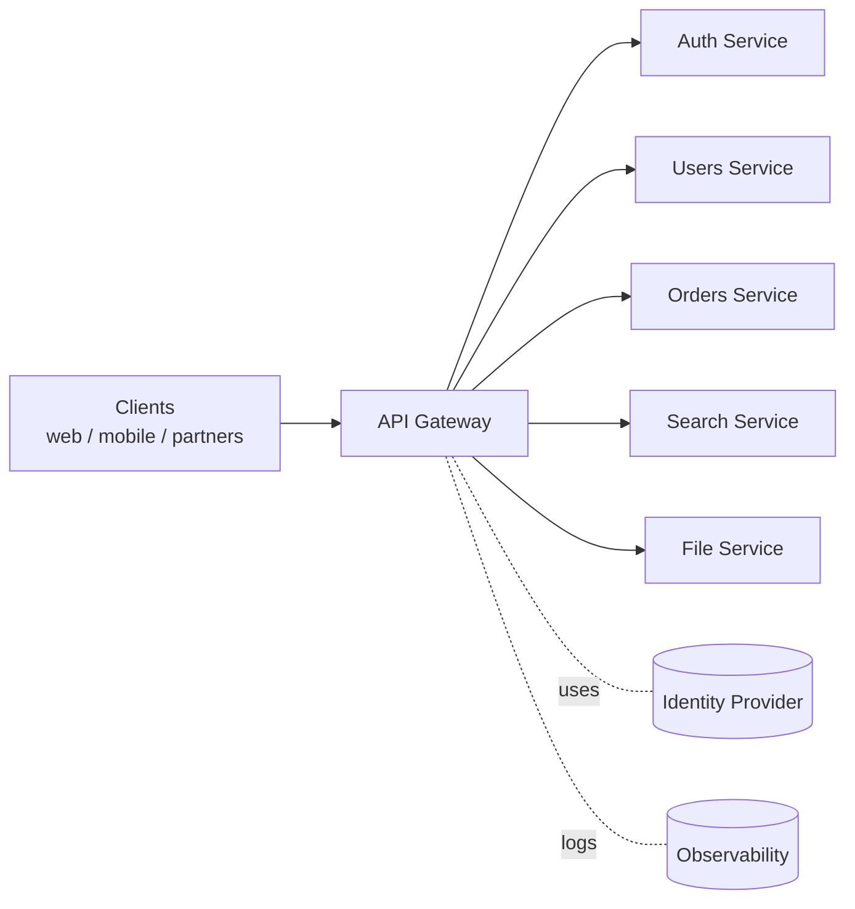
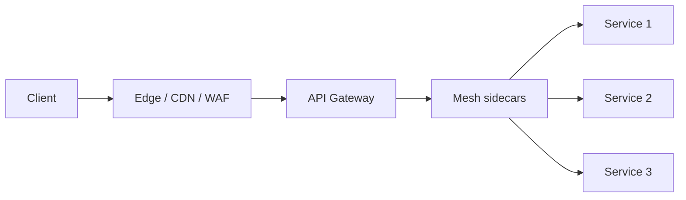

# API Gateway

> **TL;DR** — An **API gateway** is the single entry point that sits in front of your backend services. It handles cross-cutting concerns — **routing, auth, TLS termination, rate limiting, request/response transformation, observability, versioning, caching** — so individual services don't each reinvent them. Every public-facing platform has one (or several layers of one): Kong, Envoy, AWS API Gateway, NGINX, Apigee, Cloudflare, Tyk, Zuul. The trade-off: you get a single chokepoint that's both powerful and a potential SPOF.

---

## 1. The Pattern



Clients talk to one URL (`api.example.com`). The gateway figures out where the request should go, applies cross-cutting policies, and forwards it. Responses go back through the gateway, which can transform them before returning to the client.

---

## 2. What an API Gateway Does

| Concern | What the gateway handles |
| --- | --- |
| **Routing** | Map paths → upstream services. URL rewrites. |
| **TLS termination** | Decrypt TLS once, talk to services internally over mTLS or plaintext. |
| **AuthN / AuthZ** | Validate JWTs, API keys, OAuth tokens, mTLS client certs. |
| **Rate limiting** | Per-IP, per-key, per-tenant, per-endpoint quotas. |
| **Quota / billing** | API plan enforcement. |
| **Request/response transformation** | Add/remove headers, rewrite paths, transform JSON shapes. |
| **Validation** | Reject malformed payloads at the edge (JSON Schema / OpenAPI). |
| **Caching** | Cache `GET` responses; honor `Cache-Control`. |
| **Compression** | gzip / Brotli. |
| **Aggregation** | Fan out to multiple services; merge results (sometimes — this is BFF territory). |
| **Versioning** | Route `/v1/` and `/v2/` differently; date-based version translation. |
| **Observability** | Centralized logs, metrics, distributed tracing IDs. |
| **WAF / Security** | Block known-bad traffic, SQLi/XSS detection. |
| **Failover / circuit breaker** | Detect unhealthy upstreams, route elsewhere. |
| **A/B / canary** | Route a % of traffic to a new version. |
| **CORS** | Centralized policy. |
| **Webhook ingestion** | Verify signatures, dedupe events. |

If you'd otherwise build five of those things into every service, put them in the gateway instead.

---

## 3. Why You Want One

### Single chokepoint for policies
Auth, rate limiting, logging — every service needs them. Implementing them N times is brittle. One gateway = one place to fix bugs and ship policies.

### Clients see one URL
`api.example.com` is the only public surface. Internal services can be added, renamed, split, merged without breaking clients.

### Decouple deploys
Backend services can move without touching clients — the gateway absorbs the change.

### Defense in depth
Edge → gateway → service mesh → service. Each layer can enforce its own rules.

### Operations
- One TLS cert.
- One CORS config.
- One source of truth for routes.
- Centralized request IDs and tracing.

---

## 4. Why You Don't Want One (Trade-Offs)

- **It's a SPOF** if not deployed redundantly. Many copies in many AZs is non-negotiable.
- **It can become a "smart gateway, dumb services"** anti-pattern — too much business logic at the edge.
- **Adds latency** — usually small (sub-ms to a few ms), but worth measuring.
- **Operational cost** — config explosion is a real risk in big orgs (thousands of routes, no owner).
- **Vendor lock-in** if you pick a managed product.
- **Performance ceiling** — a gateway must be very efficient; a poorly tuned one can become the bottleneck.

The mitigation: keep gateway logic **thin and declarative**. Routing, auth, rate limit, schema check — yes. Business logic — no.

---

## 5. API Gateway vs Reverse Proxy vs Load Balancer

These overlap. The distinction is in *features* and *layer*:

| | Load balancer (L4) | Reverse proxy (L7) | API gateway |
| --- | --- | --- | --- |
| Operates at | TCP/UDP | HTTP | HTTP, with API semantics |
| Knows about | IPs, ports | URLs, headers | APIs, methods, schemas, tokens |
| Examples | AWS NLB, HAProxy (L4) | NGINX, Envoy, ALB | Kong, AWS API Gateway, Apigee, Tyk |
| Concerns | Connection forwarding | URL routing, TLS, basic policies | Full API policy stack |

An API gateway is a reverse proxy with API-aware features. Modern proxies (Envoy, NGINX) can serve as gateways with plugins/config. Pure load balancers can't.

---

## 6. API Gateway vs BFF vs Service Mesh

The three are complementary, not interchangeable.

| | API Gateway | BFF (Backend for Frontend) | Service Mesh |
| --- | --- | --- | --- |
| Position | **North-south** (client ↔ backend edge) | **North-south** (between a specific client and backends) | **East-west** (service ↔ service) |
| Purpose | Cross-cutting policies, single entry | Tailored API for a specific frontend | Service-to-service networking |
| Examples | Kong, AWS API GW | A Node/Go service per client | Istio, Linkerd, Consul Connect |
| Owns business logic? | No | Sometimes (aggregation, formatting) | No |

A common layout: **Gateway → BFF(s) → Services**, with a **mesh** glueing east-west traffic.

See: [BFF →](./bff.md) · [Service Mesh →](./service-mesh.md).

---

## 7. Architecture Patterns

### Single global gateway
One layer in front of everything. Simple, but the gateway becomes critical infra.

### Per-client gateway / BFF
A gateway specialized for web vs mobile vs partners. Each can apply client-specific transforms.

### Layered (edge + internal)
- **Edge**: CDN/WAF (Cloudflare, Fastly) — DDoS, bot, caching, TLS.
- **API gateway**: routing, auth, rate limit, transform.
- **Internal mesh**: service-to-service mTLS, retries.

This is the common pattern at scale.



### Per-tenant gateway
SaaS with strict isolation may put a separate gateway per tenant. Operationally heavier but blast-radius small.

---

## 8. Routing — What Can You Match On?

Modern gateways match on:
- **Path** — `/v1/users/*`.
- **Method** — `GET`, `POST`.
- **Host** — `api.example.com` vs `partners.example.com`.
- **Headers** — `X-Region: eu`, `Authorization` presence.
- **Query params** — feature flag toggles, A/B splits.
- **Source IP / ASN**.

Routes typically resolve in **longest-prefix** or **declared-order** rules. Beware: route conflicts are a common source of "why is this not hitting service X?" debugging.

---

## 9. Authentication at the Gateway

The gateway is the perfect place to centralize identity:
- **Bearer tokens / JWT** validation (cache JWKs, check expiry, audience, scopes).
- **API key** lookup (against a Redis / DB store).
- **OAuth introspection** for opaque tokens.
- **mTLS** — clients present a cert; gateway verifies CN/SAN against allowlist.
- **Session cookies** for first-party SPAs.

Service downstream can trust a *signed* header from the gateway (e.g., `X-User-Id`, `X-Tenant-Id`) rather than re-doing the work. Make sure services **never** accept these headers from anywhere except the gateway (use mesh-level allowlist or network policy).

---

## 10. Rate Limiting & Quotas

The natural home — see [Rate Limiting →](./rate-limiting.md).
Gateways implement token-bucket / sliding-window keyed by IP, user, API key, endpoint, or cost weight. Tier-based plan limits are usually here.

---

## 11. Caching at the Gateway

For idempotent GETs the gateway can:
- Cache responses keyed by URL + `Vary` headers.
- Respect `Cache-Control` from origin.
- Cache for short TTLs (30–60 s) to absorb hot paths.

For "almost cacheable" data (a feed that refreshes every 5 s), this is enormous leverage. Be careful with auth-bearing requests: cache only public responses, or include the user in the cache key.

---

## 12. Observability — One Throat to Choke

Gateways are observability gold. From a single point you can collect:
- Latency per route, p50/p95/p99.
- Status code distribution.
- Per-tenant traffic.
- Top error endpoints.
- Origin upstreams' health.

Tag all logs with a **request ID** (`X-Request-Id`) and propagate it downstream — distributed tracing follows it across services. Most gateways auto-emit OpenTelemetry spans.

---

## 13. Performance Considerations

A gateway adds 1–10 ms to every request. Choose carefully:
- **Sidecar / single-binary proxies** (Envoy, NGINX) — usually < 1 ms hop.
- **Big managed gateways** (AWS API GW, Apigee) — 10–50 ms more typical.
- **HTTP/1.1 from client, HTTP/2 to upstream** is common; some gateways now do HTTP/3.
- Watch connection-pool tuning to upstreams; default pools often too small.

Run load tests with the gateway in the path. Don't trust "we'll measure later" — too late then.

---

## 14. Failure Modes

- **Gateway dies**: outage. Always run multiple instances behind an L4 LB. Use multi-AZ at minimum.
- **Misrouted requests**: typos in config send all `/payments` to the wrong upstream. Use canaries and config review.
- **Tight coupling of services to gateway plugins**: changing the gateway breaks services. Keep contracts narrow.
- **JWT key rotation gap**: if the gateway caches public keys, key rotation needs grace overlap.
- **Cascading retries**: gateway retries against a slow upstream multiply load. Use circuit breakers.
- **Backpressure absent**: gateway accepts more than upstreams can handle. Add concurrency limits per upstream.

---

## 15. A Worked Example: Routing in Kong

```yaml
# kong.yaml (declarative config)
services:
  - name: users-svc
    url: http://users.internal:8080
    routes:
      - name: users
        paths: ["/v1/users"]
    plugins:
      - name: jwt
      - name: rate-limiting
        config: { minute: 1000 }
      - name: request-transformer
        config:
          add:
            headers: ["X-User-Id: $(jwt.sub)"]
  - name: orders-svc
    url: http://orders.internal:8080
    routes:
      - name: orders
        paths: ["/v1/orders"]
    plugins:
      - name: oauth2
      - name: request-validator
        config: { ref: "OrderRequestSchema" }
```

A few declarations and you've got JWT auth, rate limiting, header injection, and schema validation across two services.

---

## 16. Choosing a Gateway

### Self-hosted, open-source
- **Kong** — Lua plugins, very flexible. Postgres/DB-less mode.
- **Envoy** — fast, programmable via xDS API. Foundation for Istio, AWS App Mesh, Google Cloud Service Mesh.
- **NGINX** / **NGINX Plus** — battle-tested. Lots of OSS use.
- **Tyk** — Go-based gateway.
- **Traefik** — popular in K8s.
- **APISIX** — Apache project, Lua-based, HTTPS/gRPC-friendly.
- **KrakenD** — high-performance, declarative, supports response aggregation.

### Managed (cloud)
- **AWS API Gateway** (REST, HTTP, WebSocket).
- **AWS AppSync** (managed GraphQL).
- **Google Cloud Endpoints / API Gateway / Apigee**.
- **Azure API Management**.
- **Cloudflare API Gateway / Workers**.

### Specialized
- **Apigee** — enterprise-grade, monetization, deep developer-portal features.
- **WSO2 API Manager**.
- **Hasura** — GraphQL gateway over multiple backends.

Picking is a function of: team size, hosting (K8s vs serverless), language preference, integration with your auth/observability stack, vendor lock-in tolerance.

---

## 17. Common Anti-Patterns

- **God gateway**: business logic creeps in, gateway becomes the monolith.
- **Per-route YAML soup**: thousands of routes, no owner. Treat configs as code with reviews.
- **Skipping versioning at the gateway**: `/v1/` and `/v2/` should be visible in route names.
- **Ignoring observability** until something breaks.
- **No canary deploys for gateway config**: a typo takes everything down.
- **One global rate-limit bucket**: a noisy tenant starves the rest.
- **Trusting client headers** as identity. Always re-derive identity at the gateway.
- **No backpressure to upstreams**: gateway accepts unbounded concurrency.
- **No mTLS to internal services**: gateway sees plaintext, then forwards plaintext.

---

## 18. Mini Decision Tree

```
Are you running a public-facing API at any scale?
  Yes  → You need a gateway.

Cloud-native, on AWS / GCP / Azure, small team?
  → managed gateway (AWS API GW / Azure APIM / GCP).

Self-hosted on Kubernetes, want flexibility?
  → Envoy (with Istio or standalone), Kong, APISIX, Traefik.

Need enterprise developer portal, monetization?
  → Apigee or Kong Enterprise.

Need GraphQL stitching?
  → Hasura, Apollo Router, GraphQL Mesh.

Need very high throughput, low latency?
  → Envoy or KrakenD.

Need it to also be your CDN + WAF?
  → Cloudflare / Fastly / Akamai (they bundle).
```

---

## 19. Cheat Card

```
API GATEWAY  = single entrypoint that owns cross-cutting concerns.

OWNS         routing, TLS, auth, rate limit, transforms, validation,
              caching, observability, versioning, WAF, A/B/canary.

DOES NOT OWN business logic, data, long-lived state.

POSITION
  Edge (CDN+WAF)  →  API Gateway  →  Service Mesh  →  Services
  (north-south)                     (east-west)

KEY POLICIES
  Validate JWT / API key here. Pass signed identity headers down.
  Rate limit per IP, per user, per tenant, per endpoint.
  Distributed tracing IDs injected once.
  Circuit-break / retry against upstreams with care.

PITFALLS
  SPOF (deploy redundantly).      "God gateway" with business logic.
  Hot routes vs cold routes.      Config sprawl.
  No backpressure to upstreams.   Trusting client identity headers.

TOOLS
  OSS: Kong, Envoy, NGINX, APISIX, Traefik, Tyk, KrakenD.
  Managed: AWS API GW, Apigee, Azure APIM, GCP API GW.
```

---

## 20. Resources

### Articles
- "The API Gateway Pattern" — Microsoft Azure Architecture Center: <https://learn.microsoft.com/en-us/azure/architecture/microservices/design/gateway>
- "API Gateways: Patterns and Anti-Patterns" — Martin Fowler / Chris Richardson.
- "When to use an API Gateway vs Service Mesh" — Solo.io blog.
- "Pattern: API Gateway / Backends for Frontends" — microservices.io: <https://microservices.io/patterns/apigateway.html>

### Books
- *Microservices Patterns* — Chris Richardson (gateway + BFF chapters).
- *Building Microservices* (2nd ed.) — Sam Newman.

### Official docs
- **Envoy** — <https://www.envoyproxy.io/docs>
- **Kong** — <https://docs.konghq.com/>
- **AWS API Gateway** — <https://docs.aws.amazon.com/apigateway/>
- **Apigee** — <https://cloud.google.com/apigee/docs>
- **Azure APIM** — <https://learn.microsoft.com/en-us/azure/api-management/>
- **NGINX** — <https://nginx.org/en/docs/>
- **APISIX** — <https://apisix.apache.org/>
- **Traefik** — <https://doc.traefik.io/traefik/>

### Videos
- ByteByteGo: "What is an API Gateway?" — <https://www.youtube.com/@ByteByteGo>
- Hussein Nasser API Gateway series — <https://www.youtube.com/@hnasr>
- Envoy / Kong / Istio talks on KubeCon YouTube.

### Adjacent reading
- [BFF — Backend for Frontend](./bff.md)
- [Service Mesh →](./service-mesh.md)
- [Rate Limiting](./rate-limiting.md)
- [Layer 4 vs Layer 7 Load Balancing →](../06-load-balancing/l4-vs-l7.md)
- [DDoS Protection & WAF →](../12-security/ddos-waf.md)

---

*Previous:* [← Rate Limiting](./rate-limiting.md)  |  *Next:* [Service Mesh (Istio, Linkerd) →](./service-mesh.md)
