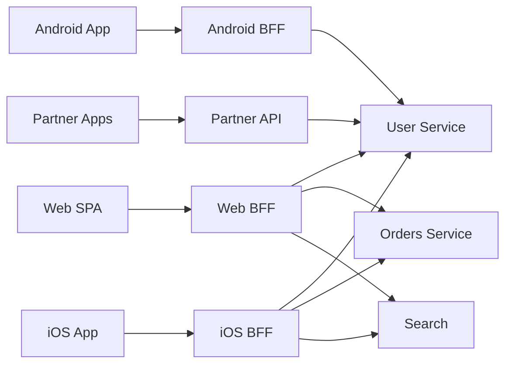
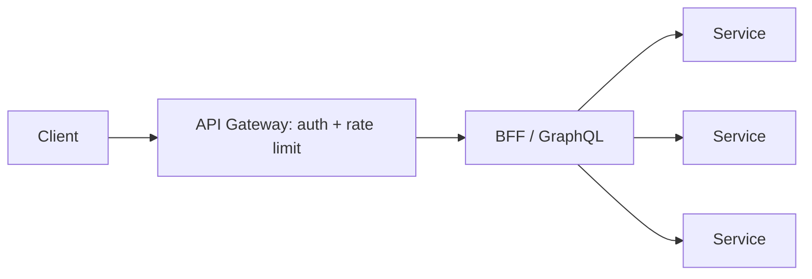
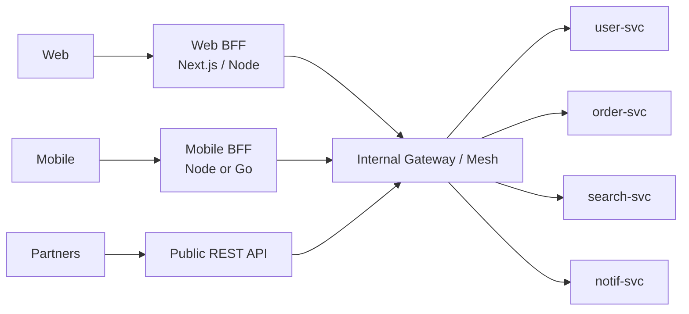

# BFF — Backend for Frontend

> **TL;DR** — A **BFF** is a backend service **dedicated to a specific frontend** (one for web, one for iOS, one for Android, one for partners). It sits between the client and your domain services and **shapes the API to fit that client's needs** — aggregating, transforming, paginating, caching, formatting — so the client doesn't need to call ten services to render one screen. The pattern, coined at SoundCloud (Phil Calçado, 2015), is now standard in any non-trivial product. Trade-off: more services to operate, but each frontend ships independently and the surface stays tight.

---

## 1. The Problem It Solves

In a microservices system, one screen often needs data from many services:

```
A mobile profile screen needs:
   user info        ← user-svc
   recent orders    ← orders-svc
   loyalty points   ← rewards-svc
   recommended      ← recs-svc
   notifications    ← notif-svc
```

Without a BFF, the client makes 5 calls — slow on cellular networks, awkward to coordinate, every error case the client's problem.

With a BFF:
```
Client → GET /screens/profile  →  BFF aggregates 5 calls  →  one response
```

The BFF tailors the response to *exactly* what the screen renders. Less data, fewer round trips, cleaner client.

---

## 2. The Picture



- One BFF **per frontend** — not per microservice.
- Each BFF speaks its frontend's idiom (REST/GraphQL, JSON shape, auth flow).
- Downstream services don't know which frontend is calling — they expose generic APIs.

---

## 3. Why a BFF Beats "One API for Everyone"

| Problem in "one API for all" | How BFFs help |
| --- | --- |
| Different clients want different fields | Each BFF asks for what its screen needs |
| Mobile clients suffer from N round trips | BFF aggregates server-side |
| Mobile clients want compact payloads | BFF strips fields, batches |
| Different auth flows per client | BFF handles its own auth |
| Frontend teams blocked by backend deploys | BFF is owned by the frontend team |
| Cross-team API churn | Domain service API stays stable; BFF absorbs change |
| Different release cadences | Web BFF deploys daily, iOS BFF weekly |

The unifying theme: **the API surface should match the client, not the database.**

---

## 4. Who Owns the BFF?

The crucial answer: **the frontend team that consumes it**. Not the backend team. Not the platform team.

Reasons:
- They know the screens, the network constraints, the strange product requirements.
- They iterate together — one team, one deploy.
- It moves the *coupling* to a place where it doesn't slow other teams.

Convention: web BFF lives in the web repo (and is often the SSR/Next.js server). Mobile BFF can live in a thin Node/Go service co-owned with the mobile team.

---

## 5. BFF vs API Gateway vs GraphQL — Don't Confuse Them

| | API Gateway | BFF | GraphQL |
| --- | --- | --- | --- |
| Purpose | Generic cross-cutting policies | Tailor API for **one** client | Client picks fields |
| Owns business logic? | No | Some (aggregation, formatting) | No (resolvers) |
| Endpoints | Many → many | A few per screen | One graph endpoint |
| Per-client | No | Yes | Optional |
| Auth, rate limit, observability | Yes | Inherits gateway, adds client-specific | Inherits gateway |
| Common pairing | In front of mesh + BFFs | Behind gateway / in front of services | Often the BFF itself |

A **GraphQL service is often the BFF** — federation/subgraphs aggregate from many services. Apollo Federation works beautifully here.



---

## 6. Responsibilities the BFF Takes On

- **Aggregation.** Fan out to multiple services in parallel, merge results.
- **Transformation.** Convert backend shapes to view-model shapes; rename fields; flatten / nest as needed.
- **Pagination convergence.** Combine paginations from multiple sources into a single cursor.
- **Auth-flow specifics.** OAuth code exchange for web, refresh-token rotation, cookie handling — all per-client.
- **Session management.** First-party sessions (SameSite cookies) often live here.
- **Caching.** Per-screen caching with short TTLs, plus per-resolver caching when GraphQL.
- **Rate limiting per client.** Cap one frontend's hammering without affecting others.
- **Backpressure on downstreams.** Bounded concurrency, retry budgets.
- **Edge formatting.** Locale, currency formatting, time-zone conversion.
- **Feature flags.** Read flag service once, apply per response.
- **Personalization assembly.** Combine recs, profile, A/B variants.

What it should **not** do: own domain logic that should live in a domain service. BFFs are *adapters*, not authority.

---

## 7. Communication Patterns

### REST / JSON BFF
Each screen is an endpoint:
```
GET /screens/home
GET /screens/profile?userId=42
```
Responses are tightly shaped to render the screen.

### GraphQL BFF
One endpoint, many queries:
```graphql
query Home {
  me { name avatar }
  feed(first: 20) { edges { node { ... } } pageInfo { ... } }
  notifications(unread: true) { count }
}
```
The client picks fields. The BFF resolvers fan out to services (often via gRPC).

### tRPC / typed-client BFFs
TypeScript-only stacks favor **tRPC** — end-to-end type safety from BFF function signatures to client calls. Excellent DX for Next.js + Node mono-repos.

### gRPC for downstream calls
Within the platform, BFF → domain services usually uses gRPC. Browser → BFF stays REST / GraphQL.

---

## 8. A Concrete Example: Profile Screen

### Client (mobile)
```
GET /v1/screens/profile
Authorization: Bearer ...
```

### BFF aggregator (Node, fan-out gRPC)
```ts
async function profileScreen(userId: string) {
  const [user, orders, points, notifs] = await Promise.all([
    userClient.GetUser({ id: userId }),
    orderClient.ListOrders({ userId, last: 5 }),
    rewardClient.GetPoints({ userId }),
    notifClient.GetUnreadCount({ userId }),
  ]);

  return {
    name: user.name,
    avatarUrl: user.avatar,
    recentOrders: orders.items.map(o => ({
      id: o.id,
      total: formatMoney(o.amount, o.currency),
      placedAgo: relativeTime(o.createdAt),
    })),
    rewards: { points: points.balance, tier: points.tier },
    notificationBadge: notifs.count,
  };
}
```

### Result
One JSON, ready to render. Five downstream calls executed in parallel. Mobile sees one network hop.

---

## 9. Resilience Inside the BFF

Aggregation means: if **any** downstream is slow, your screen is slow. Strategies:

- **Parallelize** independent calls (`Promise.all`).
- **Per-call timeouts** — fast cap on each downstream.
- **Partial responses** — return what you got; mark unavailable fields:
  ```json
  { "rewards": null, "_errors": { "rewards": "unavailable" } }
  ```
- **Circuit breakers** — stop hammering a known-bad downstream.
- **Stale-while-revalidate** — serve last good value while refresh runs.
- **Hedged requests** — fire twice, take the faster (Tail-at-Scale trick).

Without these, your BFF becomes a latency multiplier.

---

## 10. Auth at the BFF

Two common topologies:

### A — Cookie-based first-party
- Browser → BFF over same root domain.
- BFF sets `HttpOnly; Secure; SameSite=Lax` session cookie.
- BFF holds refresh tokens / OAuth client secrets server-side.
- Frontend never sees raw access tokens. XSS surface tiny.

### B — Token-based mobile
- Mobile app obtains OAuth tokens directly from IdP.
- Sends `Authorization: Bearer ...` to BFF.
- BFF validates and forwards (with downstream identity headers signed by the gateway).

Hybrid: web uses cookies, mobile uses bearer tokens, both hit different BFFs.

---

## 11. Performance Patterns

- **Parallel fan-out** is the default (do not chain serial calls if avoidable).
- **Batch loaders** when a list has many items needing fan-out (DataLoader pattern).
- **Local caches** for hot reference data (feature flags, product catalogs, currency rates).
- **HTTP/2 (or H/3) downstream** to multiplex many BFF→service calls over fewer connections.
- **Tracing** every fan-out call so you can see the slow leg.
- **N+1 hunting** — easy to introduce, easy to find with traces.

---

## 12. When Not to Use a BFF

- **One client** — direct calls to services are fine.
- **Domain monolith** — already exposes the right shape.
- **Public partner API** — a stable contract is better than a per-client BFF.
- **Tiny team** — adding services adds operational cost.
- **Pure WebSocket / streaming workloads** — different architecture (gateway WS tier + pub/sub).

Even when you have a BFF, you may still want **a single public REST API** for third-party partners — it's a *different* client with *different* needs.

---

## 13. The Pitfalls

- **"BFFs but everyone shares one"** — that's not a BFF, that's a monolithic API.
- **BFF owned by backend team** — defeats the autonomy promise.
- **BFF holding domain logic** — over time it becomes a god service. Refactor business rules back into domain services.
- **Per-screen endpoints with hundreds of duplicates** — refactor common pieces.
- **No timeouts** → one slow downstream stalls the screen.
- **No partial responses** → users see blank screens.
- **Caching aggressively without invalidation strategy** → stale screens.
- **Letting the BFF talk directly to the DB** of a domain service → coupling skipping the boundary.
- **Skipping the BFF when adding a new feature** "just for now" → bypass becomes structural.

---

## 14. A Mature Architecture



- Three BFFs / API surfaces, each tailored.
- Common gateway/mesh enforces auth + observability.
- Domain services stay stable.

That layout scales from a startup with 10 engineers to a platform with 500 without rewrites — just by adding BFFs as new client classes appear.

---

## 15. BFF Stack Choices

- **Node / TypeScript** — by far the most common, especially with Next.js, NestJS, tRPC, GraphQL.
- **Go** — when latency budget matters; great for mobile BFFs.
- **Kotlin / Java** — Spring Boot or Micronaut, especially for Android-team-owned BFFs.
- **Python (FastAPI)** — small teams who like the language.
- **Rust** (Axum, Actix) — for the few latency-sensitive shops with the appetite.

GraphQL gateways: **Apollo Router**, **Hot Chocolate**, **gqlgen**, **graphql-yoga**, **Wundergraph**, **Hasura** (over many services), **Apollo Federation** for big multi-team graphs.

---

## 16. Cheat Card

```
BFF = a backend tailored to ONE frontend (web, iOS, Android, partners).

OWNS         aggregation, transformation, screen-shaped responses,
              client-specific auth, paging, caching, partial responses.

DOES NOT OWN core domain logic — that stays in domain services.

OWNED BY     the frontend team that consumes it.

POSITION
  Client → API Gateway → BFF → domain services (via gRPC).

RESILIENCE
  Parallel fan-out · per-call timeouts · partial responses ·
  circuit breakers · DataLoader batching · short-TTL caches.

PROTOCOLS
  Out: REST / GraphQL / tRPC to client.
  In:  gRPC / HTTP to domain services.

ANTI-PATTERNS
  One shared BFF for all clients (that's an API).
  BFF owned by the backend team.
  Business logic creeping in.
  No timeouts, no partial responses.

REAL ARCH
  Web BFF + Mobile BFF + Public REST + shared mesh = the modern stack.
```

---

## 17. Resources

### Articles
- "BFF @ SoundCloud" — Phil Calçado, the original article (2015): <https://philcalcado.com/2015/09/18/the_back_end_for_front_end_pattern_bff.html>
- "Pattern: Backends for Frontends" — Sam Newman: <https://samnewman.io/patterns/architectural/bff/>
- "Pattern: Backends for Frontends" — microservices.io: <https://microservices.io/patterns/apigateway.html>
- Spotify, Netflix engineering blogs on BFFs and aggregator services.
- "The Anatomy of a Modern Web Stack" — many BFF/Next.js write-ups.

### Books
- *Building Microservices* (2nd ed.) — Sam Newman. Section on BFF.
- *Microservices Patterns* — Chris Richardson. Gateway / BFF chapter.
- *Production-Ready GraphQL* — Marc-André Giroux. GraphQL as BFF.

### Videos
- ByteByteGo: "What is BFF?" — <https://www.youtube.com/@ByteByteGo>
- Sam Newman talks on YouTube — clear, hands-on.
- "GraphQL as BFF" — many conference talks (Apollo, GraphQL Summit).

### Frameworks & tools
- **Apollo Router** / **Apollo Federation** — <https://www.apollographql.com/>
- **Hot Chocolate** (.NET GraphQL): <https://chillicream.com/docs/hotchocolate/>
- **gqlgen** (Go): <https://gqlgen.com/>
- **Hasura**, **Wundergraph** — DB / multi-service → GraphQL BFF.
- **tRPC** — TS end-to-end type safety: <https://trpc.io/>
- **Next.js Route Handlers / Server Actions** — Web BFF in the same repo as the SPA.

### Adjacent reading
- [API Gateway](./api-gateway.md)
- [Service Mesh](./service-mesh.md)
- [GraphQL Fundamentals](./graphql.md)
- [REST vs GraphQL vs gRPC](../02-networking/api-styles.md)
- [Microservices Architecture →](../14-architecture/microservices.md)

---

*Previous:* [← Service Mesh](./service-mesh.md)  |  *Next:* [Synchronous vs Asynchronous Communication →](./sync-vs-async.md)
