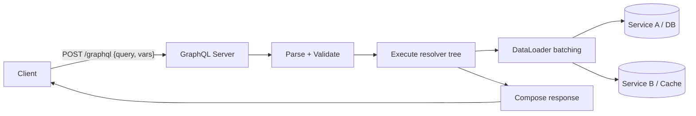
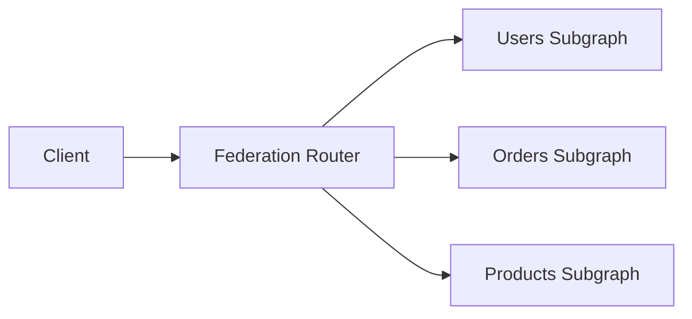

# GraphQL Fundamentals

> **TL;DR** — **GraphQL** is a query language for APIs (and a runtime to execute those queries). One endpoint, one strongly-typed schema, and clients pick exactly the fields they want. It eliminates over- and under-fetching, collapses N round trips into 1, and makes a complex backend feel like a unified graph. The cost: caching, performance analysis, and authorization shift from HTTP to your resolver layer.

---

## 1. Why GraphQL Exists

REST works great for resource-shaped CRUD. It struggles when a single screen needs data from many resources:

```
GET /users/42
GET /users/42/orders
GET /orders/o-1/items
GET /products/p-77
GET /products/p-77/reviews
...
```

Each call is a round trip. Mobile users on flaky networks feel every one. GraphQL says: *describe what you want once, get it back in one response*.

```graphql
query {
  user(id: 42) {
    name
    orders(last: 5) {
      id
      items { sku, quantity, product { name, price } }
    }
  }
}
```

Single round trip. Single response. No over-fetch.

---

## 2. The Three Operation Types

```graphql
# 1. Query  — read data (idempotent)
query GetUser($id: ID!) {
  user(id: $id) { id name }
}

# 2. Mutation — change data
mutation CreateOrder($input: OrderInput!) {
  createOrder(input: $input) {
    id status
  }
}

# 3. Subscription — server-pushed updates over WebSocket / SSE
subscription OnOrderUpdate($id: ID!) {
  orderUpdated(id: $id) { id status }
}
```

All three travel over the same `/graphql` HTTP endpoint (subscriptions need a long-lived transport).

---

## 3. The Schema — The Heart of GraphQL

```graphql
type User {
  id: ID!
  email: String!
  name: String
  orders(last: Int = 10): [Order!]!
}

type Order {
  id: ID!
  total: Money!
  items: [OrderItem!]!
  customer: User!
}

type OrderItem {
  sku: String!
  quantity: Int!
  product: Product!
}

type Product {
  id: ID!
  name: String!
  price: Money!
}

type Money {
  amount: Int!     # minor units
  currency: String!
}

type Query {
  user(id: ID!): User
  order(id: ID!): Order
}

type Mutation {
  createOrder(input: OrderInput!): Order!
}

input OrderInput {
  customerId: ID!
  items: [OrderItemInput!]!
}
```

Notes:
- `!` means **non-null**.
- `[Type!]!` is a non-null list of non-null items.
- **`input`** types are for arguments only; **`type`** for outputs.
- The schema is *introspectable* — clients (GraphiQL, codegen) can read it at runtime.

---

## 4. Resolvers — Where the Work Happens

For every field in the schema you write a **resolver** that knows how to produce its value:

```js
const resolvers = {
  Query: {
    user: (_, { id }, ctx) => ctx.dataSources.users.byId(id),
  },
  User: {
    orders: (user, { last }, ctx) =>
      ctx.dataSources.orders.forUser(user.id, last),
  },
  Order: {
    items: (order, _, ctx) => ctx.dataSources.items.forOrder(order.id),
    customer: (order, _, ctx) => ctx.dataSources.users.byId(order.customerId),
  },
};
```

A query plan walks the tree: resolve `user`, then for each `user` resolve `orders`, then for each `order` resolve `items`, etc.

### N+1 — the trap
A naive run resolves `items` once per order — leading to N database calls. **DataLoader** batches and dedupes loads within a request:

```js
const userLoader = new DataLoader(ids => db.users.byIds(ids));
ctx.dataSources.users.byId = (id) => userLoader.load(id);
```

You **must** use a DataLoader-like pattern in any non-trivial GraphQL server.

---

## 5. Query Execution, End-to-End



1. Client sends one POST with the query and variables.
2. Server **parses** it into an AST.
3. Server **validates** against the schema.
4. **Authorization** runs (per-field or per-operation).
5. Server **executes** resolvers (often in parallel, with DataLoader batching).
6. Result is shaped to match the query and returned.

---

## 6. Variables & Fragments

### Variables — never inline values
```graphql
query GetUser($id: ID!) {
  user(id: $id) { name }
}
```
Sent with `{"variables": {"id": "42"}}`. Enables caching, persisted queries, safer logging.

### Fragments — reusable pieces
```graphql
fragment UserCore on User {
  id
  email
  name
}

query {
  a: user(id: "1") { ...UserCore }
  b: user(id: "2") { ...UserCore }
}
```

### Aliases — same field twice
```graphql
query {
  first: user(id: "1") { name }
  second: user(id: "2") { name }
}
```

### Directives — modify execution
```graphql
query GetUser($withOrders: Boolean!) {
  user(id: "1") {
    name
    orders @include(if: $withOrders) { id }
  }
}
```
`@include`, `@skip`, custom `@auth(role: "admin")`, etc.

---

## 7. Errors & Partial Results

GraphQL is *not* "all or nothing." A response can carry **both** `data` and `errors`:

```json
{
  "data": {
    "user": {
      "name": "Ada",
      "orders": null
    }
  },
  "errors": [
    {
      "message": "Failed to load orders",
      "path": ["user", "orders"],
      "extensions": { "code": "ORDERS_UNAVAILABLE" }
    }
  ]
}
```

The HTTP status is **almost always 200** even on error (controversial; some servers return non-2xx for total failures). Clients must inspect `errors`.

Best practice: use `extensions.code` for stable machine-readable codes, just like REST error envelopes.

---

## 8. Mutations Done Right

- Return the **mutated object** so the client can update its cache without a second query.
- Wrap input in an `input` type so adding fields later is non-breaking:
  ```graphql
  mutation { createOrder(input: { ... }) { id status } }
  ```
- Define explicit payload types when you need to return multiple fields:
  ```graphql
  type CreateOrderPayload {
    order: Order
    clientMutationId: String
    userErrors: [UserError!]!
  }
  ```
- For **business errors** (validation, etc.) some teams prefer `userErrors` inside the payload over the top-level `errors` array — keeps "system errors" and "expected errors" separate.

---

## 9. Subscriptions

Real-time push.

- Transport: **WebSocket** (the `graphql-ws` protocol) or **SSE**.
- Use case: live notifications, status updates, "someone is typing".
- Same schema, same resolvers, different lifecycle.

```graphql
subscription { orderUpdated(id: "o-1") { id status } }
```

Server pushes a new `orderUpdated` payload whenever the resolver yields one (from a Kafka topic, Redis pub/sub, etc.).

Subscriptions are stateful — see [WebSockets](../02-networking/websockets.md) for the operational realities (gateway tier, pub/sub backplane, sticky-ish routing).

---

## 10. Caching — The Hard Part

HTTP-level caching breaks because all queries POST to `/graphql`. Strategies:

### Client-side normalized cache
**Apollo Client**, **Relay**, **urql** — keep entities by ID in a normalized in-memory store. A field updated by mutation X automatically refreshes queries that reference the same entity.

### Persisted queries + GET + CDN
- Hash queries at build time; client sends `{queryId}` instead of full text.
- Server-side, registered queries are allowlisted.
- Now you can use GET (with query in URL) → CDN can cache by URL.

### Per-resolver caching
Resolvers cache hot results in Redis with TTLs. Tricky because invalidation is your job.

### Edge caching with response hints
Apollo's `@cacheControl(maxAge: 60)` directive lets the server tell a CDN how long to cache each field. Caching unit becomes the merged TTL of every field in the response.

> *Rule of thumb*: assume nothing's cacheable until you make it cacheable. The default is "every query hits the resolvers."

---

## 11. Performance Hazards

| Hazard | Mitigation |
| --- | --- |
| N+1 from naive resolvers | DataLoader batching |
| Pathologically large queries | **Query cost analysis** (depth, complexity, breadth limits) |
| Schema fields whose data is expensive | Mark with `@cost` directive; reject over budget |
| Tail latency from slow resolvers | Time every resolver; alert on regressions |
| Unbounded list fields | Always require pagination args (`first`, `after`) |
| Allowing arbitrary queries from untrusted clients | Persisted queries / allowlist |
| Many small queries instead of one | Encourage clients to use fragments and combine |

A common rule: every query must come with **a complexity budget**. Above it → reject with `429` or `400`.

---

## 12. Authorization

Three layers:

1. **At the gateway** — authenticated user / API key on the HTTP request.
2. **At the operation** — only logged-in users can call `createOrder`.
3. **At the field** — `Order.customer` may be visible only to the order's owner or to admins.

Field-level authz is *the* hard part. Solutions:
- `@auth(role: "admin")` directives.
- Authorization context passed into every resolver.
- **rules** libraries (graphql-shield, rate-limit-directive).
- Compile-time checks via federation tooling.

If you skip field-level checks, a query can fan-out to fetch fields the user shouldn't see.

---

## 13. Versioning — Schema Evolution Instead of v1/v2

GraphQL doesn't usually use URL versioning. Instead:

- **Add** new fields freely — clients pick what they want.
- **Deprecate** old fields with `@deprecated(reason: "use newField instead")`.
- **Remove** only after analytics show no client uses it.
- Use **schema diffing** (graphql-inspector, Apollo Studio) in CI to detect breaking changes.

Done with discipline, you never need a "v2". Done sloppily, your schema becomes a swamp of zombie fields.

---

## 14. Federation — Schemas Across Services

For a large org, one big monolithic schema becomes a coordination nightmare. **Apollo Federation** (and similar: Hot Chocolate, GraphOS, GraphQL Mesh) lets each team own a *subgraph* with its own schema, and a **router** stitches them into one super-graph.



- A type like `User` is `@key(fields: "id")` and can be **extended** by other subgraphs.
- The router resolves cross-subgraph fields with a query plan.
- Each subgraph owns its data and deploys independently.

Federation is the way most large GraphQL deployments scale beyond one team.

---

## 15. GraphQL vs REST — Quick Comparison

| | GraphQL | REST |
| --- | --- | --- |
| Endpoint | `/graphql` | many resource URLs |
| Shape control | Client picks fields | Server decides |
| Round trips | Usually 1 | Often N |
| Schema | Mandatory, introspectable | Optional (OpenAPI) |
| HTTP caching | Hard | Easy |
| Tooling | GraphiQL, Apollo, codegen | curl, Postman, OpenAPI |
| Public-API expectations | Less universal | Universal |
| Mobile DX | Great | Variable |

See [REST vs GraphQL vs gRPC](../02-networking/api-styles.md) for the full comparison.

---

## 16. When to Choose GraphQL

✅ Mobile / web apps where each round trip costs.
✅ A BFF aggregating many internal services.
✅ Complex deeply nested data with many access patterns.
✅ A schema-first culture with the muscle to maintain it.
✅ Multiple consumers each wanting a different slice.

❌ Simple public CRUD API — REST is fine.
❌ Server-to-server high-throughput — gRPC.
❌ Caching-dominated workloads — REST with HTTP caching shines.
❌ Small team without bandwidth for federation / cost analysis / cache tuning.

---

## 17. A Real-World Stack

- **Server**: Apollo Server (Node), Hot Chocolate (.NET), Graphene (Python), gqlgen (Go), graphql-ruby (Ruby), graphql-java.
- **Client**: Apollo Client, Relay, urql, graphql-request.
- **Subscriptions**: graphql-ws over WebSocket; some teams use SSE.
- **Caching**: Apollo cache (in-memory), Redis behind resolvers, GraphCDN-style edge caches.
- **Tooling**: GraphiQL, Apollo Sandbox, GraphQL Codegen, Spectaql, graphql-inspector.
- **Schema registry**: Apollo Studio, Hive, Wundergraph.
- **Security**: GraphQL Armor / cost-limit / depth-limit libraries.

---

## 18. Mini End-to-End Example

### Schema
```graphql
type Query {
  me: User
  product(id: ID!): Product
}

type Mutation {
  addToCart(productId: ID!, quantity: Int!): Cart!
}

type User { id: ID! email: String! cart: Cart! }
type Cart { id: ID! items: [CartItem!]! total: Money! }
type CartItem { product: Product! quantity: Int! }
type Product { id: ID! name: String! price: Money! }
type Money { amount: Int! currency: String! }
```

### Query
```graphql
query Page {
  me {
    cart {
      items { quantity product { name price { amount currency } } }
      total { amount currency }
    }
  }
}
```

### Resolver shape (Apollo / Node)
```js
const resolvers = {
  Query: {
    me: (_, __, { auth }) => auth.user(),
  },
  User: {
    cart: (user, _, ctx) => ctx.dataSources.carts.forUser(user.id),
  },
  Cart: {
    items: (cart, _, ctx) => ctx.dataSources.items.forCart(cart.id),
    total: (cart, _, ctx) => ctx.dataSources.carts.totalOf(cart.id),
  },
  CartItem: {
    product: (item, _, ctx) => ctx.dataSources.products.byId(item.productId),
  },
  Mutation: {
    addToCart: (_, args, ctx) => ctx.dataSources.carts.addItem(args),
  },
};
```

One query, one response, batched data fetching.

---

## 19. Common Mistakes

- No DataLoader → N+1 → DB on fire.
- No cost / depth limits → DoS by query.
- Exposing DB tables as schema types directly.
- Field-level authz forgotten → data leaks.
- Returning huge unbounded lists.
- Letting any client send arbitrary queries to a public endpoint.
- Skipping persisted queries (loses caching opportunity).
- Reinventing pagination (use **Relay-style cursors** — `edges`, `pageInfo`, `endCursor`).
- Treating GraphQL as a replacement for backend logic; it's a transport, not a service.
- Federation without governance.

---

## 20. Cheat Card

```
GRAPHQL = one endpoint, typed schema, client picks fields, 1 round trip.

THREE OPS  Query (read), Mutation (write), Subscription (push).

ESSENTIALS
  Schema (types, queries, mutations)        Resolvers (fetch the data)
  Variables, fragments, aliases             Directives (@include, @auth)
  DataLoader to batch & dedupe (MANDATORY)  Persisted queries for caching

ERRORS     200 OK with both `data` and `errors` is normal.
            Stable codes go in extensions.code.

PERFORMANCE  cost analysis + depth limit + max breadth + budget per query.

CACHING    Apollo Client normalized cache  ·  persisted queries + GET + CDN
            Per-resolver Redis with TTL    ·  @cacheControl directives

AUTH       op-level + field-level. Don't forget field-level.

EVOLUTION  add fields freely, @deprecated old ones, remove after analytics.
            Apollo Federation for many teams.

USE FOR    mobile BFFs, web SPAs, aggregated screens.
AVOID FOR  simple public CRUD (REST), high-throughput internal (gRPC).
```

---

## 21. Resources

### Official
- **GraphQL spec**: <https://spec.graphql.org/>
- **graphql.org**: <https://graphql.org/learn/>
- **Apollo Docs**: <https://www.apollographql.com/docs/>
- **Relay spec (pagination)**: <https://relay.dev/graphql/connections.htm>

### Books
- *Production-Ready GraphQL* — Marc-André Giroux. The standard.
- *Learning GraphQL* — Eve Porcello, Alex Banks (O'Reilly).
- *The Road to GraphQL* — Robin Wieruch.

### Articles
- "Principled GraphQL" — Apollo: <https://principledgraphql.com/>
- "GraphQL at Netflix" — Netflix Tech Blog (Federation case study).
- "GraphQL at GitHub" — engineering blog post.
- "Why GraphQL?" — Lee Byron: <https://medium.com/@leeb/why-graphql-7c5b1e5e1d6>

### Videos
- ByteByteGo: "What is GraphQL?" — <https://www.youtube.com/@ByteByteGo>
- "GraphQL Conf" talks on YouTube.
- Hussein Nasser GraphQL deep dives — <https://www.youtube.com/@hnasr>

### Tools
- **GraphiQL** — in-browser query IDE.
- **Apollo Sandbox / Studio** — schema explorer + metrics.
- **GraphQL Code Generator** — TS/Java/Swift client codegen.
- **graphql-inspector** — schema diffing.
- **GraphQL Armor / cost-analysis / depth-limit** — security plugins.
- **Hive**, **Apollo GraphOS**, **Wundergraph** — schema registries.

### Adjacent reading
- [REST vs GraphQL vs gRPC](../02-networking/api-styles.md)
- [WebSockets](../02-networking/websockets.md) (subscriptions)
- [BFF — Backend for Frontend](./bff.md)
- [Rate Limiting](./rate-limiting.md)

---

*Previous:* [← REST API Design Principles](./rest-design.md)  |  *Next:* [API Versioning Strategies →](./versioning.md)
