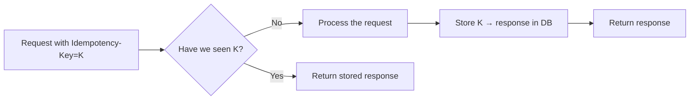

# Idempotency

> **TL;DR** — An operation is **idempotent** when applying it more than once has the same effect as applying it once. Networks are unreliable: clients retry, packets drop, timeouts lie. Without idempotency, a retried payment double-charges and a retried email gets sent twice. Idempotency is achieved by (a) using HTTP methods whose semantics are already idempotent, or (b) attaching an **idempotency key** to non-idempotent operations and remembering the result keyed by that ID. Every mutating API call that can be retried needs this.

---

## 1. Why Idempotency Matters

A simple scenario:

```
Client → POST /payments {amount: 4200}
Server processes, charges card $42.00.
Server sends 200 OK.
…response is lost in the network.
Client retries → POST /payments {amount: 4200}
Server charges card $42.00 again. 🔥
```

That's a double charge — a near-universal source of customer-support nightmares. The fix is idempotency.

### The unreliable middle
There are three failure modes around any call:
1. Request never arrives → server didn't do the work → safe to retry.
2. Server processed, **response was lost** → repeating the request will repeat the work.
3. Server is *currently processing*, client retries before first finishes → concurrent duplicates.

The client cannot distinguish between these. Idempotency makes the distinction unnecessary.

---

## 2. Definitions

- **Safe** — no observable state change (GET, HEAD).
- **Idempotent** — same result after N repeats as after 1. (GET, PUT, DELETE.)
- **Non-idempotent** — repeating may change behavior (POST, generic actions).

HTTP method idempotency by spec:
| Method | Idempotent? |
| --- | --- |
| GET | ✅ |
| HEAD | ✅ |
| PUT | ✅ |
| DELETE | ✅ |
| POST | ❌ |
| PATCH | depends |

**Spec idempotency is the contract**, not the implementation. A `DELETE` that returns 404 on the second call is still idempotent — the resulting *state* is the same (resource is gone).

---

## 3. Two Sources of Idempotency

### 3.1 Naturally idempotent operations
Some operations are idempotent by definition:
- `DELETE /users/42` — deleting twice is the same as once.
- `PUT /users/42 { ... }` — second PUT just overwrites with the same content.
- `POST /invoices/inv_1/mark-paid` — already-paid + mark-paid is a no-op.

Design your APIs so this category is as large as possible. Prefer:
- **`PUT` over `POST`** when the client can provide the resource ID.
- **State transitions that are idempotent** (`mark-paid`, `cancel`) over generic create-or-do.

### 3.2 Idempotency keys
When the operation isn't naturally idempotent (most `POST`s — creating something with a server-generated ID, charging a card, sending an SMS), the client provides an **idempotency key**:

```
POST /payments
Idempotency-Key: 6a7c2d-3e8f4-9bd1-acef-83df21
Content-Type: application/json

{ "amount": 4200, "currency": "USD", "source": "tok_visa" }
```

The server **remembers** the result for this key. If the same key arrives again, the server returns the cached response and skips the work.

This single header has prevented more outages and customer-support tickets than nearly any other API design choice.

---

## 4. Idempotency Keys — How They Work



Three states for a key:
1. **Unseen** — process normally.
2. **In flight** — another request with the same key is still processing → block / 409 Conflict / wait.
3. **Completed** — return the stored response.

### Storage
Two common backends:
- **DB row** with `UPDATE ... RETURNING` or `INSERT ... ON CONFLICT`.
- **Redis** with `SETNX` and TTL.

A typical schema:
```sql
CREATE TABLE idempotency_records (
  key            TEXT PRIMARY KEY,
  status         TEXT NOT NULL,           -- 'pending' | 'completed'
  request_hash   TEXT NOT NULL,           -- to detect "same key, different body"
  response_code  INT,
  response_body  JSONB,
  created_at     TIMESTAMPTZ NOT NULL,
  expires_at     TIMESTAMPTZ NOT NULL     -- typical TTL: 24h
);
```

### Concurrency
The first request inserts a `pending` row in a transaction. Concurrent retries see `pending` and either wait or return a "still processing" response. When work finishes, the row is updated to `completed` with the response.

### Tying the key to the request
Two requests with the **same key but different bodies** is a client bug. Hash the request body (excluding noise like the timestamp), store the hash, and return `409 Conflict` if a future request reuses the key with a different hash:

```
HTTP/1.1 409 Conflict
{
  "error": {
    "code": "IDEMPOTENCY_KEY_REUSED_DIFFERENT_BODY",
    "message": "Idempotency-Key has already been used with a different request body."
  }
}
```

### Key scope
Keys should be **scoped per account** (so two customers can't collide) and ideally **per endpoint**. A key for `/payments` doesn't have to be unique vs a key for `/refunds`.

### Key lifetime
- 24 h is a common default (Stripe).
- After expiry, the same key can be reused.
- Clients shouldn't rely on long memory — they generate fresh keys per logical operation.

---

## 5. What's a Good Idempotency Key?

- A **UUID v4** per logical operation. Most common.
- A **client-generated request ID** tied to the action (e.g., the order ID in the client's local DB).
- Never reuse keys across logically-different actions.
- Don't include sensitive data in the key.

Generate **on the client**, *before* the first send. If you generate after a response, you lose the retry safety.

```js
const key = crypto.randomUUID();
async function payOrder(order) {
  for (let attempt = 0; attempt < 5; attempt++) {
    try {
      return await fetch("/payments", {
        method: "POST",
        headers: { "Idempotency-Key": key, "Content-Type": "application/json" },
        body: JSON.stringify({ orderId: order.id, amount: order.total }),
      });
    } catch (e) {
      await sleep(backoff(attempt));     // retry with the SAME key
    }
  }
}
```

The same `key` survives every retry; only after the call completes (success or terminal error) do you generate a new one.

---

## 6. Idempotency in Distributed Systems

The same ideas apply, not just at the HTTP boundary:

### Message queues
Consumers see the same message more than once (Kafka, SQS, RabbitMQ are all "at least once"). The consumer must be idempotent — typically by deduping on a **message ID** stored in a side table:

```sql
INSERT INTO processed_messages (id) VALUES ($1)
ON CONFLICT DO NOTHING
RETURNING id;
-- if no row returned, this is a duplicate; skip.
```

### Webhooks
Same as above. The webhook sender retries; the receiver must dedupe by `event_id`. See [Webhooks](../02-networking/webhooks.md).

### Background jobs
Schedulers retry failed jobs. A job that creates an invoice must check whether the invoice already exists for this period before creating it.

### Sagas / sequential workflows
Each step records its completion so a re-run can skip already-done steps and resume from the failure point.

---

## 7. Naturally Idempotent Designs

The cleanest fix is often to **not need an idempotency key** at all. Patterns:

### Client-supplied IDs
```
PUT /orders/o_abc123
{ ... }
```
The client picks `o_abc123` (a UUID); the server `UPSERT`s. Retries are inherently safe.

### Conditional writes
```
POST /payments
If-None-Match: *
```
Server only creates if not already created. Returns 412 Precondition Failed on duplicate.

### State transitions
```
POST /orders/o_1/cancel
```
If the order is already cancelled, return 200 (or a documented no-op result). Idempotent by construction.

### Compare-and-swap
```
PATCH /users/42
If-Match: "v17"
```
Update only if the version matches. Lost updates are impossible; second update with the old version is rejected.

---

## 8. Idempotency vs Deduplication vs Exactly-Once

These three terms are often muddled:

- **Idempotency** — repeating an op has the same effect. Property of the *operation*.
- **Deduplication** — recognizing a repeat and ignoring it. Property of the *consumer*.
- **Exactly-once** — every op happens exactly one time. End-to-end *guarantee*.

Most distributed systems give you "at-least-once delivery" + "idempotent processing" → effectively "exactly-once **effect**." True exactly-once is rarely achievable in practice; the combination above is what real systems implement.

---

## 9. Pitfalls

### Idempotency keys done wrong
- Server *processes the request twice* but returns the cached response → bug, charged twice but client thinks it was deduped.
- Keys with no TTL → table grows forever.
- Keys global instead of per-account → tenants collide.
- Race: two concurrent requests with the same key both pass the "is it cached?" check → both process. Fix: insert `pending` row atomically; second one fails the insert and waits.
- Idempotency over response **status code only** ignoring body → second response can disagree.

### Naturally-idempotent endpoints that aren't
- `POST /increment-counter` is not idempotent. Use `PATCH /counter { value: 7 }` or `PUT /counter/7`.
- `POST /retry-job` that creates a new job each call.
- `DELETE` that returns 500 the second time instead of treating "already gone" as success.

### Retries that defeat idempotency
- Generating a new key on each retry.
- Retrying inside a try/catch but not on the outer business operation.
- Retries with mutable bodies (different amounts each attempt).

### Confusing idempotency with safety
- A retried `DELETE` is idempotent — but if the resource was recreated between attempts, you might delete the new one. Use conditional deletes (`If-Match`).

---

## 10. Response Status Codes

When returning a cached response on idempotency-key replay, you have choices:

- **Return the original status code & body verbatim.** Most common. Optionally include a header:
  ```
  Idempotency-Replayed: true
  ```
- **Return 200 with a "duplicate" indicator.** Less common; can confuse clients.
- **Return 409** when key matches a *different* body.

Document your choice. Clients shouldn't have to guess.

---

## 11. Worked Example: A Payment Endpoint

```
POST /v1/payments
Idempotency-Key: 6a7c2d-3e8f4-9bd1-acef-83df21
Authorization: Bearer ...
Content-Type: application/json

{
  "amount": 4200,
  "currency": "USD",
  "source": "tok_visa",
  "order_id": "ord_abc"
}
```

Server flow:
```
1. BEGIN TX
2. INSERT INTO idempotency_records (key, status='pending', request_hash=...)
   ON CONFLICT DO NOTHING.
3. If insert created a row → process payment; persist response;
   UPDATE row to status='completed' with response. COMMIT.
4. If insert hit conflict → SELECT existing row.
     If status='completed' → return stored response.
     If status='pending'   → return 409 or 425 Too Early with Retry-After.
5. Set response header Idempotency-Replayed: true on replays.
```

This pattern is exactly what Stripe, Shopify, Square, and most payment APIs do.

---

## 12. Implementation Checklist

- [ ] Decide which endpoints accept `Idempotency-Key`. Mark them in OpenAPI.
- [ ] Decide key TTL (24 h is fine).
- [ ] Decide storage (Postgres table or Redis).
- [ ] Hash request body; store the hash to detect key reuse with different body.
- [ ] Acquire `pending` atomically (DB unique constraint or Redis `SETNX`).
- [ ] On replay, return the stored response (with `Idempotency-Replayed: true`).
- [ ] On conflict (same key, different body), return `409`.
- [ ] On in-flight (`pending`) replay, decide policy: short wait, or `409`, or `425 Too Early`.
- [ ] Garbage-collect expired keys.
- [ ] Document the behavior; show examples.

---

## 13. Cheat Card

```
IDEMPOTENT = same effect after N tries as after 1.

NATURALLY        GET, HEAD, PUT, DELETE.   POST / PATCH usually NOT.
KEY-BASED        Client sends `Idempotency-Key: <uuid>` on POST.
                  Server stores result keyed by that header.

STORAGE          Postgres row or Redis SETNX with TTL.
                  Hash request body to catch key-with-different-body.

CONCURRENCY      Insert `pending` atomically; concurrent retry waits or 409.
LIFECYCLE        TTL ~24h.   GC expired rows.

REPLAY           Return original response + `Idempotency-Replayed: true`.

GOLDEN RULES
  Generate the key BEFORE the first attempt.
  Reuse the same key across retries.
  Never reuse a key for a different logical operation.
  Pair with retry + exponential backoff in the client.

DISTRIBUTED PARALLELS
  Kafka / SQS / RabbitMQ → consumer dedupes by message ID.
  Webhooks → receiver dedupes by event_id.
  Jobs → record completion of each step.
```

---

## 14. Resources

### Articles
- "Designing robust and predictable APIs with idempotency" — Stripe blog: <https://stripe.com/blog/idempotency>
- "Implementing Idempotency Keys" — Brandur Leach: <https://brandur.org/idempotency-keys>
- "How to Build Idempotent APIs" — Shopify engineering.
- "Idempotency: A Simple Concept" — AWS Architecture Blog.

### Specs
- **IETF draft: The HTTP Idempotency-Key Header Field** — emerging standard: <https://datatracker.ietf.org/doc/draft-ietf-httpapi-idempotency-key-header/>
- **RFC 9110** — HTTP semantics (idempotent methods, safe methods): <https://datatracker.ietf.org/doc/html/rfc9110>

### Books
- *Designing Data-Intensive Applications* — Kleppmann (Ch. 11: stream processing & dedup).
- *API Design Patterns* — JJ Geewax (idempotency chapter).

### Videos
- ByteByteGo: "Idempotency in API Design" — <https://www.youtube.com/@ByteByteGo>
- Hussein Nasser idempotency series — <https://www.youtube.com/@hnasr>

### Real-world examples to study
- **Stripe** Idempotency-Key headers in every mutating endpoint.
- **Adyen**, **Square**, **Braintree** — same pattern, slight variations.
- **AWS SDK** — built-in client-side retry with request-token idempotency on many APIs.

### Adjacent reading
- [REST API Design Principles](./rest-design.md)
- [Webhooks](../02-networking/webhooks.md)
- [Retry, Timeout, Exponential Backoff →](../11-reliability/retry-timeout-backoff.md)
- [Delivery Guarantees (At-Most/At-Least/Exactly-Once)](../07-messaging/delivery-guarantees.md)
- [Idempotent Operations & Retries](../11-reliability/idempotency-retries.md)

---

*Previous:* [← API Pagination Techniques](./pagination.md)  |  *Next:* [Rate Limiting →](./rate-limiting.md)
