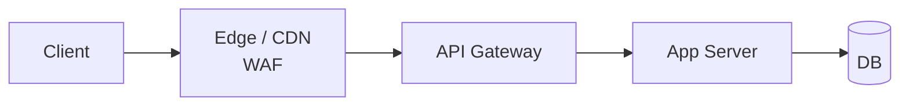

# Rate Limiting (Token Bucket, Leaky Bucket, Fixed/Sliding Window)

> **TL;DR** — **Rate limiting** caps how many requests a client can make in a time window. It's how you protect a service from abuse, runaway clients, and accidental traffic spikes. Five canonical algorithms: **Fixed Window**, **Sliding Window Log**, **Sliding Window Counter**, **Token Bucket** (the most popular), and **Leaky Bucket**. Each trades accuracy, memory, and ease of implementation differently. Where you enforce (edge, gateway, app, DB) and what you key on (IP, user, API key, endpoint) matter more than the exact algorithm.

---

## 1. Why Rate Limit

Every API needs rate limiting. Without it:
- **Abuse** — scrapers, credential-stuffing bots, malicious traffic.
- **Runaway clients** — a buggy loop hammers your API a million times a minute.
- **Noisy neighbors** — one customer's pathological usage degrades everyone else.
- **DoS / DDoS** — large-scale traffic overload.
- **Cost** — surprise cloud bills.

Rate limiting is also a **product feature**: API tier limits ("100 req/s on Pro, 1000 on Enterprise") are a way to monetize.

---

## 2. What to Limit

You can rate-limit on many keys; usually you combine several:

| Key | Use case |
| --- | --- |
| **IP address** | Anonymous abuse, signup forms |
| **User ID** | Authenticated abuse, fair-use |
| **API key / org / tenant** | B2B SaaS quotas |
| **Endpoint** | Expensive endpoints get tighter caps |
| **Cost-weighted** | Each request costs N "units"; budget per minute |
| **Concurrency** | Max in-flight requests per client |

Granularity examples:
- `100 req/min per IP for /login` (brute force defense)
- `10k req/min per API key globally` (tier cap)
- `200 req/sec per user for /search` (fair-use)
- `cost <= 1000 units/min` (GraphQL query complexity)

Combine them: a single request can be checked against multiple buckets and rejected if *any* fails.

---

## 3. The Standard Response

When a client exceeds the limit:

```
HTTP/1.1 429 Too Many Requests
Retry-After: 30
RateLimit-Limit: 1000
RateLimit-Remaining: 0
RateLimit-Reset: 1716072600
Content-Type: application/json

{
  "error": {
    "code": "RATE_LIMIT_EXCEEDED",
    "message": "Try again in 30 seconds."
  }
}
```

- `429 Too Many Requests` — the canonical status.
- `Retry-After` — seconds (or HTTP date) until the client may retry.
- `RateLimit-*` headers (IETF draft) — programmatic info on the bucket.

On successful requests, also expose `RateLimit-Limit` / `RateLimit-Remaining` so clients can self-throttle.

---

## 4. The Five Canonical Algorithms

### 4.1 Fixed Window Counter
Bucket counts requests in a wall-clock window (e.g., "this minute"). Reset at boundary.

```
window: 1 min, limit: 100
[12:00:00 - 12:00:59]   counter: 73     ← allow
[12:01:00 - 12:01:59]   counter: reset to 0
```

**Pros**: trivial, tiny memory (one counter per key per window).
**Cons**: **boundary burst**. A client can fire 100 requests at 12:00:59 and 100 more at 12:01:00 — 200 requests in 2 seconds, all "within limit."

### 4.2 Sliding Window Log
Store the **timestamps** of every recent request. Drop those older than the window. Count what's left.

```
limit: 100 / 60 s
records: [12:00:01, 12:00:05, 12:00:09, ...]
on new request: drop entries older than now-60s, count, compare to 100.
```

**Pros**: exact.
**Cons**: memory grows with request rate; expensive at scale.

### 4.3 Sliding Window Counter
A compromise. Keep two fixed-window counters (current and previous), then **weight** them by how far into the current window we are.

```
limit: 100 / 60 s
current = 30 reqs in [12:01:00 - 12:01:59]
previous = 80 reqs in [12:00:00 - 12:00:59]

now = 12:01:18 → 18/60 into current window
estimated_count = current + previous × (1 − 18/60)
                = 30 + 80 × 0.7
                = 86
```

**Pros**: cheap memory, no boundary burst, close to exact in practice.
**Cons**: approximate (assumes uniform distribution in previous window).

### 4.4 Token Bucket
A bucket holds up to `B` tokens. Every request consumes 1 token. The bucket refills at `R` tokens per second.

```
B = 100, R = 10 tokens/sec
bucket starts full = 100
client bursts 100 requests → bucket=0, all allowed.
1 sec later, bucket = 10. Client can fire 10 more.
```

**Pros**:
- Allows **bursts** up to `B`, then enforces average rate `R`.
- Trivial to implement: store `(tokens, last_refill_at)` per key.
- The most common algorithm in real systems (AWS API GW, Stripe, Cloud rate limiters, NGINX `limit_req`).

**Cons**: bursts permitted up to the bucket size; choose `B` carefully.

```python
def allow(key):
  bucket = redis.hgetall(key) or {"tokens": B, "last": now()}
  elapsed = now() - bucket["last"]
  bucket["tokens"] = min(B, bucket["tokens"] + elapsed * R)
  bucket["last"] = now()
  if bucket["tokens"] >= 1:
      bucket["tokens"] -= 1
      redis.hset(key, bucket)
      return True
  redis.hset(key, bucket)
  return False
```

### 4.5 Leaky Bucket
Think of a bucket with a hole. Requests arrive and queue. They "leak" out at a fixed rate. If the bucket fills, new requests are dropped.

```
capacity: 100 in-flight
leak rate: 10 / sec
incoming requests queue; processor pulls them at fixed rate.
```

**Pros**: smooths bursts into a constant outflow.
**Cons**: introduces *latency* (queueing). Used more for traffic *shaping* (network egress, write throughput control) than for HTTP rate limiting.

---

## 5. Comparison at a Glance

| Algorithm | Memory | Allows bursts? | Boundary burst bug? | Accuracy | Typical use |
| --- | --- | --- | --- | --- | --- |
| Fixed window | ★ | Yes (within window) | ⚠️ Yes | Coarse | Simple counters |
| Sliding log | ★★★★ | Configurable | No | Exact | Small-scale, regulatory |
| Sliding counter | ★★ | Smooth | No | ~99% | High-scale APIs |
| **Token bucket** | ★ | Yes (size = B) | No | High | **Default for HTTP APIs** |
| Leaky bucket | ★ | No (smooths) | No | High | Traffic shaping, egress |

For most APIs: start with **token bucket**.

---

## 6. Where to Enforce



Limit at the **earliest possible layer** for the cheapest defense:

- **CDN / edge** (Cloudflare, Fastly, CloudFront, Akamai) — first defense against L7 floods. Coarse keys (IP, ASN, country).
- **WAF** — bot-style detection, JS challenges.
- **API gateway** (Kong, Envoy, AWS API GW, Apigee) — global limits per API key.
- **App server** — fine-grained per-user / per-endpoint logic.
- **Internal services** — protect downstream DBs from runaway upstream.

Layered defense is normal. Different layers see different keys (edge sees IP; app sees user ID).

---

## 7. Distributed Rate Limiting

A single API server with a local in-memory counter is easy. **Multiple servers** sharing a limit need a coordinated counter.

### Centralized Redis (most common)
- All instances increment/check the same Redis key.
- One round trip per request adds ~0.5–1 ms.
- Use atomic operations (`INCR`, `EXPIRE`, Lua scripts) to avoid races.
- Redis Cluster shards by key; rate-limit keys distribute naturally.

### Sliding-window in Redis (Lua)
```lua
-- KEYS[1] = bucket key, ARGV: now, window, limit
local now = tonumber(ARGV[1])
redis.call('ZREMRANGEBYSCORE', KEYS[1], 0, now - ARGV[2])
local count = redis.call('ZCARD', KEYS[1])
if count < tonumber(ARGV[3]) then
  redis.call('ZADD', KEYS[1], now, now)
  redis.call('EXPIRE', KEYS[1], ARGV[2])
  return 1   -- allow
end
return 0     -- deny
```

### Sliding-counter in Redis
- Two keys per bucket (`current`, `prev`) with TTLs.
- Cheap, no Lua needed.

### Local-cache + periodic-sync (eventual consistency)
- Each instance keeps a local counter, syncs to Redis every N ms.
- Trades a bit of accuracy for huge throughput.
- Used by very-high-QPS gateways (Envoy with `descriptors`).

### Distributed token bucket via "request quota"
Each instance fetches a chunk of tokens from a central authority and serves locally until its chunk runs out. Reduces hot keys.

---

## 8. Hard vs Soft Limits

- **Hard**: requests above limit are rejected (`429`).
- **Soft**: requests above limit are *throttled* (delayed in a queue) instead of rejected. Smoother UX but adds latency. Like a leaky bucket.

Most public APIs use hard limits at the API edge and soft limits internally (queue depth, concurrency caps).

---

## 9. Cost-Weighted Limiting

Not all requests are equal. A `GET /users` is cheap; a `POST /reports` is expensive.

Assign **costs**:
- Cheap endpoints: 1 unit.
- Heavy endpoints: 10 units.
- GraphQL: cost = computed from query depth × breadth × resolvers.

Bucket is in *units*, not requests. Common at GitHub (their REST and GraphQL APIs use a points system), Shopify, and most GraphQL services.

---

## 10. Per-Tenant Fairness

If you have one big bucket *globally*, a single customer can starve everyone else.

Two layers:
- **Per-tenant** limits — each tenant gets its own bucket sized to their plan.
- **Global safety net** — protect the whole service from any one tenant going crazy.

For SaaS: every plan has a documented rate-limit table:
```
Free:   60 req/min,   1 req/sec burst
Pro:    1000 req/min, 50 req/sec burst
Enterprise: custom
```

---

## 11. Burst Handling

Real traffic is bursty. A strict "100 req/min" cap means a client must space requests at one per 600 ms. That's terrible UX for many use cases.

Token bucket fixes this: `B = 100, R = 100/60 ≈ 1.66/sec`. The client can burst 100 in a second when needed, then settles into the average. The user-perceived feel is "fast when I'm working, paced when I'm hammering."

Tune `B` (burst) separately from `R` (sustained). They're different knobs.

---

## 12. Common Failure Modes

- **Boundary burst** (fixed window) — letting 2× the limit slip through across the boundary.
- **Hot key in Redis** — every request from a popular tenant hammers one Redis shard. Mitigate with local-cache + sync.
- **Race conditions** without atomic ops — two concurrent requests both pass the check.
- **Clock skew** between servers — fix by using Redis time or central clock.
- **Limiting only on IP** — bots rotate IPs and a single corporate NAT shares one IP across thousands of users.
- **Not signaling the limit to clients** — they can't self-throttle.
- **`Retry-After` ignored or used wrong** — should be seconds.
- **Limiting too aggressively** — legitimate users get blocked; product suffers.
- **No exemptions for internal IPs / health checks** — your own monitor floods become 429s.
- **Single-region limiter** for a multi-region service — limits don't compose correctly.

---

## 13. Telling Clients How To Behave

A good rate-limit response and headers make clients *cooperate*:

```
RateLimit-Limit:     1000        ← cap for the window
RateLimit-Remaining: 42          ← how many left
RateLimit-Reset:     1716072600  ← UNIX timestamp when window resets
Retry-After:         30          ← only on 429; seconds (or HTTP date)
```

Modern clients (Stripe SDK, AWS SDK, etc.) automatically respect these — sleeping for `Retry-After` and resuming.

For very abusive clients: stop responding at all (drop the connection) instead of issuing 429s — 429s themselves cost CPU.

---

## 14. Operational Realities

- **Always exclude health checks and your own monitors** from limits.
- **Have a kill switch** to disable limits during incidents (e.g., post-outage stampede where every client is retrying — limits would amplify pain).
- **Measure**: track 429 rate by tenant. A flat-line at the cap = either abuse or your plan is too tight.
- **Alert** on sudden 429 spikes.
- **Log** rate-limit decisions for audits (especially for fraud / abuse cases).
- **Test** the limiter under load before relying on it in production.
- **Coordinate** with autoscaling: when traffic legitimately doubles, scale rather than throttle.

---

## 15. Cheat Card

```
WHY                Protect from abuse, runaway clients, noisy neighbors, DoS.

ALGORITHMS
  Fixed Window     simple, boundary-burst bug.        burst safety: bad
  Sliding Log      exact, memory-heavy.               accuracy: best
  Sliding Counter  cheap + smooth.                    accuracy: ~99%
  TOKEN BUCKET     bursts up to B, sustained R.       DEFAULT for HTTP
  Leaky Bucket     smooths to constant rate.          traffic shaping

KEYS               IP, user, API key, endpoint, cost-weighted, concurrency

RESPONSE           429 + Retry-After + RateLimit-{Limit,Remaining,Reset}

ENFORCEMENT        Edge / WAF / Gateway / App, layered.
DISTRIBUTED        Centralized Redis with atomic ops, or local+sync.

PRINCIPLES
  Burst-friendly via token bucket.
  Per-tenant + global safety net.
  Document limits in docs and headers.
  Don't 429 your own health checks.
  Kill switch for incidents.
```

---

## 16. Resources

### Specs / drafts
- **IETF draft, RateLimit headers**: <https://datatracker.ietf.org/doc/draft-ietf-httpapi-ratelimit-headers/>
- **RFC 6585** — Additional HTTP Status Codes (defines 429): <https://datatracker.ietf.org/doc/html/rfc6585>
- **RFC 7231 / 9110** — Retry-After header.

### Articles
- "Scaling your API with rate limiters" — Stripe engineering: <https://stripe.com/blog/rate-limiters>
- "How we built rate limiting capable of scaling to millions" — Figma / Discord / Cloudflare blogs.
- "Rate limiting strategies and techniques" — Cloudflare Learning Center.
- "The Token Bucket algorithm explained" — many sources; Wikipedia is fine.
- "GitHub GraphQL API rate limits" — cost-weighted: <https://docs.github.com/en/graphql/overview/resource-limitations>

### Books
- *Designing Data-Intensive Applications* — Kleppmann (admission control, backpressure).
- *Site Reliability Engineering* — Google (handling overload chapter).

### Videos
- ByteByteGo: "Rate Limiting Algorithms": <https://www.youtube.com/@ByteByteGo>
- Hussein Nasser rate-limiting deep dives: <https://www.youtube.com/@hnasr>
- "Rate Limiting at Scale" — various conference talks.

### Tools / implementations
- **nginx `limit_req`** (leaky bucket) and `limit_conn` (concurrency).
- **Envoy rate-limit filter** + **ratelimit service**: <https://github.com/envoyproxy/ratelimit>
- **Redis Cell** module: <https://github.com/brandur/redis-cell>
- **Kong rate-limiting plugin**.
- **AWS API Gateway usage plans**.
- **Cloudflare Rate Limiting** rules.
- **GCP Cloud Armor** rate-based rules.

### Libraries
- **golang/x/time/rate** — Go (token bucket).
- **bottleneck** — Node.
- **token-bucket** — Python.
- **resilience4j-ratelimiter** — Java.

### Adjacent reading
- [API Gateway →](./api-gateway.md)
- [Service Mesh →](./service-mesh.md)
- [Circuit Breaker Pattern →](../11-reliability/circuit-breaker.md)
- [Backpressure →](../10-scalability/backpressure.md)
- [DDoS Protection & WAF →](../12-security/ddos-waf.md)

---

*Previous:* [← Idempotency](./idempotency.md)  |  *Next:* [API Gateway →](./api-gateway.md)
