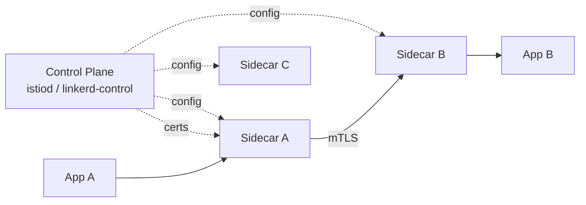

# Service Mesh (Istio, Linkerd)

> **TL;DR** — A **service mesh** is the **east-west** (service-to-service) networking layer for a fleet of microservices. It runs a small proxy ("sidecar") next to each service that intercepts every outbound and inbound call, transparently providing **mTLS, retries, timeouts, traffic shifting, load balancing, observability, and policy enforcement** — without changes to application code. Istio, Linkerd, Consul Connect, Cilium Service Mesh, and AWS App Mesh are the most-used implementations. The trade-off: you get powerful networking primitives in exchange for serious operational complexity. You probably don't need one before you have ~20 services.

---

## 1. The Problem It Solves

In a microservices system, every service needs to:
- Authenticate every call (mTLS or tokens).
- Retry transient failures with backoff.
- Time out slow downstreams.
- Load-balance across multiple replicas.
- Emit metrics and traces.
- Apply circuit breakers.
- Handle deployments without breaking in-flight traffic.

Implementing all of that **in each service** — in every language, in every team — is endless duplication and inevitable drift. A service mesh moves these concerns out of the application and into a uniform infrastructure layer.

---

## 2. The Sidecar Architecture

```
   ┌──────────────────────┐         ┌──────────────────────┐
   │ ┌───────┐  ┌───────┐ │         │ ┌───────┐  ┌───────┐ │
   │ │  App  │──│Sidecar│─┼────mTLS─┼─│Sidecar│──│  App  │ │
   │ │   A   │  │ (Envoy)│ │         │ │ (Envoy)│  │   B   │ │
   │ └───────┘  └───────┘ │         │ └───────┘  └───────┘ │
   │   Pod A             │         │   Pod B             │
   └──────────────────────┘         └──────────────────────┘
```

- Each pod runs **two containers**: your app, and a sidecar proxy (commonly Envoy or a Linkerd micro-proxy).
- The sidecar **intercepts all traffic** into and out of the app (via iptables/eBPF redirects).
- The app code talks plain HTTP/gRPC to `localhost`; the sidecar does the heavy lifting.

### Data plane vs control plane
- **Data plane**: the sidecars themselves, handling actual traffic.
- **Control plane**: the central brain that pushes config to sidecars (Istio's `istiod`, Linkerd's controller). Defines policies, certs, routing rules.



---

## 3. What a Service Mesh Gives You

| Capability | How |
| --- | --- |
| **mTLS everywhere** | Automatic cert issuance + rotation. Identity per workload. |
| **Authentication / Authorization** | "Service A may call Service B"; per-method authz policies. |
| **Retries / timeouts** | Declarative per route. |
| **Circuit breaking** | Per upstream. |
| **Load balancing** | Round-robin, least-request, ring-hash, EWMA. |
| **Traffic shifting** | 1% to v2 for canary, 50/50 for blue-green. |
| **Fault injection** | Inject delays/errors for resilience testing. |
| **Observability** | Metrics, distributed tracing, access logs — uniform across services. |
| **Health checks** | Active and passive. |
| **Locality-aware routing** | Prefer same-zone replicas for latency. |
| **Multi-cluster / multi-region** | Stretch the mesh across clusters. |

All without changes in service code. The sidecar absorbs it.

---

## 4. mTLS — The Single Biggest Win

Without a mesh: each service implements TLS, manages certs, rotates keys, validates peers. Most don't, so internal traffic ends up plaintext.

With a mesh:
- Each workload gets a short-lived (typically 24 h) X.509 cert signed by an internal CA.
- The sidecar performs mTLS automatically — *both* sides verify.
- Identity is `<workload> in <namespace> in <cluster>`.
- Rotation is automatic and invisible.

That's how zero-trust internal networks become real. Even if an attacker pwns one pod, they can't move laterally without a valid workload identity.

---

## 5. Traffic Management

Mesh resources (Istio CRDs as example):

### VirtualService — routing rules
```yaml
apiVersion: networking.istio.io/v1
kind: VirtualService
metadata: { name: orders-routing }
spec:
  hosts: [orders]
  http:
    - match: [ { headers: { canary: { exact: "true" } } } ]
      route: [ { destination: { host: orders, subset: v2 } } ]
    - route:
        - destination: { host: orders, subset: v1 }
          weight: 95
        - destination: { host: orders, subset: v2 }
          weight: 5
```

That alone gives you canary deploys: 95% to v1, 5% to v2, plus a header-based "force canary".

### DestinationRule — upstream policies
```yaml
apiVersion: networking.istio.io/v1
kind: DestinationRule
metadata: { name: orders-destination }
spec:
  host: orders
  trafficPolicy:
    connectionPool:
      tcp:  { maxConnections: 100 }
      http: { http2MaxRequests: 1000, maxRetries: 3 }
    outlierDetection:
      consecutive5xxErrors: 5
      interval: 30s
      baseEjectionTime: 30s
  subsets:
    - { name: v1, labels: { version: v1 } }
    - { name: v2, labels: { version: v2 } }
```

Connection pools, circuit-breaking thresholds, and traffic subsets all declared.

### PeerAuthentication / AuthorizationPolicy — security
```yaml
apiVersion: security.istio.io/v1
kind: AuthorizationPolicy
metadata: { name: only-orders-may-call-payments }
spec:
  selector: { matchLabels: { app: payments } }
  rules:
    - from: [ { source: { principals: ["cluster.local/ns/svc/sa/orders"] } } ]
      to:   [ { operation: { methods: ["POST"], paths: ["/charge"] } } ]
```

L7 authz, by workload identity.

---

## 6. Resilience Primitives

### Retries
```yaml
http:
  - retries: { attempts: 3, perTryTimeout: 2s, retryOn: 5xx,gateway-error }
```
Beware: retries amplify load. Use jittered backoff (often default) and short caps.

### Timeouts
```yaml
http:
  - timeout: 5s
```
The mesh enforces an upper bound regardless of what the service does internally. Goodbye unbounded calls.

### Circuit breakers
Set `outlierDetection` thresholds; the mesh **ejects** a misbehaving upstream from the load-balancing pool for a cool-off window.

### Fault injection
Stress-test resilience by **injecting** errors or delays declaratively:
```yaml
fault:
  delay: { percentage: { value: 5.0 }, fixedDelay: 2s }
  abort: { percentage: { value: 1.0 }, httpStatus: 503 }
```
That's "chaos engineering" without external tooling.

---

## 7. Observability for Free

Because every byte goes through the sidecar, you get:
- **Metrics** — RED (Rate, Errors, Duration) per service-pair, per route, automatically scraped into Prometheus.
- **Distributed tracing** — sidecars propagate trace headers (B3 / W3C Trace Context) and emit spans to Jaeger / Zipkin / Datadog.
- **Access logs** — request-by-request structured logs with timing.
- **Topology view** — Kiali / Linkerd-viz visualize the actual call graph.

This is enormous in big microservices estates — you immediately know who calls whom, with what latency and what error rate.

---

## 8. Comparing the Big Meshes

| | **Istio** | **Linkerd** | **Consul Connect** | **Cilium Mesh** | **AWS App Mesh** |
| --- | --- | --- | --- | --- | --- |
| Data plane | Envoy (sidecar) | Linkerd2-proxy (Rust, tiny) | Envoy | eBPF-native or Envoy | Envoy |
| Footprint | Heavy | Light | Medium | Light (kernel-level) | Managed |
| L7 features | Most | Fewer | Medium | Newer | Medium |
| Multi-cluster | Yes | Yes | Yes | Yes | AWS only |
| Learning curve | Steep | Friendly | Medium | Steep (eBPF) | AWS-flavored |
| K8s-only? | Mostly | Yes | No (VMs too) | Yes | Mostly |
| Auto mTLS | Yes | Yes | Yes | Yes | Yes |

- **Istio** — most powerful, biggest community, biggest learning curve.
- **Linkerd** — simpler, much smaller, fast Rust proxy, fewer knobs.
- **Cilium Service Mesh** — uses eBPF for some of the data plane (no sidecars in many cases — "sidecar-less mesh").
- **Consul Connect** — HashiCorp's offering, plays well outside K8s.
- **App Mesh** — AWS-native; on its way out in favor of EKS + Istio in many shops.

---

## 9. Sidecar-less / Ambient Mode

The sidecar pattern is heavy (one extra container per pod, double network hops). Two newer modes are emerging:

### Ambient mesh (Istio)
- A per-node *zero-trust tunnel* (`ztunnel`) handles mTLS + identity.
- An *optional* per-namespace L7 proxy handles richer features.
- No sidecar in the application pod.
- Lower resource use, simpler upgrades.

### eBPF mesh (Cilium)
- Networking primitives implemented in the **kernel** via eBPF.
- mTLS, observability, policy enforced at the socket level.
- Even less overhead than ambient.

These approaches are gaining momentum in 2024–2026 and may be the future. Sidecars remain the safer default for now.

---

## 10. API Gateway vs Service Mesh — Don't Confuse Them

They overlap but address different problems.

| | API Gateway | Service Mesh |
| --- | --- | --- |
| Position | North-south (client edge) | East-west (service-to-service) |
| Talks to | External clients | Internal services |
| Concerns | API surface, auth, rate limit, transform | Identity, retries, tracing, mTLS |
| Lives where | Edge of cluster | Sidecars inside cluster |
| Examples | Kong, AWS API GW | Istio, Linkerd |

A mature platform has **both**: a gateway at the edge, a mesh inside. Some products (Istio Gateway, Envoy Gateway, Kong Mesh) blur the line.

See [API Gateway](./api-gateway.md).

---

## 11. When You Need a Mesh (and When You Don't)

### Reasons to adopt
- ≥20 services, multiple teams.
- Compliance need for **mTLS everywhere**.
- Frequent canary / blue-green deploys.
- Multi-cluster / multi-region routing.
- Polyglot fleet — implementing retries/tracing in N languages is hopeless.
- Strong need for service-level observability without per-service code.

### Reasons to wait
- Small fleet (< 10 services).
- Single team that can ship a shared library.
- Tight latency budget — sidecars add ~0.5–2 ms; ambient/eBPF less.
- No SRE / platform team to operate the mesh.
- You don't yet know your service boundaries.

The honest answer: **most companies adopt meshes too early**. Start with a shared library or framework (Spring Cloud, NestJS, Go middlewares). Move to a mesh when the duplication tax exceeds the operational cost.

---

## 12. Operational Realities

### Resource cost
- Sidecar adds ~50–200 MB RAM per pod, 0.1–0.5 vCPU.
- For a 1000-pod cluster, that's tens of GB of overhead.
- Ambient / eBPF modes reduce this significantly.

### Latency cost
- Each request crosses the sidecar twice (out of A, into B, and the same on response).
- Typical: < 1 ms p50, a few ms p99.
- Negligible for HTTP/JSON, noticeable for tight RPC chains.

### Operational maintenance
- Control-plane upgrades.
- Mesh CRDs everywhere; misconfiguration can be catastrophic.
- Debugging is harder: connectivity may be blocked by AuthorizationPolicy, not a firewall.

### Failure modes
- Sidecar crash → pod loses network. Address with proper liveness probes.
- Control-plane outage → sidecars usually keep running on cached config but can't reconcile new state.
- Certificate-rotation failures → cascading mTLS errors.

---

## 13. Multi-Cluster / Multi-Region Mesh

Meshes can stretch across clusters with east-west gateways and shared trust roots. Useful for:
- Disaster recovery / region failover.
- Sharded deployments by data residency (EU vs US).
- Edge POPs with central control plane.

This is genuinely advanced — only attempt with experienced SRE.

---

## 14. A Concrete Example: Canary With Istio

1. Deploy `orders:v2` next to `orders:v1`.
2. Apply a `VirtualService` routing 1% of traffic to v2, 99% to v1.
3. Observe Prometheus + Kiali — error rate stable? p99 OK?
4. Increase to 10%, then 50%, then 100% via config (no app changes).
5. Roll back instantly by flipping the weights.

The same logic with sticky-session header (`canary: true`) lets internal users try v2 first.

---

## 15. Common Anti-Patterns

- Adopting a mesh "because microservices."
- Putting business logic in EnvoyFilter Lua / Wasm.
- Bypassing the mesh for "fast paths" → asymmetric policy enforcement.
- AuthorizationPolicies that allow `*` because debugging is hard.
- Sharing one mesh control plane across hundreds of unrelated tenants.
- No alerts on sidecar crash loops.
- Hand-editing CRDs in prod (treat as GitOps with reviews).
- Confusing mesh with gateway responsibilities.
- Locking yourself into mesh-specific CRDs that don't migrate cleanly.

---

## 16. Cheat Card

```
SERVICE MESH = transparent service-to-service networking via sidecars.

GIVES YOU   mTLS, identity, retries, timeouts, traffic shifting,
             circuit breakers, observability, fault injection — without
             changing app code.

ARCHITECTURE
  Data plane: sidecar proxies (Envoy / Linkerd2-proxy / eBPF).
  Control plane: istiod / linkerd-control issues config + certs.

NORTH vs EAST
  API Gateway → north-south, client edge.
  Service Mesh → east-west, internal traffic.
  Both are common; they're complementary.

POPULAR        Istio (powerful, complex), Linkerd (light, friendly),
                Consul Connect, Cilium (eBPF), AWS App Mesh.

NEW MODES      Ambient (Istio) and eBPF (Cilium) → sidecar-less, lighter.

WHEN TO ADOPT
  ≥ 20 services. Many languages. mTLS / zero-trust requirement.
  Frequent canaries. Platform team to operate it.

WHEN NOT
  Small fleet. One team. Tight latency budget. No platform muscle.

OBSERVABILITY
  Metrics, traces, access logs — all uniform.
  Topology views: Kiali (Istio), linkerd-viz (Linkerd).

PITFALLS
  Resource cost.   Misconfigured AuthorizationPolicy → outages.
  Cert rotation.   "Smart sidecar" anti-pattern.
```

---

## 17. Resources

### Official
- **Istio docs**: <https://istio.io/latest/docs/>
- **Linkerd docs**: <https://linkerd.io/2/overview/>
- **Envoy docs**: <https://www.envoyproxy.io/docs>
- **Consul Connect**: <https://developer.hashicorp.com/consul/docs/connect>
- **Cilium Service Mesh**: <https://docs.cilium.io/en/stable/network/servicemesh/>
- **AWS App Mesh**: <https://docs.aws.amazon.com/app-mesh/>
- **SMI** (Service Mesh Interface, common API): <https://smi-spec.io/>
- **SPIFFE / SPIRE** (workload identity): <https://spiffe.io/>

### Books
- *Istio in Action* — Christian Posta, Rinor Maloku.
- *Service Mesh Patterns* — early access editions.
- *Cloud Native Patterns* — Cornelia Davis (broader context).

### Articles
- "What's a service mesh? And why do I need one?" — William Morgan (Linkerd founder): <https://buoyant.io/2017/04/25/whats-a-service-mesh-and-why-do-i-need-one/>
- "The Service Mesh: What Every Software Engineer Needs To Know" — Jenn Gile / NGINX.
- "Do you really need a service mesh?" — Solo.io / Tetrate.
- "Ambient Mesh: A new dataplane mode for Istio": <https://istio.io/latest/blog/2022/introducing-ambient-mesh/>
- "Cilium: How eBPF is changing networking" — many CNCF talks.

### Videos
- ByteByteGo: "What is a Service Mesh?" — <https://www.youtube.com/@ByteByteGo>
- "Istio in Production" — KubeCon talks.
- "Linkerd vs Istio" — comparison videos (many on YouTube).
- Hussein Nasser service mesh deep dives — <https://www.youtube.com/@hnasr>

### Tooling / observability
- **Kiali** — Istio observability UI: <https://kiali.io/>
- **Jaeger / Zipkin / Tempo** — distributed tracing.
- **Prometheus + Grafana** — mesh metrics.
- **Skooner / k9s** — K8s ops with mesh annotations.

### Adjacent reading
- [API Gateway](./api-gateway.md)
- [Sidecar Pattern →](../14-architecture/sidecar.md)
- [Microservices Architecture →](../14-architecture/microservices.md)
- [Encryption in Transit](../12-security/encryption.md)
- [Distributed Tracing →](../13-observability/tracing.md)

---

*Previous:* [← API Gateway](./api-gateway.md)  |  *Next:* [BFF — Backend for Frontend →](./bff.md)
