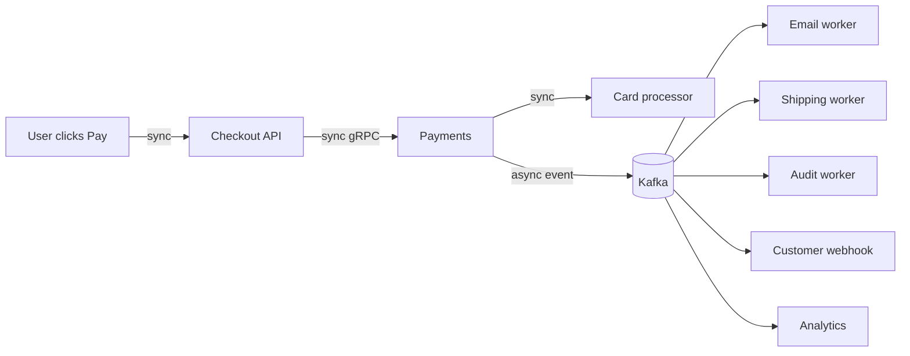

# Synchronous vs Asynchronous Communication

> **TL;DR** — **Synchronous** = the caller waits for the response (request/response, RPC, blocking I/O). **Asynchronous** = the caller doesn't wait (queues, events, pub/sub, callbacks). Sync is simple to reason about but couples services in time — if any participant is slow, everyone is slow. Async decouples in time, smooths spikes, and survives outages — at the cost of complexity (delivery guarantees, dedup, ordering, eventual consistency). **Use sync when the answer is needed right now; use async when "done eventually" is fine.** Real systems blend both.

---

## 1. Two Distinct Axes — Don't Confuse Them

There are actually two separate ideas often called "async":

- **In-process async** — non-blocking I/O, `async/await`, futures, promises. The *thread* doesn't block. The *call* may still be request/response.
- **Inter-service async** — communication is decoupled in time. Sender doesn't wait for the receiver. Usually a queue or event bus in between.

This doc is about the **second** one — the architectural choice. The first is a programming-model detail that applies to both.

---

## 2. The Difference in One Picture

```
SYNCHRONOUS                            ASYNCHRONOUS
─────────────                          ─────────────

Caller ──── request ────► Server      Producer ──── event ────► Queue / Bus
       ◄─── response ────                                            │
                                                                     ▼
                                                                  Consumer
                                                                  (whenever)

Caller blocks until response.          Producer continues immediately.
Both must be up at the same time.      Consumer reads when ready.
```

---

## 3. Synchronous Communication

### What it looks like
- **REST / HTTP** request-response.
- **gRPC unary calls**.
- **Direct DB queries**.
- **RPC libraries** in general (Thrift, Cap'n Proto).

### Strengths
- **Simple mental model**: call → result. Like a function.
- **Strong consistency** is easy: you know the operation succeeded when the call returns.
- **End-to-end tracing** is natural.
- **Errors propagate** directly to the caller.
- **No new infrastructure**: it's just HTTP/gRPC.

### Weaknesses
- **Temporal coupling**: every participant in the chain must be up *now*.
- **Latency adds up**: a chain A → B → C → D has total latency = sum of legs.
- **Compounding availability**: 4 services at 99.9% in series = 99.6% (you can do the math).
- **Spikes propagate**: if A bursts, B and C also burst.
- **Backpressure is awkward**: rejecting a sync call mid-chain causes the whole chain to fail.
- **Slow downstream stalls everyone** — Tail-at-Scale problem.

### When sync is the right tool
- The caller needs the result **right now** to continue.
- Read paths (GET) and user-blocking actions ("show me my profile").
- Operations where a failed write must be visible immediately.
- Transactions and consistency-critical writes.
- Anything where the user clicked a button and is staring at a spinner.

---

## 4. Asynchronous Communication

### What it looks like
- **Message queues** — Kafka, RabbitMQ, AWS SQS, GCP Pub/Sub.
- **Event buses** — EventBridge, NATS, Redis Streams.
- **Webhooks** — HTTP push from sender to receiver, async by nature.
- **Email / SMS / push** — fire and forget.
- **Background jobs** — Sidekiq, Celery, ResqueQ, Temporal, RQ.
- **Streams** — Kafka, Pulsar, Kinesis with consumers.

### Strengths
- **Temporal decoupling**: producer doesn't care if consumer is up.
- **Smooths spikes**: queue absorbs bursts; consumer drains at its own pace.
- **Independent scaling**: scale producers and consumers separately.
- **Survives outages**: consumer down for an hour? Messages wait.
- **Fan-out**: one event → many consumers.
- **Replay / time travel**: with Kafka-style logs you can re-process history.
- **Easier to evolve**: new consumers can subscribe without changing producers.

### Weaknesses
- **Eventual consistency** — UI shows stale data until the event lands.
- **Delivery guarantees** are tricky: at-least-once is the default; exactly-once is hard.
- **Ordering** is per-partition at best; cross-partition ordering is gone.
- **Debugging** is harder — no straight stack trace from producer to consumer.
- **Backpressure** moves to consumer lag; you must watch it.
- **More infrastructure** to operate (brokers, dead-letter queues).
- **Idempotency required** on consumers (duplicates happen).

### When async is the right tool
- The caller doesn't need the result to continue (sending email, generating PDF, indexing for search).
- Bursty workloads — flatten spikes.
- Fan-out to many subscribers — analytics + notifications + audit + ML pipeline.
- Long-running work — video transcoding, ML inference, bulk imports.
- Cross-team / cross-bounded-context integration.
- Reliable inter-service communication when transient downtime is normal.

---

## 5. The Big Differences at a Glance

| | Synchronous | Asynchronous |
| --- | --- | --- |
| Caller blocks? | Yes | No |
| Producer ↔ consumer coupled in time? | Yes | No |
| Latency profile | Sum of all hops | Producer immediate; consumer "eventually" |
| Spikes | Propagate | Absorbed by queue |
| Failure isolation | Caller sees error | Producer succeeded; consumer retries |
| Backpressure | Reject / 503 | Queue grows; alert on lag |
| Consistency | Strong & immediate | Eventual |
| Ordering | Easy (single stream) | Per-partition only |
| Debug | One call → one trace | Many hops via correlation IDs |
| Infra cost | None extra | Broker / queue cluster |
| Operational burden | Lower | Higher |
| New consumers added | Tight coupling | Subscribe; no producer change |
| Best at | Real-time queries, transactions | Bursty work, fan-out, decoupling |

---

## 6. Choosing — A Decision Tree

```
Does the caller need the result immediately to continue?
  Yes  → SYNC.

Is the operation idempotent and OK if it happens "eventually"?
  Yes  → ASYNC is usually better.

Will there be bursts the downstream can't absorb?
  Yes  → ASYNC (queue smooths).

Multiple consumers want this event?
  Yes  → ASYNC fan-out (pub/sub).

Cross-team / cross-bounded-context?
  Lean ASYNC — couples teams less.

Strong consistency or transaction required?
  SYNC.

User is watching a spinner?
  SYNC for the part that returns; ASYNC for follow-up work (email, audit, etc.).
```

---

## 7. The Common Pattern: Sync Edge, Async Inside

Most production systems combine both. A typical e-commerce checkout:



- **Sync** in the user-blocking path: take payment, return success/failure.
- **Async** for everything that can wait: send receipt email, update warehouse, fire customer webhook, ingest into analytics.

The user sees a fast response. Six downstream side effects happen in the background.

---

## 8. The Outbox Pattern (the secret to safe async)

Producing an event "after" updating the DB has a race condition:
- Update DB ✅ → publish to Kafka ❌ → event lost.
- Update DB ❌ → publish to Kafka ✅ → ghost event.

**Outbox pattern** fixes it:
1. Inside the *same DB transaction* as the business change, insert a row into an `outbox` table.
2. A separate process polls the outbox and publishes to Kafka, marking rows as published.
3. Atomic — the event exists if and only if the business change did.

See [Outbox Pattern →](../07-messaging/outbox-pattern.md). Combined with consumer idempotency, this gives you reliable async between services.

---

## 9. Delivery Guarantees

Async systems give you one of three guarantees (mostly):

- **At-most-once** — fastest, lossy. Fire and forget; if it fails, it's gone. (Some metrics, some telemetry.)
- **At-least-once** — duplicates possible, no loss. The common default (Kafka, SQS, RabbitMQ). Consumer must be idempotent.
- **Exactly-once** — every event processed exactly one time. Rare in practice; usually means "at-least-once + idempotent consumer" → "exactly-once effect".

Knowing which one your broker provides and your consumer needs is *the* design decision. See [Delivery Guarantees →](../07-messaging/delivery-guarantees.md).

---

## 10. Patterns Built on Async

- **Event-driven architecture** — services emit events; others react.
- **Event sourcing** — store events as the source of truth; rebuild state from them.
- **CQRS** — separate write model from read model; async update read model.
- **Saga pattern** — distributed transactions via a sequence of local steps + compensations.
- **Stream processing** — Kafka Streams / Flink continuously process events.
- **Webhooks** — async HTTP delivery to customer endpoints.
- **Background jobs** — single-consumer task queue.
- **Pub/sub fan-out** — one event, many subscribers.

Each is a chapter of this repo — but they all rest on async fundamentals.

---

## 11. Patterns Built on Sync

- **Request-response APIs** (REST, gRPC unary).
- **RPC chains** — A calls B which calls C.
- **Aggregator BFFs** — call many services in parallel, return a single response.
- **Database transactions** — locks held during the duration of a sync call.
- **Synchronous webhooks** are an oxymoron; the receiver might be sync internally but the sender returns immediately.

---

## 12. Hybrid: Long-Running Sync

What if the work takes 30 seconds? Two options:

### Async with a poll / push-back
```
POST /reports          → 202 Accepted, Location: /reports/job_1
GET  /reports/job_1     → 200 OK { status: "running" }
GET  /reports/job_1     → 200 OK { status: "done", url: "..." }
```
or notify via webhook / SSE / WebSocket when done.

### Synchronous over a long-lived stream
SSE or gRPC streaming — server holds the connection and pushes partial progress.

The right choice depends on UX. "Generate report" → async with status URL. "Render LLM response token-by-token" → streaming.

---

## 13. Observability Differences

### Sync
- One trace from start to finish.
- Stack traces include all hops.
- Failure point obvious.

### Async
- Producer's trace ends at the publish.
- Consumer's trace starts at the consume.
- You need **correlation IDs** or **trace context propagation** through messages.
- Lag (consumer lag, queue depth) is the key metric, not request latency.

OpenTelemetry supports both with message-attribute propagation. Without that, async is debugging hell.

---

## 14. Backpressure — Who Pushes Back On Whom?

### Sync
- Server returns 429 / 503 → client must back off.
- Risk: cascading retries amplify load.

### Async
- Queue grows when consumers can't keep up.
- Lag becomes the visible signal.
- Mitigations: scale consumers, drop oldest (lossy), apply admission control upstream, route to a slower-tier queue.

If you don't watch lag, async hides problems until they become catastrophic.

See [Backpressure →](../10-scalability/backpressure.md).

---

## 15. Failure Modes

| Failure | Sync | Async |
| --- | --- | --- |
| Downstream slow | Caller slow | Queue grows, consumer drains slower |
| Downstream down | Caller fails | Messages wait |
| Downstream restored | Recovers in real time | Drains burst (potential stampede) |
| Message lost | N/A (no message) | Possible without right guarantees |
| Duplicate delivery | N/A | Common (at-least-once) — need idempotency |
| Ordering broken | Single-stream → order preserved | Per-partition; cross-partition unordered |
| Poison message | N/A | Repeatedly fails → dead-letter queue |

Async swaps one set of problems for another. There is no free lunch.

---

## 16. Common Mistakes

- Picking async for a user-blocking action ("place order goes through Kafka") — adds complexity for no benefit.
- Picking sync for a fan-out — N services each take a hop while user waits.
- No idempotency on async consumers — silent duplicates.
- No DLQ / poison-pill handling — one bad message clogs the queue forever.
- No monitoring of consumer lag.
- Inventing your own retry / backoff instead of using broker primitives.
- Using async to hide a slow service ("send everything through a queue").
- Treating async as fire-and-forget without thinking about delivery guarantees.
- Building an "async monolith" with hundreds of fine-grained events that all depend on each other.

---

## 17. Practical Heuristics

- **User-visible writes** → sync (fast acknowledge), then publish event for downstream work.
- **Side effects** (emails, audit, search index, analytics) → async.
- **Cross-team integration** → async to avoid coupling.
- **Critical financial state** → sync + event (outbox).
- **Bursty workloads** → async with rate-limited consumers.
- **Real-time UI updates** → SSE / WebSocket (sync-ish stream) backed by async event source.
- **Inference / batch jobs** → async, with status polling or webhook on completion.

---

## 18. Cheat Card

```
SYNC = caller waits.       great for: real-time, transactions, user actions.
ASYNC = caller doesn't wait. great for: bursts, fan-out, cross-team, side effects.

KEY TRADE-OFF
  Sync  → simple, fast feedback, temporal coupling, cascading failures.
  Async → resilient, decoupled, requires idempotency + dedup + ordering thought.

COMBINE THEM
  Sync edge for user blocking call.
  Async for everything that can wait (emails, audit, search index, analytics).

OUTBOX PATTERN
  Write DB row + outbox row in ONE transaction. Publisher reads outbox.
  Atomic with the business change.

DELIVERY
  At-most-once / at-least-once / "exactly-once via idempotency".

MONITOR
  Sync  → request latency, error rate.
  Async → consumer lag, queue depth, DLQ count.
```

---

## 19. Resources

### Foundational
- *Designing Data-Intensive Applications* — Kleppmann. Chapters 4 (encoding & evolution), 11 (stream processing).
- *Enterprise Integration Patterns* — Hohpe & Woolf. The canonical book on messaging patterns.
- *Building Event-Driven Microservices* — Adam Bellemare.

### Articles
- "Synchronous vs Asynchronous Communication" — Microsoft Architecture Center: <https://learn.microsoft.com/en-us/azure/architecture/microservices/design/interservice-communication>
- "Pattern: Messaging" — microservices.io: <https://microservices.io/patterns/communication-style/messaging.html>
- "The Outbox Pattern" — Debezium blog: <https://debezium.io/blog/2019/02/19/reliable-microservices-data-exchange-with-the-outbox-pattern/>
- "Tail at Scale" — Dean & Barroso (CACM 2013).

### Videos
- ByteByteGo: "Synchronous vs Asynchronous Communication" — <https://www.youtube.com/@ByteByteGo>
- Hussein Nasser sync/async deep dives — <https://www.youtube.com/@hnasr>
- Sam Newman "Designing Microservices" talks.

### Tooling
- **Kafka, Pulsar, RabbitMQ, NATS, AWS SQS/SNS, EventBridge, GCP Pub/Sub** — async brokers.
- **Temporal, Cadence** — durable workflow engines (orchestrate sync + async safely).
- **OpenTelemetry** — trace context across async hops.
- **Sidekiq, Celery, RQ, BullMQ** — background-job frameworks.

### Adjacent reading
- [Message Queues vs Pub/Sub vs Streams →](../07-messaging/queue-vs-pubsub-vs-stream.md)
- [Event-Driven Architecture →](../07-messaging/event-driven-architecture.md)
- [Outbox Pattern →](../07-messaging/outbox-pattern.md)
- [Saga Pattern →](../07-messaging/saga-pattern.md)
- [Delivery Guarantees →](../07-messaging/delivery-guarantees.md)
- [CQRS →](../07-messaging/cqrs.md)
- [Backpressure →](../10-scalability/backpressure.md)
- [Idempotency](./idempotency.md)

---

*Previous:* [← BFF — Backend for Frontend](./bff.md)  |  *Up:* [README ↑](../README.md)
