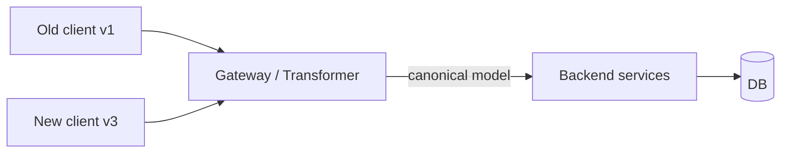

# API Versioning Strategies

> **TL;DR** — Any non-trivial API will outlive its first design. **Versioning** is the contract between you and your clients about which old behavior you'll keep alive. Four common strategies: **URL path** (`/v1/...`), **header** (`Accept: application/vnd.acme.v2+json`), **query parameter** (`?v=2`), and **date-based** (`API-Version: 2024-04-10`, Stripe-style). The right choice depends on who your consumers are, how often you change, and how much translation layer you can afford to maintain.

---

## 1. Why Versioning Matters

A change is "breaking" if any compliant client could stop working because of it:

- Removing a field, endpoint, or method.
- Renaming a field.
- Tightening a validation rule.
- Changing a default value.
- Changing the shape or type of a response.
- Changing pagination, error format, status codes.

Once a client is shipped, you don't control its upgrade schedule. Mobile apps in production. Server-to-server integrations. Partner code you've never seen. Versioning is how you ship change *without* breaking those clients.

> *Versioning isn't just a URL choice. It's an operational discipline: every change is labeled "additive" or "breaking", and breaking changes have a path.*

---

## 2. Additive vs Breaking — The Most Important Distinction

### Additive (safe)
- Adding a new endpoint.
- Adding a new optional field to a response.
- Adding a new optional request field.
- Adding new enum values to a permissive enum.
- Adding new error codes.
- New optional query parameters.

Clients that don't know about these changes are unaffected.

### Breaking (requires a new version)
- Removing or renaming anything.
- Making an optional field required.
- Tightening validation.
- Changing semantics of existing fields.
- Reordering positional arguments (shouldn't exist in REST anyway).
- Changing pagination, error format.

The cheapest API change is **additive**. Squeeze as many changes as possible into the additive bucket.

---

## 3. The Four Strategies

### 3.1 URL Path Versioning
```
GET /v1/users/42
GET /v2/users/42
```

**Pros**
- Obvious, visible, easy to log/debug.
- Trivial to route at gateway / load balancer level.
- Friendly to caches, CDNs, OpenAPI tooling.
- Different versions can have entirely different shapes / DBs / teams.

**Cons**
- Big bang version bumps — clients change a lot of URLs to upgrade.
- Encourages "v2 = rewrite", which inflates scope.
- Multiple versions = parallel codepaths to maintain.

**Use it when**: most public APIs (GitHub, Twitter, Twilio, AWS, Slack). The default.

### 3.2 Header Versioning
```
GET /users/42
Accept: application/vnd.acme.v2+json
```

Or a custom header:
```
GET /users/42
X-API-Version: 2
```

**Pros**
- Clean URLs.
- Some purists like it because URLs identify a *resource*, not a *version of a resource*.

**Cons**
- Invisible in logs and bookmarks.
- Hard to test from `curl` (until you remember the flags).
- Less CDN-cache-friendly.
- Easier for clients to forget the header → defaults to "latest" → silent break later.

**Use it when**: B2B APIs whose clients are sophisticated and you really care about clean URLs.

### 3.3 Query Parameter Versioning
```
GET /users/42?v=2
```

**Pros**
- Visible and simple.
- Can be defaulted server-side.

**Cons**
- Pollutes URLs.
- Caching considerations (`Vary: ...` complications).
- Mixed signal — query strings usually mean *filters*, not *contracts*.

**Use it when**: small / internal APIs. Avoid for public ones.

### 3.4 Date-Based Versioning (Stripe-style)
```
GET /v1/charges/ch_123
Stripe-Version: 2024-04-10
```

The client pins to a specific date. The server has a *translation layer* that converts request/response between the canonical "latest" representation and the requested date version.

**Pros**
- Hundreds of micro-versions instead of a few mega-versions.
- Each change is small, surgical, and documented.
- Clients upgrade at their own pace, one breaking change at a time.
- New customers get the latest by default.

**Cons**
- A nontrivial **version transformer** infrastructure is required.
- Internal models still evolve; you maintain N transformers forever.
- Discipline-heavy: every breaking change needs a migration.

**Use it when**: large-surface-area, rapidly-evolving B2B APIs where upgrade churn is a sales concern. Stripe, Twilio, Shopify use variants of this.

---

## 4. A Concrete Date-Based Example

Stripe-style:

```
Customer-A is pinned to 2023-08-16. They see:
  charge.amount      -> integer in minor units

We release 2024-04-10 introducing:
  charge.amount_money -> { amount, currency }   (more flexible)

Server stores 'canonical' form (the latest). For Customer A's responses,
a transformer converts amount_money → amount before returning.

Customer A's code is untouched. New customers consume the new shape.
```

This pattern is **expensive** but the user experience is fantastic — single-field upgrades, no big migrations.

---

## 5. Beyond URL: Versioning at the Service Layer

Even if your *URL* says `/v1/`, your *internal* services need to evolve. Two patterns:

- **N+1 strategy.** Always support the current version and the previous one. Stop supporting older ones after a deprecation window.
- **Transformer layer.** Internal services speak the latest shape. The gateway or BFF translates older external shapes in/out.

The second pattern is what makes date-based versioning sustainable: only the **boundary** knows about old versions; everything inside is unaware.



---

## 6. Deprecation: How To Sunset An Old Version

Versioning is only useful if you can eventually *remove* old versions.

### Recommended sunset workflow
1. **Announce** in changelog, status page, dashboard, blog, *and* via email to all known integrators. State the sunset date.
2. **Tag** every response from the deprecated version with the standardized headers:
   ```
   Deprecation: true
   Sunset: Sun, 30 Nov 2026 00:00:00 GMT
   Link: <https://docs.example.com/migrating-v1-to-v2>; rel="deprecation"
   ```
   (`Deprecation` is RFC 9745; `Sunset` is RFC 8594.)
3. **Brownouts**: hours-long temporary 410 returns near the end of the deprecation window — they force notice.
4. **Final removal**: respond with `410 Gone` and the migration link.

### Realistic timeline
- **Internal APIs**: a sprint or two.
- **Public APIs**: 6–24 months. 12 months is a healthy default.
- **Government / enterprise integrations**: years.

---

## 7. How GraphQL Does It

GraphQL doesn't usually use URL versions. Instead:

- **Add** fields freely (additive, safe).
- **Deprecate** old fields with `@deprecated(reason: "use newField")`.
- **Track usage** with schema analytics (Apollo Studio, Hive).
- **Remove** only when zero clients use it.
- Schema diffing in CI prevents accidental breaks.

Same discipline, expressed at the schema layer instead of URL layer. See [GraphQL Fundamentals](./graphql.md).

---

## 8. How gRPC / Protobuf Does It

Schema evolution rules (proto3):

- Adding a new optional field → safe (use a fresh tag number).
- Removing a field → safe (but **reserve** its tag number).
- Renaming a field name → safe (wire uses tag numbers, not names).
- Changing a tag number → **never** safe.
- Changing a type → safe only between compatible types.

Plus: **buf** can fail your CI build on breaking changes.

Effectively, gRPC versions services with new methods (`GetUserV2`) or new RPC packages (`acme.user.v2.UserService`).

---

## 9. Backward & Forward Compatibility

- **Backward compatible**: new server works for old clients. (Adding optional response fields.)
- **Forward compatible**: old server can ingest new clients' requests (typically only with strict schemas like protobuf — unknown fields are ignored).

Aim for both. Practical recipe:
- Tolerate unknown fields ("ignore unknowns") on the server.
- Don't reorder enum cases.
- Don't repurpose existing fields.
- Treat schema evolution as a first-class engineering concern with CI checks.

---

## 10. Multi-Version Coexistence — The Operational Cost

Running multiple versions is not free:

| Cost | Manifestation |
| --- | --- |
| Code paths | If/else by version, transformers, separate handlers |
| Test surface | Each version needs its own test suite |
| Docs | Every version's docs must be maintained |
| Bugs | A fix in v2 might need backporting to v1 |
| Observability | Metrics tagged by version |
| Capacity | Old versions still consume infra |

Discipline: each version has a **clear sunset date** and **measured usage**. Don't let zombie versions accumulate.

---

## 11. Communicating Change — The Things Clients Need

A good versioning practice ships with:

- **Changelog** — every change, dated, labeled additive / breaking.
- **Migration guides** — concrete diffs, code samples.
- **Versioned docs** — `/docs/v1/`, `/docs/v2/`.
- **Deprecation headers** — `Deprecation`, `Sunset`, `Link rel="deprecation"`.
- **Per-integration dashboards** — "you're on v1, sunsets in 90 days".
- **Email / webhook notifications** to known integrators.
- **CI clients** can read OpenAPI/protobuf diffs for breakage warnings.

---

## 12. Versioning Pitfalls

- **No versioning at all.** Inevitable retroactive heartbreak. Start with `/v1/` from day one even if you never bump it.
- **Calling everything "v2"** to justify a rewrite. Versions should map to client-facing semantics, not internal refactors.
- **Mega-versions** with hundreds of changes. Hard to migrate. Either ship more often or move to date-based.
- **Forever-alive v1.** If you never sunset, you never get the benefit.
- **Silent breaking changes.** Changing semantics of an existing field is *always* breaking, even if the field name is unchanged.
- **No deprecation window.** Public APIs need months; internal can be days.
- **Version everywhere.** Each microservice having its own `v1/v2/v3` becomes a coordination matrix. Keep versions at the *external* boundary.
- **Two simultaneous breaking releases.** Bundle pain.

---

## 13. A Mini Decision Tree

```
Is your API consumed by external partners or mobile apps?
  Yes → URL path /v1/ is the safe default.
         If you ship breaking changes monthly → date-based.
  No  → Could use header / query-param / single-version + additive only.

Is your API GraphQL or gRPC?
  → Use their built-in schema evolution; URL versioning rarely needed.

Do you ship breaking changes more than every few months?
  Yes → Invest in a transformer/translator layer; date-based.
  No  → Big-bang URL versions with long deprecation windows are fine.

Are you a small team / single product?
  → Keep it simple. /v1/. Be additive. Bump when forced.
```

---

## 14. Cheat Card

```
PRINCIPLES
  Additive = safe, version-free.
  Breaking = requires a new version + deprecation plan.

STRATEGIES
  URL path     /v1/...          default for public APIs
  Header       Accept: ...vN     clean URLs, harder to debug
  Query        ?v=2              small/internal only
  Date-based   API-Version: YYYY-MM-DD   for fast-evolving B2B (Stripe-style)

LIFECYCLE
  Announce  →  add Deprecation + Sunset headers  →
  brownouts  →  410 Gone after sunset date.

DEFAULTS
  Public APIs:  /v1/ + 12-month deprecation window.
  GraphQL:      no URL version; @deprecated + schema analytics.
  gRPC:         schema evolution rules; new package = new version.

ALWAYS
  Tolerate unknown fields.
  Document every change; label additive vs breaking.
  Track per-version usage.
  Have a sunset plan from day one.
```

---

## 15. Resources

### Articles
- "API Versioning at Stripe" — Brandur Leach: <https://stripe.com/blog/api-versioning>
- "Versioning REST APIs" — Twilio engineering.
- "Versioning with GraphQL" — Apollo: <https://www.apollographql.com/blog/graphql/versioning/>
- "Microservices API versioning" — Microsoft: <https://learn.microsoft.com/en-us/azure/architecture/microservices/design/api-design>
- Roy Fielding on versioning (skeptical of URL versioning): <https://www.infoq.com/articles/roy-fielding-on-versioning/>

### Specs
- **RFC 8594** — The Sunset HTTP Header Field: <https://datatracker.ietf.org/doc/html/rfc8594>
- **RFC 9745** — The Deprecation HTTP Header Field: <https://datatracker.ietf.org/doc/html/rfc9745>

### Examples to study
- **Stripe** API versioning (date-based): <https://stripe.com/docs/api/versioning>
- **GitHub** (URL + accept-header dual): <https://docs.github.com/en/rest/overview/api-versions>
- **Twilio** versioning: <https://www.twilio.com/docs/usage/api>
- **AWS** versioning conventions per service.

### Tools
- **OpenAPI Diff** — detect breaking changes: <https://github.com/OpenAPITools/openapi-diff>
- **Spectral** — lint OpenAPI specs: <https://stoplight.io/open-source/spectral>
- **Buf** — breaking-change detection for protobuf: <https://buf.build/>
- **graphql-inspector** — schema diff for GraphQL: <https://the-guild.dev/graphql/inspector>
- **Apollo Studio** — track GraphQL field usage and deprecation.

### Videos
- ByteByteGo: "API Versioning Strategies" — <https://www.youtube.com/@ByteByteGo>
- "Stripe API Versioning Deep Dive" — various conference talks on YouTube.

### Adjacent reading
- [REST API Design Principles](./rest-design.md)
- [GraphQL Fundamentals](./graphql.md)
- [gRPC, Protocol Buffers, Thrift](../02-networking/grpc-protobuf.md)

---

*Previous:* [← GraphQL Fundamentals](./graphql.md)  |  *Next:* [API Pagination Techniques →](./pagination.md)
