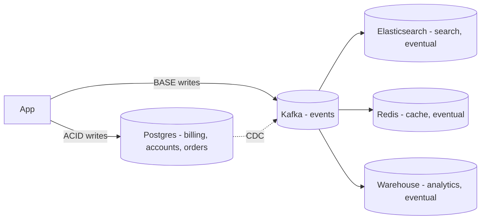

# ACID vs BASE

> **TL;DR** — **ACID** describes the guarantees a *single-node* relational transaction makes: **Atomicity, Consistency, Isolation, Durability** — what banks need. **BASE** describes the *distributed-system* trade-offs many NoSQL stores make: **Basically Available, Soft state, Eventual consistency** — what Twitter, Facebook, and Amazon shopping carts ship every day. They're not opposites so much as **different priorities at different scales**. Modern systems aren't purely one or the other — they pick per workload.

---

## 1. ACID — The Classical Contract

| Letter | Meaning |
| --- | --- |
| **A — Atomicity** | A transaction is all-or-nothing. If any step fails, the entire transaction is rolled back. |
| **C — Consistency** | Database invariants (constraints, foreign keys, business rules) hold before and after every transaction. |
| **I — Isolation** | Concurrent transactions appear to run as if they were serial. (Configurable via isolation levels.) |
| **D — Durability** | Once a transaction commits, it survives any crash or power loss. |

These guarantees were defined by Jim Gray in 1981 to describe how production databases must behave for serious business workloads. Relational engines (Postgres, MySQL, Oracle, SQL Server) and NewSQL engines (Spanner, CockroachDB) implement ACID. So do some NoSQL stores at the single-row level (DynamoDB, MongoDB w/ majority writes), but cross-document/row guarantees vary.

### Atomicity in practice
A bank transfer:
```sql
BEGIN;
  UPDATE accounts SET balance = balance - 100 WHERE id = 'A';
  UPDATE accounts SET balance = balance + 100 WHERE id = 'B';
COMMIT;
```
If anything fails between the two UPDATEs, the system rolls back. You never see $100 vanishing into the void.

### Consistency in practice
"Consistency" here means **the data satisfies its rules**: foreign keys point to real rows, balances aren't negative if the schema says so, uniqueness holds. It's *not* the same "consistency" as in the CAP theorem (which means "all replicas see the same value at the same time"). Two different uses of one overloaded word — this is a perpetual interview gotcha.

### Isolation in practice
Default `READ COMMITTED` in Postgres means: you see only committed data, but a row can change between two reads in the same transaction. **SERIALIZABLE** gives you the guarantee that *something equivalent to running transactions one after the other* happened. See [Transactions & Isolation Levels](./transactions-isolation.md).

### Durability in practice
On `COMMIT`, the engine fsyncs the WAL. The OS confirms the data is on disk. If the power goes out, recovery replays the WAL and you have your committed transactions back. Cloud-managed DBs additionally replicate the WAL to other AZs for redundancy.

---

## 2. BASE — The Distributed Trade-Off

| Letter | Meaning |
| --- | --- |
| **BA — Basically Available** | The system always responds to requests, even during partial failure — possibly with stale or partial data. |
| **S — Soft state** | The state of the system may change over time, even without input, as replicas converge. |
| **E — Eventual consistency** | Given enough time and no new writes, all replicas converge to the same value. |

Coined by Dan Pritchett (Brewer's colleague) around 2008 to describe the trade-offs of internet-scale stores like Amazon's shopping cart or Twitter's timeline.

The motivation: at internet scale, **partitions and node failures are not exceptional**. A system that pauses every write when 2 of 100 nodes are unreachable is unusable. BASE accepts a softer guarantee in exchange for *availability under failure*.

### Eventual consistency in practice
You post a tweet. It instantly appears for some followers (those served by replicas you wrote to), then gradually for everyone else as replication catches up. Within seconds, all replicas agree. No one sees missing data forever; just sometimes a few-second lag.

### Soft state in practice
Caches expire and refresh. Counters lag and reconcile. Materialized views eventually catch up. The system doesn't insist that every read reflects the latest write — it insists that it eventually will.

---

## 3. Side-by-Side

| | ACID | BASE |
| --- | --- | --- |
| Primary goal | Correctness | Availability + scale |
| Where it shines | Money, inventory, identity, regulated data | Feeds, timelines, recommendations, carts |
| Default systems | Postgres, MySQL, Oracle, Spanner | Cassandra, DynamoDB, Couchbase, Riak |
| Consistency | Strict (configurable isolation) | Eventual (sometimes tunable to strong) |
| Latency at scale | Higher (consensus, locks) | Lower (no global coordination) |
| Availability under partition | Lower (refuse rather than lie) | Higher (serve possibly-stale data) |
| Cognitive cost | "It just works" | Plan for duplicates, ordering, retries |
| Best for transactions across N rows | ✅ | ⚠️ limited |
| Best for global multi-region writes | ❌ unless NewSQL | ✅ |

It's not a religious split. **Most production systems use both**, in different parts of the stack.

---

## 4. The CAP Connection

CAP says: during a network partition, you must choose between **Consistency** (refuse writes / reads if you can't be sure they're current) and **Availability** (serve writes / reads regardless). You can't have both during a partition.

- **ACID** databases lean **CP** — they'll refuse writes rather than break invariants.
- **BASE** databases lean **AP** — they'll keep accepting writes and reconcile later.

That's the structural connection. PACELC adds: even when there's no partition, you trade latency vs consistency:

- **Spanner / CockroachDB**: CP + EC (consensus on every write → milliseconds added).
- **DynamoDB / Cassandra (default)**: AP + EL (no quorum on read → fast but possibly stale).

See [CAP Theorem](../08-distributed-systems/cap-theorem.md) and [PACELC](../08-distributed-systems/pacelc.md).

---

## 5. Don't Confuse "Consistency" Words

This is the most common interview trap.

- **The C in ACID** = invariants hold (constraints, FKs, app-defined rules).
- **The C in CAP** = all nodes see the same value at the same time (linearizability / strong consistency).

Same word, completely different scope. ACID's C is *intra-node*; CAP's C is *inter-node*. A system can be ACID and weakly CAP-consistent (single-leader Postgres replicating async). A system can be CAP-consistent but offer weak isolation (a poorly-configured Spanner deployment). Always specify which.

---

## 6. Where ACID Wins

- **Financial systems** — debits and credits must balance, no exceptions.
- **Inventory** — overselling 5 last items is catastrophic.
- **Identity / auth** — duplicate user IDs break the world.
- **Healthcare / medical records** — invariants matter; regulators care.
- **Orders & invoices** — totals, taxes, line items must agree.
- **Any case where "eventually correct" isn't good enough** — surprise refunds, lawsuits, audits.

For these, even if you scale horizontally, you stay relational (or NewSQL) for the transactional core.

---

## 7. Where BASE Wins

- **Social feeds, timelines, "likes," follower counters** — small staleness is acceptable.
- **Product catalogs** — eventually consistent reads are fine.
- **Recommendations** — slightly old similar-item lists don't matter.
- **Search indexes** — Elastic / Solr / OpenSearch are eventually consistent with the source DB.
- **Activity logs, audit trails (as append-only streams)** — order matters less than throughput.
- **Caches, sessions, leaderboards** — Redis is happy to lose them.
- **Anything where massive write throughput beats strict guarantees.**

Many internet-scale products are *built on BASE* in their hot paths, with ACID systems behind for billing and account state.

---

## 8. The "Best of Both" — Real Systems Mix

A typical SaaS architecture:



- **ACID** core (Postgres) for money + invariants.
- **BASE** derived stores (Elastic, Redis, warehouse) for speed + scale.
- **Kafka / CDC** glue keeps them in sync.

You get **correctness where it matters** and **scale where it pays**. This is the modern norm.

---

## 9. Tunable Consistency in Practice

Most modern stores aren't strictly ACID or BASE — they're **tunable**:

- **DynamoDB**: choose strongly or eventually consistent reads per call.
- **Cassandra / ScyllaDB**: choose `ONE`, `QUORUM`, `LOCAL_QUORUM`, `ALL`.
- **MongoDB**: `writeConcern` (w=1, w=majority, ...) and `readConcern` (local, majority, linearizable).
- **CockroachDB**: choose follower reads vs leader reads.

The right knob per operation is a real engineering choice. Hot path? Loose. Money path? Strict.

---

## 10. Common Misconceptions

- **"NoSQL = BASE."** Wrong — DynamoDB, MongoDB, ZooKeeper can offer strong single-row consistency.
- **"ACID = SQL."** Mostly true, but NoSQL stores can offer ACID (e.g., FoundationDB, single-row in DynamoDB, Mongo single-doc transactions).
- **"Eventual consistency = unreliable."** Wrong. It just means *bounded staleness*. Most real systems are fine with it for the right workloads.
- **"Just use ACID everywhere."** Doesn't scale; not always available; not always cheap.
- **"Just use BASE everywhere."** Will cost you the next time legal asks about an audit log.
- **"BASE means you can ignore concurrency."** It means concurrency is *more* present — you must plan for retries, dedup, ordering.

---

## 11. Cheat Card

```
ACID   — single-node transactional guarantees.
  Atomicity · Consistency (invariants) · Isolation · Durability
  Default in: Postgres, MySQL, Oracle, SQL Server, NewSQL.

BASE   — distributed-system trade-offs.
  Basically Available · Soft state · Eventual consistency
  Default in: Cassandra, DynamoDB (eventual mode), Riak, Couchbase.

C IS OVERLOADED
  C in ACID = invariants in your data.
  C in CAP  = all replicas see same value at same time.

NOT OPPOSITES
  Modern systems use BOTH: ACID core + BASE derived stores.

PICK BY WORKLOAD
  Money / inventory / identity   → ACID.
  Feeds / catalog / recs / search → BASE is fine.

TUNABLE
  Most modern stores let you pick per-query (strong vs eventual reads,
   quorum vs ONE, writeConcern majority, follower reads).

INTERVIEW TIP
  When you say "consistency", say which one.
```

---

## 12. Resources

### Foundational
- **Jim Gray, "The Transaction Concept"** (1981) — the ACID paper.
- **Dan Pritchett, "BASE: An Acid Alternative"** (ACM Queue, 2008): <https://queue.acm.org/detail.cfm?id=1394128>
- *Designing Data-Intensive Applications* — Kleppmann; Ch. 7 (transactions), Ch. 9 (consistency).
- *Database Internals* — Alex Petrov.

### Articles
- "ACID vs BASE" — many writeups; Atlassian and Cloudflare have good ones.
- "Eventually consistent" — Werner Vogels (Amazon CTO): <https://www.allthingsdistributed.com/2008/12/eventually_consistent.html>
- "Highly Available Transactions" — Bailis et al. — paper exploring what guarantees are possible at scale.
- "Consistency Tradeoffs in Modern Distributed Database System Design" — Daniel Abadi (PACELC paper).
- "Building on quicksand" — Pat Helland — beautiful think-piece.

### Videos
- ByteByteGo: "ACID vs BASE" — <https://www.youtube.com/@ByteByteGo>
- Hussein Nasser ACID / isolation deep dives — <https://www.youtube.com/@hnasr>
- Martin Kleppmann lectures — <https://www.youtube.com/@kleppmann>

### Adjacent reading
- [Relational Databases Deep Dive](./relational-databases.md)
- [Transactions & Isolation Levels](./transactions-isolation.md)
- [MVCC](./mvcc.md)
- [CAP Theorem](../08-distributed-systems/cap-theorem.md)
- [PACELC](../08-distributed-systems/pacelc.md)
- [Consistency Models](../08-distributed-systems/consistency-models.md)
- [NewSQL](./newsql.md)

---

*Previous:* [← NewSQL](./newsql.md)  |  *Next:* [Database Indexing →](./indexing.md)
