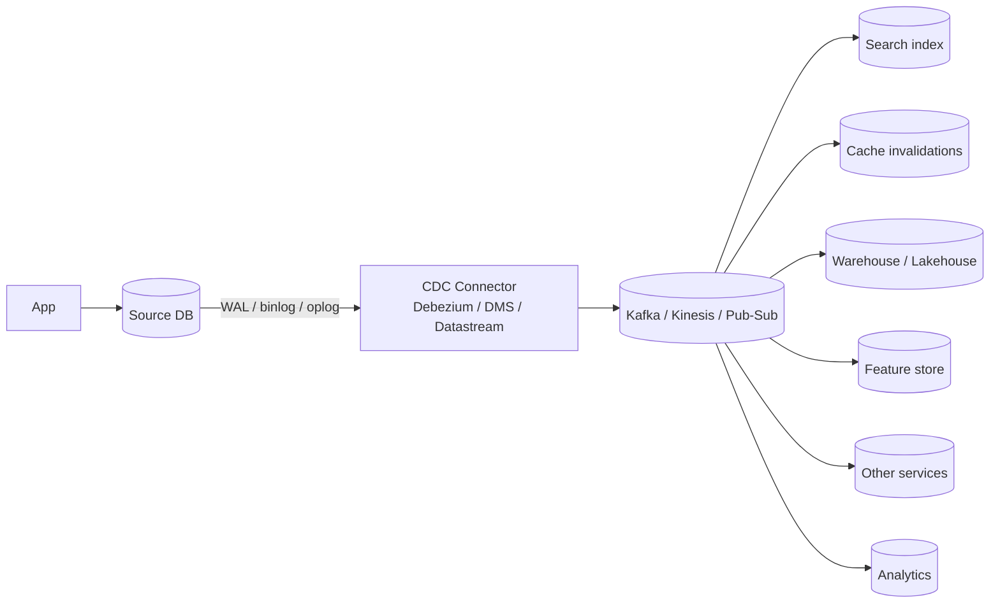
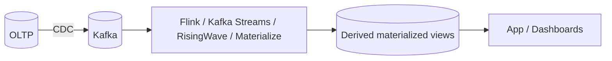

# Change Data Capture (CDC)

> **TL;DR** — **CDC** turns the changes happening inside a database — every `INSERT`, `UPDATE`, `DELETE` — into a **stream of events** that downstream systems can consume. Done right, it's the cleanest way to keep search indexes, caches, warehouses, ML feature stores, audit logs, microservices, and other databases in sync with the source of truth — without polluting your app code with "publish to Kafka after every write." Two main techniques: **log-based** (read the DB's WAL/binlog/oplog) and **trigger/polling-based** (mostly historical). Players: **Debezium** (everywhere), **Maxwell** (MySQL), **Kafka Connect** sources, **AWS DMS**, **GCP Datastream**, **Snowflake Streams**, **Mongo Change Streams**, **Postgres logical replication**.

---

## 1. The Picture



Every change in the DB becomes an event. Many consumers, one source of truth.

---

## 2. Why CDC Beats "Just Have the App Publish Events"

Without CDC, every place that writes to the DB must *also* publish a message:
```
db.write(...)
kafka.publish(...)   ← can fail. or duplicate. or get out of order.
```

Problems:
- Atomicity — what if the DB commits but Kafka publish fails?
- Coverage — what about writes from migrations, batch jobs, manual `psql`, replication tools?
- Drift — devs forget to update one path; data becomes inconsistent.
- Schema drift — different consumers see different event shapes.

CDC fixes all of these. The DB's WAL is the **single source of truth** for what changed; reading it captures **every** change, automatically. The "outbox + CDC" pattern uses this property to give you atomic, reliable event publishing without sacrificing transactional semantics — see [Outbox Pattern](../07-messaging/outbox-pattern.md).

---

## 3. Two Implementation Families

### 3.1 Log-based CDC (modern default)
Read the database's own **change log** — the same data the DB uses for replication.

- **Postgres**: logical decoding of the WAL (`pgoutput`, `wal2json`, `decoderbufs`).
- **MySQL**: binlog row events (`ROW` format).
- **MongoDB**: oplog / Change Streams API.
- **SQL Server**: CDC tables (built-in) or transaction log.
- **Oracle**: LogMiner / XStream / GoldenGate.
- **DynamoDB**: Streams.
- **Cassandra**: change data capture (CDC) files.

Pros:
- Captures every change, including those from non-app sources.
- Low overhead on the primary.
- Order-preserving per row.
- Includes "before" and "after" images.
- Transaction-aware (commit boundaries).

Cons:
- Configuration is per-engine.
- Requires a replication slot / privileged account.
- Schema changes require coordination.

### 3.2 Trigger / Polling (legacy / niche)
- **Triggers** that write to a side table; a poller reads it.
- **`updated_at` polling** — periodically `SELECT * WHERE updated_at > $last`.

Pros:
- No engine-specific log access; works anywhere.
- Easy to set up for one table.

Cons:
- Triggers add write overhead and surprise behaviors.
- Misses deletes (no row to query).
- High latency (polling interval).
- Doesn't scale gracefully.

In 2026, **log-based CDC is the right answer** unless you can't enable it.

---

## 4. Anatomy of a CDC Event

```json
{
  "op": "u",                            // c=create, u=update, d=delete, r=read (snapshot)
  "ts_ms": 1716072000123,
  "source": {
    "db": "shop", "table": "orders",
    "lsn": "0/1A2B3C4D", "txId": 98765
  },
  "before": { "id": 42, "status": "open",    "total": 4200 },
  "after":  { "id": 42, "status": "paid",    "total": 4200 },
  "key":    { "id": 42 }
}
```

You get:
- The **operation** (insert / update / delete).
- The **table** and **transaction id**.
- A **timestamp**.
- The **before** state (where supported).
- The **after** state.
- A **key** so downstream consumers can dedupe / order.

Each table usually becomes its own Kafka topic. Each row's key becomes the Kafka key — same key → same partition → ordered events for that row.

---

## 5. Use Cases

- **Replicate to a warehouse** — Snowflake / BigQuery / Redshift continuously, instead of nightly batch.
- **Search index sync** — push every change to Elasticsearch / OpenSearch.
- **Cache invalidation** — emit "key X changed" events; subscribers evict.
- **Microservice integration** — other services build their own materialized views.
- **Audit / compliance log** — append-only history of every row change.
- **Event sourcing-lite** — derive events from CRUD without rewriting the app.
- **Cross-region replication** — emit changes, replay in another region's DB.
- **ML feature store** — keep features fresh in near-real-time.
- **Database migration / dual-write** — backfill + tail the WAL to a new DB.

---

## 6. The Tools

### Open source
- **Debezium** — the de-facto CDC framework. Connectors for Postgres, MySQL, MongoDB, SQL Server, Oracle, Cassandra. Runs on Kafka Connect (or standalone via Debezium Server).
- **Maxwell's Daemon** — MySQL → JSON to Kafka.
- **Apache Flink CDC connectors** — combined with Flink stream processing.
- **PeerDB / Materialize / RisingWave** — newer streaming-DB tools that consume CDC.

### Cloud-managed
- **AWS DMS** — Database Migration Service; can run continuously.
- **GCP Datastream** — managed CDC to BigQuery / GCS.
- **Azure Data Factory / Synapse Link**.
- **Snowflake Streams** — internal CDC for Snowflake tables.
- **Mongo Change Streams** — native, simple.
- **DynamoDB Streams** + **Kinesis**.

### Built-into-the-DB
- **Postgres logical replication / pgoutput / wal2json** — built-in.
- **MySQL binlog** — built-in.
- **Mongo Change Streams** — built-in.

For most teams: **Debezium → Kafka** is the default. For Postgres-heavy shops: **logical replication directly** if downstream is also Postgres or your own consumer.

---

## 7. Initial Snapshot + Streaming

A CDC pipeline needs both:
1. **Snapshot** — read the existing table state when the connector first starts.
2. **Streaming** — tail WAL/binlog/oplog from a known position thereafter.

```
T0 connector starts → SELECT * FROM users          (snapshot rows)
                       record LSN at start
T1 streaming WAL from that LSN              → continuous change events
```

Modern tools handle this transparently. Watch for:
- **Lock contention** during snapshot on huge tables (Debezium's incremental snapshot helps).
- **Hours-long snapshot** before streaming catches up.
- **Schema changes mid-snapshot** — coordinate carefully.

---

## 8. Delivery Guarantees and Idempotency

CDC streams are usually **at-least-once**. Duplicates and minor reordering across partitions are expected. Consumers must be idempotent:

- Dedupe by `(table, key, lsn)` or `(table, key, txId)`.
- Apply changes in **monotonic order per key** (same Kafka partition = same row = ordered).
- Use the **after-image** as the new authoritative value (idempotent overwrite).

For "exactly-once **effect**", combine with idempotent writes downstream and a dedup window. See [Delivery Guarantees](../07-messaging/delivery-guarantees.md), [Idempotency](../03-apis/idempotency.md).

---

## 9. Schema Evolution

The source schema *will* change. Your CDC pipeline must cope.

Patterns:
- **Schema registry** (Confluent, Apicurio, Buf) — every event carries a schema ID; consumers fetch the schema.
- **Avro / Protobuf / JSON Schema** payloads — versioned, evolvable.
- **Backward + forward compatibility** rules: never reuse field IDs, only add nullable fields, never repurpose fields.
- **Schema migrations** coordinated with consumer rollouts (expand-contract again).

Debezium emits a schema with each message, or refers to a schema registry. Consumers update their handlers when needed.

---

## 10. The Outbox Pattern (CDC's Best Friend)

The cleanest way to emit "events" from a service that also writes to a relational DB:

```
BEGIN;
  INSERT INTO orders ...;
  INSERT INTO outbox (event_type, payload) VALUES (...);
COMMIT;
```

A CDC connector tails the `outbox` table and republishes those rows as events. The event exists if and only if the business write committed. **Atomic**, no dual-write hazard.

This is the canonical event-publishing pattern in modern microservices. See [Outbox Pattern](../07-messaging/outbox-pattern.md).

---

## 11. Operations

### Replication slot management (Postgres)
- A *logical replication slot* tracks how far the connector has consumed.
- If the connector is **down or slow**, the slot retains WAL — your disk fills.
- Always monitor `pg_replication_slots.confirmed_flush_lsn` lag.
- Have a plan for stopping/restarting the connector cleanly.

### Heavy WAL volume
- Every change is logged twice: in the WAL for the DB's replication *and* parsed by the connector.
- High-write workloads can saturate the network / disk.
- Tune retention, batch sizes, fetch sizes.

### Backpressure
- A slow Kafka can stall the connector; the replication slot grows.
- Monitor and alert on slot size.

### DDL handling
- DDL doesn't always appear in the CDC stream uniformly. Some connectors emit schema-change events; some don't.
- Coordinate DDL with downstream schema updates.

### Failure / restart
- Connectors checkpoint to a Kafka topic (or external store).
- On restart, they resume from the last checkpoint.
- Test this drill before you need it in production.

---

## 12. Common Pitfalls

- **No monitoring of replication slot lag** → disk full at 3 AM.
- **Skipping the outbox pattern** and trying dual-write → events out of sync with state.
- **Treating the warehouse as a CDC consumer with no idempotency** → duplicates, wrong totals.
- **No schema registry** → consumers break silently on new fields.
- **CDC across major DB version upgrades** without re-snapshot → potential data drift.
- **One mega-Kafka-topic for all tables** → bottleneck and noisy neighbors. One topic per table.
- **Cross-table transactions** treated as separate events without `txId` correlation → consumers see partial state.
- **Pretending CDC is exactly-once** → ungraceful failures.
- **Letting the connector run as superuser** in production → security risk.
- **Including PII in CDC streams** without redaction → compliance horror.

---

## 13. CDC vs Change Streams (NoSQL)

Mongo Change Streams, DynamoDB Streams, Cosmos Change Feed are CDC by another name — built directly into the DB.
- Easier to set up than Debezium.
- Tied to one DB engine; no Kafka unless you wire it in.
- Used heavily by AWS Lambda triggers, real-time apps, mobile sync.

If your stack is already on one of these, native streams may be simpler than running Debezium.

---

## 14. CDC and Stream Processing

CDC is the *input* to many stream-processing pipelines:



Tools like **Materialize**, **RisingWave**, **Apache Flink** + **CDC connectors** let you express derived views in SQL and have them maintained continuously off CDC streams. Real-time joins, aggregations, alerts — all without polling.

This is the future of "data engineering for OLTP-shaped data."

---

## 15. Cheat Card

```
CDC = stream every row change as an event. WAL/binlog/oplog → consumers.

LOG-BASED (modern default)
  Postgres logical replication (pgoutput / wal2json / decoderbufs)
  MySQL binlog row events
  Mongo Change Streams · DynamoDB Streams · SQL Server CDC

TOOLS
  Debezium (Kafka Connect) — Postgres / MySQL / Mongo / SQL Server / Oracle
  Maxwell · AWS DMS · GCP Datastream · Snowflake Streams · Mongo Change Streams

EVENT SHAPE
  op (c/u/d), table, txId, ts_ms, before, after, key.
  One topic per table; key = primary key.

GUARANTEES
  at-least-once. order preserved PER KEY (same partition).
  Make consumers IDEMPOTENT.

PATTERNS
  Source-of-truth DB + CDC → derived stores (search, cache, warehouse, ML, services).
  Outbox pattern + CDC = atomic event publishing.
  CDC as input to stream-processing (Flink, Materialize, RisingWave).

OPS
  Monitor replication slot lag (Postgres).
  Snapshot + stream when bootstrapping.
  Schema registry + Avro/Proto/JSON Schema for evolution.
  Test restart / catch-up before it's an incident.

DON'T
  Dual-write app → DB + Kafka without outbox.
  Treat CDC as exactly-once.
  Mix many tables into one topic.
  Forget to redact PII.
```

---

## 16. Resources

### Articles
- "An overview of CDC" — Confluent: <https://www.confluent.io/learn/change-data-capture/>
- "Reliable microservices data exchange with the Outbox Pattern" — Debezium: <https://debezium.io/blog/2019/02/19/reliable-microservices-data-exchange-with-the-outbox-pattern/>
- "Logical replication in Postgres" — official docs.
- "Streaming MySQL changes with Debezium" — Confluent / Debezium docs.
- "Streaming Snowflake with Streams and Tasks" — Snowflake blog.
- "Why we built RisingWave / Materialize" — engineering blogs.

### Documentation
- **Debezium** — <https://debezium.io/documentation/>
- **Maxwell** — <https://maxwells-daemon.io/>
- **Kafka Connect** — <https://kafka.apache.org/documentation.html#connect>
- **Postgres logical replication** — <https://www.postgresql.org/docs/current/logical-replication.html>
- **MySQL binlog events** — <https://dev.mysql.com/doc/refman/en/replication-options-binary-log.html>
- **Mongo Change Streams** — <https://www.mongodb.com/docs/manual/changeStreams/>
- **AWS DMS** — <https://docs.aws.amazon.com/dms/>
- **GCP Datastream** — <https://cloud.google.com/datastream/docs>
- **Snowflake Streams** — <https://docs.snowflake.com/en/user-guide/streams-intro>

### Books
- *Designing Data-Intensive Applications* — Kleppmann; Ch. 11 (stream processing).
- *Kafka: The Definitive Guide* — Narkhede et al.
- *Streaming Data: Understanding the Real-Time Pipeline* — Andrew Psaltis.

### Videos
- ByteByteGo: "What is Change Data Capture?" — <https://www.youtube.com/@ByteByteGo>
- Hussein Nasser CDC deep dives — <https://www.youtube.com/@hnasr>
- Gunnar Morling / Debezium / Materialize / RisingWave conference talks.

### Tools
- **Debezium UI**, **Confluent Control Center**, **Kpow**.
- **Schema Registry** (Confluent / Apicurio).
- **Flink CDC**, **Kafka Streams**, **Materialize**, **RisingWave**.
- **Airbyte / Fivetran** — managed ELT with CDC support.

### Adjacent reading
- [Outbox Pattern →](../07-messaging/outbox-pattern.md)
- [Event-Driven Architecture →](../07-messaging/event-driven-architecture.md)
- [Stream Processing →](../07-messaging/stream-processing.md)
- [Delivery Guarantees →](../07-messaging/delivery-guarantees.md)
- [Replication](./replication.md)
- [Data Warehouses & Data Lakes](./warehouses-lakes.md)
- [Lakehouse Architecture](./lakehouse.md)

---

*Previous:* [← Database Migrations at Scale](./migrations.md)  |  *Next:* [OLTP vs OLAP →](./oltp-vs-olap.md)
