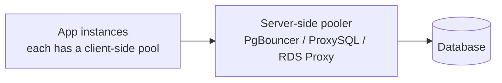

# Connection Pooling

> **TL;DR** — A **connection pool** is a long-lived cache of open database connections that your application leases for the duration of each query and returns when done. Without one, every request pays the TCP+TLS+auth handshake (tens of ms) *and* the DB's per-connection memory cost (~10 MB in Postgres). With one, requests reuse warm connections in microseconds. At scale you often add a **server-side pooler** (PgBouncer, ProxySQL, RDS Proxy) so thousands of short-lived app processes share a small number of DB connections. Get pooling wrong and the DB melts; get it right and you forget it exists.

---

## 1. Why Pool

Opening a DB connection is *expensive*:

- **TCP handshake** — 1 RTT.
- **TLS handshake** — 1–2 RTT.
- **Auth handshake** — SCRAM / password, several round trips.
- **Server-side setup** — Postgres forks a backend process, allocates ~10 MB.
- **Client-side setup** — driver allocates buffers, negotiates encoding.

The total can be **50–200 ms** end-to-end. Even on localhost, **5–20 ms**. For a request that needs to run a 1 ms query, opening a new connection is 95% pure overhead.

A connection pool keeps connections warm and hands them out instantly.

```
Without pool:                              With pool:
  request → open conn (100 ms)              request → borrow from pool (µs)
          → run query   (1 ms)                      → run query   (1 ms)
          → close conn                              → return to pool
```

---

## 2. The Two Layers of Pooling



### Client-side pool (in your app)
- Lives **inside** each app process or worker.
- Each instance has its own pool of N connections.
- Examples: HikariCP (Java), pgx pool (Go), `psycopg2.pool` / `asyncpg.pool` (Python), `pg` (Node), Sequelize, SQLAlchemy.
- Solves: per-request handshake cost.

### Server-side pooler
- A separate process between apps and the DB.
- Many app processes share a smaller pool to the DB.
- Solves: too many app connections overwhelming the DB.
- Examples: **PgBouncer**, **pgcat**, **PgPool-II**, **ProxySQL** (MySQL), **AWS RDS Proxy**, **Cloud SQL Proxy**.

At scale you need **both**: a small client pool per worker + a server-side pooler that fan-ins to a much smaller real DB connection set.

---

## 3. Why Postgres Especially Needs Pooling

Postgres uses a **process-per-connection** model. Every connection forks a backend process consuming:

- ~10 MB private memory.
- A file descriptor.
- A scheduler slot.

With `max_connections = 100`, you can serve ~100 simultaneous queries. 500 concurrent connections is workable but starts to hurt. 5,000 will melt the box.

Combine with serverless / Lambda / Cloud Run, where each cold start may open a fresh connection, and the math gets ugly fast. RDS Proxy and PgBouncer exist exactly for this.

MySQL (thread-per-connection) is a little lighter but the same lesson applies.

---

## 4. Pool Sizing — The Counter-Intuitive Math

**More connections is not faster.**

If your DB has 8 CPU cores and each query is CPU-bound:
- 8 active queries saturate the CPU.
- 80 connections means 80 queries fighting for 8 cores → 10× context-switching overhead.

The famous HikariCP guidance:
```
connections = ((core_count * 2) + effective_spindle_count)
```
For a 16-core SSD server: ~32 connections. *Per app process*.

In practice:
- **DB-bound apps**: small pools (10–30 per app process) beat large pools.
- **I/O-bound queries** (many waiting on slow disk / external services): pools can be larger.
- **Front a large pool** with a **server-side pooler** that limits the DB to a manageable concurrency.

> **Rule:** size the pool to the DB's *useful concurrency*, not your peak request rate.

---

## 5. Pool Settings That Matter

Per-driver names vary; the concepts repeat:

| Setting | What it does |
| --- | --- |
| `max` / `pool_size` | Max connections in the pool. |
| `min` / `min_idle` | Minimum kept warm. |
| `idle_timeout` | Close connections that sat idle longer than X. |
| `max_lifetime` | Force-close after N seconds (handles DB restarts). |
| `acquire_timeout` | How long a request waits for a free connection. |
| `connection_timeout` | How long to wait for a new TCP connect. |
| `statement_timeout` | DB-level cap on a single query. |
| `idle_in_transaction_session_timeout` | Kill connections idle inside an open tx (Postgres). |
| `health_check_period` | Periodic ping. |

Always set:
- A **bounded** pool size.
- An **acquire timeout** (clients should fail fast, not block forever).
- A **max lifetime** (so connections roll over after a DB upgrade / config change).

---

## 6. PgBouncer — The De-Facto Postgres Pooler

`PgBouncer` is a tiny C process that sits in front of Postgres. It runs in one of three modes:

### Session mode
A client connection is mapped 1:1 to a DB connection for its lifetime.
- Compatible with everything (prepared statements, temporary tables, `SET` commands, advisory locks).
- Doesn't save connections meaningfully — equivalent to a regular pool.

### Transaction mode (the popular one)
A client gets a DB connection **only for the duration of a transaction**, then it's returned.
- Massive savings — 100 client connections share 10 DB connections.
- Incompatible with:
  - **Prepared statements** that span requests (until PgBouncer 1.21+ added support).
  - **Session-level state** (`SET …`, temp tables, advisory locks held across transactions).
  - Some ORMs that assume session-level connection continuity.

### Statement mode
DB connection released after each **statement** (no multi-statement transactions).
- Most aggressive reuse.
- Hard to use safely — no transactions.

For most Postgres deployments: **PgBouncer in transaction mode**, tuned for the app's needs, in front of the DB. Modern alternatives: **pgcat** (Rust, sharded routing) and **pgagroal**.

---

## 7. Serverless / Lambda — The Hardest Case

Each invocation might be a fresh process. If every Lambda opens its own connection:
- 1,000 concurrent Lambdas = 1,000 Postgres connections.
- Your DB collapses.

Fixes:
- **RDS Proxy** (AWS) — purpose-built for this.
- **PgBouncer** sitting in your VPC; Lambdas connect there.
- **Per-Lambda mini-pool** that's tiny (`max=1` or `max=2`) and cleaned up on container shutdown.
- **HTTP-based DB access** like **Neon serverless driver** (which avoids long-lived connections entirely).
- **Aurora Data API** — query via HTTP.

For serverless Postgres, **never connect directly without a pooler**.

---

## 8. Common Failure Modes

### Pool exhaustion
Every connection is in use; requests pile up behind `acquire`. Causes:
- A slow query holding a connection forever.
- A leaked connection that was never returned.
- A bug in the app holding a transaction open while doing network I/O.
- Too few connections for the load.

Symptoms: latency spikes; `pool acquire timeout` errors; happy DB CPU.

Fix: find the long-held connection (Postgres: `pg_stat_activity` ordered by `query_start`). Add `idle_in_transaction_session_timeout`. Reduce hot-path work inside transactions.

### Connection storm after deploy
1,000 fresh containers each opening a pool simultaneously → 50,000 connections to the DB → DB falls over.

Fix:
- **Connection rate limiting** at the pooler.
- **Slow rollout** of new versions.
- **Warm pool** sized to typical load, not panic peak.
- **Server-side pooler** with limits.

### Stale connections
Connection is in the pool, but the DB closed it (idle timeout, restart, NAT timeout). Next request gets `connection closed` errors.

Fix:
- **Validation queries** (`SELECT 1`) before lease — or "validate-on-borrow" config.
- **`max_lifetime`** shorter than the DB's idle timeout.
- **Health checks** in the pool.

### Sticky transactions
A request `BEGIN`s a transaction, fires off some async work, returns the connection to the pool. Another request picks up that connection in the middle of a transaction. Chaos.

Fix:
- Never return a connection until the transaction is committed/rolled back.
- Use the driver's "ensure clean" hook.

### Idle-in-transaction monsters
Most common Postgres outage: an app opens a transaction, makes an external call (HTTP, queue, sleep), and forgets about it. That connection holds locks and snapshots forever; bloat grows; eventually the DB is unusable.

Fix: `idle_in_transaction_session_timeout = '30s'`. Audit any code path with `BEGIN` and network calls inside.

---

## 9. Pool Sizing Per Tier

A useful mental model:

```
Total DB capacity (connections) =
   Σ (app instances × per-instance pool size)  + headroom for ops tools
```

Reverse it. If your DB can comfortably handle 200 connections:
- 50 app processes → 4 per pool = 200.
- 100 app processes → 2 per pool = 200.
- 500 app processes (Lambda-style) → use a server-side pooler to fan-in.

Always leave ~10–20 connections reserved for **superuser tools, monitoring, migrations**.

Postgres `superuser_reserved_connections = 5` reserves slots for emergency `psql` access. Use it.

---

## 10. Multiple DBs and Pools

If your app talks to multiple DBs:
- One pool per **DB target**, not one mega-pool.
- Each pool sized to that DB's capacity.
- Health-check separately.

If your app speaks to a primary and N replicas:
- Separate pools per endpoint.
- Different timeouts (replicas may be slower).
- Failover logic in the routing layer.

---

## 11. Async Frameworks and Pooling

In async runtimes (Go, Node, Tokio, asyncio), a single process can run thousands of concurrent tasks. Each task takes a connection only while it's actually using it:

- **`asyncpg.pool`** (Python), **`pgx`** (Go), **`tokio-postgres`** (Rust) all support hundreds of concurrent in-flight queries on a pool of 10–20 connections.
- The bottleneck shifts from "connections per process" to "queries per second the DB can handle."

The math is the same: don't let pool size exceed your DB's useful concurrency.

---

## 12. Useful Diagnostics

Postgres:
```sql
-- Who's connected?
SELECT pid, usename, application_name, client_addr,
       state, query_start, query
FROM pg_stat_activity
ORDER BY query_start NULLS LAST;

-- Idle-in-transaction (the killer)
SELECT pid, age(now(), xact_start) AS tx_age, query
FROM pg_stat_activity
WHERE state = 'idle in transaction'
ORDER BY tx_age DESC;

-- Slot reservation
SHOW max_connections;
SHOW superuser_reserved_connections;
```

MySQL:
```sql
SHOW PROCESSLIST;
SHOW STATUS LIKE 'Threads_%';
```

Pooler-level (PgBouncer):
```
psql -p 6432 pgbouncer
SHOW POOLS;
SHOW CLIENTS;
SHOW SERVERS;
```

`pg_stat_activity` + a pool dashboard answers 95% of "the DB is slow" questions.

---

## 13. Common Mistakes

- **No pool.** Every request opens a new connection.
- **Huge pool.** "max=500 because more is better." It isn't.
- **Pool > DB max_connections.** Half your fleet gets `too many clients`.
- **No `idle_in_transaction_session_timeout`.** A single buggy code path can take down the DB.
- **Holding a connection during slow external calls** — pool exhaustion.
- **No validation** — stale connections after DB restart.
- **No reserved slots** for ops tools.
- **PgBouncer transaction mode** plus prepared statements you forgot to update for it (older PgBouncer) → mysterious errors.
- **One pool per ORM session** — leaking connections per HTTP request.
- **Serverless with no server-side pooler.**

---

## 14. Cheat Card

```
TWO LAYERS
  Client-side pool in each app instance.
  Server-side pooler (PgBouncer / RDS Proxy / pgcat) before the DB.

SIZING
  small > large. Match DB's useful concurrency.
  HikariCP formula: cores * 2 + spindles.
  Server-side pooler fan-ins many client conns to few DB conns.

ESSENTIAL SETTINGS
  max / min               bounds.
  idle_timeout            close idle conns.
  max_lifetime            roll over after upgrades.
  acquire_timeout         fail fast under load.
  statement_timeout       cap queries.
  idle_in_transaction_session_timeout   the Postgres lifesaver.

PGBOUNCER
  transaction mode = best fan-in, but be aware of session-state limits.

SERVERLESS
  always use a server-side pooler (RDS Proxy / Neon / Cloud SQL Proxy).

WATCH FOR
  pool exhaustion → slow query / leaked connection / long tx
  connection storm after deploy → slow rollout, server pooler
  stale connections → validation queries, shorter max_lifetime
  idle-in-transaction → the #1 Postgres incident — TIMEOUT EVERYTHING
```

---

## 15. Resources

### Articles
- "About Pool Sizing" — HikariCP wiki (the canonical small-pool guidance): <https://github.com/brettwooldridge/HikariCP/wiki/About-Pool-Sizing>
- "Connections are expensive" — Postgres docs / community wiki.
- "PgBouncer: Useful PostgreSQL tools" — Crunchy Data / EDB blogs.
- "Idle in transaction is a problem" — many Postgres-focused engineering blogs.
- "Connection management in serverless" — AWS RDS Proxy / Neon serverless driver blog posts.

### Documentation
- **PgBouncer** — <https://www.pgbouncer.org/>
- **ProxySQL** — <https://proxysql.com/documentation/>
- **AWS RDS Proxy** — <https://docs.aws.amazon.com/AmazonRDS/latest/UserGuide/rds-proxy.html>
- **Google Cloud SQL Auth Proxy** — <https://cloud.google.com/sql/docs/postgres/sql-proxy>
- **HikariCP** — <https://github.com/brettwooldridge/HikariCP>
- **pgx (Go)** — <https://github.com/jackc/pgx>

### Videos
- Hussein Nasser connection-pool deep dives — <https://www.youtube.com/@hnasr>
- ByteByteGo: "Database connection pooling" — <https://www.youtube.com/@ByteByteGo>
- PgConf talks on PgBouncer / pgcat.

### Tools
- `pg_stat_activity`, `pg_stat_statements`, PgBouncer admin console.
- **pganalyze**, **Datadog DB monitoring**.
- **pgcat** — Rust replacement for PgBouncer with sharding awareness: <https://github.com/postgresml/pgcat>

### Adjacent reading
- [Relational Databases Deep Dive](./relational-databases.md)
- [MVCC](./mvcc.md) (idle-in-transaction → bloat)
- [Read Replicas](./read-replicas.md)
- [Rate Limiting](../03-apis/rate-limiting.md) (admission control)

---

*Previous:* [← Read Replicas & Write-Through Patterns](./read-replicas.md)  |  *Next:* [Database Migrations at Scale →](./migrations.md)
