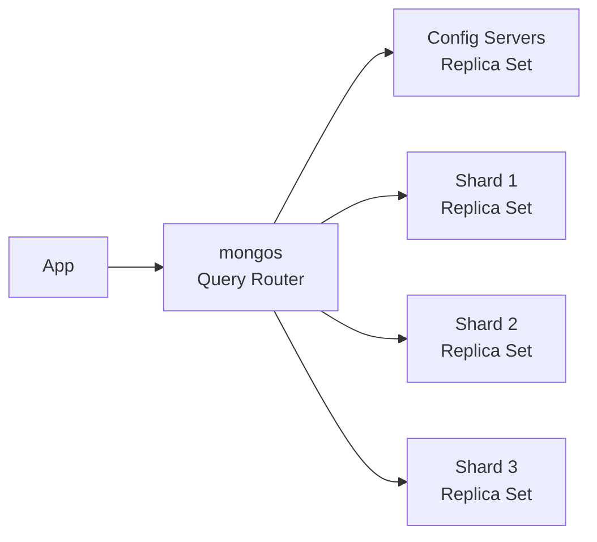

# Document Stores (MongoDB, CouchDB)

> **TL;DR** — A **document store** holds JSON-like documents grouped into **collections** instead of typed rows in tables. Schemas are flexible: each document can have different fields, nested objects, and arrays. Queries can filter and project into nested paths, build aggregation pipelines, and use rich secondary indexes. Trade-off: easy to start, easy to drift. MongoDB is the dominant player; Postgres's JSONB is a strong "embedded" alternative; CouchDB / Couchbase / Firestore / DocumentDB / RavenDB fill various niches. Best for **product catalogs, user content, configuration, and mobile-app backends** with varying shapes — not for highly relational, multi-table, transactional domains.

---

## 1. The Mental Model

Every record is a **document** — usually JSON or BSON (Binary JSON). Documents live in **collections**, the document-store equivalent of tables.

```json
// users collection
{
  "_id": "u_42",
  "name": "Ada Lovelace",
  "email": "ada@example.com",
  "addresses": [
    { "type": "home", "city": "London", "zip": "W1" },
    { "type": "work", "city": "London", "zip": "EC2" }
  ],
  "preferences": { "theme": "dark", "notify": true },
  "created_at": "2026-05-19T10:00:00Z"
}
```

Things to notice:
- **Nested objects and arrays** are first-class — no join table needed for "user has many addresses."
- The **`_id`** is the primary key; usually unique within a collection.
- Two documents in the *same* collection can have *different* shapes — that's the whole point.

---

## 2. The Players

| Engine | Notes |
| --- | --- |
| **MongoDB** | Dominant. Rich query language, aggregation framework, multi-document transactions (4.0+), sharding, replica sets. |
| **CouchDB** | Apache, multi-master replication, "offline-first" sync. Less popular as a primary; foundation for **PouchDB** in the browser. |
| **Couchbase** | Memcached + Couch lineage. SQL-like query language (N1QL/SQL++). |
| **AWS DocumentDB** | MongoDB-compatible API on top of Aurora-like storage. |
| **Azure Cosmos DB (Document API)** | Multi-model; document is one of its modes. |
| **Google Firestore** | Hosted, realtime sync to mobile/web; subcollections. |
| **RavenDB** | .NET-flavored; multi-master. |
| **Postgres JSONB** | Not a separate engine, but a serious contender — relational + flexible nested data. |

---

## 3. Why Document Stores Exist

The pitch:

- Application objects map naturally to documents — no ORM impedance mismatch.
- New fields are free; no schema migration.
- Embedded relationships save the cost of joins.
- Easier for rapid product iteration.
- Horizontally shardable from day one (in many implementations).

The reality:

- **Schemas don't disappear; they move to your code.**
- Cross-document relationships still exist — and they get painful when they grow.
- Reading a sub-document is fast; updating one safely is harder than it looks.
- Aggregating across documents is slower than relational joins on big data.

Used well, document stores accelerate development. Used poorly, they become a JSON swamp that fights you every day.

---

## 4. Querying — Filter / Project / Aggregate

### Filtering with nested paths
```js
// MongoDB
db.users.find(
  { "addresses.city": "London", "preferences.notify": true },
  { name: 1, email: 1 }
)
```
Reaches into nested fields; project picks fields to return.

### Updating in place
```js
db.users.updateOne(
  { _id: "u_42" },
  { $set: { "preferences.theme": "light" } }
)

// Array operations
db.users.updateOne(
  { _id: "u_42" },
  { $push: { addresses: { type: "work2", city: "Paris" } } }
)
```

### Aggregation pipelines
The killer feature of MongoDB beyond key lookup. A sequence of stages:
```js
db.orders.aggregate([
  { $match: { status: "paid", created_at: { $gte: ISODate("2026-01-01") } } },
  { $group: { _id: "$customer_id", total: { $sum: "$amount" } } },
  { $sort: { total: -1 } },
  { $limit: 10 }
])
```

This is GROUP BY + WHERE + ORDER BY in JSON form. Operators include `$match`, `$group`, `$project`, `$lookup` (join), `$unwind` (flatten arrays), `$facet` (parallel aggregations), `$bucket`, `$geoNear`, and many more.

### `$lookup` — the join you "didn't need"
```js
db.orders.aggregate([
  { $lookup: {
      from: "users",
      localField: "customer_id",
      foreignField: "_id",
      as: "customer"
  }}
])
```
Document stores end up reinventing joins because relational data is everywhere. `$lookup` is **slower than a relational join** at scale.

---

## 5. Indexes

Same idea as relational indexes — secondary B-trees over fields, including nested paths.

```js
db.users.createIndex({ "addresses.city": 1 })
db.orders.createIndex({ customer_id: 1, created_at: -1 })
db.users.createIndex({ name: "text" })          // text search
db.places.createIndex({ loc: "2dsphere" })      // geo
```

- **Compound** indexes (left-to-right prefix match).
- **Multi-key** indexes on array fields.
- **Text** indexes for basic full-text search.
- **Geo** indexes for 2D / spherical queries.
- **Partial** indexes (subset of documents matching a filter).
- **TTL** indexes (auto-expire documents).

Same rule as anywhere: **index what you query**, not everything. Index maintenance slows writes.

---

## 6. Embed vs Reference

The single biggest schema decision in a document store:

### Embed
```json
{
  "_id": "u_42",
  "name": "Ada",
  "addresses": [ {...}, {...} ]
}
```
Fast reads of the parent. Atomic updates of parent+child. Limited to ~16 MB per document.

### Reference
```json
// users
{ "_id": "u_42", "name": "Ada" }
// addresses
{ "_id": "a_1", "user_id": "u_42", "city": "London" }
{ "_id": "a_2", "user_id": "u_42", "city": "Paris" }
```
Each address can be queried independently. Updates don't touch the user. Reading a user *and* addresses needs a `$lookup` or two queries.

### Rules of thumb
- **1-to-few**, accessed together → embed.
- **1-to-many that grows unbounded** → reference (else the doc bloats).
- **Many-to-many** → reference (use a separate collection).
- **Independent lifecycle** (orders vs users) → reference.
- **Always written/read together** → embed.
- **Hard cap**: a document can't exceed 16 MB (MongoDB) or similar.

The "embed too much" failure mode is the most common: a user document growing forever as activity history piles in.

---

## 7. MongoDB Architecture (in brief)



- **Replica set** — one primary + N secondaries; automatic failover via Raft-like election.
- **Sharding** — collection split by a **shard key** (hash or range) across many replica sets.
- **mongos** — stateless router that knows the shard map.
- **Config servers** — store cluster metadata.

Sharding rules of thumb:
- **High-cardinality** shard key with good distribution.
- **Compound shard keys** for query locality.
- **Hashed shard key** for uniformly random spread when locality doesn't matter.
- A bad shard key = forever pain. Picking one is harder than picking a Postgres index.

---

## 8. Transactions

Modern document stores support **multi-document ACID** transactions:
- MongoDB ≥ 4.0 — sessions + `withTransaction()`.
- DocumentDB — limited transactional support.
- Couchbase, Firestore — supported with various caveats.

But transactions in document stores are:
- More expensive than relational transactions.
- Limited in scope and duration.
- Best avoided when possible by embedding the transactional data in one document.

The original promise — *"transactions don't matter if you design right"* — collapsed under real-world needs. Sometimes you really do need atomic updates across documents.

---

## 9. Consistency

- **Replica set reads** can be **primary** (linearizable for one client) or **secondary** (eventual, may be stale).
- `readConcern` lets you opt into stronger guarantees (`"majority"` = read what a majority of replicas committed).
- `writeConcern` controls how durable a write must be before the server acknowledges (`{w: 1}` vs `{w: "majority"}`).

Use **`w: "majority"` and `readConcern: "majority"`** for anything correctness-critical. The defaults vary by version; check.

In sharded clusters there's a small risk window during chunk migrations. Modern versions handle it correctly with two-phase commits, but be aware.

---

## 10. Postgres JSONB — The "Embedded" Document Store

Postgres has a **JSONB** type with operators, GIN indexes, and constraints. For many "we want flexibility" use cases, a JSONB column inside a Postgres table is *better* than reaching for MongoDB.

```sql
CREATE TABLE users (
  id text PRIMARY KEY,
  email text UNIQUE NOT NULL,
  data jsonb NOT NULL
);

CREATE INDEX users_data_gin ON users USING GIN (data);
CREATE INDEX users_country_idx ON users ((data->>'country'));

SELECT data->>'name' FROM users WHERE data->>'country' = 'DE';
```

You keep **joins, transactions, SQL, mature tooling, talent pool** — and stash the flexible parts in JSONB. Many teams now choose Postgres JSONB instead of MongoDB.

When MongoDB still wins:
- Truly schema-less or wildly varying shapes.
- The team is already deep in MongoDB.
- Hosted Atlas operational benefits + global clusters.
- Massive horizontal scale with sharding that the team can operate.

---

## 11. Operations & Real-World Considerations

- **Schema drift** — without app-level validation, fields appear/disappear and your code becomes a series of "maybe-this-field-exists" checks. Use schema validators (MongoDB has built-in `$jsonSchema`) or libraries (Mongoose, Zod, Prisma).
- **16 MB document cap** — silent gotcha when you embed comment threads or activity logs.
- **Hot shards** — a bad shard key serializes traffic to one node.
- **Background indexing** — building indexes on multi-TB collections takes hours; plan carefully.
- **Compaction** — secondary indexes and updates create fragmentation; periodic compact/`reIndex` may be needed.
- **Backups** — `mongodump` is fine for small data; for big clusters use snapshot-based or hosted backups.
- **Cost on Atlas** — Mongo Atlas pricing scales fast. Watch your bill.
- **Eventual consistency surprises** — secondary reads return stale data. Pin to primary for read-your-writes.

---

## 12. When Document Stores Shine

- Mobile app backends with varying client versions and shapes.
- Product catalogs with optional / category-specific attributes.
- CMS-style user content with rich nested structures.
- IoT / event payloads where the schema evolves often.
- Offline-first apps (CouchDB / PouchDB / Firestore).
- Rapid prototyping when you don't yet know your shape.
- Per-customer "extension fields" that vary by tenant.

## 13. When They Hurt

- Highly relational data — orders, customers, products with strict integrity.
- Many ad-hoc analytical queries — use a warehouse.
- Financial / inventory invariants — relational + transactions are better here.
- Reporting that joins many documents — `$lookup` doesn't scale like SQL joins.
- Strict schemas with strong evolution rules — JSONB-in-Postgres is friendlier.

---

## 14. The Common Failure Stories

- "We picked MongoDB for our SaaS. Two years later we wrote our own join engine in app code. We migrated to Postgres."
- "Documents grew unbounded as we appended comments. Hit 16 MB. Now we're migrating arrays out into a separate collection."
- "We hot-sharded on `customer_id` because most customers were tiny. Then one customer became huge and crushed a shard."
- "We never validated schemas. Two years in, every field is `string | number | undefined`."

None of these are MongoDB's "fault" — they're predictable consequences of skipping schema design.

---

## 15. Best-Practice Recipes

- **Validate at write time** with `$jsonSchema` or a library.
- **Document your shapes** even if the DB doesn't enforce them.
- **Plan for unbounded arrays**: cap them at N or move to a referenced collection.
- **Pick a shard key carefully**: high cardinality, even distribution, common-query locality.
- **Index for your top queries** — `explain()` everything before shipping.
- **Use `$lookup` sparingly** — denormalize, or query in app code, or rebuild as a derived collection via change streams.
- **`readConcern: "majority"` and `writeConcern: "majority"`** when you care.
- **Capture change streams** to feed search, analytics, derived stores.
- **Avoid using document stores as a queue/lock** — there are better tools.
- **Have a migration plan** for schema evolution: lazy migration on read, background scripts, dual-write windows.

---

## 16. Cheat Card

```
DOCUMENT STORE = collections of JSON-ish documents. Flexible shape.

PROS    fast to start, nested data first-class, easy iteration,
         sharding built-in, mobile-friendly.

CONS    schema drift, joins are awkward, transactions limited,
         16 MB document cap, hot shards, no relational integrity.

EMBED vs REFERENCE
  Embed:     1-to-few, atomic together, read together.
  Reference: 1-to-many unbounded, independent lifecycle, many-to-many.

INDEXES    same idea as SQL — index what you query, not everything.
            compound, multi-key, partial, TTL, text, geo.

SHARDING   pick a shard key like your career depends on it.
            high-cardinality + good distribution + query locality.

CONSISTENCY  majority concerns for critical writes/reads.
              secondary reads = stale; primary for read-your-writes.

POSTGRES JSONB    serious "embedded" alternative — keep SQL, gain flexibility.

DON'T
  rely on emergent schema in production
  let documents grow unbounded
  use $lookup as a primary join strategy at scale
  default to MongoDB when the data is clearly relational
```

---

## 17. Resources

### Books
- *MongoDB: The Definitive Guide* (3rd ed.) — Bradshaw, Brazil, Chodorow.
- *MongoDB in Action* — Banker, Bakkum, Verch, Garrett.
- *Designing Data-Intensive Applications* — Kleppmann; Ch. 2 covers document models.
- *Document Database Patterns* — Pramod Sadalage.

### Documentation
- **MongoDB Manual** — outstanding: <https://www.mongodb.com/docs/manual/>
- **MongoDB University** (free courses): <https://learn.mongodb.com/>
- **Apache CouchDB** — <https://docs.couchdb.org/>
- **Couchbase** — <https://docs.couchbase.com/>
- **Google Firestore** — <https://firebase.google.com/docs/firestore>
- **Postgres JSONB** — <https://www.postgresql.org/docs/current/datatype-json.html>

### Articles
- "Why Postgres JSONB might be enough" — many blog posts; a useful counterweight.
- "MongoDB Schema Design Best Practices" — MongoDB blog (multi-part series).
- "Embedded vs Referenced Documents" — design pattern overview.
- "How Discord uses MongoDB" — earlier engineering posts (they later moved off it — worth reading both arcs).
- Martin Fowler on aggregate-oriented DBs: <https://martinfowler.com/bliki/AggregateOrientedDatabase.html>

### Videos
- ByteByteGo: "MongoDB explained" — <https://www.youtube.com/@ByteByteGo>
- Hussein Nasser MongoDB / document store videos — <https://www.youtube.com/@hnasr>
- MongoDB.live talks on YouTube — solid technical content.

### Tools
- **MongoDB Compass** — GUI client.
- **mongosh** — modern CLI shell.
- **Mongoose** (Node), **Mongoengine** (Python), **Spring Data MongoDB** — ORMs.
- **Studio 3T** — heavier GUI.
- **Atlas Search / Vector Search** — managed integration.

### Adjacent reading
- [SQL vs NoSQL](./sql-vs-nosql.md)
- [Key-Value Stores](./key-value-stores.md)
- [Indexing](./indexing.md)
- [Sharding & Partitioning](./sharding-partitioning.md)
- [Search Engines](./search-engines.md)
- [Change Data Capture](./cdc.md) (Mongo change streams)

---

*Previous:* [← Key-Value Stores](./key-value-stores.md)  |  *Next:* [Wide-Column Stores →](./wide-column-stores.md)
