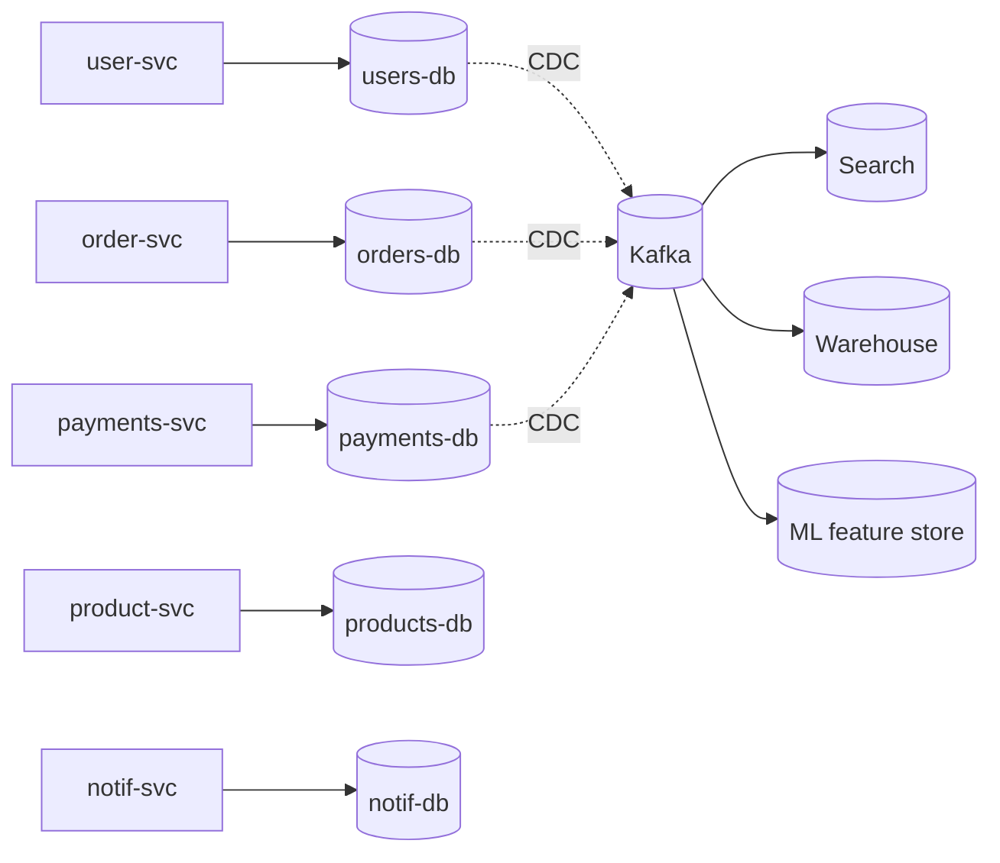

# Database Federation

> **TL;DR** — **Database federation** = splitting your data across **multiple databases by function/domain** instead of by row (sharding). One database for users, one for orders, one for analytics. Each service owns its DB. It's the boring, cheap, effective scaling step *before* sharding — and the architectural foundation of microservices. Trade-off: cross-domain joins become harder; you must coordinate via APIs, events, or CDC.

---

## 1. The Idea

```
Before:            users  orders  products  payments  comments  ...
                       in ONE giant database
                          ↓
After:    users-db   orders-db   products-db   payments-db   comments-db
              owned by their respective services
```

Each domain lives in **its own database**, often **its own database server**. Services talk to their own DB; they ask each other via APIs / events for data they don't own.

This isn't sharding (no horizontal split of a single table). It's **vertical decomposition** along functional boundaries — *functional partitioning*.

---

## 2. Why Federate

- **Read/write isolation.** A heavy analytics query on `orders` doesn't slow `users`.
- **Independent scaling.** The orders DB can be huge while users stays tiny.
- **Independent technology.** Postgres for `orders`, DynamoDB for `sessions`, Elastic for `search`.
- **Smaller blast radius.** A bad migration on `payments` doesn't take everyone down.
- **Cleaner ownership.** Each team has *one* DB to know cold.
- **Schema evolution.** Each domain evolves at its own pace.
- **Compliance scopes** (PCI for payments, HIPAA for medical) stay narrow.

It's the "scale by separation" step that comes before "scale by partition."

---

## 3. Federation vs Sharding vs Replication

| | Federation (functional) | Sharding (horizontal) | Replication |
| --- | --- | --- | --- |
| What splits | Tables / domains | Rows of one table | None — same data, multiple copies |
| Why | Independence, ownership, isolation | Capacity per table | Availability, read scale |
| Routing | Service owns its DB | Shard key | Primary / replica |
| Cross-X queries | Hard (across services) | Hard (across shards) | Trivial (any replica) |
| Operational cost | Medium | High | Low |
| When | Microservices, multi-domain monoliths | One table is too big | Always |

In big systems you use **all three**: federate by domain, shard the biggest table inside a domain, replicate every shard for HA. They compose.

---

## 4. Where the Pain Moves

Once each service owns its data, you lose the **single-database JOIN**. Patterns to replace it:

### API composition (BFF / aggregator)
Service A calls Service B's API. The caller stitches the result.
```
order = orders.get(id)
customer = users.get(order.customer_id)
return { ...order, customer }
```
Simple. Synchronous fan-out latency adds up — see [BFF](../03-apis/bff.md).

### Event-driven denormalization
Service A publishes events; Service B builds a **derived view** of A's data shaped for B's queries.
```
orders publishes OrderCreated → audit-service builds its own view
                              → search-service indexes orders
                              → analytics ingests for reporting
```
Each consumer holds a **local cached projection** with the fields it needs. Reads are local. Writes propagate eventually.

See [Event-Driven Architecture](../07-messaging/event-driven-architecture.md), [CDC](./cdc.md).

### Materialized views in a warehouse
For cross-domain analytics, you don't need joins in OLTP — push everything to a warehouse and join there.

### Saga pattern
For transactions across services: a sequence of local transactions with compensations. See [Saga Pattern](../07-messaging/saga-pattern.md).

### Distributed query engines
Federated query tools like **Presto / Trino**, **Postgres Foreign Data Wrappers**, **Snowflake's external tables** can query multiple sources and join the results. Useful for ad-hoc analytics; **don't** make this your hot OLTP path.

---

## 5. Patterns of Federation

### One DB per service (microservices canon)
Each service owns its DB. No other service touches it directly. Communication via API or events. The Amazon-style "API mandate" of 2002 codified this.

### One DB per subdomain (modular monolith)
Several logically-distinct schemas inside one DB or several DBs. Looser than full microservices; useful intermediate step.

### Bounded-context databases (DDD)
Each bounded context has its own data store. The boundaries map to **how the business talks about the domain**, not how the code is currently organized.

### Hybrid: shared identity DB + per-service DBs
A central "users / auth / tenants" DB plus per-service domain DBs. Common; works well if you discipline what goes in the shared DB.

---

## 6. The Big "Shared Database" Anti-Pattern

The opposite of federation: many services hitting one big DB.

Problems:
- **Coupled deploys** — a schema change blocks every team.
- **Coupled performance** — one bad query degrades everyone.
- **Coupled security scope** — one leak = total leak.
- **No clear ownership** — bug at 3 AM, who fixes it?
- **No room to innovate** — can't switch DB technology for one domain.

A shared DB undermines microservices entirely — it's a *distributed monolith*. If two services *must* share the same DB, you've found a misdrawn service boundary.

---

## 7. Operational Realities

- **Many DBs to operate.** Backups, migrations, monitoring × N.
- **Many drivers, many migration tools.** Standardize where possible.
- **Cross-DB transactions disappear.** Use sagas + idempotency + outbox.
- **Cross-DB reporting** moves to a warehouse fed by CDC.
- **Schema versioning per service** is now a thing.
- **Consistency budgets** — what staleness is acceptable for each derived view?

Investment in a **platform team / data platform** pays back fast as federation grows.

---

## 8. Federation in Practice

A typical SaaS:



- Each service owns its DB; no service reads another's tables.
- Cross-service data flows through APIs (for sync) and Kafka (for async).
- Search, analytics, ML — all **derived** stores fed via CDC.
- A user-facing aggregator (BFF) stitches per-screen views.

---

## 9. When Federation Isn't Enough

When one specific service's DB is the bottleneck (`orders-db` overflowing one node), you shard *that* DB. Federation kept the rest of the system unaffected. The blast radius of "we have to shard" is now one service, not the whole platform.

---

## 10. Common Mistakes

- **Sharing tables between services.** Always wraps back into "distributed monolith".
- **Federating before service boundaries are clear.** Premature splits become painful.
- **No central platform** (CI, deploy, observability, secrets). Each team reinvents.
- **Cross-service JOINS via direct DB connections.** Tomorrow's tech debt.
- **Eventual consistency everywhere** without a plan for read-your-writes / reconciliation.
- **No data platform** — ad-hoc Snowflake exports per team, multiple sources of truth.
- **Skipping CDC** and pulling data daily — analytics is always a day behind.
- **Per-service auth duplication** — centralize via OIDC / API gateway.

---

## 11. Federation Beyond OLTP

You'll see "federation" in adjacent contexts too:

- **GraphQL Federation** (Apollo, Mesh, GraphOS): one supergraph composed of many subgraphs, each owned by a team. Fits naturally on top of a federated DB layer.
- **Identity federation**: SSO with OIDC / SAML — one identity provider trusted by many services.
- **Federated queries** (Presto / Trino / Snowflake / Postgres FDW): query across heterogeneous stores transparently. Useful for analytics; rarely the right answer for OLTP.

Same idea: **multiple owners, single facade.**

---

## 12. Cheat Card

```
FEDERATION = split DBs by domain/service (vertical), not by row.
              Each service owns its DB. Talk via APIs / events.

GAIN        independent scale · independent tech · cleaner ownership ·
              smaller blast radius · narrower compliance scope.

LOSS        cross-domain JOINs · multi-DB transactions ·
              one config to operate becomes N configs.

REPLACE JOINS WITH
  API composition (BFF)         · synchronous, easy, latency adds up
  Event-driven projections      · async, fast reads, eventual consistency
  Warehouse / lakehouse          · for analytics
  Distributed query (Trino/FDW) · for ad-hoc, NOT hot OLTP
  Saga pattern                   · for multi-service business workflows

ANTI-PATTERN  shared DB across services = distributed monolith.

COMBINE WITH
  Replication (always).
  Sharding (when one domain's DB needs it).
  CDC + event bus (to feed derived stores).

WHEN
  Multiple teams + multiple domains.
  Independent scale per domain.
  Hot tables differ wildly across domains.

NOT YET
  Tiny team. Single product. Single domain.
```

---

## 13. Resources

### Books
- *Designing Data-Intensive Applications* — Kleppmann.
- *Building Microservices* (2nd ed.) — Sam Newman.
- *Monolith to Microservices* — Sam Newman.
- *Microservices Patterns* — Chris Richardson.
- *Implementing Domain-Driven Design* — Vaughn Vernon (bounded contexts).

### Articles
- "Pattern: Database per service" — microservices.io: <https://microservices.io/patterns/data/database-per-service.html>
- "Bezos' API Mandate" — Amazon (2002) lore: <https://nordicapis.com/the-bezos-api-mandate-amazons-manifesto-for-externalization/>
- "Pattern: Shared database" (anti-pattern): <https://microservices.io/patterns/data/shared-database.html>
- "Decentralized data management" — Martin Fowler / ThoughtWorks.
- Chris Richardson talks on YouTube — saga vs database-per-service.

### Videos
- ByteByteGo: "Database per service" — <https://www.youtube.com/@ByteByteGo>
- Sam Newman microservices talks.
- "Apollo Federation" introduction videos.

### Tools
- **Debezium / Maxwell** — CDC from each service DB.
- **Kafka** — backbone for cross-service events.
- **Trino / Presto** — federated query across heterogeneous stores.
- **Postgres Foreign Data Wrappers** — query other Postgres / MySQL / files.
- **Apollo Federation / Hasura / GraphQL Mesh** — federated GraphQL on top.
- **GraphQL Code Generator** — codegen across teams.

### Adjacent reading
- [Sharding & Partitioning](./sharding-partitioning.md)
- [Replication](./replication.md)
- [Change Data Capture →](./cdc.md)
- [Event-Driven Architecture →](../07-messaging/event-driven-architecture.md)
- [Saga Pattern →](../07-messaging/saga-pattern.md)
- [BFF — Backend for Frontend](../03-apis/bff.md)
- [Microservices Architecture →](../14-architecture/microservices.md)
- [Bounded Contexts & Aggregates →](../14-architecture/bounded-contexts.md)

---

*Previous:* [← Consistent Hashing](./consistent-hashing.md)  |  *Next:* [Read Replicas & Write-Through Patterns →](./read-replicas.md)
