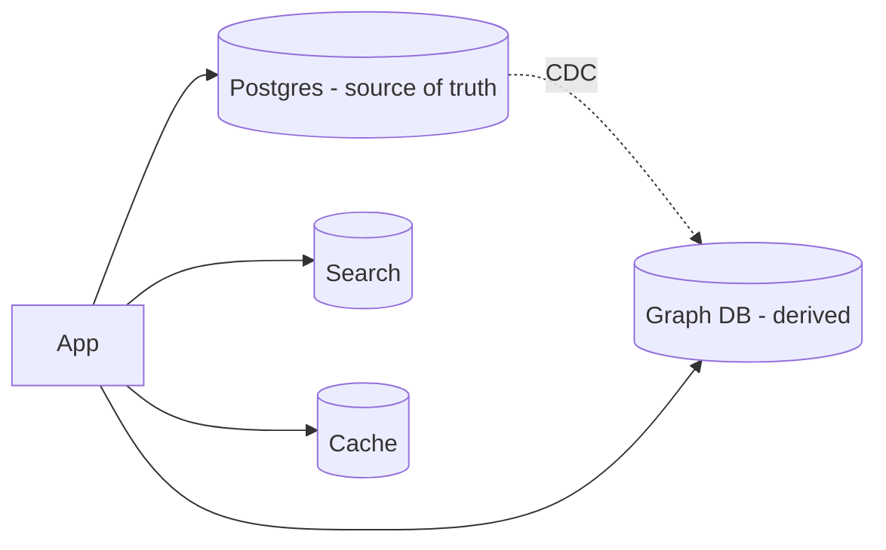

# Graph Databases (Neo4j, Neptune)

> **TL;DR** — A **graph database** stores **nodes** (entities) and **edges** (relationships) as first-class objects, optimized for fast traversal of those relationships. Where SQL needs multi-table joins and code, a graph DB lets you write "friends of friends of friends who like X" as a one-line query. Two main flavors: **labeled property graphs** (Neo4j, Memgraph, Neptune Property Graph) using Cypher / Gremlin; and **RDF triple stores** (Amazon Neptune RDF, Stardog) using SPARQL. Best for **social networks, fraud detection, recommendations, knowledge graphs, identity resolution, supply chains, network/infra modeling**. Niche, but irreplaceable when the workload is genuinely relationship-heavy.

---

## 1. The Model

```
   (Alice)─[FRIENDS_WITH]──►(Bob)──[FRIENDS_WITH]──►(Carol)
       │                       │
       │                  [LIKES]
       ▼                       ▼
    (Coffee Shop)         (Tomatoes)
```

Two atoms:
- **Node** — an entity with a label (e.g. `:Person`) and properties (`{name:"Alice",age:31}`).
- **Edge / relationship** — a typed, directed connection between nodes with its own properties (`:FRIENDS_WITH {since:2019}`).

Three big patterns:
- **Labeled Property Graph (LPG)** — what Neo4j, Memgraph, JanusGraph use. Nodes and edges have labels + key-value properties.
- **RDF (Resource Description Framework) / Triple Store** — every fact is a triple `(subject, predicate, object)`. The W3C Semantic Web stack. Querying with SPARQL.
- **Hypergraphs** — edges can connect more than two nodes; rare, mostly research.

---

## 2. Why a Graph DB and Not SQL?

You *can* model graphs in SQL — a `nodes` table and an `edges` table. But for deep traversals SQL falls apart:

> Find all people who are friends-of-friends-of-friends of Alice and also live in Berlin.

In SQL, three self-joins on the `edges` table. Joins compound; the planner struggles; performance scales poorly with depth.

In Cypher:
```cypher
MATCH (alice:Person {name:"Alice"})-[:FRIENDS_WITH*1..3]-(other:Person)
WHERE other.city = "Berlin"
RETURN DISTINCT other;
```

The graph engine **doesn't materialize joins** — it walks edges from one node to the next using **index-free adjacency** (each node knows its edges). 3-hop traversal stays roughly constant cost per node visited.

That's the whole pitch: **multi-hop queries are O(traversed) instead of O(joined cross-product).**

---

## 3. The Big Players

| Engine | Family | Notes |
| --- | --- | --- |
| **Neo4j** | LPG, Cypher | The most popular. Single-leader cluster ("causal cluster"); Aura is the managed offering. |
| **Memgraph** | LPG, Cypher | In-memory, C++, fast. Streams from Kafka natively. |
| **AWS Neptune** | LPG (Gremlin) + RDF (SPARQL) | Managed, AWS-native. |
| **JanusGraph** | LPG, Gremlin | Pluggable storage (Cassandra, HBase, Bigtable). |
| **TigerGraph** | LPG, GSQL | Massively parallel, deep analytics. |
| **ArangoDB** | Multi-model (graph + doc + KV) | AQL. |
| **OrientDB** | Multi-model | Older, smaller community. |
| **Dgraph** | LPG, GraphQL-ish | Native distributed. |
| **Stardog / GraphDB / Virtuoso** | RDF triple stores | SPARQL. Used in life sciences, government, enterprise knowledge graphs. |
| **Apache TinkerPop / Gremlin** | A *query language*, not a DB | Backend abstraction used by JanusGraph, Neptune, Cosmos DB. |

The default choice for most teams in 2026 is **Neo4j** for an OSS / self-managed graph workload, **Neptune** if you're deep in AWS, **Memgraph** for low-latency streaming.

---

## 4. Query Languages

### Cypher (Neo4j, Memgraph, ONgDB, openCypher)
The most readable graph language. Visual ASCII-art for patterns:
```cypher
// Recommendations: who else liked products I liked
MATCH (me:User {id:$me})-[:LIKED]->(p:Product)<-[:LIKED]-(other:User)
WHERE me <> other
WITH other, count(p) AS shared
ORDER BY shared DESC LIMIT 20
MATCH (other)-[:LIKED]->(rec:Product)
WHERE NOT (me)-[:LIKED]->(rec)
RETURN rec, count(*) AS score
ORDER BY score DESC LIMIT 10;
```
ISO standardized in 2024 as **GQL** — the new ISO query language for property graphs.

### Gremlin (TinkerPop, Neptune, JanusGraph, Cosmos DB)
Functional / fluent. Same query:
```groovy
g.V().has("User","id", me)
  .out("LIKED").in("LIKED").where(neq(me))
  .groupCount().by(id())
  .order(local).by(values, desc).limit(local, 20)
```
More powerful for graph-traversal as code; harder to read.

### SPARQL (RDF triple stores)
```sparql
SELECT ?friend ?city WHERE {
  :alice :friendsWith+ ?friend .
  ?friend :livesIn ?city .
  FILTER(?city = "Berlin")
}
```
SQL-flavored, with `+` meaning transitive closure of a predicate.

---

## 5. Core Concepts

### Index-free adjacency
The fundamental performance trick: each node stores pointers (or references) directly to its edges and neighbors. Walking edges doesn't cost an index lookup; it's a pointer dereference.

### Direction
Edges are typed and directed. `(a)-[:LIKES]->(b)` is *not* the same as `(b)-[:LIKES]->(a)`. Either side can be matched without direction (`-[:LIKES]-`).

### Labels (LPG)
Both nodes and edges have a label: `:Person`, `:Product`, `:FRIENDS_WITH`. Used for filtering and index targeting.

### Properties
Nodes and edges have key-value properties. Inline; no separate row.

### Indexes
Property-level B-tree / hash / full-text indexes accelerate finding the *start* nodes of a traversal. Once you've found the start node, traversal is index-free.

### Constraints
Uniqueness constraints, existence constraints, schema validation (Neo4j 5+).

---

## 6. Where Graph DBs Shine

| Use case | Why a graph fits |
| --- | --- |
| **Social networks** | "Friends of friends," shortest path, mutual connections |
| **Recommendations** | Collaborative filtering, "users who liked X also liked Y" via path-based scoring |
| **Fraud detection** | Find rings, suspicious shared attributes across accounts |
| **Identity resolution** | Merge entities across systems via overlapping properties |
| **Knowledge graphs** | Reasoning over an ontology (Google's KG, Wikidata) |
| **Supply chains** | Trace component lineage, impact analysis |
| **Network / infrastructure** | Topology, dependency analysis, blast radius |
| **Master data management** | "What's the canonical record across 12 sources?" |
| **Access control** | Permission graphs ("can A read B?") — Google Zanzibar style |
| **Route / pathfinding** | Shortest paths, A*, Dijkstra natively |
| **Genealogy / biology** | Ancestry, biological pathways |

When you hear "deep relationships matter and we keep writing recursive CTEs in SQL", that's a graph DB use case.

---

## 7. Where Graph DBs Don't Shine

- **Tabular CRUD** — orders, payments, line items. Relational still wins.
- **Massive ingest of analytics events** — use Kafka + warehouse / wide-column.
- **Time-series** — use a TSDB.
- **Full-text search** — Elasticsearch.
- **Hot transactional throughput** — graph DBs often top out earlier than relational on raw writes/sec.
- **Strict relational integrity** with foreign keys — relational does it natively.

A common pattern: **Postgres as system-of-record** + **graph DB as a derived store** populated via CDC, used for the graph-shaped queries.

---

## 8. Architecture & Scale

### Neo4j
- Single-leader cluster with multiple followers ("causal cluster").
- All writes go to the leader; followers serve reads with bookmarks ("read your own writes").
- "Fabric" feature shards across multiple databases for horizontal scale.

### TigerGraph / Memgraph
- Massively parallel processing on a single cluster.
- Multi-machine partitioning.

### JanusGraph
- Storage pluggable into Cassandra, HBase, Bigtable, Berkeley DB.
- Inherits the scale of the underlying store.

### Neptune
- Managed, AWS-native, fault-tolerant via storage layer (Aurora-like).
- Reader/writer instances.

### Triple stores (Stardog, GraphDB)
- Often disk-backed B-trees over RDF triples.
- Reasoning engine adds inference on top of stored facts.

Real-world scale points:
- A single Neo4j or Memgraph can hold **billions of nodes and edges** on a modest box.
- For **trillion-edge** graphs, you need TigerGraph, JanusGraph on Cassandra, or specialized in-house systems (Meta's TAO).

---

## 9. Modeling Tips

- **Nodes are nouns; edges are verbs.** A `Person` *is*; "friends with" *happens between*.
- **Push attributes onto edges** when they belong to the relationship, not the entity. Example: `:RATED {stars:4, when:2026-01-01}`.
- **Use multiple labels** for shared behavior: `(:Person:Customer)`.
- **Indexes on starting properties** (`name`, `email`, `id`) to find traversal roots quickly.
- **Avoid super-nodes** when you can. A node with 100M edges (a celebrity, a category) creates hotspots in traversals.
- **Constraint** that uniqueness applies (e.g., `email` on `:Person`) — saves a lot of dedup logic.

### Super-node problem
A `:Tag {name:"music"}` connected to 10M items is a super-node. Queries that pass through it are slow. Solutions:
- Partition the relationship (`:TAGGED_RECENT`, `:TAGGED_OLD`).
- Add intermediate "bucket" nodes.
- Filter early using indexed properties before walking the giant edge fan-out.

---

## 10. Worked Example: A Fraud Ring

```
Suspect signals:
   - same device fingerprint
   - same payment method
   - same address normalization
   - same referral path

   (acctA)─[:USES_DEVICE]─►(dev_x)◄─[:USES_DEVICE]─(acctB)
   (acctA)─[:USES_CARD]──►(card_1)◄─[:USES_CARD]──(acctC)
   (acctB)─[:USES_CARD]──►(card_1)
   (acctC)─[:REFERRED_BY]─►(acctA)
```

Query: "Find groups of ≥3 accounts that share at least two attributes."

```cypher
MATCH (a:Account)-[:USES_DEVICE|USES_CARD|LIVES_AT]->(attr)<-[:USES_DEVICE|USES_CARD|LIVES_AT]-(b:Account)
WHERE id(a) < id(b)
WITH a, b, count(DISTINCT attr) AS shared
WHERE shared >= 2
WITH collect({a:a, b:b}) AS pairs
// Cluster connected components from pairs ...
RETURN size(pairs) AS suspicious;
```

In SQL, this is a multi-self-join nightmare. In a graph, it's natural.

---

## 11. Operations & Limits

- **Backups** — engine-specific tools (Neo4j has `neo4j-admin`).
- **Cluster upgrades** — usually rolling.
- **Memory** — graph workloads often benefit from "warm cache" / page-cache priming. Memgraph keeps everything in RAM.
- **Transactional model** — Neo4j is ACID; many others are too. Multi-statement transactions supported.
- **Streaming updates** — Memgraph, Neo4j, Neptune all support CDC-in / CDC-out via various integrations.
- **Visualization** — Neo4j Bloom, Memgraph Lab, Gephi, Linkurious — making humans sense the graph.

---

## 12. Picking a Graph DB

```
Need OSS, single-cluster, well-loved tooling?
  → Neo4j (Community / Enterprise / Aura).

Need extremely low-latency, in-memory, streaming-first?
  → Memgraph.

Already on AWS, want managed?
  → Neptune (Property Graph or RDF).

Want pluggable storage on top of Cassandra?
  → JanusGraph.

Massively parallel deep analytics on trillion-edge graphs?
  → TigerGraph.

Semantic web / RDF reasoning?
  → Stardog / GraphDB / Virtuoso.

Just need *some* graph queries, hate adding infra?
  → Postgres recursive CTEs + Apache AGE (graph extension on Postgres).
```

For most teams that aren't graph-first: **start with Postgres** (recursive CTEs, AGE extension). Promote to a real graph DB when you can prove the read patterns are dominated by deep traversal.

---

## 13. Common Mistakes

- Treating a graph DB as a generic OLTP store. It isn't.
- Modeling everything as nodes/edges including attributes that should be properties.
- Super-nodes from naive modeling (tags, categories, hubs).
- Skipping indexes on traversal-start properties.
- Forgetting that pure graph queries can still **N+1** in code if you don't return the right paths.
- Running deep unbounded queries from production user input → DoS by traversal. Always cap depth.
- Trying to do analytics across the whole graph in OLTP. Use a graph-analytics pipeline (Pregel, GraphX, Neo4j GDS library) on a snapshot.
- Putting *everything* in the graph. Often the right pattern is "Postgres for facts, graph for relationships."

---

## 14. The Hybrid Pattern



You don't *replace* your transactional DB; you stand up a graph DB next to it. CDC keeps the graph in sync (using Debezium → Kafka → graph loader). The app uses Postgres for ordinary CRUD and the graph DB for the queries that benefit from traversal.

This pattern keeps you safe: graph DBs are powerful but smaller-community and operationally less forgiving. Decoupling means you can rebuild the derived graph if you make a modeling mistake.

---

## 15. Cheat Card

```
GRAPH DB  = first-class nodes & edges. Optimized for traversals.

MODELS
  Labeled Property Graph (Neo4j, Memgraph, Neptune-LPG, JanusGraph)
  RDF triple store        (Stardog, GraphDB, Virtuoso, Neptune-RDF)

LANGUAGES
  Cypher / GQL (ISO 2024)   — readable, ASCII-art patterns.
  Gremlin (TinkerPop)        — fluent traversal API.
  SPARQL                      — RDF.

KEY IDEA
  index-free adjacency: each node knows its edges directly.
  multi-hop = O(traversed), not O(joined).

USE FOR
  social, fraud, recommendations, knowledge graphs,
  identity resolution, supply chain, network topology,
  access control (Zanzibar-style), path-finding.

DON'T USE FOR
  tabular CRUD, analytics, time-series, full-text — use the right tool.

PITFALLS
  super-nodes, unbounded traversals, no indexes on start properties,
  using a graph DB as primary OLTP for everything.

HYBRID  Postgres = system of record. Graph DB = derived store via CDC.
```

---

## 16. Resources

### Books
- *Graph Databases* (2nd ed.) — Robinson, Webber, Eifrem (Neo4j team). Free PDF: <https://graphdatabases.com/>
- *Designing Data-Intensive Applications* — Kleppmann; Ch. 2 covers graph data models.
- *Knowledge Graphs* — Aidan Hogan et al. — semantic web / RDF deep dive.
- *Graph Algorithms* — Mark Needham, Amy Hodler.

### Documentation
- **Neo4j docs** — <https://neo4j.com/docs/>
- **Memgraph docs** — <https://memgraph.com/docs>
- **Neptune docs** — <https://docs.aws.amazon.com/neptune/>
- **TigerGraph docs** — <https://docs.tigergraph.com/>
- **Apache TinkerPop / Gremlin** — <https://tinkerpop.apache.org/>
- **OpenCypher / GQL spec** — <https://opencypher.org/>

### Articles
- "When to use a Graph Database" — Neo4j blog.
- "Graph data modeling guide" — Neo4j.
- "Google Knowledge Graph" — Google blog.
- "Zanzibar: Google's Consistent, Global Authorization System" — paper on auth as a graph problem.
- "Facebook TAO: The graph data store" — paper.
- "How LinkedIn uses graphs": engineering blog.

### Videos
- ByteByteGo: "What is a Graph Database?" — <https://www.youtube.com/@ByteByteGo>
- Neo4j Live / GraphConnect talks on YouTube.
- Hussein Nasser graph DB videos — <https://www.youtube.com/@hnasr>

### Tools
- **Neo4j Bloom / Browser** — UI to query and visualize.
- **Memgraph Lab** — IDE for Memgraph.
- **Apache AGE** — Postgres extension that adds Cypher.
- **Gephi**, **Cytoscape**, **Linkurious** — graph visualization.
- **Neo4j Graph Data Science (GDS) library** — algorithms (PageRank, community detection, shortest paths).

### Adjacent reading
- [SQL vs NoSQL](./sql-vs-nosql.md)
- [Wide-Column Stores](./wide-column-stores.md)
- [Change Data Capture →](./cdc.md)
- [PageRank Algorithm →](../19-advanced/pagerank.md)
- [Recommendation System →](../18-case-studies/recommendation-system.md)
- [Fraud detection / social graph case studies](../18-case-studies/)

---

*Previous:* [← Wide-Column Stores](./wide-column-stores.md)  |  *Next:* [Time-Series Databases →](./time-series-databases.md)
