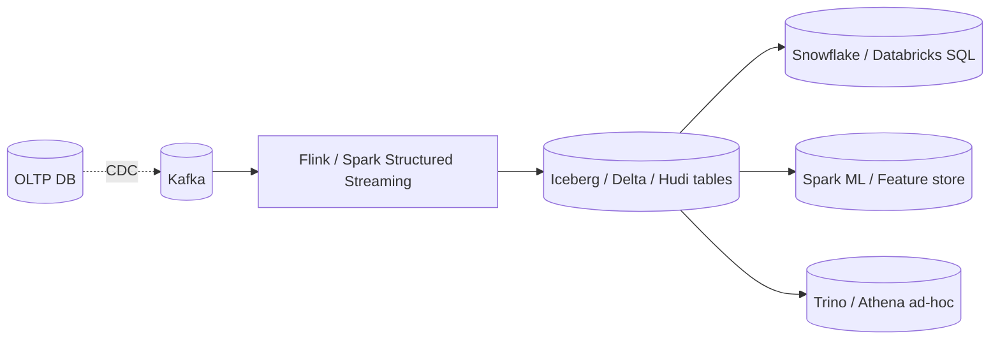

# Lakehouse Architecture (Delta Lake, Iceberg, Hudi)

> **TL;DR** — A **lakehouse** is a **data lake** (cheap object storage with files in open columnar formats) made *behave like a data warehouse* through an **open table format** layered on top. The table format (Delta Lake, Apache Iceberg, Apache Hudi) adds **ACID transactions, time travel, schema evolution, hidden partitioning, and concurrent writers** to Parquet files in S3/GCS/ADLS. Any compatible engine — Spark, Trino, Flink, Snowflake, BigQuery, Databricks SQL — can read or write the same tables. The result: one source of truth for both analytics and ML, no copy into a proprietary warehouse required.

---

## 1. The Pitch

```
Old world: two stores
  ┌─────────────┐                      ┌─────────────┐
  │   LAKE      │ ─ETL─►              │   WAREHOUSE │
  │ S3 + Parquet│                      │ Snowflake / │
  │ Spark / ML  │                      │ Redshift /  │
  │  no ACID    │                      │ BQ — fast SQL│
  └─────────────┘                      └─────────────┘

Lakehouse: one store, two consumers
  ┌──────────────────────────────────────────────────┐
  │   LAKEHOUSE                                       │
  │   S3 / GCS / ADLS                                  │
  │   Parquet files + Iceberg / Delta / Hudi metadata │
  │   ACID, time travel, schema evolution             │
  │                                                   │
  │   Read/write from Spark · Trino · Flink ·         │
  │   Snowflake · BigQuery · Databricks · DuckDB      │
  └──────────────────────────────────────────────────┘
```

Same files, same metadata, all engines. No data duplication for analytics + ML + streaming.

---

## 2. Why Lakehouses Exist

Pre-2020 the choice was painful:
- **Lake** — cheap, flexible, but no ACID, no schema enforcement, no clean updates / deletes (Parquet is immutable).
- **Warehouse** — fast SQL, governed, but proprietary, expensive, hard to use for ML training data.

Companies built **two copies** (lake for raw + ML, warehouse for analytics). Cost doubled, lineage was messy, governance fragmented.

A **table format** (metadata layer over Parquet) solved this. It tracks which Parquet files belong to a logical "table", in what state, with what schema, at what point in time. Engines that understand the format treat the lake folders like a real database.

---

## 3. What a Table Format Adds

| Capability | Why it matters |
| --- | --- |
| **ACID transactions** | Concurrent writers no longer corrupt the table. Failed writes auto-roll-back. |
| **UPDATE / DELETE / MERGE** | GDPR "right to be forgotten," upserts, CDC sinks. |
| **Time travel** | Query the table "as of yesterday at 14:00." Compare versions. |
| **Schema evolution** | Add / rename / drop columns without rewriting all files. |
| **Partition evolution** (Iceberg) | Change partition spec without rewriting history. |
| **Hidden partitioning** (Iceberg) | Users query naturally; the engine handles partitioning. |
| **Snapshots & branching** | Git-like workflows for data. |
| **Statistics + skipping** | File-level min/max + row-group stats prune scans. |
| **Compaction / OPTIMIZE** | Merge small files for query speed. |
| **Vacuum / GC** | Remove old snapshot files safely. |

The Parquet files don't change. The **metadata** describes the table state on top.

---

## 4. The Three Big Formats

### Delta Lake
- Open-sourced by Databricks (2019).
- Mature and widely adopted on the Databricks platform.
- Stores a **transaction log** (`_delta_log/`) of JSON commit files + checkpoints.
- Strong on Spark; growing engine support (Trino, Flink, Iceberg-compat layer, Snowflake reads).

### Apache Iceberg
- Created at Netflix, donated to Apache (2018).
- Strong engineering: hidden partitioning, partition evolution, snapshot isolation, branches & tags.
- Engine-agnostic from day one — Trino, Spark, Flink, Hive, Snowflake (read+write), BigQuery (via BigLake), Dremio, DuckDB.
- Currently the *fastest-moving* open table format in 2026.
- Metadata stored as JSON / Avro manifest files referenced via a **catalog** (Glue, Nessie, REST, JDBC, Hive Metastore, Snowflake Polaris).

### Apache Hudi
- Created at Uber, donated to Apache (2017).
- First mover on **streaming upserts** (record-level inserts/updates).
- Two table types: **Copy-On-Write (COW)** and **Merge-On-Read (MOR)**.
- Strong for CDC sinks, change capture.
- Slightly less momentum than Iceberg/Delta today but a great fit for streaming-heavy workloads.

### What format wins in 2026?
- Industry consensus is shifting toward **Iceberg as the open standard**: Snowflake, BigQuery, Databricks (via Delta-Iceberg interop), AWS, and Confluent all support it.
- **Delta Lake** is the default if you're in Databricks-heavy shops; it's also evolving toward Iceberg compatibility.
- **Hudi** holds strong in streaming-CDC scenarios.

All three converge on the same set of capabilities; pick by ecosystem fit.

---

## 5. The Anatomy of an Iceberg Table

```
s3://lake/db/orders/
   metadata/
     v1.metadata.json                ← table schema, partition spec, snapshot id
     v2.metadata.json
     v3.metadata.json
     snap-...-1.avro                  ← list of manifests for snapshot 1
     snap-...-2.avro
     ...
     manifest-list-...-3.avro         ← list of manifest files for current snapshot
     ...
   data/
     dt=2026-05-18/00000-...-part-0.parquet
     dt=2026-05-18/00000-...-part-1.parquet
     dt=2026-05-19/00000-...-part-0.parquet
     ...
```

Reading a table = read the catalog → find current snapshot → read manifest list → read manifests → know which Parquet files to scan, with stats for pruning.

Writing a table = produce new Parquet files → write a new manifest → write a new snapshot → **atomically swap pointer** in the catalog. That swap is the ACID magic.

---

## 6. Catalogs

Table formats need a **catalog** to point at the "current" metadata file. Options:

- **Hive Metastore** — the original; widely used.
- **AWS Glue Data Catalog** — managed, integrates with most AWS services.
- **Nessie** — git-like, branching catalog for Iceberg.
- **Polaris** — Snowflake's open REST catalog (donated to Apache 2024).
- **Unity Catalog** — Databricks' governance catalog (open-sourced 2024).
- **Apicurio, Apache Gravitino, REST catalogs** — emerging.

The trend in 2024–2026: **open catalogs** (Polaris, Unity, Nessie, REST API) so any engine can speak to the lake.

---

## 7. Where Lakehouses Shine

- **Single source of truth** for both BI (SQL) and ML (Python/Spark).
- **Open formats** — avoid vendor lock-in.
- **Cost** — storage in cheap object storage; compute elastic per workload.
- **Multi-engine** — Snowflake for BI, Databricks for ML, Trino for ad-hoc, Flink for streaming — all on the same tables.
- **Streaming + batch unification** — many engines treat a lakehouse table as both source and sink.
- **GDPR-style deletes** without rewriting whole partitions.
- **Time travel** for audits and reproducible ML training.
- **Multi-cloud** — same Parquet + Iceberg works on S3, GCS, ADLS.

---

## 8. Where They Struggle (or Need More Work)

- **OLTP-style row updates** — possible but slower than a warehouse; not for high-QPS writes.
- **Concurrency** — multiple concurrent writers to the same table can conflict; engines need to retry.
- **Small-file problem** — streaming ingest creates many small files; compaction is mandatory.
- **Metadata growth** — long-running tables accumulate snapshots; vacuuming needs to run.
- **Tool maturity** — schema evolution, especially across engines, still has gotchas.
- **Latency** — lake-style storage isn't sub-second like ClickHouse / Druid.
- **Cost surprises** — many readers on huge tables means lots of S3 GET requests.

The lakehouse is genuinely production-ready in 2026, but it's still *plumbing-heavy* — invest in operations.

---

## 9. Streaming Lakehouse

The killer combo: **CDC + Iceberg/Delta/Hudi**.



- CDC events stream into a lakehouse table.
- The table maintains the latest state with ACID.
- Analytics, ML, and ad-hoc all read the same table.
- "Source of truth" lives in S3 instead of a specific warehouse.

This is the direction the industry is moving — same data, many engines, open format.

---

## 10. Common Lakehouse Operations

### MERGE / UPSERT (Spark on Delta)
```sql
MERGE INTO orders t
USING staged s ON t.order_id = s.order_id
WHEN MATCHED THEN UPDATE SET *
WHEN NOT MATCHED THEN INSERT *;
```

### Time travel
```sql
-- Delta
SELECT * FROM orders VERSION AS OF 100;
SELECT * FROM orders TIMESTAMP AS OF '2026-05-18';

-- Iceberg
SELECT * FROM orders.snapshots;
SELECT * FROM orders FOR VERSION AS OF 4567;
SELECT * FROM orders FOR TIMESTAMP AS OF '2026-05-18T14:00:00';
```

### Schema evolution
```sql
ALTER TABLE orders ADD COLUMNS (channel string);
ALTER TABLE orders RENAME COLUMN cust_id TO customer_id;
```

### Optimize / compact
```sql
-- Delta
OPTIMIZE orders ZORDER BY (customer_id, order_date);

-- Iceberg
CALL system.rewrite_data_files('orders');
CALL system.rewrite_manifests('orders');
```

### Vacuum old snapshots
```sql
VACUUM orders RETAIN 168 HOURS;     -- Delta
CALL system.expire_snapshots('orders', TIMESTAMP '2026-05-01 00:00:00');  -- Iceberg
```

---

## 11. Operations

- **Partition evolution** (Iceberg) lets you change partitioning without rewriting history — huge for long-lived tables.
- **OPTIMIZE / compaction** must run regularly. Small-file problem is a real killer.
- **Snapshot retention** — keep weeks or months for time travel; vacuum the rest.
- **Catalog HA** — your catalog is now critical infra; treat it like one.
- **Permissions** — Unity Catalog, Lake Formation, Polaris, Ranger all add fine-grained authz on lake tables.
- **Monitoring** — table size, file count, manifest count, snapshot age, write conflict rate.
- **Concurrent writes** — use optimistic concurrency + retries.

---

## 12. Lakehouse vs Warehouse — Picking

```
Heavy ML / data science + BI on the same data?
  → Lakehouse (Iceberg / Delta) + Databricks / Spark / Trino.

Pure SQL analytics, small team, want zero ops?
  → Managed warehouse (Snowflake / BigQuery).

Multi-engine, multi-cloud, open formats matter?
  → Iceberg on S3 + Snowflake/BQ/Databricks reading the same tables.

Streaming-CDC heavy?
  → Hudi or Iceberg with Flink.

Already in Databricks ecosystem?
  → Delta Lake.

Sub-second real-time queries?
  → ClickHouse / Druid / Pinot alongside the lakehouse.
```

A common pattern: **Iceberg on S3 as the canonical store** + **Snowflake / Databricks / Trino** for compute + **dbt** for transforms.

---

## 13. The Ecosystem in 2026

- **Snowflake** — reads & writes Iceberg natively; storage-engine choice per table.
- **BigQuery** — Iceberg via BigLake; external table federation.
- **Databricks** — Delta Lake (native), Iceberg interop via Uniform format.
- **AWS** — S3 Tables (managed Iceberg), Athena, Glue, EMR, Redshift Iceberg integration.
- **GCP** — BigLake, Spanner federation.
- **Trino / Presto** — read/write Iceberg, Delta, Hudi.
- **Flink** — read/write Iceberg, Hudi.
- **DuckDB** — query Iceberg/Delta via extensions; runs on a laptop.

Open formats are commoditizing; vendors are competing on **performance + tooling + governance**, not on storage lock-in.

---

## 14. Common Mistakes

- **Skipping compaction** — small-file storm; queries slow to a crawl.
- **No catalog discipline** — orphaned files, ghost tables.
- **Streaming writes without checkpoints** — duplicate or lost records on restart.
- **No snapshot vacuum** — metadata growth pegs the catalog.
- **Using lakehouse as OLTP** — wrong tool.
- **Mixed schemas in the same Parquet folder** — engines disagree on the type.
- **Engine-specific extensions** that other engines don't understand — defeating the open-format point.
- **Ignoring governance** — Unity / Polaris / Lake Formation exist for good reasons.
- **PII in the open lake without column-level masking or encryption.**

---

## 15. Cheat Card

```
LAKEHOUSE   data lake (Parquet on S3/GCS/ADLS) + open table format
             (Delta · Iceberg · Hudi) + open catalog → ACID, time travel,
             schema evolution, multi-engine.

FORMATS
  Iceberg  most open momentum, partition evolution, hidden partitioning.
  Delta    born at Databricks; mature; interop layers improving.
  Hudi     streaming-CDC upserts strength.

CAPABILITIES
  ACID transactions · UPDATE / DELETE / MERGE · time travel ·
  schema evolution · partition evolution (Iceberg) · snapshots / branches ·
  file-level statistics · compaction.

ARCHITECTURE
  Catalog → metadata pointer → manifest list → manifests → Parquet files.
  Atomic pointer swap = commit.

ENGINES (all read the same tables)
  Spark · Trino / Presto / Athena · Flink · Snowflake · BigQuery ·
  Databricks SQL · DuckDB.

OPERATE
  Run COMPACT / OPTIMIZE.   Vacuum old snapshots.   Watch file count.
  HA the catalog.    Plan write concurrency / retries.

USE FOR
  one source of truth for analytics + ML + streaming · multi-cloud · open formats.

DON'T USE FOR
  OLTP · sub-second real-time queries (use ClickHouse/Druid/Pinot) · tiny data.
```

---

## 16. Resources

### Foundational
- "Lakehouse: A New Generation of Open Platforms" — Armbrust et al. (CIDR 2021): <https://www.databricks.com/wp-content/uploads/2020/12/cidr_lakehouse.pdf>
- "What is a Lakehouse?" — Databricks blog (Feb 2020): <https://www.databricks.com/blog/2020/01/30/what-is-a-data-lakehouse.html>
- "Iceberg: a fast table format for huge analytic datasets" — Netflix paper / blog.

### Documentation
- **Apache Iceberg** — <https://iceberg.apache.org/docs/latest/>
- **Delta Lake** — <https://docs.delta.io/latest/>
- **Apache Hudi** — <https://hudi.apache.org/docs/overview>
- **Polaris (open catalog)** — <https://polaris.apache.org/> (incubating)
- **Nessie (git-like catalog)** — <https://projectnessie.org/>
- **Unity Catalog (open-sourced 2024)** — <https://www.unitycatalog.io/>
- **AWS S3 Tables (managed Iceberg)** — AWS docs.

### Articles
- "Iceberg vs Delta vs Hudi" — many side-by-side blog posts; Tabular, Onehouse, Dremio comparisons.
- "Apache Iceberg architecture in depth" — Dremio: <https://www.dremio.com/blog/apache-iceberg-101-your-guide-to-getting-started/>
- "Delta Lake: The Data Lakehouse Format" — Databricks blogs.
- "Apache Hudi vs Delta vs Iceberg" — Onehouse posts.
- "How Netflix uses Iceberg" — Netflix Tech Blog.
- "Snowflake supports Iceberg tables" — Snowflake blog.
- "BigLake & Iceberg" — Google Cloud blog.

### Videos
- ByteByteGo: "What is a Data Lakehouse?" — <https://www.youtube.com/@ByteByteGo>
- "Iceberg deep dive" — Netflix / Apple conference talks on YouTube.
- "Why Delta Lake" — Michael Armbrust talks.
- Databricks Data + AI Summit, Snowflake Summit talks.

### Books
- *Apache Iceberg: The Definitive Guide* — Dremio team.
- *Delta Lake: Up and Running* — Bennie Haelen, Dan Davis (O'Reilly).
- *Designing Cloud Data Platforms* — Zburivsky & Partner.
- *Building the Data Lakehouse* — Bill Inmon et al.

### Tools
- **Iceberg / Delta / Hudi** OSS projects.
- **Tabular** (Iceberg-as-a-service, acquired by Databricks 2024).
- **Onehouse** (Hudi-as-a-service).
- **Dremio / Starburst / Trino** — query engines.
- **Apache Spark + dbt + Airflow** — transforms.
- **DuckDB + Iceberg / Delta extensions** — query lakehouse from a laptop.

### Adjacent reading
- [Data Warehouses & Data Lakes](./warehouses-lakes.md)
- [OLTP vs OLAP](./oltp-vs-olap.md)
- [Change Data Capture](./cdc.md)
- [Object Storage →](../09-storage/object-storage.md)
- [ETL vs ELT →](../17-big-data/etl-vs-elt.md)
- [Data Pipelines & Orchestration →](../17-big-data/data-pipelines.md)
- [Apache Spark / Flink →](../17-big-data/spark.md)

---

*Previous:* [← Data Warehouses & Data Lakes](./warehouses-lakes.md)  |  *Up:* [README ↑](../README.md)
