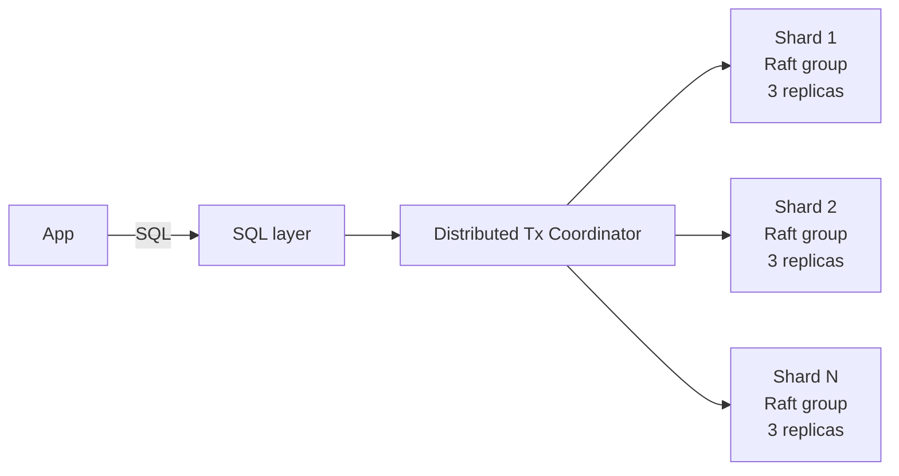

# NewSQL (CockroachDB, Spanner, TiDB)

> **TL;DR** — **NewSQL** databases bring back what NoSQL gave up: **SQL, ACID transactions, and strong consistency** — while keeping the **horizontal scalability** NoSQL pioneered. They achieve this with **sharded storage + a distributed consensus protocol (Raft / Paxos) per shard** plus a clever transaction protocol. Pioneered by Google **Spanner** (2012, the paper) and brought to OSS by **CockroachDB**, **TiDB**, **YugabyteDB**, **Vitess**. Use them when you need *global SQL with strong consistency at scale* — and accept the higher operational and latency cost compared to a single-region Postgres.

---

## 1. The Promise

For decades the trade-off was:
- **Relational + ACID + SQL** → vertically scaled (one big primary).
- **Horizontally scalable** → NoSQL, eventual consistency, no joins.

NewSQL says: *you can have both.*

```
       SQL + ACID                NewSQL                     NoSQL
       (Postgres / MySQL)        (Spanner / Cockroach /     (Cassandra / Dynamo /
                                  YugaByte / TiDB)            MongoDB)
       ─────────────────         ────────────────────       ─────────────────────
       Single-leader            Many shards, each with     Many shards, eventual
       Vertically scaled        Raft/Paxos quorum          consistency or tunable
       Hard to scale globally   SQL + transactions          Per-key consistency
                                Horizontal scale            No joins / weak SQL
```

The trick: **shard the data, and run a consensus protocol per shard** so each shard is itself a tiny strongly-consistent replicated state machine.

---

## 2. The Players

| Engine | Notes |
| --- | --- |
| **Google Spanner** | The original, 2012 paper. Closed, hosted on GCP. Uses **TrueTime** atomic clocks for global external consistency. |
| **CockroachDB** | OSS implementation of Spanner ideas. Postgres wire protocol. Cloud SQL across regions. |
| **YugabyteDB** | OSS. Postgres or Cassandra-compatible. Strong consistency. |
| **TiDB** (PingCAP) | OSS. MySQL wire protocol. Storage layer (TiKV) + SQL layer separated. |
| **Vitess** | OSS. Sharded MySQL. Started at YouTube. Used by Slack, GitHub, PlanetScale. Not strictly NewSQL — it's MySQL with sharding tooling. |
| **PlanetScale** | Managed Vitess. |
| **AlloyDB Omni / AlloyDB** | Postgres-compatible, GCP. Single-region scale-out via columnar acceleration. |
| **NuoDB / VoltDB / MemSQL/SingleStore / FoundationDB** | Various flavors of NewSQL with different niches (in-memory, real-time analytics, ordered KV). |

Practical defaults: **CockroachDB** if you want OSS-friendly Spanner-like; **Spanner** if you're deep in GCP; **TiDB** for MySQL-compatible distributed SQL; **Vitess / PlanetScale** when you want sharded MySQL specifically.

---

## 3. The Core Architecture



- **Storage layer** — data is sharded by key range (CockroachDB, Spanner, TiKV) or hash. Each shard is replicated 3× (or 5×) using **Raft** or **Paxos**. Each shard is its own strongly-consistent state machine.
- **SQL layer** — parses SQL, plans, executes; pushes predicates and aggregations to shards where possible.
- **Distributed transaction coordinator** — orchestrates multi-shard ACID transactions using 2-phase commit + careful protocols (Spanner: TrueTime; Cockroach: HLC + intent locks; TiDB: Percolator-style; YugabyteDB: Hybrid Logical Clocks).
- **Time** — Spanner's TrueTime provides bounded clock uncertainty using GPS + atomic clocks. Open-source NewSQLs use **Hybrid Logical Clocks (HLC)** to approximate without specialized hardware.

The result: SQL transactions that span shards (or even regions) and remain **serializable / strongly consistent**.

---

## 4. Spanner's TrueTime — A Brief Aside

Spanner's secret sauce is **TrueTime**, an API that returns a *range* `[earliest, latest]` for "now," with bounded uncertainty (typically a few ms thanks to GPS + atomic clocks in every datacenter).

For each transaction, Spanner waits until the uncertainty has passed before committing — guaranteeing **external consistency**: if T1 commits before T2 starts, T1's timestamp < T2's timestamp, *globally*.

Open-source NewSQLs can't run atomic clocks at every node, so they use HLC + intent locks and accept slightly weaker (or different) consistency guarantees. In practice, both achieve serializable transactions; Spanner just has a more elegant time story.

---

## 5. What You Get vs Postgres

| | Postgres (single-leader) | NewSQL |
| --- | --- | --- |
| SQL | ✅ rich | ✅ (slightly limited surface) |
| ACID transactions | ✅ | ✅ |
| Joins, foreign keys | ✅ | ✅ (mostly) |
| Horizontal writes | ❌ (single primary) | ✅ |
| Multi-region | Manual / single-region | First-class |
| Read replicas | ✅ async | ✅ + fresh follower reads |
| Failover | Promote replica | Automatic via consensus |
| Operational complexity | Low | Higher |
| Latency for cross-region txns | N/A | Higher (consensus + wait) |
| Cost | Lower | Higher |

If you can fit on a vertically scaled Postgres (and most teams can), do that. NewSQL is for when you genuinely need **(SQL + ACID) AND (horizontal / multi-region)**.

---

## 6. Strong vs Local Reads

NewSQL gives you reads at multiple consistency levels:
- **Default linearizable reads** — go through the leader; might be cross-region; correct but slower.
- **Follower reads / stale reads** — read from a nearby replica at a slightly-stale timestamp (Spanner / Cockroach: e.g., "as of 5 s ago"). Faster, eventually consistent.
- **Bounded staleness** — "fresh within 100 ms".
- **Read-your-writes** — guaranteed to see the writer's own commits.

Choosing the right read level per query is a real performance lever in NewSQL.

---

## 7. Data Locality (Multi-Region Done Right)

NewSQL lets you control **where each row lives**.

CockroachDB / Spanner:
- **Regional tables** — pinned to a single region; low write latency there.
- **Multi-region tables** with **leader pinning** — leader in EU for EU customers, US for US customers; reads stay local.
- **Global tables** — small, slowly-changing reference data replicated everywhere; reads are local, writes traverse the world.

```
CREATE TABLE users (
  id uuid,
  region crdb_internal_region,
  ...
) LOCALITY REGIONAL BY ROW AS region;
```

A row's region drives where its leader lives. Users in EU pay EU latencies; users in US pay US latencies — without sharding logic in your application.

---

## 8. Transactions That Span Shards

Multi-shard transactions are *the* hard problem. NewSQLs use variants of:

- **Two-phase commit (2PC)** with locks (Spanner-flavored).
- **Percolator** — write intent records, commit via timestamp oracle (TiDB).
- **Calvin-style deterministic transactions** (FaunaDB).

You write SQL; the engine handles the protocol:
```sql
BEGIN;
  UPDATE accounts SET balance = balance - 100 WHERE id = 'a';
  UPDATE accounts SET balance = balance + 100 WHERE id = 'b';
COMMIT;
```
If `a` and `b` live in different shards (possibly different regions), the coordinator runs 2PC across them. **Latency = at least one cross-shard round trip.** Often acceptable; sometimes not.

---

## 9. Performance Realities

- **Single-row writes**: a few ms, usually local-region quorum.
- **Single-row reads (leader / follower)**: sub-ms to ~10 ms depending on locality.
- **Multi-row transactions in one region**: 5–30 ms.
- **Multi-region transactions**: tens to hundreds of ms (consensus round trips across continents).
- **Analytics workloads**: NewSQL is OLTP-first; for big analytical queries use a warehouse or HTAP features (TiDB has TiFlash columnar; Cockroach is mostly OLTP).

You pay for SQL+ACID at scale with **latency, cost, and ops**. Worth it when the alternative is rolling your own sharding + eventual consistency mess.

---

## 10. Compatibility Wire Protocols

- **CockroachDB** speaks the **Postgres wire protocol**. Almost any Postgres client works.
- **YugabyteDB** speaks both Postgres (YSQL) and Cassandra (YCQL).
- **TiDB** speaks the **MySQL wire protocol**. MySQL clients work.
- **Vitess** speaks MySQL.
- **Spanner** has its own protocol with rich SDKs.

This is enormous: you reuse drivers, ORMs, migration tools, dashboards, BI connectors.

---

## 11. Vitess — Sharded MySQL Done Right

A special case worth knowing.

- **YouTube** built Vitess to scale MySQL. **Slack**, **GitHub**, **HubSpot**, **PlanetScale** run on it.
- Architecturally: a fleet of MySQL primaries, each shard with its own replicas, fronted by a **VTGate** that routes and aggregates queries.
- **Online schema changes**, **vreplication**, **resharding**, **automatic failover**.
- Mostly **eventually consistent** across shards by default; you pick which guarantees you need per query.

Vitess isn't a pure NewSQL — there's no Spanner-grade global ACID — but it solves the *"my MySQL can't fit on one box anymore"* problem cleanly. For many companies it's the right answer.

---

## 12. When NewSQL Is The Right Call

- **Global SaaS** with users in many regions where each row's locality matters.
- **Financial** systems needing strict ACID + horizontal scale.
- **Multi-tenant platforms** where one shard isn't enough.
- **Outgrew a sharded MySQL/Postgres** and don't want to manage sharding manually.
- **Need both transactions and read scaling** at a scale Postgres won't sustain.

## 13. When It's The Wrong Call

- **Single region, single-tenant, well within Postgres limits.** A beefy Postgres is simpler and cheaper.
- **You really need eventual-consistency throughput** (analytics fan-out, hot-key writes). NoSQL or wide-column is better.
- **Mostly read-heavy with cacheable data.** Postgres + read replicas + Redis is the simpler, cheaper answer.
- **Small team with no platform muscle.** NewSQL's ops are non-trivial.
- **You think it'll magically remove the need to think about data locality.** It won't.

---

## 14. The Operational Tax

- More moving parts: storage, SQL, gateway, balancer, observability.
- Backups and restore are cluster-wide and time-consuming.
- Schema migrations work but require knowing the underlying mechanics.
- Multi-region deployments multiply complexity (and bill).
- Talent: fewer engineers have deep CockroachDB / TiDB experience compared to Postgres / MySQL.
- Monitoring: latency percentiles by region, hot ranges, raft group health, leader balance.

Pick a managed offering (CockroachDB Cloud, TiDB Cloud, Spanner, PlanetScale) if you don't have a platform team.

---

## 15. Migration Stories

- **Sharded MySQL → Vitess** — common at high-throughput shops outgrowing manual sharding.
- **Postgres → CockroachDB** — when global multi-region SQL becomes a hard requirement.
- **MySQL → TiDB** — when you want HTAP (TiKV + TiFlash) and stay on MySQL surface.
- **NoSQL → NewSQL** — when "we wish we had transactions" finally outweighs the throughput win.

Migrations between databases are *never* "drop in." Plan months. See [Database Migrations at Scale](./migrations.md).

---

## 16. Common Pitfalls

- **Treating it like single-leader Postgres.** Cross-shard transactions have latency you didn't have before.
- **No locality strategy** — every transaction stamps cross-region trips.
- **Hot ranges / hot keys** — sequential PKs (auto-increment IDs) create write-hotspot ranges. Use UUIDs / hash sharding.
- **Schemas that fight the engine** — overly normalized when the system's strength is multi-shard joins, or under-normalized when single-row updates would suffice.
- **No followers near readers** — reads still go cross-region.
- **Underestimated cost** — NewSQL clouds (Spanner especially) bill by storage + processing units; runaway queries get expensive.
- **Over-using `SERIALIZABLE`** when **SNAPSHOT** would do.
- **Skipping the read-consistency knob** — sometimes a 5-second stale read is fine and orders of magnitude cheaper.

---

## 17. Cheat Card

```
NEWSQL = SQL + ACID + horizontal scale + multi-region.
          Each shard is its own Raft/Paxos group.

PLAYERS
  Spanner (GCP) — TrueTime atomic clocks, gold-standard global ACID.
  CockroachDB   — OSS Spanner-flavored; Postgres wire protocol.
  TiDB          — OSS; MySQL wire; TiKV storage + TiDB SQL + TiFlash columnar.
  YugabyteDB    — OSS; Postgres or Cassandra surface.
  Vitess        — sharded MySQL (not pure NewSQL).

DATA LOCALITY  pin rows to regions. Leader-near-writers gives low latency.
              global / regional / row-locality table types.

READ MODES     linearizable (leader)  ·  follower (slightly stale)
                bounded staleness     ·  read-your-writes

TX LATENCY     local-region OK (ms). multi-region quorum = WAN RTTs.

USE WHEN
  Global SQL + strict ACID at scale.
  Outgrowing a single-leader RDBMS.
  Multi-region SaaS with strong consistency requirements.

DON'T USE WHEN
  Single Postgres fits.
  You really want eventual consistency throughput → NoSQL.
  Small team, no platform muscle, no managed offering.

PITFALLS
  Hot ranges from sequential PKs.
  No locality strategy → cross-region everything.
  Cross-shard txns where one shard would do.
  Underestimated ops + cost.
```

---

## 18. Resources

### Papers (the canon)
- **Spanner: Google's Globally-Distributed Database** — Corbett et al. (2012): <https://research.google/pubs/spanner-googles-globally-distributed-database/>
- **F1: A Distributed SQL Database That Scales** — Shute et al. (Google).
- **CockroachDB: The Resilient Geo-Distributed SQL Database** — SIGMOD 2020.
- **TiDB: A Raft-based HTAP Database** — VLDB 2020.
- **Percolator** — used by TiDB's transaction layer.
- **Raft** — Ongaro, Ousterhout (2014).

### Documentation
- **CockroachDB** — <https://www.cockroachlabs.com/docs/>
- **Google Spanner** — <https://cloud.google.com/spanner/docs>
- **TiDB** — <https://docs.pingcap.com/tidb/stable>
- **YugabyteDB** — <https://docs.yugabyte.com/>
- **Vitess** — <https://vitess.io/docs/>
- **PlanetScale** — <https://planetscale.com/docs>

### Articles
- "Why we chose CockroachDB" / "Why we chose Spanner" — many engineering blogs.
- "Building a globally distributed SQL database" — Cockroach engineering blog.
- "Scaling MySQL with Vitess" — YouTube engineering.
- "How GitHub uses Vitess".
- "How Slack scaled with Vitess".
- "The case against NewSQL" — counterpoints (some real, some dated).

### Videos
- ByteByteGo: "What is Distributed SQL?" — <https://www.youtube.com/@ByteByteGo>
- Spencer Kimball (Cockroach CEO) talks on YouTube.
- Hussein Nasser distributed SQL videos — <https://www.youtube.com/@hnasr>
- CMU 15-721 lectures by Andy Pavlo.

### Tools / managed
- **CockroachDB Cloud**, **TiDB Cloud**, **Spanner**, **PlanetScale**, **Neon** (Postgres serverless, not NewSQL but adjacent), **AlloyDB**.

### Adjacent reading
- [Relational Databases Deep Dive](./relational-databases.md)
- [Consensus Algorithms (Paxos, Raft, ZAB) →](../08-distributed-systems/consensus.md)
- [Two-Phase Commit (2PC) and Three-Phase Commit (3PC) →](../08-distributed-systems/2pc-3pc.md)
- [Sharding & Partitioning →](./sharding-partitioning.md)
- [Replication →](./replication.md)
- [CAP Theorem](../08-distributed-systems/cap-theorem.md)

---

*Previous:* [← Vector Databases](./vector-databases.md)  |  *Next:* [ACID vs BASE →](./acid-vs-base.md)
