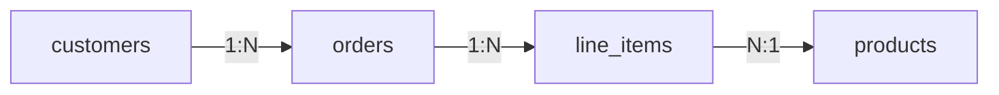

# Database Normalization & Denormalization

> **TL;DR** — **Normalization** is the discipline of splitting data into multiple related tables so each fact lives in exactly one place — prevents duplication, anomalies, and inconsistency. **Denormalization** is the deliberate reintroduction of duplication for *performance* — making reads cheaper at the cost of more complex writes. Real systems do **both**: normalize the source of truth, denormalize derived stores and hot paths. Knowing the normal forms (1NF–BCNF) is table stakes; knowing **when to break them** is senior.

---

## 1. Why It Matters

Consider this single-table schema:

```
orders
─────────────────────────────────────────────────────────────────
order_id | customer_name | customer_email | product_name | qty | price
1        | Ada           | ada@ex.com     | Coffee       | 2   | 4.50
2        | Ada           | ada@ex.com     | Tea          | 1   | 3.00
3        | Bob           | bob@ex.com     | Coffee       | 1   | 4.50
```

Three problems:
- **Update anomaly** — Ada's email changes; you must update every row that mentions her.
- **Insert anomaly** — to add a product you've never sold you need a fake order.
- **Delete anomaly** — delete every Bob row and you forget Bob ever existed.

Normalization fixes this by splitting into `orders`, `customers`, `products`, `line_items`. Each fact in one place. Updates touch one row.

---

## 2. The Normal Forms (in plain English)

You won't be quizzed on these in production — but you do need the intuition.

### 1NF — Atomic values
Each cell holds **one** value; no comma-separated lists or repeating groups of columns.

❌ `phones: "555-1212, 555-2222"`
✅ separate `phones` table with `phone_number` per row.

### 2NF — No partial dependencies on composite keys
If your primary key is `(order_id, product_id)`, no other column should depend on only one part of that key.

❌ `(order_id, product_id) → product_name` (depends only on `product_id`)
✅ move `product_name` to a `products` table.

### 3NF — No transitive dependencies
No non-key column should determine another non-key column.

❌ `order_id → customer_id → customer_email` (transitive)
✅ move `customer_email` to a `customers` table; `orders` keeps just `customer_id`.

### BCNF — Strict 3NF
Every determinant must be a candidate key. Mostly equivalent to 3NF; corrects rare edge cases.

### 4NF & 5NF
Address multi-valued and join dependencies. Rarely needed in practice; if you're worried about them you've already overshot for OLTP.

**For 99% of designs, "make it 3NF" is the goal.**

---

## 3. From Wide Table to Normalized Schema

```
customers(id, name, email, country)

products(id, name, price)

orders(id, customer_id → customers, ordered_at)

line_items(order_id → orders, product_id → products, quantity)
```



Each fact in one row. Foreign keys glue the world together. Updates are surgical. Joins reassemble the original wide view.

---

## 4. The Cost of Normalization

Reads of "show me everything about an order" become joins:
```sql
SELECT o.id, c.name, c.email, p.name, li.quantity, p.price
FROM orders o
JOIN customers c ON c.id = o.customer_id
JOIN line_items li ON li.order_id = o.id
JOIN products p ON p.id = li.product_id
WHERE o.id = 42;
```

Modern engines optimize joins well, especially with proper indexes on FK columns. But:
- **Cross-shard joins** in distributed DBs are slow.
- **High-fan-out** joins (one user × many tables) on hot endpoints cost CPU and IO.
- **NoSQL** stores often don't have joins at all.

That's where denormalization enters.

---

## 5. Denormalization — Trade-Offs On Purpose

**Denormalization** = deliberately duplicating data to make a particular access pattern fast.

Examples:
- Storing the **customer email** inline in each `order` row so the order list page doesn't join customers.
- Storing **product price** inside `line_items` so changing today's price doesn't rewrite history.
- Keeping a **counter cache** (`comments_count` on `posts`) so showing 100 posts doesn't trigger 100 `COUNT(*)`.
- Building a **materialized view** of "user profile screen" with all the joined data precomputed.
- Storing **derived state** (lifetime value, last activity) on the user row.

You're paying with:
- **Write complexity** — multiple places to update.
- **Risk of inconsistency** — what if the cache and source disagree?
- **Storage** — duplicates take space.

You're buying:
- **Read speed** — single-row read replaces multi-table joins.
- **Independence** — a downstream service can serve without joining upstream tables.
- **Scalability** — denormalized data is easier to shard.

> **Rule:** start normalized. Denormalize when you can name *which query* benefits and prove it matters.

---

## 6. When to Denormalize

- Hot read paths (millions of hits/min) that would otherwise join.
- Distributed/sharded systems where joins span shards (Cassandra, DynamoDB, sharded MySQL).
- "Audit-style" historical data — `line_items.price` should be the price *at order time*, not current.
- Search indexes (Elasticsearch / OpenSearch) where joins are unnatural; flatten parents into children.
- Read replicas built specifically for one screen / one report.
- Documents in document stores that are read together with their parent.

---

## 7. When Not To Denormalize

- You haven't measured a problem yet. Premature denormalization is technical debt.
- The data changes frequently and consistency matters.
- Operational complexity outweighs the perf win (Postgres + a few indexes is usually enough).
- You'd be duplicating across many tables — that's a schema smell.
- The "performance problem" is actually a missing index.

---

## 8. Patterns for Safe Denormalization

### Computed columns / generated columns
Postgres / SQL Server let you declare derived columns that the engine maintains:
```sql
ALTER TABLE orders ADD COLUMN total
  GENERATED ALWAYS AS (subtotal + tax) STORED;
```
Free maintenance, no app code.

### Counter caches
Maintained by triggers, application code, or async workers.
```sql
UPDATE posts SET comments_count = comments_count + 1 WHERE id = $1;
```
Easy to drift. Reconcile periodically via a job that recounts.

### Materialized views
A pre-joined result stored on disk, refreshed on schedule.
```sql
CREATE MATERIALIZED VIEW user_dashboard AS
SELECT u.id, u.name, count(o.id) AS orders, sum(o.total) AS spend
FROM users u LEFT JOIN orders o ON o.user_id = u.id
GROUP BY u.id, u.name;

REFRESH MATERIALIZED VIEW CONCURRENTLY user_dashboard;
```
Great for dashboards. Stale by definition.

### Read models / CQRS
A *separate store* (Elasticsearch, Redis, ClickHouse) that's populated asynchronously from the OLTP source. Used for the read path. See [CQRS](../07-messaging/cqrs.md).

### Embedded references in documents
In MongoDB / DynamoDB: embed sub-records that are always read with the parent (e.g., embed line items inside an order document).

### Snapshotting historical state
Copy mutable values into immutable rows so history is preserved (e.g., `line_items.unit_price` snapshots `products.price` at sale time).

---

## 9. Maintaining Consistency

Denormalized data drifts. You need a reconciliation strategy.

- **Synchronous updates** in the same transaction (good for in-DB counters).
- **Triggers** for tightly-coupled derived data.
- **Outbox + CDC** for cross-store sync — see [Outbox Pattern](../07-messaging/outbox-pattern.md), [CDC](./cdc.md).
- **Async workers** that batch-recompute counters periodically.
- **Reconciliation jobs** — nightly sanity check that detects and repairs drift.
- **Idempotent retries** so a duplicate event doesn't double-count.

The cost of denormalization is *everything you have to do to keep it honest*. Budget for it.

---

## 10. NoSQL's Denormalization Mindset

DynamoDB and Cassandra are **denormalization-first**. You design one *table per access pattern* and write the same fact into multiple tables.

- "List a user's orders" → `orders_by_user` partitioned by `user_id`.
- "List orders by status" → `orders_by_status` partitioned by `status`.
- "Single order detail" → `orders_by_id`.

Every write fans out to N tables. Reads are O(1). This is the inversion: **storage cheap, reads must be fast**.

You'd never do this in Postgres for a 10k-row table — overkill. You'd do it in DynamoDB at internet scale because it's the *only* way to keep reads cheap.

---

## 11. Star and Snowflake Schemas (analytical denormalization)

In warehouses (Snowflake, BigQuery, Redshift), normalization rules are relaxed:

- **Star schema** — one big **fact** table (sales, events) joined to several **dimension** tables (date, product, customer). Dimensions may have denormalized text descriptions. Reads are fast aggregations.
- **Snowflake schema** — dimensions further normalized (e.g., `product` → `category` → `department`). Cleaner, more joins.

Why? Warehouse queries are big aggregations over giant tables. Star schemas minimize join count and maximize columnar scan efficiency. See [Data Modeling for Analytics](../17-big-data/dimensional-modeling.md).

---

## 12. JSON-In-Table — A Middle Ground

Postgres JSONB and MySQL JSON let you stash semi-structured fields in a relational table:
```sql
ALTER TABLE users ADD COLUMN preferences jsonb;
```

Use this for genuinely variable / sparse / user-controlled attributes. Don't use it to dodge schema design for things that are clearly structured (orders, products, addresses).

The mistake: putting *core relational data* in JSONB to skip migrations. You'll regret it in two years.

---

## 13. Common Mistakes

- **Splitting too eagerly** — every value gets its own table; queries become a join festival.
- **Denormalizing too eagerly** — copies everywhere, drift everywhere, bugs everywhere.
- **Forgetting historical snapshots** — using current `products.price` for old orders is a bug.
- **No reconciliation strategy** for counter caches — they drift; users notice.
- **Using JSONB to dodge schema design.**
- **Treating star schema as OLTP** — and vice versa.
- **Designing for hypothetical scale** instead of current pain.

---

## 14. A Pragmatic Heuristic

```
Build your write model: NORMALIZED (3NF) source of truth.

Build your read models: DENORMALIZED only where measured.

Use:
  • indexes first
  • materialized views or generated columns next
  • async CDC-fed read stores (search, cache) when one DB isn't enough
  • full CQRS only when joining the OLTP store every page is the bottleneck.
```

This grows naturally with your needs.

---

## 15. Cheat Card

```
NORMALIZE   each fact in exactly one place. 3NF is the practical target.
            FK → other tables instead of duplicating.

DENORMALIZE   deliberately copy a value for read speed.
              ALWAYS plan how to keep the copies honest.

NORMAL FORMS
  1NF  atomic values, no repeating groups.
  2NF  no partial dependency on composite keys.
  3NF  no transitive dependencies. (Sweet spot.)
  BCNF / 4NF / 5NF — rarely needed.

SAFE DENORMALIZATION TOOLS
  generated columns · counter caches · materialized views ·
  read models (CQRS) · embedded sub-documents · historical snapshots.

CONSISTENCY
  in-transaction updates · triggers · outbox + CDC · async reconcilers.
  always have a "rebuild from source" plan.

NoSQL  one table per access pattern. Write same data multiple times.

WAREHOUSES  star / snowflake schemas — analytical denorm rules apply.

DON'T
  - denormalize prematurely
  - use JSONB to dodge real schema design
  - skip reconciliation for derived counts/state
```

---

## 16. Resources

### Books
- *Designing Data-Intensive Applications* — Kleppmann (Ch. 2 — data models).
- *Database Design for Mere Mortals* — Michael J. Hernandez.
- *SQL Antipatterns* — Bill Karwin.
- *The Data Warehouse Toolkit* — Ralph Kimball (star/snowflake bible).

### Articles
- "When to denormalize" — Martin Fowler bliki.
- "Normalization" — Wikipedia is actually useful here: <https://en.wikipedia.org/wiki/Database_normalization>
- "Design patterns for denormalization" — various engineering blogs.
- "The case for read models" — CQRS-flavored posts.
- "Single Table Design with DynamoDB" — Alex DeBrie: <https://www.alexdebrie.com/posts/dynamodb-single-table/>

### Videos
- ByteByteGo: "Normalization vs Denormalization" — <https://www.youtube.com/@ByteByteGo>
- Hussein Nasser denorm videos — <https://www.youtube.com/@hnasr>
- Martin Kleppmann lectures.

### Adjacent reading
- [Relational Databases Deep Dive](./relational-databases.md)
- [Wide-Column Stores](./wide-column-stores.md) (denorm-first culture)
- [CQRS](../07-messaging/cqrs.md)
- [Outbox Pattern](../07-messaging/outbox-pattern.md)
- [Change Data Capture](./cdc.md)
- [Data Modeling for Analytics](../17-big-data/dimensional-modeling.md)

---

*Previous:* [← Database Indexing](./indexing.md)  |  *Next:* [Transactions & Isolation Levels →](./transactions-isolation.md)
