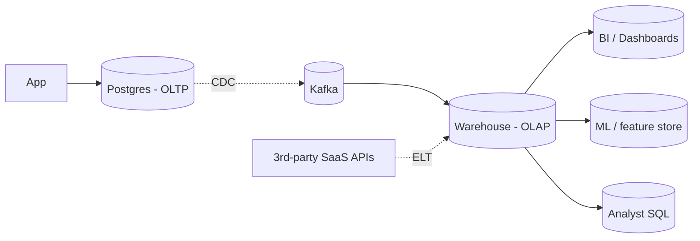

# OLTP vs OLAP

> **TL;DR** — **OLTP** (**O**nline **T**ransaction **P**rocessing) — many small, fast, single-row reads/writes, strong consistency, low latency. Powers the *running business*: orders, payments, sessions. Built on row-store DBs like Postgres / MySQL / DynamoDB. **OLAP** (**O**nline **A**nalytical **P**rocessing) — fewer queries that scan billions of rows and aggregate, optimized for *understanding* the business: dashboards, reports, BI, ML features. Built on **columnar** stores like Snowflake / BigQuery / Redshift / ClickHouse / DuckDB. The two workloads are so different they need different *storage formats*, different *engines*, and usually different *teams*. Move data from one to the other via CDC + ELT.

---

## 1. The Two Worlds, Side by Side

| | OLTP | OLAP |
| --- | --- | --- |
| Purpose | Run the business | Understand the business |
| Workload | Many small reads/writes | Few big aggregations |
| Query shape | "Get user 42's profile" | "Sum revenue by country last quarter" |
| Latency target | ms | seconds to minutes |
| Concurrency | thousands of users | tens of analysts / dashboards |
| Rows per query | 1–1000 | millions–billions |
| Updates | Constant | Mostly append; rare update |
| Schema | Normalized (3NF) | Denormalized (star/snowflake) |
| Storage | Row-store | Column-store |
| Engines | Postgres, MySQL, DynamoDB, Oracle | Snowflake, BigQuery, Redshift, ClickHouse, Druid |
| Indexes | Heavy use of B-trees | Less reliance — bulk scans dominate |
| Compression | Modest | Aggressive (10–50×) |
| Backups | Continuous, PITR | Periodic, snapshot-based |
| Cost model | Per-instance / IOPS | Per-byte scanned, per-credit |
| User | App, customers | Analysts, BI tools, ML |

> **Same data**, **different shape**, **different tool**. Most companies have *both*, with data flowing OLTP → OLAP continuously.

---

## 2. OLTP — The Live Workload

OLTP is what your *application* talks to:
- "Create user" → INSERT one row.
- "Show me my orders" → SELECT a few rows by index.
- "Charge this card" → UPDATE balance + INSERT payment in one transaction.
- "Add to cart" → small atomic write.

Characteristics:
- **Predictable schemas** — known tables, known fields.
- **Constant** — 24/7 traffic.
- **Latency-critical** — users wait for responses.
- **Transactional** — ACID guarantees.
- **Mostly read**, but the writes are critical.

Storage choice: **row-store** — rows of a table sit contiguously on disk. Read one row → one or two page reads. Indexes (B-trees) make point lookups cheap.

The classic OLTP engines: **Postgres, MySQL, Oracle, SQL Server, DynamoDB, MongoDB**. NewSQL (Spanner, CockroachDB) is OLTP-with-horizontal-scale.

---

## 3. OLAP — The Analytical Workload

OLAP is what your **BI tools, dashboards, data scientists, ML pipelines** talk to:
- "Revenue by month, by country, by product category, for the last 24 months."
- "Top 10 churned segments and their lifetime value."
- "Funnel conversion rates split by experiment cohort."
- "Daily active users by feature usage."

Characteristics:
- **Wide scans**, often millions to billions of rows.
- **Aggregations** (`SUM`, `AVG`, `GROUP BY`, window functions).
- **Joins** across fact and dimension tables.
- **Few users**, **few queries per second**.
- **Stale-by-design** — yesterday's data is usually fine.
- **Append-mostly** — events flow in; rare updates.

Storage choice: **column-store**. Each column lives contiguously on disk:
```
ROW STORE (OLTP):
  [row1: id,name,age,country,...] [row2: id,name,age,country,...] ...

COLUMN STORE (OLAP):
  ids:       [1,2,3,4,5,...]
  names:     ["Ada","Bob","Carol",...]
  countries: ["DE","US","DE","FR",...]
```

Why this wins for analytics:
- A query that touches 3 of 50 columns reads only those 3 → 17× less IO.
- Each column has one type → compresses **10–50×** with run-length, dictionary, delta, bitpacking.
- Vectorized execution: process 1024 values at once with SIMD.
- Bloom filters, zone maps, parquet row-group statistics skip whole files.

The result: a query that would take *hours* on a row store finishes in **seconds** on a columnar engine.

---

## 4. Storage Format: Row vs Column

```
OLTP row format                    OLAP column format
─────────────────                   ─────────────────────
[id|name|age|country]              ids:       [1,2,3,4,5,...]
[id|name|age|country]              names:     ["Ada","Bob",...]
[id|name|age|country]              ages:      [31,28,42,55,...]
[id|name|age|country]              countries: ["DE","US","DE","FR",...]
```

Postgres-family stores are row-major (with column-store extensions like cstore_fdw / Hydra / Citus columnar). True column stores include **Parquet**, **ORC**, **Arrow** (the in-memory standard), and engines built around them.

---

## 5. The Big Players

### OLTP
- **Postgres, MySQL** — the default OSS row stores.
- **Oracle, SQL Server** — enterprise.
- **DynamoDB, MongoDB, Cassandra** — NoSQL OLTP.
- **CockroachDB, Spanner, TiDB** — NewSQL OLTP at scale.

### OLAP (data warehouses)
- **Snowflake** — managed, separated storage/compute, multi-cloud.
- **Google BigQuery** — serverless, pay-per-scan.
- **Amazon Redshift** — AWS-native; Aurora Athena alternative.
- **Azure Synapse** — Microsoft's offering.
- **Databricks SQL Warehouse** — lakehouse-flavored.
- **Firebolt, Yellowbrick** — newer entrants.

### OLAP (real-time / OSS)
- **ClickHouse** — extremely fast OSS columnar; sub-second queries on billions of rows.
- **Apache Druid** — real-time analytics; powers many "live dashboards."
- **Apache Pinot** — same niche; LinkedIn-originated.
- **StarRocks / Apache Doris** — modern OSS columnar.
- **DuckDB** — embedded analytics engine; the "SQLite for analytics."
- **Apache Hive / Trino / Presto / Spark SQL** — query engines over data lakes.

### Lakehouse / open formats
- **Delta Lake, Apache Iceberg, Apache Hudi** — table formats on top of Parquet that add ACID, time travel, schema evolution.
- Used by Databricks, Snowflake (Iceberg support), BigQuery (Iceberg / BigLake), Athena, Spark, Trino.

See [Data Warehouses & Lakes](./warehouses-lakes.md) and [Lakehouse Architecture](./lakehouse.md).

---

## 6. The Pipeline: OLTP → OLAP

Most companies move data continuously from one to the other.



Common patterns:
- **ETL** (Extract-Transform-Load) — old style; transform in flight before load.
- **ELT** (Extract-Load-Transform) — modern; load raw into warehouse, transform with **dbt** / **SQL** there. Storage is cheap; compute is elastic.
- **CDC streaming** — real-time replication (Debezium / DMS / Datastream) into the warehouse.
- **Reverse ETL** — push enriched warehouse data back to operational tools (CRM, marketing automation).

Tools: **Airbyte, Fivetran, Stitch, Singer, Meltano** (managed ELT), **dbt** (transform), **Airflow, Dagster, Prefect** (orchestrate), **Hightouch, Census** (reverse ETL).

---

## 7. HTAP — Hybrid Transactional/Analytical Processing

Some engines try to do **both**:
- **SingleStore (MemSQL)** — row + column stores in one engine.
- **TiDB + TiFlash** — TiKV (row store) + TiFlash (columnar replica) for ad-hoc analytics on live data.
- **Snowflake Hybrid Tables / Unistore** — adding OLTP-ish behavior.
- **CockroachDB / Spanner** — strong OLTP; analytical workloads are possible but not their strength.

The HTAP pitch: skip the pipeline; query live data directly. Reality: most real OLAP workloads still benefit from a dedicated warehouse with bigger compute and cheaper storage. HTAP is improving but not the universal default.

---

## 8. Why You Shouldn't Run Analytics on the OLTP DB

You'll be tempted to. Don't.

- **Long scans hold locks** and bloat MVCC versions.
- **CPU and IO contention** with the live workload.
- **Cache pollution** — your hot pages get evicted by the scan.
- **Replication lag** if you scan a replica heavily.
- **Slower queries anyway** — row-store + B-tree isn't built for billion-row aggregations.

The exception: small analytics on small tables (a dashboard counting today's signups). For real analytics, go to the warehouse.

---

## 9. Schema: Normalized OLTP vs Star OLAP

### OLTP (3NF)
Normalize aggressively. Each fact in one place. FKs enforce integrity. Updates are surgical.

### OLAP (star schema)
- One big **fact table** (events, orders, sessions).
- Several **dimension tables** with denormalized descriptive text (product names, dates, customer regions).
- Joins are wide (fact ⨝ dimensions) and the engine optimizes for them.

```
fact_orders (order_id, customer_id, product_id, date_id, total)
dim_customer (customer_id, name, country, segment)
dim_product (product_id, name, category, brand)
dim_date (date_id, day, month, quarter, year)
```

Star schemas are *deliberately denormalized* — analytic engines love wide flat tables.

See [Data Modeling for Analytics](../17-big-data/dimensional-modeling.md), [Normalization](./normalization.md).

---

## 10. Real-time Analytics — A Special Case

Some workloads need **OLAP latency targets** (seconds) with **near-real-time freshness** (sub-second ingest):
- Ad-tech dashboards.
- Fraud detection.
- Live business metrics (Slack-bot style alerts).
- IoT telemetry dashboards.

Engines:
- **Apache Druid** — sub-second OLAP at scale.
- **Apache Pinot** — LinkedIn's choice for real-time.
- **ClickHouse** — extremely fast; many companies pair it with Kafka.
- **Materialize / RisingWave** — streaming SQL views maintained continuously.

These blur the line between OLAP and stream processing. See [Real-Time Analytics](../19-advanced/real-time-analytics.md) and [Stream Processing](../07-messaging/stream-processing.md).

---

## 11. Cost Models

OLTP cost is typically *per-instance* (CPU, RAM, disk, IOPS).

OLAP cost varies wildly:
- **Snowflake / BigQuery** — *per-byte scanned* or *per-credit* of compute. A bad query can cost real money.
- **Redshift / Databricks SQL** — per-cluster-hour.
- **ClickHouse / Druid / DuckDB self-hosted** — per-instance.

A single $5,000 query is possible in BigQuery if you scan a 1 PB table without a filter. Habits to build:
- Always **partition** large tables (date partition).
- Always **cluster / sort** on common filters.
- **Cache** common results.
- **Materialize** aggregations.
- **Reject "SELECT \*"** in code review.
- Monitor query cost per team.

---

## 12. Common Mistakes

- **Running analytics on the OLTP DB.** Inevitable contention.
- **No OLAP store at all** — analysts wait days for engineering to extract data.
- **Treating Postgres as a warehouse.** It can hold the data; it can't aggregate at column-store speed.
- **No CDC pipeline.** Daily batch loads = analytics always 24 h stale.
- **Wide scans without partitioning** — burning credits.
- **Storing PII in the warehouse without policy.** Compliance nightmare.
- **Hand-coded ETL with no orchestration.** Hidden lineage, broken jobs, no observability.
- **Reverse ETL without testing.** Bad data pushed back to ops tools = real-world damage.
- **"HTAP will solve everything."** It won't, at least not yet.

---

## 13. Picking Tools

```
Small team, small data → Postgres for OLTP; DuckDB / Postgres for "analytics".
Mid-size SaaS         → Postgres OLTP + Snowflake / BigQuery warehouse + dbt + Fivetran.
Hyperscale            → Many OLTP stores + lakehouse (Iceberg/Delta) + Spark/Trino/Snowflake.
Real-time analytics   → ClickHouse / Druid / Pinot + streaming pipelines.
Embedded / single-node analytics → DuckDB.
ML-heavy              → Lakehouse + feature store (Feast, Tecton) + Spark / Databricks.
```

The default for the next decade looks like: **OLTP (Postgres or NewSQL)** + **Lakehouse / Warehouse (Snowflake / BigQuery / Databricks)** + **dbt** + **CDC**.

---

## 14. Cheat Card

```
OLTP   many small fast tx · row store · normalized · ms latency · 24/7 · ACID.
        Postgres / MySQL / Dynamo / Mongo / NewSQL.

OLAP   few huge aggregations · column store · denormalized (star) ·
        sec–min latency · few analysts · append-mostly · cheap-storage compute-elastic.
        Snowflake / BigQuery / Redshift / ClickHouse / Druid / Pinot / DuckDB.

WHY COLUMN STORES WIN
  scan only needed columns · enormous compression · vectorized execution ·
  zone maps / Bloom filters skip data.

PIPELINE OLTP → OLAP
  CDC / ETL / ELT → warehouse → dbt → BI / ML / reverse-ETL.
  Tools: Debezium / Airbyte / Fivetran / dbt / Airflow.

REAL-TIME OLAP
  ClickHouse / Druid / Pinot · Materialize / RisingWave for streaming SQL.

HTAP (one engine for both)
  TiDB+TiFlash · SingleStore · Snowflake Unistore — promising, not universal.

DON'T
  Run analytics on the OLTP DB.
  Use a row store as a warehouse.
  Forget partitioning + clustering — credits melt.
```

---

## 15. Resources

### Books
- *Designing Data-Intensive Applications* — Kleppmann; Ch. 3 (storage) and Ch. 10 (batch + stream).
- *The Data Warehouse Toolkit* — Ralph Kimball (star schemas).
- *Fundamentals of Data Engineering* — Joe Reis, Matt Housley.
- *Designing Cloud Data Platforms* — Danil Zburivsky, Lynda Partner.

### Documentation
- **Snowflake** — <https://docs.snowflake.com/>
- **BigQuery** — <https://cloud.google.com/bigquery/docs>
- **Redshift** — <https://docs.aws.amazon.com/redshift/>
- **ClickHouse** — <https://clickhouse.com/docs>
- **DuckDB** — <https://duckdb.org/docs/>
- **Apache Druid / Pinot / Hudi / Iceberg / Delta Lake** — respective project sites.

### Articles
- "Why columnar storage is fast" — many engineering blogs.
- "ELT vs ETL" — dbt Labs.
- "The Modern Data Stack" — A16Z / Future essays.
- "OLTP vs OLAP" — Snowflake blog, AWS blog.
- "BigQuery best practices" — Google Cloud docs.
- "Apache Druid architecture" — Druid wiki.

### Videos
- ByteByteGo: "OLTP vs OLAP" — <https://www.youtube.com/@ByteByteGo>
- Hussein Nasser data-warehouse videos — <https://www.youtube.com/@hnasr>
- "DuckDB: An Embeddable Analytical Database" — Mark Raasveldt talks.
- "How ClickHouse works" — Aleksey Milovidov talks.

### Tools / ecosystem
- **dbt** — SQL transformations: <https://www.getdbt.com/>
- **Airflow / Dagster / Prefect** — orchestration.
- **Airbyte / Fivetran / Stitch** — ELT connectors.
- **Hightouch / Census** — reverse ETL.
- **Apache Arrow** — in-memory columnar standard.
- **Apache Parquet / ORC** — on-disk columnar formats.

### Adjacent reading
- [Relational Databases Deep Dive](./relational-databases.md)
- [Change Data Capture](./cdc.md)
- [Data Warehouses & Data Lakes](./warehouses-lakes.md)
- [Lakehouse Architecture](./lakehouse.md)
- [Stream Processing](../07-messaging/stream-processing.md)
- [Real-Time Analytics](../19-advanced/real-time-analytics.md)
- [Data Modeling for Analytics](../17-big-data/dimensional-modeling.md)
- [Data Pipelines & Orchestration](../17-big-data/data-pipelines.md)

---

*Previous:* [← Change Data Capture](./cdc.md)  |  *Next:* [Data Warehouses & Data Lakes →](./warehouses-lakes.md)
