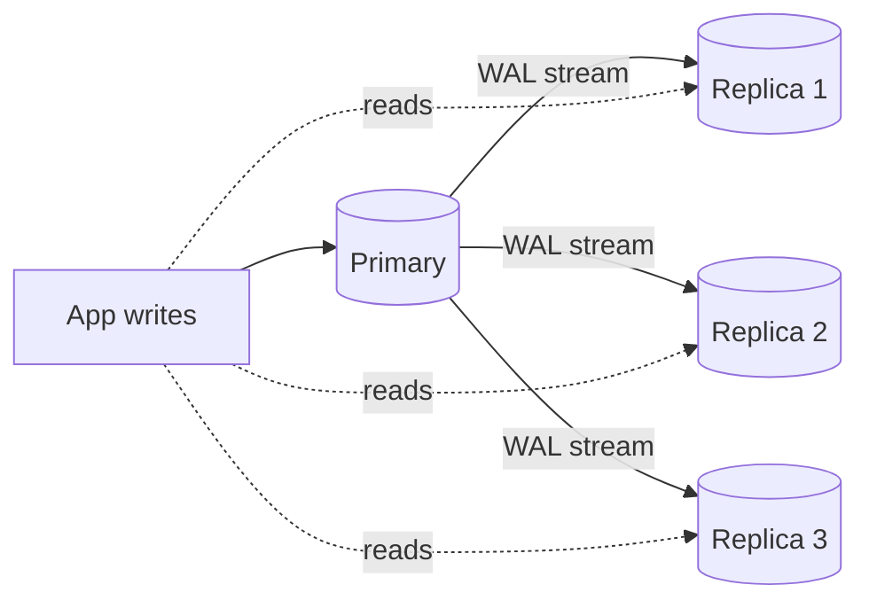
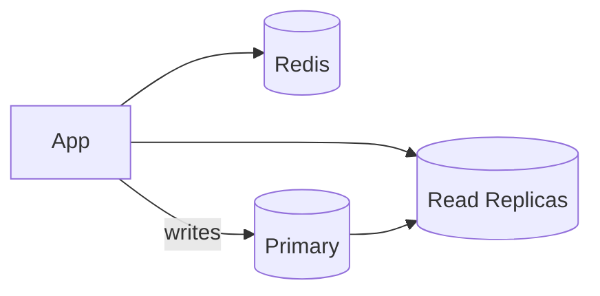

# Read Replicas & Write-Through Patterns

> **TL;DR** — A **read replica** is an asynchronous (sometimes synchronous) copy of a primary database used to scale **reads** without affecting writes. Add replicas → distribute reads → scale almost linearly until the primary's write throughput becomes the bottleneck. The catch: replicas **lag**, so you must handle **read-your-writes** correctly. Beyond replicas, **write-through / read-through / write-behind / write-around** describe how an application coordinates a *cache or derived store* with a primary database. Together, these patterns are the most common "scale my reads" toolkit before you sharded.

---

## 1. The Pattern



- All writes go to the **primary**.
- Replicas continuously apply the WAL/binlog.
- Reads are routed to replicas — sometimes by a proxy, sometimes by the application.

The result: read capacity scales by adding replicas; write capacity is still single-leader.

See [Replication](./replication.md) for the underlying mechanics.

---

## 2. What Read Replicas Buy You

- **Read scaling.** A typical OLTP app reads 10–100× more than it writes. Replicas turn that into a parallelizable problem.
- **Failover candidate.** Promote a replica when the primary dies.
- **Backup without downtime.** Take backups from a replica.
- **Heavy reports / analytics** on a replica, not on the primary.
- **Geographic locality.** Replicas in other regions serve nearby users with low latency.
- **Schema migrations.** Apply some types of online migrations against replicas first.

---

## 3. What They Don't Solve

- **Writes.** The primary is still your single writer.
- **Strong consistency** out of the box — replicas lag.
- **Lock contention on the primary.** A long-held lock on the primary is everyone's problem.
- **Failures of the primary.** Without HA tooling, replicas don't save you automatically.

---

## 4. Replication Modes Recap

- **Async** — primary commits, then replicas apply. Lowest latency; may lose recent writes on failover.
- **Sync to one replica** — primary waits for one replica's ack. Zero data loss on single-replica failover.
- **Semi-sync** — wait for network ack, not apply. Practical middle.
- **Quorum** — wait for a majority. Used by Spanner, CockroachDB, MongoDB w/ majority writeConcern.

For data that matters: **at least one synchronous replica in a different AZ**, plus async replicas for reads.

---

## 5. Routing Reads to Replicas

### Manual / per-query
The app picks: "this query is OK on a replica; this one needs the primary."
```python
session = db.replica_session() if is_safe_read else db.primary_session()
```

### Proxy (PgBouncer / ProxySQL / RDS Proxy / Vitess)
The proxy understands `SELECT` vs `UPDATE` and routes accordingly. Some proxies inspect the SQL; others rely on hints (`-- USE_REPLICA`).

### DNS or service-discovery
Two endpoints: `db-write` and `db-read`. The read endpoint round-robins across replicas. AWS Aurora exposes a "reader endpoint."

### Smart driver
The driver knows about cluster topology and routes.

Whichever you pick, **decouple connection strings from your application code** — you'll add and remove replicas constantly.

---

## 6. Replication Lag — The Silent Killer

Async replicas are usually **milliseconds** behind. Under load, they can be **seconds or minutes** behind. Three classic problems:

### Read-your-writes
The user changes their email; the next page reads from a replica that hasn't applied the write yet → the old email shows up → confusion.

**Fixes:**
- **Route the user's reads to the primary** for a short window after their write (e.g., 30 s).
- **Causal reads / bookmarks** — the primary returns a position; the replica blocks the read until it has applied at least that position.
- **Session-pinned reads** — sticky to the same replica for the duration of a session (helps somewhat).
- **Write the result back to the client** so the UI doesn't need to re-fetch.

### Monotonic reads
A user refreshes the page; sometimes they see a newer state, sometimes an older one. Cause: round-robin across replicas with different lags.

**Fix**: pin a user's reads to a specific replica (or to the primary) for the session.

### Stale analytics
A "yesterday's revenue" dashboard reads a replica an hour behind during peak; numbers seem wrong.

**Fix**: dedicate a replica with lag monitoring, document its freshness SLA, and prefer a warehouse for analytics.

---

## 7. Monitoring Lag

Don't fly blind:
- Postgres: `pg_stat_replication.replay_lag` and `replay_lsn` vs primary's `pg_current_wal_lsn()`.
- MySQL: `Seconds_Behind_Master` (legacy) or `Replica_SQL_Running_State` + GTID gap.
- MongoDB: `rs.printSecondaryReplicationInfo()`.
- Cloud-managed services expose lag as a CloudWatch / Stackdriver metric.

Alert on:
- Lag > X seconds.
- Replica falling out of `replica` role.
- Replica restarting / re-bootstrapping.

---

## 8. Read-Replica Capacity Planning

A rough rule: **one replica per ~5–10× the primary's read load**, minus overhead.
- Replicas pay the same write amplification as the primary (every write applies).
- So adding more replicas doesn't reduce *write* load.
- Once writes alone saturate the primary, more replicas won't help. Time to shard.

If your CPU on the primary is dominated by **applying its own writes** (rare but possible), even replicas can't help. Consider write batching, async paths, or NewSQL.

---

## 9. Read-Through and Write-Through (Cache Patterns)

A separate-but-related family: **how the app coordinates a cache (or any derived store) with the primary**. These are not about DB replication; they're about *cache* placement.

### Cache-aside (lazy-loading)
```
read:
  v = cache.get(key)
  if v: return v
  v = db.get(key)
  cache.set(key, v, ttl)
  return v

write:
  db.write(...)
  cache.delete(key)        # or set
```
Most common. Simple. Cache can be stale; deletion on write reduces drift.

### Read-through
The cache *itself* knows how to load from the DB on miss; the app calls only the cache.
- Cleaner app code.
- Cache library handles miss → backfill.
- Examples: AWS DAX (for DynamoDB), Caffeine in Java with a loader, Ehcache.

### Write-through
The app writes to the cache, and the cache **synchronously** writes through to the DB before acking.
- Cache is always fresh.
- Latency = cache write + DB write.
- Risk: cache fails after DB → no rollback.

### Write-behind (write-back)
The app writes to the cache. The cache **asynchronously** flushes to the DB later (often batched).
- Lowest write latency.
- Crash → data loss.
- Used carefully for hot counters, metrics, batch ingestion.

### Write-around
The app writes directly to the DB; the cache is *not* updated.
- Avoid polluting the cache with one-time writes.
- The cache will lazily warm up on later reads.

See [Cache Strategies](../05-caching/cache-strategies.md).

---

## 10. Choosing Between Patterns

```
Read-heavy, cache-friendly?    → cache-aside or read-through.
Write-heavy, low-latency?      → write-behind (carefully) or skip cache.
Strong consistency required?   → write-through (and accept the latency).
One-off bulk writes?           → write-around.
Cache must always be fresh?    → write-through + read-through.
```

In practice: **cache-aside dominates**. It's simple, robust, and gives ~95% of the benefit with the least magic.

---

## 11. Combining Replicas and Caches

A typical large product uses both:



- **Cache** absorbs the hottest 10% of keys (sub-ms latency).
- **Read replicas** absorb the next tier (low-ms latency).
- **Primary** handles all writes and the long tail of uncached reads.

Cache invalidation must consider **replication lag**: if you delete a cache key right after writing to the primary, the next read may pull stale data from a replica and re-populate the cache. Either route post-write reads to the primary, or wait for replica apply before invalidating.

---

## 12. Region-Aware Read Replicas

For global products:
- A replica in each major region serves local reads at low latency.
- Writes still cross the WAN to the primary.
- A user in Tokyo writes → primary in us-east → 150 ms — but their reads stay local.

This is the simplest multi-region pattern. The catch is the same: read-your-writes across regions is fragile because lag is highest there. Pin a user's reads to the primary for a small window after their write, or push the write result back to the client.

For *write* locality you need NewSQL with regional leaders or active-active with conflict resolution. See [Replication](./replication.md), [Multi-Region](../10-scalability/multi-region.md).

---

## 13. Common Mistakes

- **Reading from replicas without read-your-writes handling.** Confusing UX.
- **Routing all queries through one replica** by accident — uneven load.
- **No monitoring of lag** — surprises during incidents.
- **Letting replicas drift** — they stop being safe failover candidates.
- **Replicas in the same AZ as the primary** — power loss kills both.
- **Backing up only from the primary** — extra load, missed window. Back up from a replica.
- **Confusing write-through and write-around** — picking the wrong one for the workload.
- **Heavy analytics on a primary** — every kind of bad. Use a replica or warehouse.
- **Using replicas to "fix" write throughput** — they don't. Shard, batch, or NewSQL.

---

## 14. Cheat Card

```
READ REPLICA   async (or sync) copy of the primary.
                Reads can hit any replica; writes go to primary.
                Scales READS, not writes.

LAG            milliseconds usually; seconds under load.
                Always monitor it; always plan for read-your-writes.

READ-YOUR-WRITES FIXES
  primary-on-write-window · causal reads (bookmarks) · session pinning

CACHE PATTERNS
  Cache-aside    app reads cache → DB on miss. DEFAULT.
  Read-through   cache library loads on miss.
  Write-through  app → cache → DB synchronously. Strong, slow.
  Write-behind   app → cache; async flush to DB. Fast, lossy.
  Write-around   app writes to DB; cache lazily warms. Avoids pollution.

ROUTING        proxy / smart driver / app-level / endpoint per role.
                Two endpoints: `db-write` and `db-read`.

CAPACITY       reads scale ~linearly with replica count.
                Writes are still bound by the primary.
                Once writes saturate the primary → SHARD.

REGION         replicas near readers for low-latency reads.
                Writes still cross WAN. Strong locality needs NewSQL / multi-master.

ALWAYS
  ≥ 1 replica in another AZ.
  Backups from a replica.
  Drill failover.
  Monitor lag, alert above SLA.
```

---

## 15. Resources

### Books
- *Designing Data-Intensive Applications* — Kleppmann (Ch. 5 — replication).
- *High Performance MySQL* — Schwartz et al. (replica scaling chapter).
- *PostgreSQL High Availability Cookbook* — Shaun M. Thomas.

### Documentation
- **Postgres streaming replication** — <https://www.postgresql.org/docs/current/warm-standby.html#STREAMING-REPLICATION>
- **MySQL replication** — <https://dev.mysql.com/doc/refman/en/replication.html>
- **AWS RDS read replicas** — <https://docs.aws.amazon.com/AmazonRDS/latest/UserGuide/USER_ReadRepl.html>
- **Aurora reader endpoint** — AWS docs.
- **MongoDB read preference** — <https://www.mongodb.com/docs/manual/core/read-preference/>
- **Redis replication** — <https://redis.io/docs/management/replication/>

### Articles
- "Read-your-writes consistency" — many blogs; AWS Builders' Library.
- "Replica lag and how to think about it" — pganalyze, Percona, DigitalOcean.
- "Caching patterns: aside, through, around" — AWS / Redis blogs.
- "Aurora design considerations" — Amazon SIGMOD paper.

### Videos
- Hussein Nasser replication / read replica deep dives — <https://www.youtube.com/@hnasr>
- ByteByteGo: "Read replicas explained" — <https://www.youtube.com/@ByteByteGo>

### Tools
- **PgBouncer / ProxySQL / RDS Proxy / Vitess** — routing.
- **pg_stat_replication / SHOW SLAVE STATUS** — lag.
- **Patroni / Orchestrator** — HA + replica management.
- **HAProxy / Envoy** — TCP-level routing with health checks.
- **Datadog / pganalyze / PMM** — observability.

### Adjacent reading
- [Replication](./replication.md)
- [Cache Strategies](../05-caching/cache-strategies.md)
- [Cache Invalidation Patterns](../05-caching/cache-invalidation.md)
- [Database Federation](./federation.md)
- [Sharding & Partitioning](./sharding-partitioning.md)
- [Multi-Region](../10-scalability/multi-region.md)
- [Failover & Disaster Recovery →](../11-reliability/failover-dr.md)

---

*Previous:* [← Database Federation](./federation.md)  |  *Next:* [Connection Pooling →](./connection-pooling.md)
