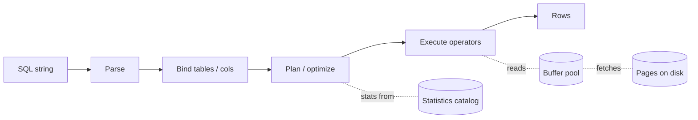
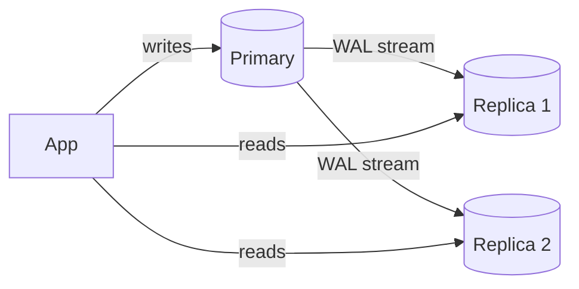

# Relational Databases Deep Dive

> **TL;DR** — A **relational database** organizes data into typed **tables** related by **keys**, queried with **SQL**, and protected by **ACID transactions**. The model — invented by E. F. Codd in 1970 — is still the right answer for the majority of business problems half a century later. Modern engines like **PostgreSQL** and **MySQL** scale further than most engineers realize. Knowing how they actually work inside (the planner, the storage engine, MVCC, the WAL, indexes) is the difference between "the DB is slow" and a five-minute fix.

---

## 1. The Model

Data lives in **relations** (tables). Each row is a tuple of typed values; each column has a domain. Relations have:

- **Primary keys** — uniquely identify a row.
- **Foreign keys** — reference rows in other tables.
- **Constraints** — NOT NULL, UNIQUE, CHECK.
- **Indexes** — extra structures for fast lookups.

Queries are **declarative**: you describe *what* you want; the optimizer figures out *how* to get it.

```sql
SELECT u.id, u.name, count(o.id) AS orders
FROM users u
LEFT JOIN orders o ON o.user_id = u.id
WHERE u.country = 'DE'
GROUP BY u.id, u.name
ORDER BY orders DESC
LIMIT 10;
```

That one statement triggers parsing, planning, choosing indexes, joining, aggregating, sorting, and limiting — all by the engine.

---

## 2. The Big Players

| Engine | Notes |
| --- | --- |
| **PostgreSQL** | Most feature-rich open-source RDBMS. JSONB, GIS, FTS, extensions (pgvector, TimescaleDB, Citus, PostGIS). Default choice for new projects. |
| **MySQL** | Mature, fast, simpler than Postgres. The default behind most LAMP/Rails/Django shops historically. |
| **MariaDB** | Community fork of MySQL. |
| **Oracle Database** | Enterprise grade. Closed, expensive, deeply mature. |
| **SQL Server** | Microsoft's flagship. Excellent on Windows ecosystems. |
| **SQLite** | Embedded library, single file. Perfect for tests, mobile, edge. |
| **Aurora (AWS)** | Postgres/MySQL-compatible, separates storage from compute. |
| **AlloyDB (Google)** | Postgres-compatible, cloud-native. |
| **CockroachDB / Spanner / Yugabyte / TiDB** | "NewSQL" — distributed SQL with global ACID. See [NewSQL](./newsql.md). |

---

## 3. ACID

Four properties every transaction must satisfy:

- **Atomicity** — all or nothing.
- **Consistency** — invariants hold before and after.
- **Isolation** — concurrent transactions appear sequential (to a configurable degree).
- **Durability** — once committed, it survives crashes.

ACID is what makes relational DBs trustworthy for money, inventory, identity. The details and trade-offs sit in [ACID vs BASE](./acid-vs-base.md) and [Transactions & Isolation Levels](./transactions-isolation.md).

---

## 4. Under the Hood: The Anatomy of a Query



1. **Parser** turns SQL into an AST.
2. **Binder** resolves names against the catalog (tables, columns, types).
3. **Optimizer** picks the cheapest plan using cost estimates and **statistics**.
4. **Executor** runs **operators** — sequential scan, index scan, nested loop, hash join, merge join, sort, aggregate.
5. **Buffer pool** caches recently-read pages in RAM.
6. **Storage engine** reads/writes 8 KB pages to disk; the **WAL** records every change.

The killer feature of relational engines is the **optimizer**: a single query can be plan-shifted between 10 strategies based on table sizes, available indexes, and selectivity.

`EXPLAIN ANALYZE` is your best friend.

---

## 5. Storage Engines & Pages

Most engines store data in fixed-size **pages** (Postgres: 8 KB; MySQL: 16 KB). A page holds many rows. Operations read/write whole pages.

Two main storage flavors:

- **Heap + B-tree indexes** (Postgres, MySQL with MyISAM-era, most engines). Rows live in a heap; indexes point to row positions.
- **Index-organized tables** (MySQL InnoDB, SQL Server clustered indexes). The primary key index *is* the table — rows live inside the index leaves. Faster PK lookups; secondary indexes point to PK, not row IDs.

Knowing your engine's choice affects scan patterns, index size, and update cost.

---

## 6. Indexes 101

An index is a sorted data structure that maps key values → row locations.

- **B-tree** — the default. Great for `=`, `<`, `>`, `BETWEEN`, prefix `LIKE 'abc%'`, sort.
- **Hash** — equality lookup only.
- **GIN** (Postgres) — inverted index for arrays, JSONB keys, full-text.
- **GiST** (Postgres) — generalized; good for geometric / range types.
- **BRIN** (Postgres) — block-range; tiny indexes for huge sorted tables (time-series).
- **Bitmap** — analytical engines for low-cardinality columns.

Indexes accelerate reads, slow writes (every insert/update touches indexes), and bloat storage. **Index what you query, not everything.**

See [Database Indexing](./indexing.md).

---

## 7. The Write-Ahead Log (WAL)

When you `COMMIT`, the engine doesn't necessarily write to data files immediately. Instead:

1. The change is appended to the **WAL** (sequential, fast).
2. WAL is `fsync`'d before commit acknowledges.
3. Data pages are updated in the buffer pool.
4. Dirty pages are written back to disk **asynchronously**.

Crash? Replay the WAL since the last checkpoint and you recover the committed state. This is how durability works in every modern relational DB.

The WAL is also the foundation of **replication** (stream WAL to replicas) and **point-in-time recovery** (replay WAL up to a chosen time).

---

## 8. MVCC — Multi-Version Concurrency Control

Postgres, MySQL InnoDB, Oracle and others use **MVCC** to give readers a consistent snapshot **without blocking writers**.

- Every row update creates a new **row version** rather than mutating in place.
- Each transaction sees the version visible at its snapshot.
- Old versions are garbage-collected later (Postgres's `VACUUM`).

The big win: **readers don't block writers, writers don't block readers.**

See [MVCC](./mvcc.md).

---

## 9. Isolation Levels (the short version)

SQL defines four:

| Level | Dirty reads | Non-repeatable reads | Phantom reads |
| --- | --- | --- | --- |
| READ UNCOMMITTED | possible | possible | possible |
| READ COMMITTED (default in PG, Oracle) | no | possible | possible |
| REPEATABLE READ (default in MySQL) | no | no | possible (theoretically) |
| SERIALIZABLE | no | no | no |

Practical: **READ COMMITTED** is the default for most workloads. Bump to **SERIALIZABLE** for code that needs to prove correctness (banking, inventory).

See [Transactions & Isolation Levels](./transactions-isolation.md).

---

## 10. The Optimizer's Tools

The optimizer picks a plan based on:

- **Cardinality estimates** — how many rows match each predicate?
- **Cost model** — random I/O cost, sequential I/O cost, CPU cost.
- **Statistics** — histograms, most-common-values, distinct counts.
- **Available indexes**.
- **Join orders** explored (often dozens to thousands of plans).

If statistics are out of date, the optimizer can pick disastrously bad plans. `ANALYZE` regularly. Modern engines auto-analyze, but verify.

### Common operators
- **Seq Scan** — read entire table. Fine for small tables or low selectivity.
- **Index Scan** — walk an index to find rows.
- **Index-Only Scan** — answer the query from the index alone (no heap fetch).
- **Bitmap Scan** — combine multiple indexes.
- **Nested Loop Join** — for one tiny side and one indexed side.
- **Hash Join** — for two large sides, builds a hash table.
- **Merge Join** — for two large sorted inputs.

---

## 11. Joins

Joins are the relational superpower.

```sql
-- 1:N
SELECT u.name, o.id, o.total
FROM users u
JOIN orders o ON o.user_id = u.id
WHERE u.country = 'DE';

-- many-to-many through a join table
SELECT u.name, r.name
FROM users u
JOIN user_roles ur ON ur.user_id = u.id
JOIN roles r ON r.id = ur.role_id;
```

Without joins, you either:
- denormalize (NoSQL-style) and accept duplication, or
- join in application code (slower, harder to evolve).

The join cost is dominated by selectivity. **Index the join keys**. Without indexes, joins of large tables become catastrophic.

---

## 12. Normalization

Splitting wide tables into smaller related ones removes redundancy and update anomalies.

- **1NF** — atomic values, no repeating groups.
- **2NF** — no partial dependency on composite keys.
- **3NF** — no transitive dependencies.
- **BCNF / 4NF / 5NF** — increasingly strict; rarely needed in practice.

Normalize for **integrity**, **denormalize** for **performance** when you can prove the need.

See [Normalization & Denormalization](./normalization.md).

---

## 13. Concurrency Control

Two main strategies:
- **Pessimistic locking** — acquire locks before reading/writing (`SELECT ... FOR UPDATE`).
- **Optimistic concurrency control** — read, modify, check on commit (versions / `If-Match`).

MVCC gives most of OCC for free. Use explicit row locks only when the application logic depends on exclusivity (banking transfers, ticket booking).

See [Concurrency Control](./concurrency-control.md).

---

## 14. Replication



- **Streaming replication** — Postgres / MySQL ship WAL/binlog to replicas in near-real-time.
- **Synchronous** — primary waits for at least one replica before committing. Slower, no data loss on failover.
- **Asynchronous** — fire-and-forget. Faster, may lose recent commits on failover.
- **Logical replication** — replicate selected tables, or to a different schema/version.

Read replicas scale reads, not writes. The primary is still your single writer (unless you go multi-master or sharded).

See [Replication](./replication.md).

---

## 15. Scaling

### Vertical (the boring answer that works)
Bigger machine: more cores, RAM, NVMe, faster network. A single modern Postgres on a beefy box handles tens of thousands of writes/sec and hundreds of thousands of reads/sec.

### Read replicas
Push reads to followers. Tolerate stale-read lag. Easy and common.

### Caching (Redis, in-process)
Often the first scaling step. Cache hot query results.

### Connection pooling (PgBouncer, ProxySQL)
A flood of short-lived connections will tank performance. Always pool.

### Vertical partitioning
Move infrequently-used columns to a side table (or out to object storage).

### Functional sharding ("federation")
Different services own different databases. See [Federation](./federation.md).

### Horizontal sharding
Split a giant table by hash or range across many DBs. Manual or with tools (Citus, Vitess, AWS RDS Proxy). See [Sharding](./sharding-partitioning.md).

### NewSQL (the nuclear option)
CockroachDB / Spanner: SQL + ACID + horizontal scale. Higher operational cost; absolves you of manual sharding.

Move down this list **only when forced**. Each step adds complexity.

---

## 16. JSON in a Relational DB

Postgres's **JSONB** is a first-class data type with operators, indexes (GIN), and pretty good performance. It blurs the line with document stores.

```sql
SELECT data->>'email' FROM users WHERE data->>'country' = 'DE';
CREATE INDEX users_country_idx ON users ((data->>'country'));
```

For "mostly structured data, with occasional varying fields", JSONB inside Postgres often beats reaching for MongoDB. You keep joins, transactions, and SQL — and stash the flexible parts in JSON.

---

## 17. Common Performance Diagnoses

| Symptom | Cause | Fix |
| --- | --- | --- |
| Slow query | Missing index | Add B-tree on filtered/joined columns |
| Slow query | Bad plan from stale stats | `ANALYZE` |
| Lots of `Seq Scan` on big tables | Optimizer thinks it's faster than the index | Investigate selectivity; possibly partial index |
| Slow `OFFSET` paging | Linear scan | Use cursor / keyset pagination |
| Lock waits | Long transactions | Shorten transactions; commit faster |
| Bloat / disk growth | Dead row versions (MVCC) | Tune autovacuum |
| Connection storms | No pool | PgBouncer in `transaction` mode |
| Tail latency | I/O burst, checkpoint | Tune checkpoint, faster disk |
| Many small writes | High commit fsync cost | Batch / async commit (carefully) |
| Cache miss | Working set > buffer pool | More RAM, or shrink working set |

`EXPLAIN ANALYZE` answers most of these.

---

## 18. The DBA's Operational Toolkit

- **Backups**: `pg_dump`, `pg_basebackup`, WAL archiving for PITR.
- **Monitoring**: pg_stat_statements, slow-query logs, RDS Insights, Datadog DB monitoring.
- **Migrations**: Flyway, Liquibase, Sqitch, Rails migrations, Alembic.
- **Connection pool**: PgBouncer, ProxySQL, RDS Proxy.
- **Index maintenance**: `REINDEX`, autovacuum tuning.
- **Failover**: Patroni (Postgres), MySQL Group Replication, managed services with automatic promotion.
- **Read replicas**: built-in or via tools like Bucardo / pglogical.

---

## 19. When Relational Is Wrong

- You truly need >100k writes/sec sustained globally → Cassandra/Dynamo.
- Every access is one-key lookup → key-value.
- Massive log/time-series volumes → TSDB / wide-column.
- Deep multi-hop graphs → graph DB.
- Full-text search → Elasticsearch.
- Embedding similarity → vector DB.

Even then, the relational DB usually stays as the **system of record**; the others are derived stores.

---

## 20. Common Mistakes

- Not indexing what you filter / join on.
- Indexing every column "just in case" (bloat + slow writes).
- Long transactions blocking everything.
- Cursor pagination with no tiebreaker (rows shuffle).
- Storing money as float.
- Storing timestamps without timezone.
- Application-side joins instead of SQL.
- No connection pool.
- ORM lazy-loading causing N+1 queries.
- Treating Postgres as "scale-incapable" before exhausting vertical/read-replicas.

---

## 21. Cheat Card

```
RELATIONAL = typed tables + SQL + ACID. Postgres / MySQL = default choice.

COMPONENTS
  Parser → Optimizer → Executor
  Buffer pool, WAL, MVCC, indexes (B-tree / GIN / GiST / BRIN), checkpoints

ACID         Atomicity · Consistency · Isolation · Durability

INDEXES      Index what you filter / join / sort by. Not everything.
             EXPLAIN ANALYZE is your best friend.

ISOLATION    PG default READ COMMITTED. SERIALIZABLE for money-grade.

MVCC         readers don't block writers; vacuum cleans old versions.

REPLICATION  WAL → replicas. Sync (safe, slow) vs async (fast, lossy).

SCALING ORDER
  vertical → caching → replicas → pooling → vertical-partition →
  federate by service → shard horizontally → NewSQL.

POSTGRES SUPERPOWERS
  JSONB, GIN, FTS, partial indexes, materialized views, pgvector,
  PostGIS, foreign data wrappers, partitioning.

DON'T
  long transactions, app-side joins, floats for money, no pool, no backups.
```

---

## 22. Resources

### Books
- *Designing Data-Intensive Applications* — Kleppmann.
- *Database Internals* — Alex Petrov. The clearest deep dive in print.
- *PostgreSQL Internals* — Hironobu Suzuki (free): <https://www.interdb.jp/pg/>
- *High Performance MySQL* (4th ed.) — Schwartz et al.
- *SQL Performance Explained* — Markus Winand: <https://sql-performance-explained.com/>
- *Use The Index, Luke!* — Winand (free): <https://use-the-index-luke.com/>

### Documentation
- **PostgreSQL docs** — outstanding: <https://www.postgresql.org/docs/>
- **MySQL Reference Manual** — <https://dev.mysql.com/doc/>
- **AWS RDS / Aurora** — production guidance.
- **CMU Database Group lectures** — free, world-class: <https://15445.courses.cs.cmu.edu/>

### Tools
- `EXPLAIN ANALYZE` / `EXPLAIN (ANALYZE, BUFFERS)` — Postgres.
- **pgAdmin**, **DBeaver**, **TablePlus** — clients.
- **pg_stat_statements**, **auto_explain** — query insight.
- **pganalyze** — managed query insight.
- **PgBouncer**, **ProxySQL** — pooling.
- **Patroni** — Postgres HA.
- **pgvector**, **TimescaleDB**, **Citus**, **PostGIS** — extensions.

### Videos
- ByteByteGo database series — <https://www.youtube.com/@ByteByteGo>
- Hussein Nasser Postgres deep dives — <https://www.youtube.com/@hnasr>
- CMU 15-445 / 15-721 lectures — Andy Pavlo.

### Adjacent reading
- [SQL vs NoSQL](./sql-vs-nosql.md)
- [ACID vs BASE](./acid-vs-base.md)
- [Indexing](./indexing.md)
- [Transactions & Isolation Levels](./transactions-isolation.md)
- [MVCC](./mvcc.md)
- [Replication](./replication.md)
- [Sharding & Partitioning](./sharding-partitioning.md)
- [Read Replicas](./read-replicas.md)
- [Connection Pooling](./connection-pooling.md)

---

*Previous:* [← SQL vs NoSQL](./sql-vs-nosql.md)  |  *Next:* [Key-Value Stores →](./key-value-stores.md)
