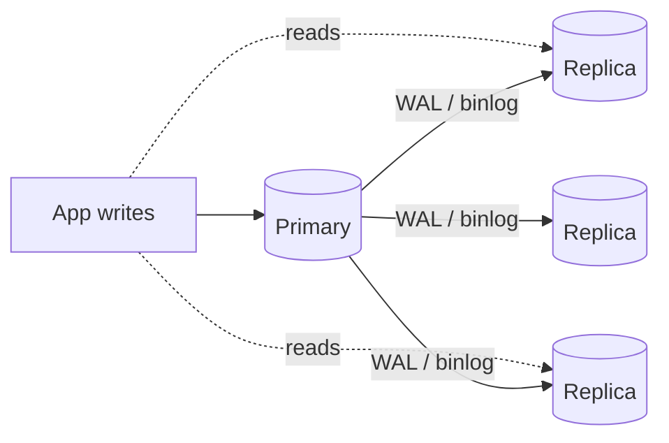
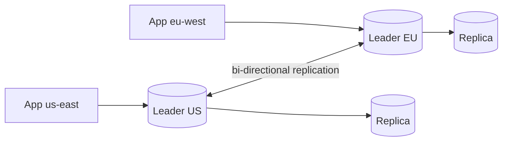

# Replication (Master-Slave, Master-Master, Multi-Region)

> **TL;DR** — **Replication** is keeping the same data on multiple machines for **availability, read scaling, geographic locality, and disaster recovery**. Three main topologies: **single-leader** (master-slave, the default — one writer, N followers), **multi-leader** (master-master, multiple writers — useful but conflict-prone), and **leaderless** (Dynamo-style quorum reads/writes). The two big choices that decide your trade-off space are **synchronous vs asynchronous** (latency vs durability) and **how conflicts are resolved**. Add **multi-region** and you must respect the speed of light.

---

## 1. Why Replicate?

- **High availability** — if the primary dies, a replica takes over.
- **Read scaling** — many replicas serve read traffic.
- **Geographic locality** — read from a replica close to the user.
- **Disaster recovery** — different DC / region copy survives a regional outage.
- **Backups without downtime** — `pg_dump` against a replica.
- **Zero-downtime maintenance** — upgrade replicas first, fail over.

Replication is the foundation under almost every production database deployment beyond "one box".

---

## 2. Single-Leader (Master-Slave / Primary-Replica)



- **One primary** accepts writes.
- **N replicas** apply the primary's WAL/binlog and serve reads.
- Failover promotes a replica to primary when the original dies.

**This is the default** for almost every relational DB (Postgres, MySQL, SQL Server, MongoDB, Redis).

### Pros
- **Simple model**. One writer; no conflicts.
- **Linearizable writes** by construction.
- **Easy scaling of reads** by adding replicas.
- **Lots of tooling, talent, and operational experience** out there.

### Cons
- **Write bottleneck** — the primary's capacity caps writes.
- **Replication lag** — replicas can be seconds (or minutes) behind under load.
- **Failover is non-trivial** — split-brain risk, RPO/RTO trade-offs.
- **Single point of failure for writes** during failover window.

---

## 3. Sync vs Async — The Knob That Matters Most

### Asynchronous
The primary commits the write, *then* tells replicas. If the primary dies before replicas catch up, **you can lose recent writes**.

- ✅ Lowest write latency.
- ✅ Replicas don't slow down the primary.
- ❌ Possible data loss on failover (RPO > 0).
- The default in most engines.

### Synchronous
The primary waits for at least one replica to acknowledge before reporting commit.

- ✅ Zero data loss on single-replica failover (RPO = 0).
- ❌ Higher write latency (network RTT to the replica).
- ❌ Primary stalls if the sync replica is down (until you reconfigure).

### Semi-synchronous
The primary waits for the **network ack** but not the actual apply. A practical middle.

### Quorum-based
Write succeeds when **a quorum** of replicas confirms (e.g., 2 of 3). Used by Spanner, CockroachDB, Cassandra, etcd, Kafka with min.insync.replicas.

```
Sync to one replica   ─►  zero data loss + slightly higher latency
Async                  ─►  fast + possible recent-write loss
Quorum                 ─►  tunable; survives N-1 failures
```

For data that matters: **at least one synchronous replica**, ideally in a different AZ.

---

## 4. What Gets Replicated — Log Shipping Variants

### Statement-based
Replicate the SQL statements. Simple, but non-deterministic statements (`NOW()`, `RAND()`, triggers) cause divergence. Mostly historical.

### Row-based / Logical
Replicate **the changes to rows** (binlog row format, Postgres logical replication). Deterministic; can replicate a *subset* of tables; can replicate across major versions or different schemas.

### Physical / WAL streaming
Stream raw write-ahead log bytes (Postgres streaming replication, MySQL's binlog in some modes, RDS read replicas). Byte-identical replicas — fast, exact, but tied to engine version and schema.

### Trigger-based
DIY using triggers. Used to bootstrap migrations or specialized cross-DB replication tools (Bucardo, Slony). Mostly obsolete.

Modern Postgres ships both physical (`primary_conninfo`) and logical (`pglogical`-style; built-in since PG10). Pick by use case.

---

## 5. Multi-Leader (Master-Master)



Multiple leaders accept writes. Each propagates changes to the others.

### Pros
- **Each region writes locally**. Low write latency for users worldwide.
- **High availability** — losing one leader doesn't stop writes elsewhere.
- **Offline / disconnected** mobile or edge writes can sync later.

### Cons
- **Write-write conflicts**. Two leaders update the same row simultaneously → which wins?
- **Conflict resolution** is hard:
  - **Last-write-wins (LWW)** — easy, lossy.
  - **Application-defined merge** — correct but complex.
  - **CRDTs** — math-backed automatic merge for specific types (counters, sets, sequences).
- **Schema migrations** become tricky.
- **Operational pain** is real.

Used by: **CouchDB, BDR for Postgres, multi-master MySQL (Galera/Group Replication), legacy Oracle multi-master, Cassandra (effectively leaderless with multi-DC quorum)**, multi-region DynamoDB Global Tables.

> *In practice, most teams that "need" multi-master end up unhappy. Single-leader with regional read replicas, or NewSQL (Spanner / Cockroach), is usually a better fit.*

---

## 6. Leaderless (Dynamo-Style)

No special "primary." Clients write to **N replicas**; success requires **W acks**. Reads consult **R replicas**; if `W + R > N`, you have a quorum that guarantees you see the latest committed write.

Used by **Dynamo, Cassandra, ScyllaDB, Riak**.

Strengths:
- Survives multiple node failures gracefully.
- Naturally multi-DC active-active.
- Tunable consistency per operation.

Weaknesses:
- Read repair and anti-entropy fill in stale replicas in background.
- Conflict resolution still needed (vector clocks, LWW).
- Latency depends on slowest replica in the quorum.

See [Quorum-Based Replication](../08-distributed-systems/quorum.md).

---

## 7. Replication Lag — The Silent Killer

Asynchronous followers lag by some amount of WAL. Symptoms:
- A user creates a record, then queries a read replica — sees nothing.
- Analytics on the replica is "yesterday's data" by lunch.
- Failover loses recent writes if lag exceeded the RPO target.

Mitigations:
- **Read-your-writes** routing: send a user's reads to the primary for a short window after their write.
- **Causal reads / bookmarks**: replica tracks a position; client passes the bookmark; replica waits to apply that position before answering.
- **Sync replication** on critical paths.
- **Monitor lag** (`pg_stat_replication.lag`, MySQL `Seconds_Behind_Master`).
- **Slow down writes** (admission control) when lag exceeds threshold.

---

## 8. Failover — How Promotion Works

When the primary dies:
1. **Detect** (heartbeat / health check / consensus).
2. **Pick a new primary** (usually the most up-to-date replica).
3. **Fence the old primary** to prevent split-brain.
4. **Redirect clients** to the new primary.
5. **Catch up the rest** of the replicas via WAL.
6. **Rejoin the old primary** as a replica when it's back.

Tooling:
- **Patroni** + etcd / Consul / ZooKeeper — Postgres HA.
- **Orchestrator** — MySQL HA.
- **MySQL Group Replication / MHA**.
- **MongoDB Replica Set** — automatic, election-based.
- **Cloud-managed**: RDS Multi-AZ, Aurora, AlloyDB, Cloud SQL, Atlas — failover is automated and you don't see it.

### RPO and RTO
- **RPO (Recovery Point Objective)** — max acceptable data loss on failure. Sync replication → RPO ≈ 0; async → seconds.
- **RTO (Recovery Time Objective)** — max acceptable downtime. Automated failover → seconds to minutes; manual → minutes to hours.

Set these explicitly. Drill them. Untested failovers fail.

---

## 9. Split-Brain

Two nodes both think they're the primary, both accept writes. Data diverges.

Causes:
- Network partition where both sides have replicas willing to promote.
- Mis-configured fencing.

Mitigations:
- **Quorum-based election** (etcd, ZooKeeper, Patroni's DCS).
- **STONITH** ("Shoot The Other Node In The Head") — physically/programmatically fence the old primary.
- **Generation / epoch numbers** — every promotion bumps a generation; any client write referencing an older generation gets rejected.

Split-brain is one of the worst outages a DB team can have. Trust the tooling; never roll-your-own failover.

---

## 10. Multi-Region Replication

Strategies:

### Single-leader, replicas in other regions
- Cheap, simple, *fast local reads* in other regions (with lag).
- Writes still cross the WAN (50–250 ms RTT).
- DR plan: promote a replica in another region if the primary region dies (RPO depends on sync mode).

### Active-active with regional leaders (multi-master / multi-leader)
- Each region writes locally — low write latency for that region's users.
- Conflict resolution becomes critical.
- Used by: DynamoDB Global Tables, Cosmos DB multi-region writes, CouchDB.

### Geo-partitioned NewSQL (CockroachDB, Spanner)
- Each row's data lives in a specific region (`LOCALITY REGIONAL BY ROW`).
- Writes stay local; cross-region transactions pay quorum latency.
- SQL + ACID + multi-region — at higher operational cost.

### Tiered approach
- Global metadata in one region (DNS-style consistency).
- Per-region transactional data with local replicas.
- Async global replication for analytics.

Multi-region adds complexity (failover testing, latency budgets, regulatory compliance). Most products start single-region and add regions only when the business demands it.

---

## 11. Cassandra / DynamoDB-Style Multi-DC

- Replication strategy `NetworkTopologyStrategy` with RF per DC.
- Writes by default fan out to all DCs.
- Consistency level `LOCAL_QUORUM` for low-latency local quorum reads.
- Async cross-DC replication closes the gap.

This is the cleanest model for "we have users on three continents and need each region to read/write locally with eventual consistency."

---

## 12. Replication in Specific Engines

| Engine | Mechanism | Default |
| --- | --- | --- |
| **PostgreSQL** | Streaming WAL or logical replication | Single-leader, async |
| **MySQL InnoDB** | binlog (statement/row/mixed) | Single-leader, async; semi-sync, group replication available |
| **Oracle Data Guard / GoldenGate** | Physical / logical | Single-leader (Data Guard); multi-leader (GoldenGate) |
| **SQL Server Always On Availability Groups** | Log shipping | Single-leader |
| **MongoDB** | Oplog | Replica set primary + secondaries |
| **Redis** | Replication of write commands | Single-leader, async; Cluster for sharding |
| **Cassandra / Scylla** | Gossip + write replicas | Leaderless, multi-DC |
| **DynamoDB** | Internal multi-replica with Paxos | Multi-AZ; Global Tables for multi-region |
| **CockroachDB / Spanner** | Per-range Raft / Paxos | Quorum, multi-region |
| **Kafka** | ISR (in-sync replicas) of partition log | Quorum |

Knowing the *mechanism* of each is essential when you're picking a knob (sync mode, replica count, lag tolerance).

---

## 13. Practical Recipes

### Boring web app
- One primary + one sync replica in another AZ (zero data loss).
- One async replica for analytics / backups.
- Managed offering (RDS / Cloud SQL / Aurora) handles failover.

### High read traffic
- One primary + many async replicas.
- Reads from a load balancer; writes to the primary endpoint.
- Read-your-writes via short routing override after a write.

### Multi-region web app, single-region DB
- All writes hit one region.
- Cross-region read replicas; user reads served locally.
- A regional outage means failover to another region's replica (with some data loss).

### Globally distributed SaaS
- CockroachDB / Spanner / DynamoDB Global Tables.
- Pin rows to home regions.
- Pay quorum latency only for cross-region transactions.

### Reporting / analytics
- Logical replication of the OLTP into a warehouse (Snowflake / BigQuery) via Debezium / Airbyte / Fivetran.
- Or a CDC pipeline (see [CDC](./cdc.md)).

---

## 14. Common Mistakes

- Single primary, single AZ, no replica → outage is one bad disk away.
- All replicas in one AZ → power loss kills them all.
- Hard-coded `db.primary.example.com` URLs everywhere → painful failover.
- Reading from replicas without read-your-writes guard → stale data confuses users.
- Ignoring replication lag in monitoring.
- Async replication treated as "no data loss" — it isn't.
- Multi-master adopted without a conflict-resolution strategy.
- Untested failover. Drill it. Twice a year.
- Manual failover scripts no one's run since 2022.
- Forgetting clock skew when reasoning about cross-region replication.

---

## 15. Cheat Card

```
TOPOLOGIES
  Single-leader  one writer, many followers. DEFAULT.
  Multi-leader   many writers, regional. Conflict resolution required.
  Leaderless     Dynamo-style. Quorum reads/writes; tunable.

SYNC vs ASYNC
  async    fast, may lose recent writes on failover.
  sync     zero loss, primary stalls if replica down.
  semi-sync / quorum   tunable middle.

LOG TYPES
  physical (WAL streaming)   byte-identical, fast, same version.
  logical / row-based         flexible, cross-version, table subsets.
  statement-based             historical; non-deterministic = bad.

REPLICATION LAG
  monitor it; route critical reads to primary (read-your-writes).
  causal reads / bookmarks help.

FAILOVER
  detect → pick new leader → fence old → redirect → catch up.
  RPO/RTO targets must be explicit + drilled.
  Patroni / Orchestrator / cloud-managed avoid roll-your-own.

SPLIT-BRAIN
  fence with quorum / STONITH / generation numbers.
  trust the tooling.

MULTI-REGION
  - single-leader + remote replicas       (simple)
  - multi-leader regional                  (conflict resolution headache)
  - NewSQL with row-locality               (Spanner / Cockroach)
  - Dynamo Global Tables / Cosmos          (managed multi-region)
  Speed of light is non-negotiable.

ALWAYS
  At least one replica in a different AZ.
  Test failover.
  Monitor lag.
```

---

## 16. Resources

### Books
- *Designing Data-Intensive Applications* — Kleppmann; Ch. 5 (replication) is the single best chapter on this topic.
- *Database Internals* — Alex Petrov.
- *Site Reliability Engineering* — Google (chapters on data integrity / DR).

### Documentation
- **PostgreSQL replication** — <https://www.postgresql.org/docs/current/high-availability.html>
- **MySQL replication** — <https://dev.mysql.com/doc/refman/en/replication.html>
- **MongoDB replica sets** — <https://www.mongodb.com/docs/manual/replication/>
- **Cassandra replication** — <https://cassandra.apache.org/doc/latest/cassandra/architecture/dynamo.html>
- **AWS RDS / Aurora replication** — service docs.
- **CockroachDB replication** — <https://www.cockroachlabs.com/docs/stable/architecture/replication-layer.html>

### Articles
- "Replication strategies" — Kleppmann blog and conference talks.
- "How to do distributed locking" — Martin Kleppmann: <https://martin.kleppmann.com/2016/02/08/how-to-do-distributed-locking.html>
- "Aurora: Design Considerations" — Amazon paper (SIGMOD 2017).
- Jepsen analyses of replication safety — <https://jepsen.io/>
- "Split-brain in CouchDB" — instructive postmortems.

### Videos
- Hussein Nasser replication deep dives — <https://www.youtube.com/@hnasr>
- ByteByteGo: "Replication explained" — <https://www.youtube.com/@ByteByteGo>
- Martin Kleppmann replication lectures — <https://www.youtube.com/@kleppmann>

### Tools
- **Patroni** (Postgres HA).
- **Orchestrator** (MySQL HA).
- **WAL-G / pgBackRest** for Postgres backup + PITR.
- **mysqlbinlog / Maxwell / Debezium** for CDC + replication.
- **pglogical / pg_basebackup** for Postgres.
- Cloud-managed: RDS, Aurora, Cloud SQL, Atlas, Azure SQL.

### Adjacent reading
- [Read Replicas & Write-Through Patterns →](./read-replicas.md)
- [Sharding & Partitioning →](./sharding-partitioning.md)
- [Change Data Capture →](./cdc.md)
- [Quorum-Based Replication →](../08-distributed-systems/quorum.md)
- [Multi-Region (geo systems) →](../10-scalability/multi-region.md)
- [Failover & Disaster Recovery →](../11-reliability/failover-dr.md)

---

*Previous:* [← MVCC](./mvcc.md)  |  *Next:* [Sharding & Partitioning →](./sharding-partitioning.md)
