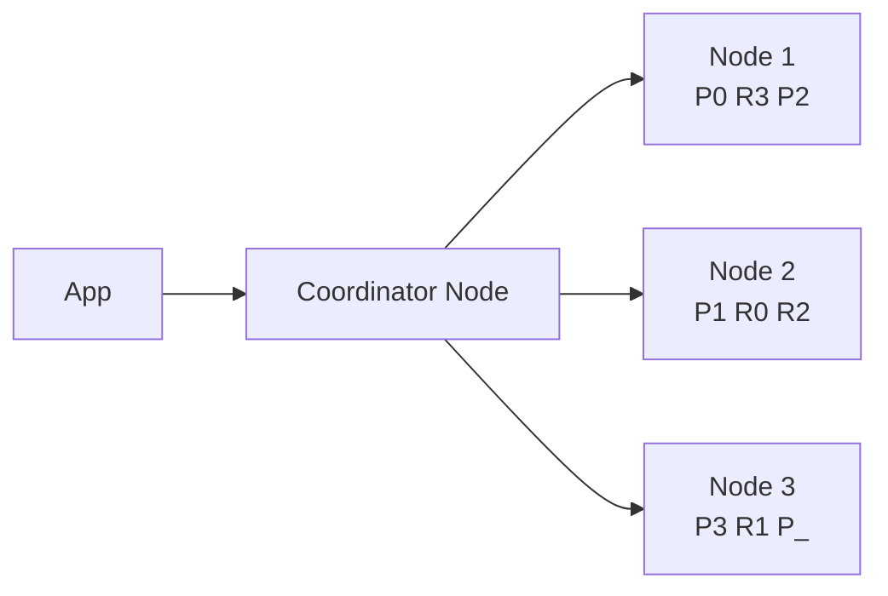
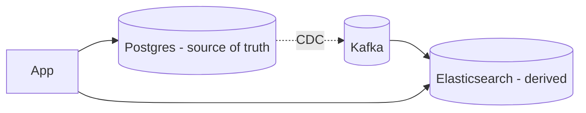

# Search Engines (Elasticsearch, OpenSearch, Solr)

> **TL;DR** — A **search engine** is a database optimized for **finding documents by content rather than by key**. The core data structure is the **inverted index**: a map from each term to the list of documents containing it. On top of that, search engines layer **scoring** (BM25/TF-IDF), **analyzers** (tokenizers, stemmers, synonyms), **filters** (facets, ranges), **geo**, **aggregations**, and increasingly **vector search**. Players: **Elasticsearch**, **OpenSearch**, **Apache Solr**, **Meilisearch**, **Typesense**, **Vespa**, **MongoDB Atlas Search**, **Postgres FTS**. Almost always used as a **derived store** kept in sync with the source-of-truth DB.

---

## 1. What "Search" Actually Means

You usually don't want this:

```sql
SELECT * FROM articles WHERE body LIKE '%machine learning%';
```

Reasons:
- It's slow (no index).
- It misses "Machine Learning" (case), "machine-learning" (punctuation), "ML" (synonym), "machine learnings" (plural).
- It can't rank — every match is "equal."
- It can't combine text with filters cheaply.

A search engine does all of that for you, fast, with good defaults.

```
GET /articles/_search
{
  "query": {
    "bool": {
      "must":   [ { "match": { "body": "machine learning"   }}],
      "filter": [ { "range": { "published_at": { "gte": "now-30d" }}},
                  { "term":  { "category": "ai" }} ]
    }
  },
  "aggs":   { "top_authors": { "terms": { "field": "author" }}},
  "sort":   [ "_score", { "published_at": "desc" } ]
}
```

One request: tokenized full-text match, ranking, time filter, faceted aggregation, secondary sort. The same query in raw SQL would be hundreds of lines and wouldn't scale.

---

## 2. The Inverted Index — The Core Idea

A normal (forward) index maps `doc_id → fields`. The **inverted index** maps `term → [doc_ids]`.

```
Documents:
  D1: "the quick brown fox"
  D2: "the quick blue cat"
  D3: "lazy brown dog"

Inverted index (after lowercasing, stop-word removal):
  brown → [D1, D3]
  cat   → [D2]
  dog   → [D3]
  fox   → [D1]
  lazy  → [D3]
  quick → [D1, D2]
```

To find "brown quick":
- Look up `brown` → [D1, D3].
- Look up `quick` → [D1, D2].
- Intersect → [D1].

Scoring (BM25) ranks the result by how *important* the term is in each document and how rare it is in the corpus.

Add **positions** to allow phrase queries (`"quick brown"` matches D1 but not D3). Add **payloads** for offsets, scores. Add **doc values** for sorting/aggregating without re-reading the doc.

This single idea — the inverted index — is what makes search engines what they are.

---

## 3. The Players

| Engine | Notes |
| --- | --- |
| **Elasticsearch** | Dominant. Built on **Lucene**. Mature, vast ecosystem, observability stack (ELK). License changed in 2021 (Elastic License). |
| **OpenSearch** | AWS-led Apache-licensed fork of Elasticsearch 7.10. Compatible API; faster moving on some fronts. |
| **Apache Solr** | Older, also built on Lucene. Enterprise installs everywhere. Less hot than ES today. |
| **Meilisearch** | Lightning-fast typo-tolerant search for small/medium corpora. Open-source, single binary. |
| **Typesense** | Similar niche — instant search, simple ops. |
| **Vespa** | Yahoo-originated, hybrid (vector + lexical + ML scoring) at huge scale. |
| **MongoDB Atlas Search** | Lucene-powered, embedded in MongoDB Atlas. |
| **Postgres FTS** | `tsvector` + GIN indexes. Surprisingly capable for small/medium use cases. |
| **ClickHouse / Tantivy** | Adjacent — analytics with text features. |
| **Algolia** | Hosted commercial. Spectacular DX for site search. |

Practical defaults:
- **OpenSearch / Elasticsearch** for general full-text + logs + analytics.
- **Meilisearch / Typesense / Algolia** for instant-as-you-type site search.
- **Postgres FTS** if you already have Postgres and the corpus is modest.
- **Vespa** when you need vector + lexical fusion at scale.

---

## 4. Analyzers — Where Search Becomes Smart

The engine doesn't store raw text. It **analyzes** it into tokens at index time and query time.

```
Input text:
  "The Quick Brown-Foxes are Running!"

Pipeline (a typical English analyzer):
  1. Char filters: strip HTML, normalize quotes
  2. Tokenizer:   split on whitespace + punctuation → ["The","Quick","Brown","Foxes","are","Running"]
  3. Token filters:
       lowercase     → ["the","quick","brown","foxes","are","running"]
       stop words    → ["quick","brown","foxes","running"]
       stemming      → ["quick","brown","fox","run"]
       synonyms      → ...
  4. Indexed tokens: quick · brown · fox · run
```

This is why a query for "running foxes" still matches.

Configurable per field. Common variants:
- **Standard** analyzer — generic.
- **English / per-language** analyzers — stemmers, stop-word lists.
- **Edge n-gram / autocomplete** — index prefixes for typeahead.
- **Keyword** — no analysis; exact-match only (for filters / aggregations).
- **Custom** — combine pieces for your domain.

Same text can be indexed multiple ways (`title`, `title.keyword`, `title.suggest`) — multi-field mapping.

---

## 5. Scoring — Ranking Results

Default scorer: **BM25** (a refined TF-IDF). For each query term in each candidate doc:
- **Term frequency (TF)**: term appears N times → higher score, with diminishing returns.
- **Inverse document frequency (IDF)**: rare-in-corpus terms score higher.
- **Field length normalization**: short fields with the term score higher than long ones.

Combined into a single score per doc. Top-K returned.

You can shape ranking with:
- **Boosts** — `{ "match": { "title": { "query": "x", "boost": 3 }}}` — title matches matter more.
- **Function scores** — multiply by freshness, popularity, distance.
- **Rescoring** — re-rank top-N with a more expensive model.
- **Learning-to-rank (LTR)** — train a model to combine many features.
- **Reciprocal rank fusion (RRF)** — blend results from multiple queries (lexical + vector).

Tuning ranking is half of building a real search experience.

---

## 6. Filters, Facets, Aggregations

A search engine is also a small analytics database:

- **Filters** — boolean predicates that don't affect scoring (and are cacheable).
- **Faceting / aggregations** — `terms` (group-by), `histogram`, `date_histogram`, `geo_distance`, `cardinality` (unique-count), `percentiles`.
- **Composite aggregations** for paginated drill-downs.

```
"aggs": {
  "by_category": {
    "terms": { "field": "category" },
    "aggs": {
      "avg_price": { "avg": { "field": "price" } }
    }
  }
}
```

That's GROUP BY + AVG in JSON. Combined with text queries, it powers any "e-commerce filter sidebar".

---

## 7. Vector Search (the new piece)

Modern search engines now store **dense vector embeddings** alongside text and provide **k-nearest-neighbor** search (HNSW algorithm, mostly).

```
Document: { text: "...", embedding: [0.12, -0.45, ...] }

Query: find 10 docs whose embedding is closest to <vector(...)>.
```

Combined ("hybrid") with lexical BM25 via Reciprocal Rank Fusion or weighted scores, this is the standard recipe for **RAG** (Retrieval-Augmented Generation) and **semantic search** in 2026.

Tools:
- **Elasticsearch / OpenSearch** — `dense_vector` + HNSW.
- **Vespa** — first-class hybrid retrieval.
- **Weaviate / Pinecone / Milvus / Qdrant** — dedicated vector DBs.
- **pgvector** — Postgres extension.

See [Vector Databases](./vector-databases.md).

---

## 8. Architecture — Indices, Shards, Replicas

Elasticsearch / OpenSearch:
- An **index** is roughly a table.
- Each index is divided into **primary shards** (the unit of write distribution).
- Each shard has **replica shards** for HA and read scaling.
- A **node** holds many shards from many indices.
- The **cluster** balances and reassigns shards.



Choices:
- **Shard count is set at index creation time**; resharding requires reindexing.
- **Too many tiny shards** → metadata pressure. **Too few large shards** → poor parallelism.
- **Time-based indices** (`logs-2026-05-19`) are the standard pattern for logs / metrics — drop old indices for retention.

For very large clusters: separate **data**, **master**, **ingest**, and **coordinating** nodes; use **ILM** (index lifecycle management) for hot/warm/cold/frozen tiers; tier old data to object storage (frozen + searchable snapshots).

---

## 9. Search Engines Are Not Systems of Record

This is **the** rule. A search index:
- Loses data sometimes (it's optimized for performance).
- Has eventual consistency vs the source DB.
- Can be rebuilt from the source.
- Has data shapes that change with index design.

So the canonical pattern:



CDC (Debezium → Kafka → indexer) feeds the search index. The DB is authoritative. You can rebuild the index without losing data.

---

## 10. Common Use Cases

- **Site / product search** — typeahead, filters, facets, relevance.
- **Log search** — Elasticsearch / OpenSearch with Logstash / Fluent Bit / Vector → Kibana / OpenSearch Dashboards. The "ELK / OpenSearch stack".
- **APM / observability** — index spans, exemplars, traces.
- **Security analytics** — SIEM (Elastic, OpenSearch, Splunk).
- **E-commerce / marketplaces** — relevance + personalization.
- **Knowledge bases** — semantic + lexical hybrid for chat-with-your-docs.
- **Geo search** — "restaurants within 5 km."
- **Autocomplete / suggesters** — edge n-grams, completion suggester.
- **De-dup / fuzzy match** — name resolution, address matching.

---

## 11. Pitfalls

- Treating the search index as the source of truth.
- Using `text` fields for filters / aggregations (use `keyword` sub-field).
- Mapping explosions — wildcards in field names create thousands of mappings.
- Too many shards per node.
- Refresh interval too short (1 s default in ES is fine for search; for ingest-heavy workloads bump to 30 s).
- Heavy `wildcard:*foo*` queries — design n-grams instead.
- Deep pagination (`from=100000`) — use `search_after` cursors.
- No retention policy on log indices.
- JVM GC and heap pressure — keep heap ≤ 30 GB.
- Reindexing during a hot incident — be sure your operational tooling is set up.

---

## 12. Performance Tuning Highlights

- **Bulk** writes — use `_bulk` API or client batching.
- **Refresh interval** — `30s` or longer for heavy ingest.
- **`number_of_shards`** — start with 1–3 per index; scale by reindex when needed.
- **Doc values** on aggregated fields.
- **Routing** — write/read same key to same shard for locality.
- **Filter caches** — keep filter clauses (range, term) cacheable (no `now/d` constants — round to day boundaries).
- **Synthetic source** (recent ES) — store less, reconstruct on read.
- **Index sorting** — pre-sort by frequently queried field (e.g., `@timestamp`).
- **Hot/warm/cold** tiers + ILM — cheaper hardware for older data.

---

## 13. Postgres Full-Text Search

For a corpus up to a few million docs and a single Postgres deployment, FTS is excellent:
```sql
ALTER TABLE articles ADD COLUMN tsv tsvector;
UPDATE articles SET tsv = to_tsvector('english', title || ' ' || body);
CREATE INDEX articles_tsv_idx ON articles USING GIN (tsv);

SELECT id, title, ts_rank(tsv, q) AS rank
FROM articles, to_tsquery('english', 'machine & learning') AS q
WHERE tsv @@ q
ORDER BY rank DESC
LIMIT 10;
```

You get tokenization, stemming, stop words, ranking, and a GIN index. Add **pg_trgm** for fuzzy match, **pgvector** for embeddings, and you have a respectable search stack inside Postgres.

When to outgrow Postgres FTS:
- Hundreds of millions of docs.
- Heavy aggregation / log-shaped workloads.
- Sophisticated relevance tuning, learning-to-rank.
- Need a clear separation between source-of-truth and search.

---

## 14. Picking a Search Engine

```
You want logs + search + dashboards in one stack?
  → Elasticsearch / OpenSearch (with Kibana / OS Dashboards).

You want instant site search with typo tolerance, low-ops?
  → Meilisearch / Typesense / Algolia.

You're on Postgres and corpus < ~10M docs?
  → Postgres FTS (+ pg_trgm + pgvector).

You need hybrid vector + lexical + heavy ML scoring?
  → Vespa, or ES/OS with dense_vector + RRF.

You want serverless, managed, AWS-native?
  → OpenSearch Serverless.

You want enterprise SIEM?
  → Splunk (commercial), OpenSearch Security Analytics.
```

---

## 15. Cheat Card

```
SEARCH ENGINE  finds docs by content, not by key.
                Core: inverted index + analyzers + BM25 scoring.

PIPELINE       text  → tokenize → lowercase → stop → stem → synonyms → tokens
                query → same pipeline → match against index → score → top-K.

FIELD TYPES    text (analyzed)   keyword (exact)   date / numeric / geo
                dense_vector (HNSW for ANN)

QUERIES        match (analyzed)  term (exact)  range  bool (must/filter/should)
                geo_distance, geo_polygon, has_child, nested

AGGREGATIONS   terms, histogram, date_histogram, cardinality, percentiles, composite

PITFALLS       wrong field type for filters/aggregations
                mapping explosion · too many tiny shards
                deep `from=` paging · heavy wildcards · no retention

RULE
  Search index = derived store. Source of truth lives elsewhere.
  Feed via CDC. Rebuild when schema changes.

HYBRID 2026    Lexical (BM25) + dense vector (HNSW) + Reciprocal Rank Fusion.
```

---

## 16. Resources

### Books
- *Elasticsearch: The Definitive Guide* (somewhat dated, still foundational).
- *Relevant Search* — Doug Turnbull, John Berryman. The canonical book on tuning relevance.
- *AI-Powered Search* — Trey Grainger, Doug Turnbull, Max Irwin (Manning).
- *Lucene in Action* — Michael McCandless et al.

### Documentation
- **Elasticsearch** — <https://www.elastic.co/guide/en/elasticsearch/reference/current/index.html>
- **OpenSearch** — <https://opensearch.org/docs/latest/>
- **Apache Solr** — <https://solr.apache.org/guide/>
- **Meilisearch** — <https://www.meilisearch.com/docs>
- **Typesense** — <https://typesense.org/docs/>
- **Vespa** — <https://docs.vespa.ai/>
- **Postgres FTS** — <https://www.postgresql.org/docs/current/textsearch.html>

### Articles
- "BM25 the next generation of Lucene relevance" — Elastic blog: <https://www.elastic.co/blog/practical-bm25-part-1-how-shards-affect-relevance-scoring-in-elasticsearch>
- "Hybrid search with Reciprocal Rank Fusion" — Elastic.
- "Designing for search at scale" — Algolia engineering blog.
- "Vespa: Hybrid retrieval blog series" — vespa.ai.

### Videos
- ByteByteGo: "How Search Engines Work" — <https://www.youtube.com/@ByteByteGo>
- Hussein Nasser ES/OS deep dives — <https://www.youtube.com/@hnasr>
- Elastic{ON} talks on YouTube.
- "Inside Lucene" — Michael McCandless conference talks.

### Tools
- **Kibana / OpenSearch Dashboards** — analytics UI.
- **Cerebro / dejavu** — ES cluster managers.
- **Vector** (Datadog open-source) — log shipping.
- **Logstash / Fluent Bit** — log pipelines.
- **search-ui / instantsearch.js** — search UIs.
- **trec_eval / Quepid** — relevance evaluation tooling.

### Adjacent reading
- [Vector Databases](./vector-databases.md)
- [Inverted Indexes →](../19-advanced/inverted-index.md)
- [TF-IDF & BM25 →](../19-advanced/tf-idf-bm25.md)
- [Trie Data Structure for Autocomplete →](../19-advanced/trie.md)
- [Change Data Capture](./cdc.md)
- [Centralized Log Aggregation →](../13-observability/log-aggregation.md)

---

*Previous:* [← Time-Series Databases](./time-series-databases.md)  |  *Next:* [Vector Databases →](./vector-databases.md)
