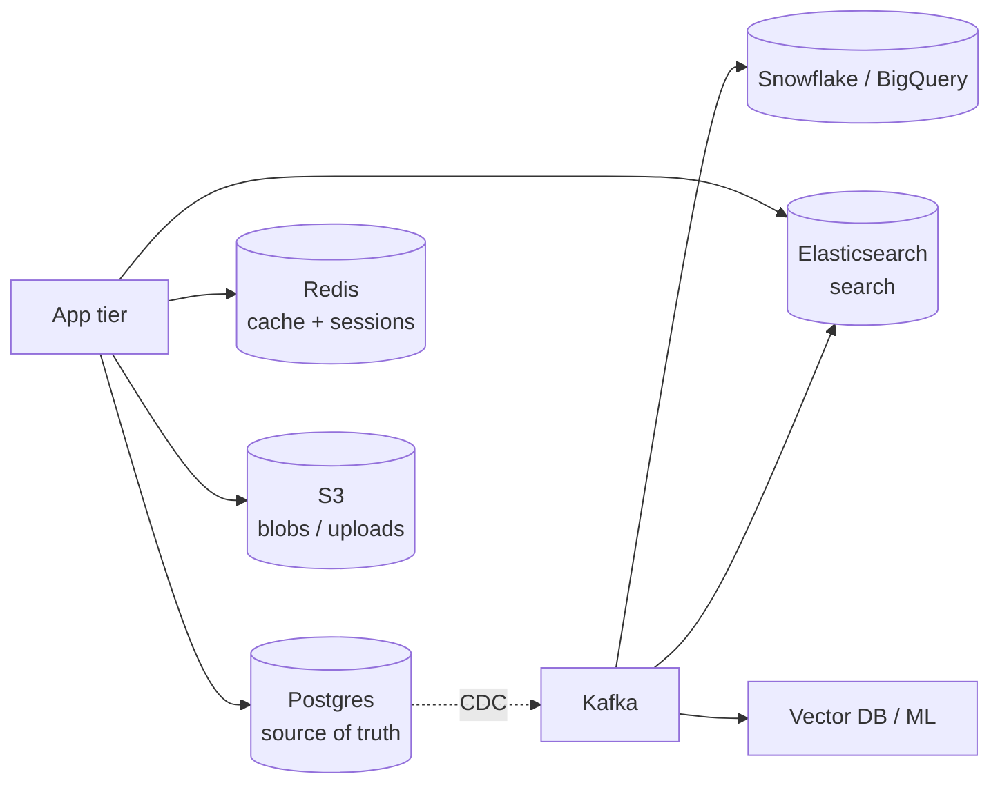

# SQL vs NoSQL — When to Use What

> **TL;DR** — **SQL** (relational) databases organize data into rigorously-shaped tables with strong typing, joins, and ACID transactions. **NoSQL** is an umbrella for everything else — **key-value**, **document**, **wide-column**, **graph**, **time-series**, **search**, **vector** — each optimized for a specific access pattern. The "right" choice is rarely either/or: most real systems use a **relational DB as the source of truth** plus one or two NoSQL stores for hot paths (cache, search, analytics). Pick by **access pattern**, not by hype.

---

## 1. The Map of the Territory

```
                ┌────────── DATABASES ──────────┐
                │                                │
        Relational (SQL)                     NoSQL
        ────────────────                     ─────
        Postgres, MySQL,           ┌──────┬──────┬──────┬──────┬──────┬──────┬──────┐
        Oracle, SQL Server         │ K/V  │ Doc  │ Wide-│Graph │Time- │Search│Vector│
        + NewSQL                   │      │      │ Col  │      │Series│      │      │
        (CockroachDB,              │ Redis│ Mongo│Cassa │Neo4j │Influx│Elastic│ pgv │
        Spanner, TiDB)             │ Dyn  │ Couch│ndra  │Nept. │TSDB  │ Solr  │ Pine│
                                   └──────┴──────┴──────┴──────┴──────┴──────┴──────┘
```

"NoSQL" was a marketing term that stuck. It really means "not the relational model." Each family solves a different problem.

---

## 2. Relational (SQL) — Still the Default

### What you get
- Tables with **typed columns**, primary/foreign keys.
- **SQL** — a 50-year-old declarative query language.
- **Joins** across tables.
- **ACID transactions** — atomicity, consistency, isolation, durability.
- **Strong indexes** (B-tree, hash, GIN, GiST, BRIN…).
- **Mature ecosystem** — drivers, ORMs, tooling, hosted offerings.

### Where it shines
- Domains with rich relationships (users, orders, products).
- Anywhere consistency and correctness matter (money, inventory).
- Anywhere you need flexible queries you couldn't predict.
- Small-to-very-large workloads on a single node.

### Where it strains
- Globally distributed writes (single-leader bottleneck).
- Extreme horizontal scale on writes.
- Schema-less data that varies wildly per row.
- Tree / graph traversal at deep depths.
- Full-text search at scale.

### The honest truth
**Postgres or MySQL on a beefy box** handles 90% of real-world workloads. A lot of "we need NoSQL" decisions are premature. Vertically scale → add read replicas → eventually shard. By that time you may also need a NoSQL store, *alongside*.

See: [Relational Databases Deep Dive →](./relational-databases.md).

---

## 3. The NoSQL Families

### 3.1 Key-Value Stores
Just a giant `Map<key, value>`. Simplest, fastest, dumbest in the good way.

- **Examples**: Redis, Memcached, DynamoDB, RocksDB, etcd.
- **Strengths**: sub-ms latency, easy to scale.
- **Weaknesses**: queries beyond `GET key` are limited.
- **Use for**: caches, sessions, leaderboards, feature flags, rate-limit buckets.

### 3.2 Document Stores
Schema-flexible JSON documents in collections.

- **Examples**: MongoDB, CouchDB, Firestore, DocumentDB.
- **Strengths**: flexible shape, embeds nested data, easy to iterate.
- **Weaknesses**: weaker on cross-document joins; schema drift over time.
- **Use for**: user-generated content, product catalogs with varying attributes, mobile-app backends.

### 3.3 Wide-Column (a.k.a. Column-family) Stores
A sparse, distributed, sorted map: `(rowKey, columnFamily, column) → value`.

- **Examples**: Cassandra, HBase, ScyllaDB, Bigtable.
- **Strengths**: massive write throughput, linear horizontal scale, multi-DC.
- **Weaknesses**: query model is constrained — you must design tables for your queries.
- **Use for**: time-series at scale, IoT, messaging history, large append-only data.

### 3.4 Graph Databases
First-class nodes and edges; native traversal.

- **Examples**: Neo4j, JanusGraph, AWS Neptune, Memgraph, ArangoDB.
- **Strengths**: deep multi-hop queries (friends of friends of friends).
- **Weaknesses**: niche; smaller ecosystem; harder to scale horizontally.
- **Use for**: social graphs, fraud detection, recommendation networks, knowledge graphs.

### 3.5 Time-Series Databases
Optimized for `timestamp + tags → metric value`.

- **Examples**: InfluxDB, TimescaleDB (on Postgres), Prometheus, VictoriaMetrics, QuestDB.
- **Strengths**: write-optimized, compressed, fast time-range queries, downsampling.
- **Weaknesses**: only good at time-shaped data.
- **Use for**: metrics, IoT telemetry, financial ticks, monitoring.

### 3.6 Search Engines
Inverted indexes for full-text and faceted search.

- **Examples**: Elasticsearch, OpenSearch, Solr, Typesense, Meilisearch.
- **Strengths**: relevance scoring, fuzzy match, faceting, geo, analytics.
- **Weaknesses**: not a source of truth; eventually consistent with the primary DB.
- **Use for**: site search, log analytics, observability dashboards.

### 3.7 Vector Databases (the new family)
Nearest-neighbor search in high-dimensional embeddings.

- **Examples**: Pinecone, Weaviate, Milvus, Qdrant, **pgvector** (Postgres extension), Vespa.
- **Strengths**: ANN search at scale, hybrid lexical+vector ranking.
- **Weaknesses**: young space, rapidly evolving.
- **Use for**: semantic search, RAG (retrieval-augmented generation), recommendations, dedup.

### 3.8 NewSQL (the relational comeback)
Relational + ACID + horizontally distributed.

- **Examples**: CockroachDB, Google Spanner, YugabyteDB, TiDB.
- **Strengths**: SQL with global scale + strong consistency.
- **Weaknesses**: more expensive, more operational complexity than single-leader Postgres.
- **Use for**: global SaaS, fintech, anywhere you need both SQL and horizontal scale.

---

## 4. Choosing by Access Pattern

The right database is determined by **how data is read and written**, not by what shape it is.

| Access pattern | Strong fit |
| --- | --- |
| Lookup by ID, sub-ms latency | Key-value (Redis, DynamoDB) |
| Rich queries, joins, transactions | SQL |
| Massive writes, time- or row-keyed | Wide-column (Cassandra, ScyllaDB) |
| Nested user-content with varying shape | Document (MongoDB) |
| Multi-hop relationship queries | Graph (Neo4j) |
| Time-range aggregations on metrics | Time-series |
| "Find docs about X" full-text | Search (Elasticsearch) |
| "Find docs *similar to* X" (embeddings) | Vector (pgvector, Pinecone) |
| Global ACID across regions | NewSQL (Spanner, Cockroach) |

A common system mixes several:
- **Postgres** = source of truth for transactional data.
- **Redis** = cache + session + rate limiters.
- **Elasticsearch** = full-text + analytics.
- **Kafka** = event log / pipe.
- **S3** + warehouse = long-term + analytics.

This is **polyglot persistence**: each tool earns its keep.

---

## 5. The Schema Trade-Off

| | SQL | Document (NoSQL) |
| --- | --- | --- |
| Defined where | At DB level, before write | At app level, often validated at write |
| Migrations | Required for change | "Just write new shape" |
| Drift | Rare | Common |
| Querying | Joins / aggregates trivial | Many "queries" require app code or denormalization |
| Refactor cost | Higher up front | Higher down the road (when shapes diverge) |

Schemaless **isn't** schemaless — the schema lives in your code instead of the DB. Long-term, the lack of a central authority often costs more than the freedom gives back.

---

## 6. The Consistency Spectrum

```
Strong          Read-your-writes        Causal       Eventual
─────                                                    ─────
Single-leader        Sessions /          CRDTs,        Async
SQL,                 sticky reads        vector        replicated
Spanner,                                 clocks        caches,
ACID                                                    Cassandra
                                                        (tunable)
```

- **Strong consistency** in NoSQL is *possible* (DynamoDB strong reads, Cassandra QUORUM at LOCAL_QUORUM, etc.) but costs more.
- **Eventual consistency** is fine for product catalogs, social timelines, analytics.
- **Strict ACID** is needed for money, inventory, identity.

See: [ACID vs BASE →](./acid-vs-base.md) · [Consistency Models →](../08-distributed-systems/consistency-models.md).

---

## 7. CAP / PACELC in Practice

The CAP theorem says: during a network **partition**, you must choose between **consistency** and **availability**.

- **CP** databases (Spanner, MongoDB w/ majority write concern, etcd, Zookeeper) — refuse writes rather than serve stale data.
- **AP** databases (Cassandra, DynamoDB w/ eventual reads, CouchDB) — keep accepting writes; reconcile later.

**PACELC** adds: *Else (when there's no partition)*, you trade **latency** vs **consistency**. Spanner is CP+EC (high latency for strong). Dynamo is AP+EL (low latency for eventual).

For interviews: state explicitly which side of CAP/PACELC each component sits on. Mature engineers do this.

---

## 8. Operational Reality

| Concern | Relational | NoSQL |
| --- | --- | --- |
| Backups | Mature, tooling everywhere | Per-product; varies wildly |
| Migrations | DDL + zero-downtime patterns | Often "just write new docs" |
| Failover | Replica promotion (manual or auto) | Built-in for many NoSQLs |
| Multi-region | Usually single leader → manual planning | Cassandra/Dynamo native |
| Talent | Universal | Specialized per product |
| Hosted offerings | RDS, Cloud SQL, Aurora, AlloyDB | DynamoDB, MongoDB Atlas, Bigtable |

Don't overlook **who will operate this in 2 a.m. incidents**. Postgres talent is everywhere; Cassandra talent is harder to find.

---

## 9. When NoSQL Is Actually The Right Call

- You truly need **>10k writes/sec sustained** with multi-region availability → Cassandra, DynamoDB.
- Your access pattern is **always by one key** → key-value.
- Workloads are **time-series at scale** → TSDB.
- You need **search relevance** → search engine.
- You need **nearest-neighbor over embeddings** → vector DB.
- You're storing **wildly varying document shapes** that genuinely defy a schema → document store.
- You're traversing **deep relationship paths** → graph DB.

When in doubt: **start relational**. Move pieces to NoSQL only when measured pain forces the move.

---

## 10. When People Pick NoSQL And Regret It

- Picking MongoDB for highly relational data → reinventing joins in app code.
- Picking DynamoDB without first nailing the access patterns → expensive secondary-index workarounds later.
- Picking Cassandra at small scale → operational overhead for no benefit.
- Picking Elasticsearch as a primary store → data loss surprises (it's a search index, not a system of record).
- Picking vector DBs for tiny corpora → pgvector would have been enough.

The pattern: **picking a DB by hype**, not by access pattern.

---

## 11. A Pragmatic Decision Tree

```
Start: do you have clear access patterns AND scale needs?

  Not yet (early product) → POSTGRES or MySQL. Period.

  Yes:
    Predominantly look up by one key, sub-ms?   → key-value (Redis, Dynamo)
    Strict global ACID across regions?           → NewSQL (Cockroach, Spanner)
    Time-series metrics at scale?                → TSDB
    Full-text search?                            → Elasticsearch / Meilisearch
    Embedding similarity search?                 → pgvector or Pinecone
    Graph traversal?                             → Neo4j / Memgraph
    Wildly variable schema?                      → MongoDB (or pg JSONB)
    Massive horizontal writes + relaxed consistency? → Cassandra / Scylla

  Heavy analytics?                               → warehouse (Snowflake/BigQuery)
                                                   or lakehouse (Iceberg / Delta)

Most systems end up using POSTGRES + (REDIS, ELASTIC, ONE EXTRA) + S3 / WAREHOUSE.
```

---

## 12. Polyglot Persistence — The Modern Reality

A typical mid-size SaaS stack:



- **One source of truth** (Postgres).
- **Derived stores** kept in sync via CDC.
- **Each store does what it's best at.**

This isn't optimization — it's just standard practice in 2026.

---

## 13. Migrations Between Database Families

Common moves:

- **Single Postgres → sharded Postgres** (Citus, Vitess).
- **Postgres → DynamoDB** for a specific hot key path. Keep Postgres for the rest.
- **MongoDB → Postgres + JSONB** when the team realized they wanted SQL after all.
- **Cassandra → Scylla** for performance with the same API.
- **Postgres → CockroachDB** when global SQL + scale > single-region simplicity.

The hard part is rarely the SQL or the data — it's **dual-writing during the transition**, draining backfill safely, and switching reads without downtime. Plan for months.

---

## 14. Common Mistakes

- **Choosing by hype.** "Scaled to internet" doesn't mean "scaled to your problem."
- **Storing the only copy in a search index or cache.** They're derived stores. Treat them as ephemeral.
- **Ignoring access patterns** with DynamoDB / Cassandra — these reward you for upfront design and punish improvisation.
- **Trying to do joins in an app instead of using SQL.**
- **Treating MongoDB as "the easy SQL".** Different model, different costs.
- **No backup test for NoSQL.** Restore drills are non-negotiable.
- **Over-provisioning rare access patterns.** Postgres + Redis is enough until it isn't.
- **Underestimating talent cost.** "Cassandra at 3 a.m." is harder than "Postgres at 3 a.m."

---

## 15. Cheat Card

```
SQL (RDBMS)        rich queries, joins, ACID, mature ecosystem.
                    Postgres or MySQL solve 90% of cases.

KEY-VALUE          GET key. Redis, DynamoDB.
                    Caches, sessions, rate buckets, hot lookups.

DOCUMENT           JSON per record. MongoDB, Firestore.
                    Variable shapes, mobile back-ends.

WIDE-COLUMN        Cassandra, Scylla, HBase.
                    Massive writes, time-series at scale.

GRAPH              Neo4j, Neptune.
                    Multi-hop traversal.

TIME-SERIES        InfluxDB, Timescale, Prometheus.
                    Metrics, telemetry.

SEARCH             Elasticsearch, OpenSearch, Solr, Meilisearch.
                    Full-text, relevance, faceting. NOT a system of record.

VECTOR             pgvector, Pinecone, Weaviate, Milvus.
                    Nearest-neighbor over embeddings.

NEWSQL             CockroachDB, Spanner, TiDB.
                    Relational + horizontal scale + ACID.

CHOOSE BY ACCESS PATTERN, not by trend.

START with Postgres + Redis + Elasticsearch. Add others when justified.
POLYGLOT PERSISTENCE is the modern default — one source of truth, several
derived stores kept in sync via CDC.
```

---

## 16. Resources

### Books
- *Designing Data-Intensive Applications* — Martin Kleppmann. Chapters 2 & 3.
- *NoSQL Distilled* — Pramod Sadalage, Martin Fowler.
- *Database Internals* — Alex Petrov.
- *Seven Databases in Seven Weeks* — Eric Redmond, Jim Wilson.

### Online
- "When to use NoSQL" — Martin Fowler: <https://martinfowler.com/articles/nosql-distilled.html>
- AWS Database guidance: <https://aws.amazon.com/products/databases/>
- "Database of Databases" — comparative reference: <https://dbdb.io/>
- DB-Engines ranking (popularity over time): <https://db-engines.com/en/ranking>

### Videos
- ByteByteGo: "SQL vs NoSQL" — <https://www.youtube.com/@ByteByteGo>
- Hussein Nasser database series — <https://www.youtube.com/@hnasr>
- Martin Kleppmann lectures on data systems — <https://www.youtube.com/@kleppmann>

### Adjacent reading
- [Relational Databases Deep Dive →](./relational-databases.md)
- [Key-Value Stores →](./key-value-stores.md)
- [Document Stores →](./document-stores.md)
- [Wide-Column Stores →](./wide-column-stores.md)
- [ACID vs BASE →](./acid-vs-base.md)
- [CAP Theorem →](../08-distributed-systems/cap-theorem.md)

---

*Up:* [README ↑](../README.md)  |  *Next:* [Relational Databases Deep Dive →](./relational-databases.md)
