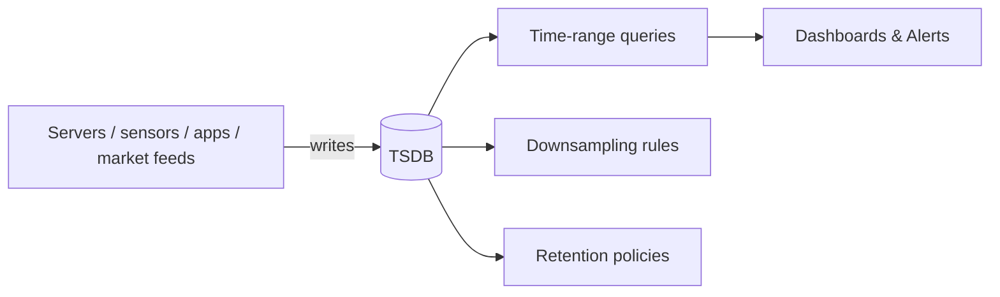

# Time-Series Databases (InfluxDB, TimescaleDB)

> **TL;DR** — A **time-series database (TSDB)** is purpose-built for **append-heavy, time-ordered, immutable data** — metrics, telemetry, sensor readings, financial ticks, application logs. Compared to a generic OLTP database, TSDBs win on write throughput, compression (10–100×), time-range queries, automatic retention, and downsampling. Big players: **Prometheus** (monitoring), **InfluxDB** (general), **TimescaleDB** (Postgres extension), **VictoriaMetrics**, **QuestDB**, **ClickHouse** (analytics-flavored), **Bigtable / OpenTSDB** (wide-column-based). Use one whenever you write millions of small, time-stamped records and read them as time-range aggregations.

---

## 1. What "Time-Series Data" Looks Like

```
metric:        cpu_usage
tags / labels: { host="web-01", region="eu-west-1", env="prod" }
timestamp:     2026-05-19T10:00:00.000Z
value:         0.73
```

Common to almost any time-series record:
- **Metric / measurement name** — what is being measured.
- **Tags / labels** — discrete dimensions ("host", "region", "device_id"). Cardinality matters.
- **Timestamp** — usually millisecond or nanosecond precision.
- **Value(s)** — numeric (or vectors of numerics, occasionally strings).

A typical row: `(metric, tags, ts) → value`. Billions of these per day in a serious deployment.



---

## 2. Why Not Just Use Postgres?

You *can* — and **TimescaleDB** is exactly that — but a generic relational DB hits walls fast:

- **Write rate** — ingesting hundreds of thousands of small inserts/sec to a B-tree-indexed table grinds. TSDBs use specialized write paths (LSM-tree or columnar).
- **Storage cost** — repeated timestamps + same labels compress poorly without column-store layout. TSDBs apply delta-of-delta encoding, run-length encoding, dictionary encoding, columnar compression for **10–100×** smaller storage.
- **Time-range scans** — `WHERE ts BETWEEN ... ` on a giant table needs B-tree range scans + heap reads. TSDBs store data sorted by time per series, making range scans trivially sequential.
- **Aggregation** — `avg / sum / rate / percentile over time buckets` is the dominant query. TSDBs provide first-class operators.
- **Retention** — auto-drop data older than N days. Time-bucket partitioning makes this O(1) (just drop a chunk file).
- **Downsampling / continuous aggregates** — automatic rollups (1-second → 1-minute → 1-hour) so dashboards stay fast as the data ages.

---

## 3. The Players

| Engine | Notes |
| --- | --- |
| **Prometheus** | Pull-based monitoring. Local TSDB (Gorilla-style). Default in K8s ecosystems. |
| **InfluxDB** (1.x / 2.x / 3.x) | Push-based, general purpose. v3 is Rust + Arrow + Parquet (DataFusion). |
| **TimescaleDB** | Postgres extension. SQL + time-series superpowers. Best of both worlds. |
| **VictoriaMetrics** | Prometheus-compatible, extremely fast, low-resource. |
| **QuestDB** | Single-binary, fast SQL on time-series, columnar. |
| **ClickHouse** | OLAP columnar DB; spectacular at time-series + analytics. |
| **OpenTSDB / KairosDB** | Older, on HBase / Cassandra. Still seen in big-iron deployments. |
| **Bigtable + Cloud Monitoring** | Google's internal flavor. |
| **AWS Timestream** | Managed, serverless TSDB. |
| **GridDB / Druid / Pinot** | Real-time analytics with strong time-series flavor. |
| **MongoDB Time-Series Collections** | Bolted on later; OK for small workloads. |

Practical defaults:
- **Prometheus** for monitoring infrastructure (with **Thanos** / **VictoriaMetrics** for long-term storage).
- **TimescaleDB** if you want SQL + Postgres ecosystem + time-series capabilities.
- **InfluxDB / VictoriaMetrics / QuestDB** for higher-volume push workloads.
- **ClickHouse** when you blur the line with analytics.

---

## 4. The Architecture Patterns

### Append-only, time-partitioned storage
Data is stored in time chunks (hypertables in Timescale, shards in Prometheus, partitions in InfluxDB). Each chunk is sealed quickly and rarely updated.

### LSM-tree write path
Most TSDBs use an LSM-tree variant:
1. Writes hit an in-memory buffer.
2. Buffer flushes to immutable on-disk segments.
3. Background compaction merges segments.

This gives **near-sequential disk writes** → hundreds of thousands of points per second per node.

### Columnar storage
Values for one metric across many timestamps are stored together — same numeric type, similar magnitudes, highly compressible. Delta-of-delta on timestamps, Gorilla compression on floats.

### Index on labels / tags
Inverted indexes map `(label, value) → series IDs`. A query like `cpu_usage{host="web-01",region="eu-west-1"}` lights up one specific series quickly.

### Downsampling / continuous aggregates
The DB precomputes coarser rollups (1m / 5m / 1h / 1d). Old data is replaced by the rollup; recent data keeps full resolution.

---

## 5. The Killer Query Shape

Almost every TSDB query is one of:

```
SELECT
  time_bucket('1m', ts) AS minute,
  avg(value) AS avg,
  max(value) AS max
FROM cpu_usage
WHERE host = 'web-01'
  AND ts BETWEEN now() - INTERVAL '1 hour' AND now()
GROUP BY minute
ORDER BY minute;
```

Or PromQL:
```
avg_over_time( cpu_usage{host="web-01"}[1m] )
```

Or InfluxQL / Flux:
```
from(bucket:"telemetry")
  |> range(start: -1h)
  |> filter(fn: (r) => r._measurement == "cpu_usage" and r.host == "web-01")
  |> aggregateWindow(every: 1m, fn: mean)
```

All three express **time-bucketed aggregation with label filters** — the dominant pattern in 99% of dashboards and alerts.

---

## 6. The Cardinality Problem (the #1 TSDB Pitfall)

A "**series**" = a unique combination of metric + labels.
```
cpu_usage{host="web-01",region="eu",env="prod"}
cpu_usage{host="web-01",region="eu",env="staging"}
cpu_usage{host="web-02",region="eu",env="prod"}
...
```
The number of distinct series is your **cardinality**.

If you add a label like `user_id` (millions of distinct values), or `request_id` (billions), you blow up cardinality. Symptoms:
- Memory explosion (indexes grow huge).
- Disk explosion (each series has its own chunks).
- Slow queries.
- Out-of-memory crashes.

> **Rule:** labels are for **dimensions you might GROUP BY or filter on** — *not* for high-cardinality IDs.

What to put in a label:
- ✅ `host`, `region`, `env`, `service`, `endpoint`, `status_code`, `method`.
- ❌ `user_id`, `request_id`, `trace_id`, raw URLs with query strings, email addresses.

For per-request data, use **logs / traces** (Loki, Tempo, Datadog APM) instead of metrics.

---

## 7. Retention & Downsampling

Time-series data ages out of usefulness:
- **Last hour**: 1-second resolution.
- **Last day**: 10-second resolution.
- **Last week**: 1-minute resolution.
- **Last year**: 1-hour resolution.
- **Older**: drop.

Most TSDBs let you define **retention policies** + **continuous aggregates** that auto-roll up. Examples:
- Prometheus + Thanos / VictoriaMetrics → long-term storage with downsampling.
- InfluxDB tasks → scheduled rollups.
- TimescaleDB continuous aggregates → materialized rollup views with auto-refresh.

The result: dashboards stay fast as the time range zooms out, and storage stays bounded.

---

## 8. Push vs Pull (Prometheus's Big Idea)

- **Push** (InfluxDB, classical): clients send writes to the DB.
- **Pull** (Prometheus): the DB scrapes endpoints (`/metrics`) on a schedule.

Pull benefits:
- Single source of truth for what's monitored (the config).
- Automatic discovery via service registry.
- Failed targets show as "down" — visibility into broken collectors.
- No clients can "forget" to send.

Pull weaknesses:
- Short-lived jobs can't easily be scraped (need **Pushgateway**).
- Firewall-traversal can be tricky.

Both models work. Prometheus's pull approach dominates Kubernetes; push approaches dominate IoT / mobile / batch.

---

## 9. TimescaleDB — TSDB Inside Postgres

The "boring tech wins" answer:
```sql
CREATE EXTENSION timescaledb;

CREATE TABLE metrics (
  ts TIMESTAMPTZ NOT NULL,
  host TEXT NOT NULL,
  metric TEXT NOT NULL,
  value DOUBLE PRECISION
);

SELECT create_hypertable('metrics', 'ts');

SELECT time_bucket('1 minute', ts) AS bucket,
       host, avg(value)
FROM metrics
WHERE metric = 'cpu_usage'
  AND ts > now() - INTERVAL '1 hour'
GROUP BY bucket, host;
```

You get:
- Hypertables (time-chunked partitions).
- Continuous aggregates.
- Compression (columnar inside Postgres).
- Native SQL, joins to other tables, transactions, ACID.
- All your Postgres tooling (pgBadger, pgAdmin, pgvector for embeddings, PostGIS for geo).

For workloads up to a few million points/sec it's hard to beat. Above that you specialize.

---

## 10. Use Cases

- **Infrastructure metrics** — CPU, memory, disk, network per host/container/pod.
- **Application metrics** — request rate, error rate, p99 latency.
- **Business metrics** — signups/min, revenue/hour, conversions.
- **IoT telemetry** — temperature, vibration, GPS, energy.
- **Financial markets** — tick data, OHLCV bars.
- **Energy / utilities** — smart meter readings.
- **Healthcare** — wearables, monitoring devices.
- **Network telemetry** — flow logs, packet counters.
- **Log analytics** (with caveat) — when grouped into counts/rates rather than free-text search.

A whole monitoring stack typically combines TSDB + log store + tracing store: **metrics (Prometheus) + logs (Loki / Elasticsearch) + traces (Tempo / Jaeger)** — sometimes called *three pillars of observability*.

---

## 11. Anti-Patterns

- **Putting `user_id` or `request_id` in labels** — cardinality explosion.
- **Treating a TSDB as a logging store** — they're optimized for numbers, not free text.
- **Using free-text content as a metric value** — store strings rarely; numbers usually.
- **No retention policy** — disk fills, queries slow.
- **Querying entire history every dashboard refresh** — pre-aggregate or paginate.
- **One metric per device + millions of devices** — fine if you index well; disaster if you index by device on a system that doesn't expect it.
- **Using a TSDB as your transactional DB** — wrong model.
- **Storing daily summaries only** in your TSDB — defeats the point; use a warehouse.

---

## 12. Operations

- **Compaction** runs constantly in the background — monitor disk I/O and lag.
- **Compression** dramatically reduces disk; turn it on for old chunks.
- **Sharding** by series for horizontal scale (VictoriaMetrics, Mimir, Cortex, Thanos).
- **High availability**: replicate with quorum (Cortex, Mimir, InfluxDB Enterprise).
- **Long-term storage**: tier old data to S3-compatible blob storage (Thanos, Mimir, VictoriaMetrics).
- **Backups**: per-chunk snapshots; restore drills regularly.

---

## 13. Picking a TSDB

```
Already on Postgres and growth is moderate?           → TimescaleDB.
Kubernetes + monitoring stack?                         → Prometheus (+ Thanos / VictoriaMetrics).
Ingest 1M+ points/sec, push-based, multi-tenant?      → VictoriaMetrics or InfluxDB.
Real-time analytics over time-series (joins, SQL)?    → ClickHouse.
Want managed, serverless, no ops?                      → AWS Timestream, Influx Cloud.
Tight HFT-style use case?                              → QuestDB (or kdb+, proprietary).
Already on AWS Bigtable / Cassandra?                   → OpenTSDB / KairosDB.
```

---

## 14. Realistic Throughput Numbers

| Engine | Single-node ingest |
| --- | --- |
| Prometheus | ~1M samples/sec |
| InfluxDB v2 | 500k–1M points/sec |
| VictoriaMetrics | 1–5M points/sec |
| TimescaleDB (single Postgres) | 100k–1M rows/sec |
| QuestDB | 1.4M rows/sec (benchmarked) |
| ClickHouse | 1M+ rows/sec |

These vary wildly with hardware and workload. Always benchmark with **your** schema, **your** cardinality, and **your** query pattern.

---

## 15. Cheat Card

```
TIME-SERIES DB = optimized for time-stamped, append-heavy data.
                  Writes >> updates. Reads are time-range aggregations.

DATA SHAPE   (metric, labels, ts) → value
INDEX        inverted index on labels + chunked by time
COMPRESSION  delta-of-delta on ts + Gorilla / RLE / columnar on values
                (10–100× smaller than naive tables)

DOMINANT QUERY
  time_bucket + filter labels + aggregate over window

PITFALLS
  Cardinality explosion (don't put user_id / request_id in labels).
  No retention → disk fills.
  TSDB as logging store / transactional store.
  Querying full history every dashboard tick.

PLAYERS
  Prometheus      monitoring, pull-based, K8s default.
  TimescaleDB     Postgres + time-series. SQL all the way.
  InfluxDB        push-based, general TSDB.
  VictoriaMetrics fast, multi-tenant, Prometheus-compatible.
  ClickHouse      OLAP-flavored, time-series + analytics.
  QuestDB         SQL TSDB single binary.

OBSERVABILITY 3 PILLARS = metrics (TSDB) + logs + traces.
                          Different stores; pick each on its own merits.
```

---

## 16. Resources

### Books
- *Time Series Databases: New Ways to Store and Access Data* — Ted Dunning, Ellen Friedman (free O'Reilly e-book).
- *Storing and Visualizing Time Series Data* (InfluxData free e-book).
- *Designing Data-Intensive Applications* — Kleppmann; relevant to TSDB internals.

### Documentation
- **Prometheus** — <https://prometheus.io/docs/>
- **InfluxDB** — <https://docs.influxdata.com/>
- **TimescaleDB** — <https://docs.timescale.com/>
- **VictoriaMetrics** — <https://docs.victoriametrics.com/>
- **QuestDB** — <https://questdb.io/docs/>
- **ClickHouse** — <https://clickhouse.com/docs>
- **AWS Timestream** — <https://docs.aws.amazon.com/timestream/>

### Articles
- "How time-series databases work" — TimescaleDB blog (multi-part series).
- "Gorilla: A Fast, Scalable, In-Memory Time Series Database" — Facebook paper (the source of modern timestamp compression).
- "Why we built VictoriaMetrics" — engineering blog.
- "Prometheus storage internals" — Prometheus docs.
- "ClickHouse for time-series" — ClickHouse blog.

### Videos
- ByteByteGo: "What is a Time-Series Database?" — <https://www.youtube.com/@ByteByteGo>
- Hussein Nasser TSDB videos — <https://www.youtube.com/@hnasr>
- PromCon talks on YouTube.
- ScyllaDB Summit, InfluxDays sessions.

### Tools
- **Grafana** — dashboards over almost any TSDB.
- **Prometheus exporters** — instrument anything.
- **Telegraf** — InfluxDB's data collector.
- **Vector** — observability data pipeline.
- **Thanos / Cortex / Mimir** — long-term storage for Prometheus.

### Adjacent reading
- [Metrics & Time-Series →](../13-observability/metrics.md)
- [Wide-Column Stores](./wide-column-stores.md) (OpenTSDB / KairosDB lineage)
- [Data Warehouses & Lakes](./warehouses-lakes.md)
- [Real-Time Analytics →](../19-advanced/real-time-analytics.md)

---

*Previous:* [← Graph Databases](./graph-databases.md)  |  *Next:* [Search Engines →](./search-engines.md)
