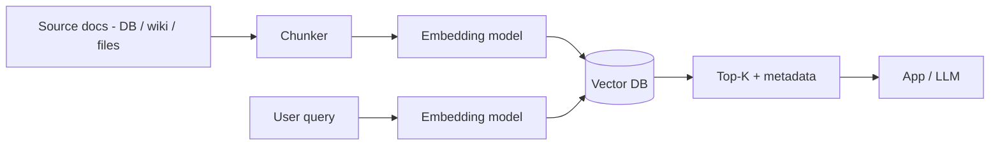
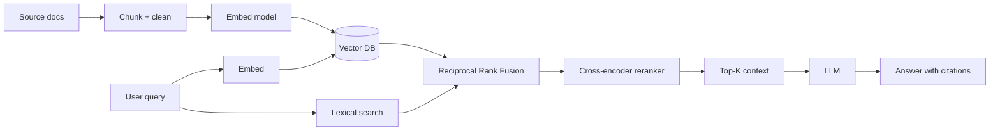

# Vector Databases (Pinecone, Weaviate, pgvector)

> **TL;DR** — A **vector database** stores **high-dimensional embeddings** (typically 256–4096-dimension float vectors produced by an ML model) and serves **nearest-neighbor (ANN)** queries fast — "find the 50 vectors closest to this one." That single capability powers **semantic search, retrieval-augmented generation (RAG), recommendations, dedup / matching, image and audio search, anomaly detection, and clustering**. Players range from purpose-built (Pinecone, Weaviate, Milvus, Qdrant, Vespa) to extensions of existing databases (**pgvector** for Postgres, ES/OS `dense_vector`, Redis Search). Most modern AI products use a vector store somewhere in the stack.

---

## 1. The Idea in One Picture

```
text / image / audio
       │
       ▼
   embedding model  (e.g., text-embedding-3-large, OpenCLIP, sentence-transformers)
       │
       ▼
  vector ≈ a list of 768 floats:
  [0.012, -0.45, 0.99, ... , 0.07]

Vector DB indexes millions of these.
Given a query vector, return the K vectors with the smallest distance.
```

The model learns to put **semantically similar inputs near each other** in the vector space. Once you have embeddings for everything, "find similar" becomes "find nearest."

---

## 2. Why It's Not Just a Numeric Index

Brute-force exact nearest-neighbor across N vectors is **O(N × d)** — checking every vector. For 1M vectors of dim 768 that's hundreds of millions of multiply-adds per query. Far too slow for online.

Vector DBs use **ANN (approximate nearest neighbor)** algorithms that trade a tiny bit of accuracy for **logarithmic** lookup time:

- **HNSW** (Hierarchical Navigable Small World graphs) — the workhorse. Layered graph; you greedily descend.
- **IVF** (Inverted File Index) — cluster vectors into "Voronoi cells"; search nearest cells then refine.
- **PQ** (Product Quantization) — compress vectors into compact codes; near-constant memory + good speed.
- **IVF+PQ / OPQ / ScaNN / DiskANN** — combinations and refinements for scale.

Typical recall (% of true neighbors retrieved) on tuned configs: **95–99% at single-digit-ms** for millions of vectors per node.

The brutal-force fallback (sometimes called "flat" or `IndexFlat`) is still useful for small corpora (< ~100k) where exactness matters.

---

## 3. Distance Metrics

A vector DB needs to know **how distance is measured**.

| Metric | Use case |
| --- | --- |
| **Cosine similarity** | Most NLP embeddings. Direction matters; magnitude doesn't. |
| **Dot product / inner product** | Same as cosine if vectors are normalized; cheaper. |
| **Euclidean (L2)** | Image embeddings, geometric data. |
| **Manhattan (L1)** | Sparse vectors / specific domains. |
| **Hamming** | Binary fingerprints (perceptual hashes, sketches). |

You almost always normalize NLP embeddings to unit length and use cosine / dot product. Mixing metrics with a model trained on a different one degrades results badly.

---

## 4. The Players

| Engine | Type | Notes |
| --- | --- | --- |
| **Pinecone** | Hosted | First mover, fully managed, easy. |
| **Weaviate** | OSS + hosted | Multi-modal, built-in modules for OpenAI, Cohere, HF. |
| **Milvus** | OSS | Mature, C++, scales horizontally. CNCF graduated. |
| **Qdrant** | OSS + hosted | Rust, fast, filtered ANN. |
| **Vespa** | OSS (Yahoo) | Hybrid retrieval at huge scale. ML in the engine. |
| **pgvector** | Postgres extension | Vectors inside Postgres. The "boring tech wins" answer for most teams. |
| **Elasticsearch / OpenSearch** | Search engine + vectors | `dense_vector` field with HNSW; hybrid with BM25 + RRF. |
| **Redis (RediSearch)** | KV + vectors | Sub-ms latency for small/medium corpora. |
| **Chroma** | OSS, dev-focused | Easy local / embedded; great for prototypes. |
| **LanceDB** | OSS columnar | Built on Apache Arrow / Parquet; embeddable. |
| **Vald / Marqo / Vectara / Activeloop Deep Lake** | Niches | Multimodal, hosted, ML-flavored. |
| **FAISS** | Library, not a DB | Facebook's reference ANN library. Embeddable. |
| **Annoy / ScaNN / DiskANN / hnswlib** | Libraries | Behind many of the above. |

Practical defaults in 2026:
- **pgvector** if you're on Postgres and the corpus is up to ~10–100M vectors.
- **Qdrant / Weaviate / Milvus** for dedicated OSS deployments.
- **Pinecone** if you want hosted with zero ops.
- **Elasticsearch / OpenSearch / Vespa** for hybrid (vector + lexical).

---

## 5. Architecture & Data Model

A vector DB usually stores:
- **Vector** (float array).
- **Payload / metadata** — fields you can filter on (e.g. `tenant`, `category`, `created_at`).
- **Document ID** referencing the source.

```json
{
  "id": "doc_42",
  "vector": [0.12, -0.45, ..., 0.07],
  "payload": {
    "tenant_id": "acme",
    "category": "support",
    "created_at": "2026-05-19T10:00:00Z",
    "text": "..."
  }
}
```

Operations:
- `upsert(id, vector, payload)`
- `delete(id)`
- `search(query_vector, k=10, filter={tenant_id:"acme"})`
- `recommend(positive=[ids], negative=[ids], filter=...)`
- `batch_search(...)`

Many engines support **filtered ANN** (apply payload filters during/after the graph walk). Naive filtering after the fact can throw away most candidates and hurt recall; modern engines integrate filters into the index walk for correctness.

---

## 6. Building a Vector-Search Pipeline



Three skills you must develop:

### 6.1 Chunking
Text is split into chunks of ~200–800 tokens with **overlap** (~50 tokens). Why:
- Embeddings of giant documents lose specificity.
- Chunks let you cite passages.
- Overlap preserves context around boundaries.

Strategies:
- **Fixed window** (simple).
- **Semantic** (split on sentence / heading boundaries).
- **Recursive** (try paragraph → sentence → token).
- **Late chunking** (embed the whole doc with long-context models, then pool).

There is no universal best; tune per corpus.

### 6.2 Embedding
Pick a model. For text in 2026 the typical defaults:
- OpenAI `text-embedding-3-large` / `-small`.
- Cohere embed-v3.
- BGE / E5 / Jina (open-source).
- Multilingual or per-domain variants for non-English / code / image.

Trade-offs:
- **Dimension**: 384–4096 typical. Higher = more memory + slightly higher recall.
- **Multilingual** support.
- **License** and **cost** if hosted.
- **Throughput**.

### 6.3 Retrieval & Reranking
Top-K alone is often noisy. Two improvements:

- **Hybrid retrieval**: combine **lexical (BM25)** and **vector** results via **Reciprocal Rank Fusion** or weighted scores. Lexical is great at exact terms / acronyms; vector is great at paraphrase. Together they beat either alone.
- **Reranking**: re-rank top 50–100 with a cross-encoder model (`bge-reranker`, Cohere Rerank, OpenAI rerank) → top 5. Much better quality at modest cost.

---

## 7. Filters (Where People Get Stuck)

Real workloads need both **similarity** and **filters**: "find the closest doc *for this tenant, in support category, in the last 30 days*."

- **Pre-filter** (filter then ANN) — fast if filter is selective; can break ANN structure.
- **Post-filter** (ANN then filter) — fast but may return few results when filter is tight.
- **Filtered ANN** (engine integrates filter into the index walk) — best of both. Qdrant, Weaviate, Pinecone, Milvus all do this in various ways.

**Always test recall with your real filters**, not on the no-filter case. Filtering naively over a 99%-recall index can drop effective recall below 50%.

---

## 8. pgvector — The "Boring" Answer

If you're already on Postgres, **pgvector** is the simplest path:

```sql
CREATE EXTENSION vector;
CREATE TABLE docs (
  id bigserial PRIMARY KEY,
  text text,
  tenant_id text,
  embedding vector(1536)
);

CREATE INDEX docs_emb_hnsw_idx ON docs USING hnsw (embedding vector_cosine_ops);
CREATE INDEX docs_tenant_idx ON docs (tenant_id);

SELECT id, text, embedding <=> $1 AS distance
FROM docs
WHERE tenant_id = $2
ORDER BY embedding <=> $1
LIMIT 10;
```

Strengths:
- One database. SQL joins, transactions, ACID, mature backups.
- Filter using normal `WHERE` clauses.
- HNSW + IVF indexes since pgvector 0.5+; performance close to specialized stores up to **~10–100M vectors** per node.

Limits:
- Index build time on huge corpora can be long.
- Tuning HNSW parameters (`ef_construction`, `m`, `ef_search`) and `maintenance_work_mem` matters.
- Beyond ~100M vectors or sub-ms latency at huge scale, specialized stores pull ahead.

The growing consensus: **start with pgvector**. Move to a dedicated store when you can name a specific limit you're hitting.

---

## 9. Sizing

Rough numbers for a single tuned node:

| Vectors | dim 384 | dim 1536 |
| --- | --- | --- |
| 1 M | RAM ~1.5 GB | RAM ~6 GB |
| 10 M | ~15 GB | ~60 GB |
| 100 M | ~150 GB | ~600 GB |

Per-vector cost is dominated by storage and index overhead (HNSW adds ~50–100% on top of raw vector size). PQ compression can cut this 5–10× with a small recall loss.

Latency: well-tuned HNSW serves at **single-digit ms** even for tens of millions of vectors per node. Insert throughput: 1k–50k vectors/sec per node depending on dimension and parameters.

---

## 10. Common Use Cases

- **Semantic / fuzzy search** — beyond keywords.
- **Retrieval-augmented generation (RAG)** — feed context to LLMs.
- **Recommendations** — items / users encoded into embeddings; "nearby" = similar.
- **Image / audio / video search** — CLIP / OpenCLIP / OpenL3 embeddings.
- **Dedup / fuzzy matching** — near-duplicate detection.
- **Identity / entity resolution** — match records across systems.
- **Anomaly detection** — points far from any cluster are anomalies.
- **Clustering / exploration** — k-means / HDBSCAN over embeddings.
- **Personalization** — user vector × item vector for scoring.

---

## 11. Anti-Patterns

- **Embedding everything once** with a generic model and never re-embedding when better models arrive. Plan for re-embedding (it's a routine event).
- **Using one giant index across tenants** without filters → cross-tenant leakage and noisy results.
- **No reranker** → quality plateaus quickly.
- **Vector search without lexical fallback** for exact-token queries (codes, product IDs, error strings).
- **Cosine on un-normalized vectors** — buggy and silent.
- **Tiny dim with huge corpus** — embeddings collapse, recall suffers.
- **Storing the only copy of source documents in the vector DB** — treat the vector DB as derived, not a source of truth.
- **Confusing "ANN recall" with "answer quality"** — quality depends on chunking, model, reranking, and prompt design too.

---

## 12. RAG in Practice (a Mini-Architecture)



The vector DB is **one piece** of a retrieval system, not the whole story. Quality comes from the *combination*: chunking, hybrid retrieval, filtering, reranking, prompt design.

---

## 13. Operations

- **Re-embedding** on model upgrades — a routine event. Plan capacity for a full reindex.
- **Index build & rebuild** windows — HNSW build is slow on large corpora.
- **Multi-tenant isolation** — namespace per tenant, or filters with strict policies.
- **Backup** — most engines have snapshots; test restore.
- **Quantization (PQ / SQ)** to cut memory at small recall cost.
- **Caching** — frequent queries / hot tenants benefit from in-memory caches.
- **Telemetry** — track recall@k, p50/p99 latency, index size, memory, build time.
- **Evaluation** — golden questions with expected answers (`hit@K`, MRR, nDCG). Without eval you can't tell if changes regress.

---

## 14. Picking a Vector DB

```
Already on Postgres, < 100M vectors?
  → pgvector. Boring wins.

Already on Elasticsearch / OpenSearch / Vespa?
  → dense_vector fields + RRF hybrid.

Want self-hosted, dedicated, very fast?
  → Qdrant or Milvus.

Want hosted, zero ops?
  → Pinecone (closed-source) / Weaviate Cloud / Qdrant Cloud / Milvus Zilliz.

Multi-modal (text + images) with pluggable models?
  → Weaviate.

Embedded / local prototype?
  → Chroma, LanceDB, FAISS via a library.

Hybrid retrieval + ranking at huge scale?
  → Vespa.

Sub-ms latency, small corpus?
  → Redis Search.
```

---

## 15. Cheat Card

```
VECTOR DB     stores high-dim embeddings; serves k-NN queries fast.

CORE ALGO     HNSW (most common), IVF, PQ, ScaNN, DiskANN.
              Trades a little recall for log-time lookup.

METRIC        cosine (NLP, normalized), dot, L2, hamming.

DATA          { id, vector, payload (filters), source ref }

PIPELINE      docs → chunk → embed → upsert
              query → embed → ANN search (+ filters) → rerank → top-K

HYBRID 2026   lexical BM25  +  vector  +  RRF  +  cross-encoder reranker.

PLAYERS
  Hosted: Pinecone · Weaviate Cloud · Qdrant Cloud · Milvus Zilliz
  OSS:    Qdrant · Milvus · Weaviate · Vespa · Chroma · LanceDB
  Extensions: pgvector (Postgres) · dense_vector (ES/OS) · RediSearch

PITFALLS
  No reranker · post-filter killing recall · giant cross-tenant index ·
  cosine on un-normalized vectors · only copy of source docs in the VDB ·
  never re-embedding when a better model arrives ·
  benchmarking without your real filters

START with pgvector. Upgrade when you can name a real limit.
```

---

## 16. Resources

### Foundational
- **FAISS** — Facebook's ANN library, the reference: <https://github.com/facebookresearch/faiss>
- "Billion-scale similarity search with GPUs" — Johnson, Douze, Jégou.
- "HNSW" — Yu. A. Malkov, D. A. Yashunin (2016).
- "Dense Retrieval and the Power of Multilingual Embeddings" — Cohere blog.

### Documentation
- **pgvector** — <https://github.com/pgvector/pgvector>
- **Pinecone** — <https://docs.pinecone.io/>
- **Weaviate** — <https://weaviate.io/developers/weaviate>
- **Milvus** — <https://milvus.io/docs>
- **Qdrant** — <https://qdrant.tech/documentation/>
- **Vespa** — <https://docs.vespa.ai/>
- **Elasticsearch dense_vector** — <https://www.elastic.co/guide/en/elasticsearch/reference/current/dense-vector.html>

### Articles
- "RAG: Retrieval-Augmented Generation" — Lewis et al. 2020 paper.
- "The illustrated retrieval transformer" — Jay Alammar.
- "Hybrid search with reciprocal rank fusion" — Elastic / Weaviate / Pinecone blog posts.
- "Choosing the right embedding model" — Sebastian Raschka.
- "Vector databases compared" — open community benchmarks (e.g. <https://ann-benchmarks.com/>).

### Books
- *Practical Natural Language Processing* — Vajjala et al.
- *AI-Powered Search* — Grainger, Turnbull, Irwin (Manning).
- *Designing Machine Learning Systems* — Chip Huyen.

### Videos
- ByteByteGo: "What is a Vector Database?" — <https://www.youtube.com/@ByteByteGo>
- Hussein Nasser pgvector videos — <https://www.youtube.com/@hnasr>
- Pinecone / Weaviate / Qdrant Tech Talks on YouTube.
- "Retrieval for LLMs" — Andrej Karpathy, Lewis Tunstall.

### Tools
- **LangChain / LlamaIndex** — RAG orchestration frameworks.
- **HuggingFace `sentence-transformers`** — local embeddings.
- **Cohere Rerank**, **bge-reranker** — cross-encoder rerankers.
- **ann-benchmarks** — open benchmark for ANN libraries.

### Adjacent reading
- [Search Engines](./search-engines.md)
- [Embedding-Based Retrieval (ANN, HNSW, FAISS)](../19-advanced/embedding-retrieval.md)
- [Recommendation System →](../18-case-studies/recommendation-system.md)
- [Relational Databases (pgvector lives here)](./relational-databases.md)

---

*Previous:* [← Search Engines](./search-engines.md)  |  *Next:* [NewSQL →](./newsql.md)
