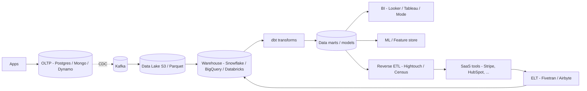

# Data Warehouses & Data Lakes (Snowflake, BigQuery, Redshift)

> **TL;DR** — A **data warehouse** is a managed, structured, columnar SQL store optimized for analytics — **Snowflake, BigQuery, Redshift, Synapse**. A **data lake** is cheap raw storage (typically S3/GCS/ADLS) holding files in open formats (Parquet, Avro, JSON) that you query with engines like **Trino, Spark, Athena, BigQuery External Tables**. Warehouses give you performance + governance with less flexibility; lakes give you flexibility + cost with less performance and governance. Modern stacks blend them via the **lakehouse** pattern (Delta Lake, Iceberg, Hudi).

---

## 1. The Two Things

```
DATA LAKE                                DATA WAREHOUSE
─────────                                ─────────────────
Cheap object storage (S3/GCS/ADLS)       Managed columnar database
Files: Parquet, ORC, Avro, JSON, CSV     Internal columnar format
Schema-on-read                           Schema-on-write
Query engine separate (Trino, Spark)     SQL engine bundled
Cheap, slow, flexible                    Fast, governed, more expensive
Holds raw + processed + ML training      Holds analytics-ready data
Used by: data engineers, ML, ad-hoc      Used by: BI, analysts, dashboards
```

For most companies, both exist. The lake is the **landing zone** for raw data; the warehouse (or lakehouse) is the **clean, modeled, queryable** layer that analysts use.

---

## 2. Data Lake — The Cheap Raw Layer

### What it is
- An object store (S3, GCS, Azure Data Lake Storage / ADLS Gen2) holding **files**.
- Organized in folders (often partitioned by date, e.g. `s3://lake/events/dt=2026-05-19/`).
- Files in **columnar** formats (Parquet / ORC) for analytics; raw text (CSV / JSON / logs) for ingestion.
- **Compute is separate** — you spin up Spark, Presto/Trino, Athena, BigQuery external tables, Dremio, or Databricks to query.

### Strengths
- **Storage is dirt cheap** — fractions of a cent per GB/month.
- **No vendor lock-in for storage** — Parquet is open.
- **Holds everything** — semi-structured, unstructured, ML training data.
- **Decoupled storage + compute** — scale them independently.
- **Time travel** with table formats (Iceberg/Delta/Hudi).

### Weaknesses
- **No built-in governance / ACID** without a table format.
- **Slower than a warehouse** for ad-hoc SQL — files are immutable, no indexes, eventual consistency on some object stores.
- **Operational discipline required** — partitioning, file size tuning, metadata catalogs.
- **Schema drift** — anyone can write any shape.
- **Compaction needed** — small-file problem kills query performance.

### The "data swamp" failure
Without metadata catalogs (AWS Glue, Hive Metastore, Unity Catalog, Lakehouse) and conventions, a lake becomes a swamp:
- Nobody knows what's where.
- Different teams' "users" tables have different shapes.
- ML pipelines train on stale or wrong data.

The discipline isn't optional.

---

## 3. Data Warehouse — The Fast Clean Layer

### What it is
- A **managed columnar SQL database** optimized for analytics.
- Storage + compute often coupled (legacy) or *separated* (modern: Snowflake, BigQuery).
- Massive parallel processing (MPP) under the hood.
- Strict schemas, governance, RBAC, audit logs.
- Pay per credit / per TB scanned / per cluster hour.

### Strengths
- **Fast SQL** on billions of rows.
- **Governance**: schemas, permissions, lineage, masking, audit.
- **Concurrency** — many users querying simultaneously.
- **Standard SQL** — analysts love it.
- **Mature BI integrations** (Looker, Tableau, Power BI).
- **Workload isolation** — Snowflake separates virtual warehouses per team.

### Weaknesses
- **Cost** — at scale, runs into millions.
- **Less flexibility** — proprietary formats, harder to escape.
- **Loading cost** — ingest still requires transform/load.
- **Limited unstructured data** support (improving with semi-structured types).

---

## 4. The Major Warehouses

### Snowflake
- Cloud-only (AWS/GCP/Azure).
- **Separation of storage and compute** is the founding feature.
- Storage in S3-compatible object storage with proprietary format (FDN files).
- Multiple **virtual warehouses** (compute clusters) per team/workload — autoscale, auto-suspend.
- Strong concurrency (each VW is independent).
- Time travel + zero-copy clones.
- Snowpark for Python/Java/Scala.
- Pricing per credit (compute) + per-TB storage. Watch query cost.

### BigQuery
- Serverless — no clusters to manage.
- Pay-per-byte-scanned (or flat-rate reservations).
- Massive scale, integrates with the GCP ecosystem.
- ML inside SQL (BigQuery ML).
- Powerful federated queries (Cloud Storage, Bigtable, Spanner).
- Iceberg / BigLake for lakehouse interop.

### Amazon Redshift
- AWS-native MPP warehouse.
- Originally cluster-based (RA3 nodes with managed storage); Redshift Serverless added later.
- Tight integration with S3 (`Spectrum` for lake-style queries).
- Spectrum lets you query S3 Parquet without loading — early lakehouse-style move.

### Azure Synapse Analytics
- Microsoft's combined data warehouse + Spark + serverless pool.
- Good for orgs already on Azure / Power BI.

### Databricks SQL Warehouse
- Spark-backed warehouse on top of Delta Lake.
- Lakehouse-native.
- Best in class if your data already lives in Databricks notebooks / ML pipelines.

### Newer
- **Firebolt** — high-performance columnar warehouse on S3.
- **Yellowbrick, Vertica** — niche enterprise.
- **ClickHouse Cloud** — OSS columnar engine; not a "classic" warehouse but increasingly used like one.

---

## 5. Data Lake Engines

Engines you point at S3/GCS/ADLS files:

- **Apache Spark** — distributed compute; the default heavyweight.
- **Trino / PrestoDB** — distributed SQL query engine; great for ad-hoc.
- **AWS Athena** — managed Presto on S3.
- **Apache Hive** — older; still common.
- **Databricks SQL** — Spark-based, optimized for Delta Lake.
- **Dremio** — SQL with semantic layer / acceleration.
- **DuckDB** — single-node, query Parquet files in S3 from your laptop.

A combination of **S3 + Parquet + a query engine + a metastore (Glue / Hive)** is the classic open-source lake stack.

---

## 6. Storage Formats You'll See

### Parquet
- **Columnar** open format.
- Best for analytical reads.
- Compressed, with per-column statistics, row groups, page-level skipping.
- Default for almost every modern analytics workflow.

### ORC
- Similar to Parquet; popular in the Hadoop / Hive ecosystem.

### Avro
- **Row-oriented** binary with embedded schema.
- Good for streaming ingest, schema evolution.

### JSON / CSV
- Raw landing format only. Don't query at scale.

### Iceberg / Delta / Hudi
- **Table formats** *built on top of* Parquet/ORC.
- Add ACID, time travel, schema evolution, partition evolution, branching.
- The foundation of the **lakehouse**.

See [Lakehouse Architecture](./lakehouse.md).

---

## 7. Modern Data Stack



Hallmarks:
- **ELT** instead of ETL — load raw, transform with SQL inside the warehouse.
- **dbt** — SQL + DAG + tests + docs; the de-facto transform layer.
- **Orchestrators** — Airflow, Dagster, Prefect.
- **Catalogs** — DataHub, Atlan, OpenMetadata, Amundsen.
- **Reverse ETL** — Hightouch / Census push warehouse data back to CRM / marketing tools.

This stack has emerged as the default in 2020–2026.

---

## 8. Data Modeling for Warehouses

### Star / Snowflake schemas (Kimball)
- One **fact** table (events, orders, sessions).
- Many **dimensions** with denormalized descriptive data.
- Wide flat tables = warehouse engines love them.

### One Big Table (OBT)
- Even flatter: pre-join everything into one giant table.
- Maximum scan efficiency; storage cheap.
- Popular with BigQuery (heavy column scanning).

### Data Vault
- Hubs, links, satellites — a flexible model for auditable enterprise data.
- Used in regulated industries.

### Snapshot tables vs slowly-changing dimensions (SCDs)
- **SCD Type 1** — overwrite the old value.
- **SCD Type 2** — keep history (`valid_from`, `valid_to`).
- **SCD Type 3** — keep current + previous.

See [Data Modeling for Analytics](../17-big-data/dimensional-modeling.md).

---

## 9. Partitioning and Clustering

The two biggest performance levers in a warehouse:

- **Partitioning** by date (or low-cardinality field). Query "this month" reads only that partition's files.
- **Clustering / sorting** within partitions (e.g., by customer_id) so range queries scan fewer blocks.
- **Z-ordering** (Delta Lake / Databricks) — multi-dimensional clustering.

```sql
-- BigQuery
CREATE TABLE events
PARTITION BY DATE(_PARTITIONTIME)
CLUSTER BY customer_id, event_type;

-- Snowflake clustering keys
CREATE TABLE events ( ... )
CLUSTER BY (event_date, customer_id);
```

Without partitioning, a "give me last 7 days" query scans the entire history. With it, the engine prunes 99% of files before reading.

---

## 10. Governance & Compliance

Warehouses come with built-in governance; lakes need it bolted on.

- **Roles & permissions** — RBAC at table, column, row.
- **Data masking** — PII redaction.
- **Audit logs** — who queried what, when.
- **Lineage** — what depends on this table (dbt, DataHub).
- **Quality tests** — dbt tests, Great Expectations, Soda.
- **Catalog** — searchable metadata.

For lakes: **Unity Catalog** (Databricks), **AWS Lake Formation**, **Apache Polaris**, **Open Metadata**, **DataHub** add governance on top.

---

## 11. Cost Realities

The bills can shock you. Common pitfalls:

- **`SELECT *` queries** scanning whole tables.
- **No partitioning** → every query pays for everything.
- **Many small files** — metadata overhead.
- **Forgotten dashboards** auto-refreshing every minute.
- **Joins across the world** with no clustering on the join key.
- **Snowflake virtual warehouses** running 24/7 instead of auto-suspending.
- **BigQuery `LIMIT 10`** doesn't reduce scan — *partition pruning* and *clustering* do.
- **Redshift unloads** with no compression.
- **Egress to BI tools** outside the same cloud — surprise.

Habits:
- Cost monitoring (query → user → team).
- Quota / budget alerts.
- `EXPLAIN` and `dry run` queries before launching huge scans.
- Materialized views for expensive recurring queries.
- Result caches.

---

## 12. Real-Time-ish Analytics

Pure warehouses are not real-time. For sub-second freshness with sub-second queries:
- Pair the warehouse with **ClickHouse / Druid / Pinot** for the live tier.
- Or use **Materialize / RisingWave** for streaming SQL views.
- Or use **Snowflake Streams + Tasks** / **BigQuery streaming insert** for near-real-time tables.

See [Real-Time Analytics](../19-advanced/real-time-analytics.md).

---

## 13. Lake vs Warehouse vs Lakehouse — Picking

```
Tiny team, simple BI?
  → managed warehouse (BigQuery serverless or Snowflake).

Heavy data science, lots of ML?
  → lake + Spark; or Databricks lakehouse.

Real-time dashboards on live data?
  → ClickHouse / Druid / Pinot alongside the warehouse.

Multi-cloud + open formats matter?
  → lakehouse (Iceberg / Delta on S3) + Trino / Spark / Snowflake reading Iceberg.

Already on AWS only?
  → Redshift + S3 + Athena, or Databricks.

Mostly SaaS-data integration?
  → Fivetran + Snowflake + dbt + Looker is the off-the-shelf modern stack.
```

---

## 14. Common Mistakes

- **Lake without governance** → swamp.
- **Warehouse for OLTP** — wrong tool, expensive.
- **Loading raw PII** without policy / masking.
- **Streaming inserts into a warehouse** without partition design → bill explosion.
- **No CI on dbt models** → silent breakages.
- **No data tests** (dbt tests, Soda) → numbers drift, BI lies.
- **Dashboards reading raw fact tables** instead of marts → slow and expensive.
- **Files too small** (KBs each) in a lake → query overhead dominates.
- **Snowflake left running** all weekend.
- **Cross-region transfers** ignored — egress charges.

---

## 15. Cheat Card

```
DATA LAKE   cheap object storage. Files in Parquet/ORC/JSON.
  S3 / GCS / ADLS. Query via Spark / Trino / Athena / DuckDB.
  + flexible · cheap · open formats · ML-friendly.
  − slow ad-hoc SQL · no ACID without table formats · governance bolt-on.

DATA WAREHOUSE   managed columnar SQL DB.
  Snowflake / BigQuery / Redshift / Synapse / Databricks SQL.
  + fast SQL · governed · concurrent · BI-ready.
  − cost can explode · less flexibility · loading required.

MODERN STACK
  OLTP → CDC + ELT (Fivetran/Airbyte) → Warehouse →
   dbt transforms → marts → BI / ML / Reverse-ETL.

KEY LEVERS
  PARTITIONING + CLUSTERING + good schemas (star / OBT / SCD2).
  ELT, not ETL.
  Materialized views for recurring expensive queries.

LAKEHOUSE
  Delta / Iceberg / Hudi on Parquet — ACID + time travel + schema evolution
  in the lake. Queryable by warehouse engines.

DON'T
  SELECT * over PBs · forget partitions · skip governance ·
  treat the lake as a swamp · run analytics on OLTP.

PICK
  Tiny / serverless?         BigQuery / Snowflake.
  Multi-cloud, open formats? Lakehouse (Iceberg / Delta).
  ML-heavy?                  Databricks / Spark.
  Real-time?                 ClickHouse / Druid / Pinot alongside.
```

---

## 16. Resources

### Books
- *The Data Warehouse Toolkit* — Ralph Kimball, Margy Ross (the bible).
- *Fundamentals of Data Engineering* — Joe Reis, Matt Housley.
- *Designing Cloud Data Platforms* — Danil Zburivsky, Lynda Partner.
- *Building the Data Lakehouse* — Bill Inmon et al.

### Documentation
- **Snowflake** — <https://docs.snowflake.com/>
- **BigQuery** — <https://cloud.google.com/bigquery/docs>
- **Redshift** — <https://docs.aws.amazon.com/redshift/>
- **Databricks** — <https://docs.databricks.com/>
- **Synapse Analytics** — <https://learn.microsoft.com/en-us/azure/synapse-analytics/>
- **AWS Glue / Lake Formation** — <https://aws.amazon.com/glue/>
- **Trino** — <https://trino.io/docs/>
- **DuckDB** — <https://duckdb.org/docs/>

### Articles
- "The Modern Data Stack" — A16Z, dbt Labs, many others.
- "Data warehouse vs data lake vs lakehouse" — Databricks blog.
- "What is a Lakehouse?" — Databricks: <https://www.databricks.com/blog/2020/01/30/what-is-a-data-lakehouse.html>
- "How dbt works" — Tristan Handy.
- "BigQuery best practices" — Google Cloud docs.

### Videos
- ByteByteGo: "Data warehouse vs data lake" — <https://www.youtube.com/@ByteByteGo>
- Snowflake Summit / dbt Coalesce / Databricks Data + AI Summit talks.
- "DuckDB for OLAP" — Mark Raasveldt's videos.

### Tools / ecosystem
- **dbt** — <https://www.getdbt.com/>
- **Airflow / Dagster / Prefect** — orchestrators.
- **Fivetran / Airbyte / Stitch** — ingestion.
- **DataHub / Atlan / OpenMetadata** — catalogs.
- **Great Expectations / Soda** — data quality.
- **Hightouch / Census** — reverse ETL.

### Adjacent reading
- [OLTP vs OLAP](./oltp-vs-olap.md)
- [Lakehouse Architecture](./lakehouse.md)
- [Change Data Capture](./cdc.md)
- [Data Pipelines & Orchestration →](../17-big-data/data-pipelines.md)
- [ETL vs ELT →](../17-big-data/etl-vs-elt.md)
- [Dimensional Modeling →](../17-big-data/dimensional-modeling.md)
- [Real-Time Analytics →](../19-advanced/real-time-analytics.md)

---

*Previous:* [← OLTP vs OLAP](./oltp-vs-olap.md)  |  *Next:* [Lakehouse Architecture →](./lakehouse.md)
