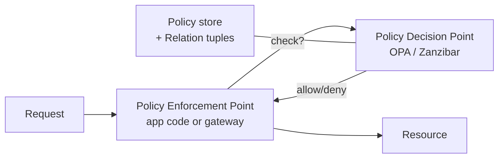

# RBAC, ABAC, ReBAC

> **TL;DR** — Access control models answer *who can do what to which resource*. **RBAC** (Role-Based) groups permissions into roles and assigns roles to users — simple and dominant, but fragile when permissions depend on relationships or context. **ABAC** (Attribute-Based) evaluates rules over arbitrary attributes (user, resource, environment) — powerful but easy to mis-design into an unmanageable swamp. **ReBAC** (Relationship-Based, popularized by Google Zanzibar) models "this user is an editor of this document" as a graph — the right answer for multi-tenant SaaS with sharing semantics (Google Drive, GitHub, Notion). Real systems mix models. Start with RBAC, add ABAC where context matters, reach for ReBAC when sharing and hierarchy dominate.

---

## 1. The Three Models, In One Picture

```
RBAC    user → role → permissions
        Alice has role "billing_admin" → can :read,write invoices

ABAC    if (user.dept == resource.dept && env.time in 9:00-17:00) → allow
        rules evaluated against attributes of subject, resource, action, environment

ReBAC   user --[edits]--> document
        if (subject) has [relation] with (resource) → allow
        relations compose: user→group→folder→document
```

| Model | Decision input | Strength | Weakness | Sweet spot |
| --- | --- | --- | --- | --- |
| **RBAC** | Roles | Simple, audit-friendly | Role explosion | Internal apps, small role sets |
| **ABAC** | Attributes | Flexible, contextual | Hard to audit, can become unbounded | Compliance, fine-grained policy |
| **ReBAC** | Relationships | Models sharing/hierarchy natively | Operational complexity | Multi-tenant SaaS with sharing |

---

## 2. RBAC — Role-Based Access Control

The default for most internal applications. Three building blocks:

```
User  ─── assigned ───► Role  ─── grants ───► Permissions
```

A **permission** is `(action, resource_type)`: `read:invoice`, `write:invoice`, `delete:user`.
A **role** is a named bundle of permissions.
A **user** has one or more roles.

### A typical schema

```sql
roles               (id, name, description)
permissions         (id, action, resource_type)
role_permissions    (role_id, permission_id)
user_roles          (user_id, role_id, scope)  -- scope = org_id, project_id, etc.
```

The `scope` column is often the underappreciated piece: in real systems, a user is "admin **of org 7**" — not globally admin. Permissions are scoped to a tenant or project.

### Role hierarchies

Sometimes roles inherit:

```
owner > admin > editor > viewer
```

Role hierarchies are convenient but introduce ordering. Keep them shallow (≤3 levels) and explicit.

### When RBAC works

- Permissions cleanly group into named roles.
- Roles rarely change.
- Users have few roles.

### When RBAC breaks

- **Role explosion.** Adding "billing_admin_eu_readonly_v2" because no existing role fits. When roles outnumber users, the model has failed.
- **Resource-level permissions.** "User can edit *this* document but not *that* document" doesn't fit. Bolt-on ACLs help, but you're drifting toward ReBAC.
- **Conditional access.** "Allowed during business hours" doesn't fit pure RBAC.
- **Sharing semantics.** "Bob shared a folder with Alice" doesn't fit.

GitHub, Notion, Google Drive all started with RBAC and outgrew it. They now use what is effectively ReBAC.

---

## 3. ABAC — Attribute-Based Access Control

ABAC replaces roles with **policy expressions** evaluated at decision time over attributes:

- **Subject attributes:** `user.department`, `user.clearance_level`, `user.id`.
- **Resource attributes:** `resource.owner_id`, `resource.classification`, `resource.tenant_id`.
- **Action:** `read`, `write`, `delete`.
- **Environment:** `env.time`, `env.ip`, `env.mfa_recent`.

### A worked rule

```
permit(action == "read", resource_type == "document") when
  user.clearance_level >= resource.classification
  and user.department == resource.department
  and env.time in business_hours
  and env.country == "US";
```

This is hard to express in RBAC without dozens of brittle roles. ABAC handles it directly.

### Policy languages

- **XACML** — the OASIS XML-based standard. Verbose, enterprise.
- **Rego** (Open Policy Agent) — small declarative language, very popular.
- **Cedar** (AWS / Permify) — newer, designed for ABAC + ReBAC hybrids.
- **Casbin** — supports RBAC and ABAC via a small DSL.

### A Rego example

```rego
package authz

default allow = false

allow {
  input.action == "read"
  input.resource.type == "document"
  input.user.clearance >= input.resource.classification
  business_hours
}

business_hours {
  h := time.weekday_hour(input.env.now)
  h >= 9
  h <= 17
}
```

### When ABAC works

- Permissions depend on *context* — time, location, MFA recency.
- Regulatory rules ("EU users see EU data").
- Healthcare, finance, government — where data classification matters.

### When ABAC hurts

- Lots of small ad-hoc rules → policy sprawl. After 200 rules, no human knows what's allowed.
- **Decidability gets fuzzy.** Audit questions like "who can read this?" become hard: you have to enumerate every possible user and evaluate.
- **Performance.** Evaluating a complex policy per request adds latency; mitigated with policy caching.

---

## 4. ReBAC — Relationship-Based Access Control

The most modern model, popularized by Google's internal **Zanzibar** system (Drive, Docs, YouTube use it). Open-source implementations: **SpiceDB**, **OpenFGA**, **Permify**, **Warrant**.

### The mental model

A graph of relations:

```
user:alice ─ owner ─►  document:budget
user:bob   ─ editor ─► document:budget
group:eng  ─ viewer ─► folder:engineering
folder:engineering ─ parent ─► document:roadmap
user:carol ─ member ─► group:eng
```

Permissions are derived from relations + rules:

```
viewer(document) ⇐ owner(document) ∪ editor(document) ∪ viewer(parent_folder)
```

So `carol → eng → engineering → roadmap → viewer` resolves to "Carol can view roadmap." All implicit, all computed by traversing the graph.

### Zanzibar's tuples

The core data model is breathtakingly simple:

```
namespace:object#relation@subject
```

Examples:
```
doc:budget#owner@user:alice
doc:budget#editor@user:bob
folder:eng#viewer@group:eng#member
group:eng#member@user:carol
doc:roadmap#parent@folder:eng
```

Authorization check: "Can `user:carol` `view` `doc:roadmap`?" → graph traversal returns yes/no in milliseconds.

### Why it works for sharing

Sharing is *the* hard case for RBAC:
- "Alice shared this document with Bob's team."
- "Carol left the team, but the document she shared with the company still stands."
- "Folder permissions cascade to nested documents."

ReBAC models these naturally. Without it, every SaaS hits a wall trying to express these rules in roles.

### Performance

Zanzibar at Google: 95th-percentile check latency under 10 ms at 10 million QPS. The trick is **caching with consistency tokens (zookies)**: clients receive a token after a write, present it on subsequent reads, and the system guarantees those reads see at least that write. See [Consistency Models →](../08-distributed-systems/consistency-models.md).

### When ReBAC works

- Multi-tenant SaaS with sharing.
- Hierarchies (folders, orgs, teams, projects).
- "Permissions inherited from parents" patterns.
- Anything Google Drive / GitHub / Notion / Figma–shaped.

### When ReBAC is overkill

- Simple internal admin apps.
- B2B apps where every customer is a closed tenant with role-based access.
- Anything where RBAC + a handful of ABAC rules covers everything.

The trap: adopting ReBAC because "Google does it" when you actually only need RBAC. The operational cost is real (running SpiceDB or OpenFGA, designing the schema, modeling relations correctly).

---

## 5. Real-World Hybrids

Almost every mature production system mixes these models:

| App | Model |
| --- | --- |
| **GitHub** | ReBAC (repos, teams, orgs) + RBAC (admin/maintainer/triage) + ABAC (IP allowlist, SSO requirements) |
| **AWS IAM** | ABAC-leaning (policies are JSON rules over attributes), with role assumption |
| **Google Drive** | ReBAC (Zanzibar) + ABAC (time-bounded shares, DLP rules) |
| **Notion** | ReBAC (page sharing) + RBAC (workspace admin/member/guest) |
| **Stripe Dashboard** | RBAC (developer/admin/view-only) + ABAC (restricted API key scopes) |
| **Slack** | RBAC (owner/admin/member/guest) + ReBAC (channel memberships) |

Designing access control is rarely "pick one." It's "RBAC for the obvious cases, ABAC for the contextual rules, ReBAC for sharing — and ensure they all evaluate consistently."

---

## 6. Centralized vs Decentralized Decisions

Two patterns:

### Inline checks
Each service evaluates authorization locally:
```python
if user.has_permission("invoice:write"):
    ...
```

Pros: fast, no extra hop. Cons: drift between services, hard to audit.

### Policy Decision Point (PDP)
A central service (OPA, Cedar, SpiceDB, custom) evaluates `(subject, action, resource)` and returns allow/deny:

```python
decision = pdp.check(subject=user.id, action="invoice:write", resource="inv_42")
if not decision.allowed:
    raise Forbidden
```

Pros: single source of truth, consistent across services, audit-friendly. Cons: extra network call (mitigated by sidecar deployment + caching).



Modern best practice: PDP as sidecar (OPA on every pod) so latency is negligible. Stripe, Netflix, Snowflake, and Airbnb all run centralized authorization services.

---

## 7. Auditability

A model is only as good as your ability to answer:

1. **"What can this user do?"** — list all permissions.
2. **"Who can do X to this resource?"** — list all users.
3. **"When did this user gain this permission?"** — temporal audit.
4. **"Was this access allowed?"** — per-decision audit trail.

| | RBAC | ABAC | ReBAC |
| --- | --- | --- | --- |
| Question 1 | Easy | Hard (must enumerate) | Easy (graph walk) |
| Question 2 | Easy | Very hard | Easy (reverse expand) |
| Question 3 | Easy (with role-change log) | Hard | Easy (with tuple-change log) |
| Question 4 | Easy (log roles consulted) | Easy (log inputs + rule) | Easy (log subjects expanded) |

ABAC's flexibility comes with auditability cost. Compensate with structured logging of every PDP decision (inputs, rule evaluated, output).

---

## 8. Designing the Permission Model

A repeatable process:

1. **List resources.** Every protected object type: User, Document, Invoice, Project, Org.
2. **List actions.** Per resource: `read`, `create`, `update`, `delete`, `share`, `archive`, `comment`.
3. **List subjects.** Who can do these? Users, groups, services, API keys.
4. **Sketch the natural language rules.** "Owners of an invoice can do anything. Editors can update but not delete. Viewers can read."
5. **Pick the model.** Does it fit RBAC cleanly? Add ABAC for context. Use ReBAC if "X shared with Y" appears more than once.
6. **Implement against a PDP.** Don't scatter `if` statements.
7. **Add audit logging from day one.** Every decision logged, even allows.

Avoid:
- Permissions named after roles ("manager can ...") — bake roles in too early.
- Models without a notion of *resource ownership*. Even RBAC needs to express "you can read your own data."
- Modeling tenants as just a `tenant_id` column. Tenancy is a first-class authorization boundary; build it into every check.

---

## 9. Common Mistakes / Anti-Patterns

- **Permission checks scattered in handlers.** No central audit, drift across services.
- **Role explosion.** When you hit 50+ roles, the model is wrong. Refactor to ABAC or ReBAC.
- **Storing permissions in JWT claims and never expiring them.** Role change takes effect at next token issuance — sometimes hours later. See [JWT →](./jwt.md).
- **Forgetting the IDOR check.** Endpoint authorizes "any logged-in user can read documents," but doesn't check the user can read **this specific** document. OWASP #1.
- **Single-tenant model retrofitted to multi-tenant.** Adding `tenant_id` columns isn't enough; every check must scope to tenant.
- **Overusing ABAC.** "Rule rule rule rule rule" — nobody knows what's allowed. Keep policies to a few dozen, well-named.
- **Adopting ReBAC for an app that doesn't share.** You bought operational complexity for nothing.
- **Treating PDP availability as optional.** If OPA goes down and you fail-open, you've removed access control entirely. Fail-closed (deny) and treat the PDP as critical.
- **Caching authorization decisions too aggressively.** A revoked permission must propagate quickly. TTL ≤ 30s for sensitive resources, with consistency tokens for stronger guarantees.
- **Mixing OAuth scopes with internal AuthZ.** Scopes are user-granted consent. They are necessary but not sufficient — internal RBAC/ABAC/ReBAC must also pass.
- **No "deny" semantics.** ABAC and ReBAC sometimes need explicit denies (regulatory blocks). Pure "allow on match" rules leave gaps.

---

## 10. Cheat Card

```
RBAC   user → role → permissions               simple, role explosion risk
ABAC   policy(user, resource, env) → allow     contextual, policy sprawl risk
ReBAC  graph of relations + rules              sharing, hierarchies, Zanzibar

START WITH    RBAC (+ scope: org_id / tenant_id on every role assignment)
ADD ABAC      for contextual rules (time, IP, MFA recency, data classification)
GO ReBAC      when sharing/hierarchy dominates (SaaS with docs, repos, folders)

ARCHITECTURE
  PEP (enforcement) — app / gateway / sidecar
  PDP (decision)   — OPA, SpiceDB, OpenFGA, Cedar, Casbin, custom
  Policy store     — versioned, code-reviewed, deployed like code

AUDIT QUESTIONS — must be answerable:
  what can user X do?
  who can do action Y to resource Z?
  when did permission P appear?

FAIL CLOSED. Cache decisions briefly. Log every decision.
RULE: don't write `if user.role == "admin"` inline. Ever.
```

---

## 11. Resources

### Books
- *Building Secure and Reliable Systems* — Google. SRE/security book; chapters on least privilege.
- *API Security in Action* — Neil Madden. Practical RBAC/ABAC in code.

### Papers
- **Zanzibar: Google's Consistent, Global Authorization System** — <https://research.google/pubs/pub48190/>
- **NIST SP 800-162** — ABAC Definition and Considerations.
- **Cedar Language** — <https://www.cedarpolicy.com/>

### Documentation
- **Open Policy Agent (OPA)** — <https://www.openpolicyagent.org/>
- **SpiceDB / Authzed** — <https://authzed.com/docs>
- **OpenFGA** — <https://openfga.dev/>
- **OWASP Authorization Cheat Sheet** — <https://cheatsheetseries.owasp.org/cheatsheets/Authorization_Cheat_Sheet.html>

### Articles
- "Why Authorization is Hard" — Oso engineering blog.
- "Authorization at Stripe" — Stripe blog.
- "The 10 Worst Mistakes in Authorization" — Authzed blog.
- "Building a Permission System: RBAC vs ABAC vs ReBAC" — Permify.

### Videos
- "Zanzibar in 100 lines" — Authzed.
- "Building authorization with OPA" — OPA team.

### Tools
- **OPA** (Rego), **SpiceDB** (Zanzibar), **OpenFGA** (Auth0/Okta), **Cedar** (AWS), **Casbin**, **Permit.io**, **Oso**.

### Adjacent reading
- [Authentication vs Authorization →](./authn-vs-authz.md)
- [OAuth 2.0 & OpenID Connect →](./oauth-oidc.md)
- [JWT — JSON Web Tokens →](./jwt.md)
- [Zero Trust Architecture →](./zero-trust.md)
- [Multi-Tenant SaaS Architecture →](../19-advanced/multi-tenant-saas.md)
- [OWASP Top 10 →](./owasp-top-10.md)

---

*Previous:* [← API Keys, HMAC Signing](./api-keys-hmac.md)  |  *Next:* [Encryption at Rest & In Transit →](./encryption.md)
