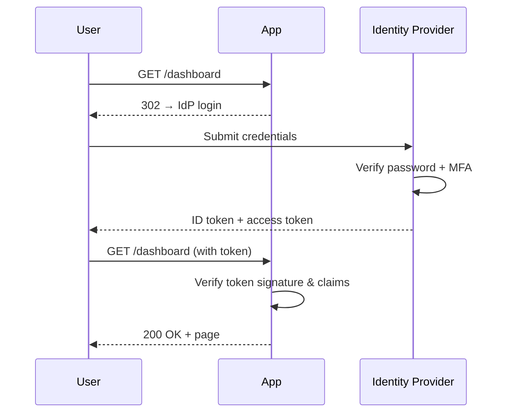

# Authentication vs Authorization

> **TL;DR** — **Authentication (AuthN)** answers *"who are you?"*. **Authorization (AuthZ)** answers *"what can you do?"*. They are different problems with different solutions: AuthN proves identity (passwords, tokens, biometrics, certificates); AuthZ enforces policy (roles, attributes, relationships). Confusing them is the root cause of most access-control bugs. Real systems separate them — an identity provider (Okta, Auth0, Cognito) handles AuthN, your application or a policy engine (OPA, Cedar, Casbin) handles AuthZ.

---

## 1. The Two Questions

Every request that touches protected data eventually answers two questions:

```
1. AuthN: Who is making this request?           → identity
2. AuthZ: Is this identity allowed to do this?  → permission
```

A login form, an OAuth handshake, a JWT signature check — these answer #1. A role check, an ownership check, a policy evaluation — these answer #2. **Doing #1 well does not give you #2.** A verified user can still be denied an action they're not authorized for.

The classic confusion: "the user is logged in, therefore they're allowed." No — being authenticated means you know *who* the request is from. Whether they can *do* the thing is a separate decision.

---

## 2. Authentication: Proving Identity

Authentication answers *who you are* by checking one or more **factors**:

| Factor | Examples | Strength |
| --- | --- | --- |
| Something you **know** | Password, PIN, secret question | Weakest — phishable, leakable |
| Something you **have** | Phone, hardware key (YubiKey), TOTP app | Strong if hardware-backed |
| Something you **are** | Fingerprint, FaceID, voice | Strong but unrecoverable if compromised |
| Somewhere you **are** | IP/geo, device fingerprint | Weak alone, useful as signal |

**Multi-factor authentication (MFA)** requires at least two distinct factors. SMS-based MFA is widely deployed but vulnerable to SIM swapping — prefer TOTP (Google Authenticator, Authy) or WebAuthn/passkeys, which are phishing-resistant.

### Common AuthN mechanisms

- **Password + session cookie** — classic web flow. See [Session-Based Authentication →](./sessions.md).
- **OAuth 2.0 / OIDC** — delegated identity, "Sign in with Google". See [OAuth 2.0 & OpenID Connect →](./oauth-oidc.md).
- **JWT bearer tokens** — self-contained signed tokens for stateless APIs. See [JWT →](./jwt.md).
- **API keys** — long-lived secrets for machine-to-machine. See [API Keys, HMAC Signing →](./api-keys-hmac.md).
- **mTLS** — both client and server present X.509 certificates. Common inside service meshes.
- **SAML** — XML-based enterprise SSO. See [SSO →](./sso.md).
- **Passkeys / WebAuthn** — public-key crypto bound to a device. Replacing passwords at Apple, Google, GitHub.

### A typical AuthN flow



The application doesn't see the password. The IdP attests "this user is `user_42` with email `alice@example.com`" and the app trusts that attestation because the token is signed.

---

## 3. Authorization: Enforcing Policy

Authorization answers *what you can do*. There are several models:

| Model | Decision input | Best for |
| --- | --- | --- |
| **RBAC** | Roles assigned to user | Small role sets, hierarchical orgs |
| **ABAC** | Attributes of user, resource, environment | Complex contextual rules (time, geo, sensitivity) |
| **ReBAC** | Relationships between user and resource | Multi-tenant SaaS, sharing, hierarchies (Google Drive, GitHub) |
| **ACL** | Explicit allow/deny list per resource | Fine-grained per-object permissions |
| **PBAC / OPA** | Policy expressions evaluated at runtime | Centralized policy across services |

See [RBAC, ABAC, ReBAC →](./access-control.md) for the deep dive on each.

### Where the AuthZ check happens

Three common patterns, ordered from worst to best:

1. **Scattered in handlers** — every endpoint inlines `if (user.role != "admin") return 403`. Quick to write, impossible to audit. Inconsistency creeps in within months.
2. **Middleware / decorators** — `@requires_role("admin")` on each route. Better, but still distributed.
3. **Centralized policy engine** — OPA, Cedar, Casbin, or a homegrown service evaluates `authorize(subject, action, resource)`. Audit-friendly and testable.

Stripe, Netflix, and Airbnb all run centralized authorization services. The tradeoff is one more network hop or sidecar — pay the cost.

---

## 4. The Difference, Sharply

| | Authentication | Authorization |
| --- | --- | --- |
| **Question** | Who are you? | What can you do? |
| **Output** | Identity (user ID, claims) | Decision (allow / deny) |
| **Where** | At the edge (login, token check) | Per request, per resource |
| **Failure mode** | 401 Unauthorized | 403 Forbidden |
| **Changes** | Rarely (login once per session) | Constantly (every action) |
| **Owned by** | IdP / auth service | Application + policy engine |

**HTTP status codes confuse this**: `401` literally says "Unauthorized" but means *unauthenticated*. `403` means *authenticated but not allowed*. Don't try to fix the spec — just remember: `401` → log in; `403` → you can't do that.

---

## 5. A Worked Example

Alice signs into a SaaS billing tool.

**Step 1 — AuthN:**
- Alice enters email + password.
- Server verifies the bcrypt hash matches.
- Server issues a session cookie referencing `session_id=abc123` → `{user_id: 42, org_id: 7}`.
- From now on every request carries this cookie. Alice is **authenticated**.

**Step 2 — AuthZ on `GET /orgs/7/invoices`:**
- Server resolves `user_id=42` from the session.
- Server checks: *does user 42 have a relationship to org 7 with permission `invoices:read`?*
- Found: `user_42 → org_7 [role=billing_admin]`. `billing_admin` includes `invoices:read`.
- Allow.

**Step 3 — AuthZ on `DELETE /orgs/7/invoices/inv_99`:**
- Same session, different action.
- Server checks: *does `billing_admin` include `invoices:delete`?*
- No — only `org_owner` has delete permission.
- Deny → 403.

Alice was authenticated **once**. Authorization was checked **twice**, with different results. That's the model.

---

## 6. Service-to-Service AuthN/AuthZ

Inside a microservices system, the same split applies but the actors are services.

**Service AuthN — who is the calling service?**
- **mTLS** — every service has a certificate; the mesh validates it on every hop.
- **Signed tokens** — the calling service includes a JWT signed by an internal IdP.
- **Network identity** — workload identity in Kubernetes (SPIFFE/SPIRE).

**Service AuthZ — is this service allowed to call this endpoint?**
- **Service mesh policies** (Istio AuthorizationPolicy, Linkerd) — declarative allow/deny by service identity.
- **OPA** sidecars — externalized policy.
- **Token scopes** — the JWT carries the scopes the caller is permitted to use.

In a Zero Trust architecture, **every call** — including internal ones — goes through AuthN+AuthZ. The old "trusted internal network" model is dead. See [Zero Trust Architecture →](./zero-trust.md).

---

## 7. Combining the Two Cleanly

A clean request flow:

```
Request →
  [1] Extract credentials (cookie, bearer token, mTLS cert)
  [2] AuthN: verify → produce a Principal {user_id, org_id, roles, claims}
  [3] AuthZ: policy.check(principal, action, resource) → allow/deny
  [4] Handler runs (or 401/403 is returned)
```

Two boundaries, two responsibilities. The handler should never see raw credentials — it sees a **typed principal**. The handler should never make its own ad-hoc allow/deny decisions — it asks the policy engine.

This separation makes systems testable: unit tests stub the principal; policy tests stub the request.

---

## 8. Common Mistakes / Anti-Patterns

- **Treating authentication as authorization.** "User is logged in → user is allowed." No — a logged-in user can still be denied an action.
- **Trusting the client.** Hiding the "Delete" button in the UI is not access control. Every server-side endpoint must authorize independently. Front-end checks are UX, not security.
- **Authorizing only at the edge.** A request that passes the API gateway but then internally calls a service that does no further AuthZ is the recipe for *confused deputy* attacks. AuthZ runs at the resource, not just the door.
- **Role explosion.** RBAC starts with `admin/user`, ends with `billing_admin_eu_readonly_v2`. When roles outnumber users, you've passed the point where ABAC or ReBAC would be cleaner.
- **Forgetting object-level checks.** Endpoint allows `GET /docs/{id}` for any authenticated user — but it should only return docs the user can read. **IDOR** (Insecure Direct Object Reference) is OWASP #1 for a reason. See [OWASP Top 10 →](./owasp-top-10.md).
- **Putting authorization logic in JWTs.** Embedding `roles: [admin]` in a JWT means revocation requires either short token lifetimes or a denylist. Fine for AuthN claims; risky as the sole AuthZ source.
- **Logging passwords or tokens.** Every credential type — password, bearer token, API key — must be redacted in logs. One leak in CloudTrail and you're rotating everything.
- **MFA without recovery flow design.** "Lost your phone" must be at least as carefully authenticated as login itself, or you've built a backdoor.

---

## 9. Cheat Card

```
AUTHN vs AUTHZ — the two questions every request answers

AUTHN     Who are you?        Identity     → 401 if missing/invalid
AUTHZ     What can you do?    Permission   → 403 if not allowed

AUTHN MECHANISMS    password+session, OAuth/OIDC, JWT, API key,
                    mTLS, SAML, WebAuthn/passkeys
AUTHZ MODELS        RBAC, ABAC, ReBAC, ACL, PBAC

FACTORS    know (password) | have (key/phone) | are (biometric)
MFA = ≥2 distinct factors. Prefer TOTP or WebAuthn over SMS.

CLEAN FLOW
  credentials → AuthN → Principal → AuthZ(principal, action, resource) → handler

RULES OF THUMB
  - Authenticate once, authorize on every call.
  - Never trust the client for AuthZ.
  - Centralize policy; decentralize enforcement.
  - 401 ≠ 403. Get the codes right.
```

---

## 10. Resources

### Books
- *OAuth 2 in Action* — Justin Richer & Antonio Sanso. Best practical AuthN/AuthZ book.
- *API Security in Action* — Neil Madden. Threats, tokens, policies, all in one place.
- *Zero Trust Networks* — Evan Gilman & Doug Barth. The mental model behind modern AuthN/AuthZ.

### Documentation
- **NIST SP 800-63** — Digital Identity Guidelines: <https://pages.nist.gov/800-63-3/>
- **OWASP Authentication Cheat Sheet** — <https://cheatsheetseries.owasp.org/cheatsheets/Authentication_Cheat_Sheet.html>
- **OWASP Authorization Cheat Sheet** — <https://cheatsheetseries.owasp.org/cheatsheets/Authorization_Cheat_Sheet.html>

### Articles
- "Authentication vs. Authorization" — Auth0: <https://auth0.com/intro-to-iam/authentication-vs-authorization>
- "How we built Zanzibar" — Google: <https://research.google/pubs/pub48190/> (Google's global ReBAC system).
- "Authorization at Stripe" — Stripe Engineering blog.

### Videos
- ByteByteGo — "OAuth 2.0 explained in plain English"
- OktaDev — channel on identity fundamentals.

### Tools
- **Open Policy Agent (OPA)** — general-purpose policy engine.
- **Cedar** — AWS's policy language.
- **SpiceDB / Authzed** — Google Zanzibar–style ReBAC.
- **Casbin** — multi-language authorization library.

### Adjacent reading
- [OAuth 2.0 & OpenID Connect →](./oauth-oidc.md)
- [JWT — JSON Web Tokens →](./jwt.md)
- [Session-Based Authentication →](./sessions.md)
- [RBAC, ABAC, ReBAC →](./access-control.md)
- [SSO — Single Sign-On →](./sso.md)
- [Zero Trust Architecture →](./zero-trust.md)
- [OWASP Top 10 →](./owasp-top-10.md)

---

*Up:* [README ↑](../README.md)  |  *Next:* [OAuth 2.0 & OpenID Connect →](./oauth-oidc.md)
