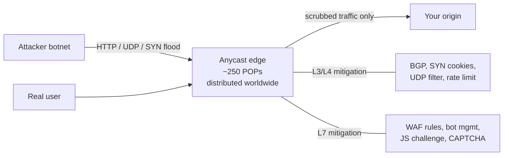

# DDoS Protection & WAF

> **TL;DR** — A **DDoS (Distributed Denial of Service)** attack tries to make your service unavailable by flooding it from many sources. Defending against it requires **upstream capacity** larger than the attacker — which is why mitigation is almost always outsourced to a CDN/scrubber (Cloudflare, AWS Shield, Akamai, Fastly, Google Cloud Armor). A **WAF (Web Application Firewall)** inspects HTTP requests for malicious patterns (SQLi, XSS, RCE, credential stuffing) and blocks them before they reach your app. The two solve different problems: DDoS protection defends bandwidth and connection capacity; WAFs defend application logic. Most modern setups combine both at the edge, with rate limiting, bot management, and challenge mechanisms layered in.

---

## 1. The Attacks, At Different Layers

DDoS isn't one thing. The defenses depend on which layer is attacked.

```
Layer 7  HTTP floods, slowloris, expensive endpoints, credential stuffing
Layer 4  TCP SYN floods, UDP floods, ACK floods
Layer 3  Volumetric — saturate your internet link with raw bandwidth
```

| Layer | Attack | Defense |
| --- | --- | --- |
| **L3 — Volumetric** | UDP amplification (DNS, NTP, Memcached), ICMP flood, ~Tbps scale | Upstream scrubbing only (Cloudflare, AWS Shield Advanced, Akamai). Anycast + BGP blackholing. |
| **L4 — Protocol** | SYN flood, ACK flood, fragmentation | SYN cookies, connection-rate limits, stateful firewalls. CDN+L4 LB. |
| **L7 — Application** | HTTP request flood, slowloris, "expensive" endpoint abuse | WAF, rate limiting, bot management, autoscaling within bounds. |

Modern attacks are usually multi-vector — saturating bandwidth *and* HTTP simultaneously to overwhelm both layers.

### Scale, today

The largest recorded attacks (as of 2026) are in the **multi-Tbps** range for L3/L4 and **hundreds of millions of RPS** for L7. Cloudflare and Google have both reported HTTP/2 Rapid Reset attacks generating 200M+ RPS. No single-origin server can defend against that — your bandwidth bill alone would crater.

---

## 2. The Big Mental Model

Defending against DDoS isn't about being clever. It's about **having more capacity than the attacker** at every layer the attack hits.

```
Attacker (botnet) ──────► your edge ──────► your origin
                          ↑                     ↑
                  must have terabit-           must have
                  scale absorbing               headroom +
                  capacity (CDN/scrubber)       autoscale
```

If you try to defend at the origin alone:
- L3/L4 floods saturate your ISP link before any of your servers see them.
- L7 floods consume your application capacity (DB connections, threads, memory).

The only path that works for serious attacks: **terminate / inspect traffic at a global anycast edge** with vastly more capacity than the attacker. Cloudflare, AWS, Google, Akamai, Fastly, Microsoft all operate networks with hundreds of Tbps of edge capacity.

---

## 3. How CDN-Based DDoS Mitigation Works



The attack is **dispersed** across hundreds of points of presence (POPs) via anycast — what looks like one IP from the outside is actually advertised from every POP. Each POP only sees its slice of the attack; the aggregate fits because there's so much edge capacity.

Origin protection: your real origin server's IP is **never exposed**. The CDN terminates TLS, applies all defenses, then connects to your origin over a private link or a non-public IP. If the origin IP leaks, attackers bypass the CDN entirely — a real and common failure mode.

### Anycast vs unicast

Single-server origins are unicast — one IP, one location. Anycast advertises the same IP from many locations; BGP routes traffic to the nearest. Anycast turns volumetric attacks into "many small attacks" that each POP can absorb individually.

This is why DDoS protection vendors are CDNs — they already operate anycast networks for performance, and the same infrastructure absorbs attacks.

---

## 4. L7 Defenses — Beyond Brute Force

L7 attacks are subtler. They send valid-looking HTTP requests at high rate, often to expensive endpoints (search, login, sign-up). Volumetric defenses don't catch them.

### Rate limiting
At multiple layers:
- Per IP (per-edge).
- Per session / user.
- Per endpoint (login is rate-limited harder than static).
- Per API key.
- Global rate limit on expensive endpoints.

Algorithms: token bucket, leaky bucket, sliding window. See [Rate Limiting →](../03-apis/rate-limiting.md).

### Bot management
- **Fingerprinting** — TLS JA3/JA4, HTTP/2 frame patterns, header order, browser quirks. Real browsers and curl scripts look different.
- **Behavioral analysis** — speed of navigation, mouse movement, form-fill cadence.
- **Reputation** — IPs known for residential proxies / VPNs / cloud providers ranked by historical badness.
- **Challenges** — JavaScript challenge, managed challenge, CAPTCHA (hCaptcha, Cloudflare Turnstile, Google reCAPTCHA).

Cloudflare's "Bot Score" and AWS WAF's bot control are productized versions of this.

### Adaptive responses
The system observes attack patterns and applies graduated responses:

```
Normal      → pass
Suspicious  → JavaScript challenge (real browsers pass silently)
Likely bot  → managed challenge (CAPTCHA-like)
Confirmed   → block, log, IP reputation feed
```

This works because real users tolerate a one-time invisible challenge; bots can't pass at scale economically.

### Anti-credential-stuffing
Credential stuffing — replaying breached username/password pairs — is the most common credential attack in 2026. Defenses:
- **Per-account rate limit** on failed logins.
- **Geolocation anomaly detection** — login from a new country triggers MFA prompt.
- **Have I Been Pwned API** — refuse known-breached passwords on signup.
- **Honeytokens** — fake usernames in your DB that should never authenticate; if they do, alert.

---

## 5. WAFs — Web Application Firewalls

A WAF inspects each HTTP request against a ruleset, blocking those that match attack patterns:

- **SQL injection** — `'; DROP TABLE users; --` patterns.
- **Cross-site scripting (XSS)** — `<script>`, JavaScript event handlers.
- **Command injection** — shell metacharacters in form fields.
- **Path traversal** — `../../../etc/passwd`.
- **Remote code execution** — Log4Shell `${jndi:...}`, deserialization gadgets.
- **Known CVEs** — virtual patches for specific exploits.

### OWASP Core Rule Set (CRS)
The reference WAF ruleset, open source, used by ModSecurity / Coraza / AWS WAF / nginx-naxsi. It scores each request based on rule matches and blocks when a threshold is exceeded.

### Modes

- **Detection / monitoring** — log only. Safe to roll out.
- **Blocking** — block at threshold. Risk: false positives reject legitimate requests.

Standard rollout: enable in detection mode, observe for weeks, tune false positives, then move to blocking.

### Custom rules
Beyond the canned ruleset:
- "Block all requests with body > 10 MB".
- "Block requests to `/admin` not from corporate IP."
- "Block User-Agent strings matching known scrapers."
- "Block POSTs to `/login` over 5/min from one IP."

WAFs are most useful for the long tail of CVEs you can't immediately patch (Log4j was patched at the WAF before applications could be redeployed) and for blunting obviously-malicious traffic before it reaches application code.

### What WAFs don't catch

- **Business-logic vulnerabilities.** "Add item to cart with negative price." No WAF rule for that.
- **IDOR.** `/users/42/profile` accessing user 99's profile via tampering — the request looks normal.
- **CSRF.** Looks like a normal request.
- **API abuse with valid payloads.** "Sign up 100,000 accounts."
- **Zero-days you don't have signatures for.**

WAFs are not a substitute for secure coding. They're a complement.

---

## 6. The Modern Edge Stack

A typical 2026 production setup:

```
                    ┌────────────────────────────────────────┐
                    │  CDN / Edge (Cloudflare / Akamai / AWS)│
                    │                                        │
   public IP  ─────►│  1. Anycast, BGP routing               │
   (only this       │  2. L3/L4 mitigation                   │
    IP is reachable)│  3. TLS termination                    │
                    │  4. WAF rules (OWASP CRS + custom)     │
                    │  5. Bot management + JS challenge      │
                    │  6. Rate limiting (per IP, per API key)│
                    │  7. Static caching                     │
                    └────────────────────────────────────────┘
                                       │
                                       │ over private link / WAF-mTLS
                                       ▼
                    ┌────────────────────────────────────────┐
                    │  Origin (your VPC)                     │
                    │  - load balancer                       │
                    │  - app servers (autoscaling)           │
                    │  - origin shielding (allow only CDN)   │
                    └────────────────────────────────────────┘
```

Critical: **the origin only accepts traffic from the CDN.** Usually via IP allowlist of the CDN's published IP ranges, or an mTLS-authenticated tunnel (Cloudflare Tunnel, AWS PrivateLink). Otherwise an attacker who discovers the origin IP can bypass everything.

---

## 7. Tooling Comparison

| Tool | DDoS | WAF | Bot mgmt | Pricing model |
| --- | --- | --- | --- | --- |
| **Cloudflare** | L3-L7, included | Included (with custom rules in higher tiers) | Strong | Per request / per zone |
| **AWS Shield Standard** | L3/L4 free with AWS services | — | — | Free with AWS |
| **AWS Shield Advanced + WAF** | L3-L7 | Yes | Bot Control add-on | Paid per protected resource |
| **Akamai Kona / App & API Protector** | L3-L7 | Yes | Strong | Enterprise pricing |
| **Fastly (formerly Signal Sciences)** | L3-L7 | Yes | Bot mgmt | Per request |
| **Google Cloud Armor** | L3-L7 | Yes | Bot Mgmt | Per rule / per request |
| **Imperva** | L3-L7 | Yes | Strong | Enterprise |
| **Open source** | (not really) | ModSecurity, Coraza, OpenWAF | — | Self-managed |

**Practical default for SaaS:** Cloudflare. The free tier covers small sites; paid tiers cover most needs; their network handles the largest attacks. Move to AWS Shield Advanced + WAF if you're deep in AWS; Akamai if you have an existing enterprise relationship.

---

## 8. Application-Side Defenses (Even Behind a CDN)

Don't outsource the entire problem. Origin-side hardening still matters:

- **Connection limits per IP** — protect against partial-bypass attacks.
- **Timeouts everywhere** — read, write, idle. Slowloris depends on long-lived half-open connections.
- **Resource limits** — request body size, header size, JSON depth.
- **Backpressure** — when overloaded, shed load gracefully rather than collapsing. See [Backpressure →](../10-scalability/backpressure.md).
- **Circuit breakers** on downstream calls. See [Circuit Breaker Pattern →](../11-reliability/circuit-breaker.md).
- **Autoscaling within sensible bounds** — sudden 10× traffic shouldn't auto-scale to a $100k bill in an hour. Set ceilings.
- **Caching aggressively** — the easiest way to absorb load is to not compute it. Cache static and personalized content where possible.
- **Asymmetric work check** — expensive endpoints (search, signup) have stricter limits than cheap ones.

---

## 9. Operational Playbook — The First 10 Minutes of an Attack

1. **Detect** — alerting on error rates, latency, traffic volume, 429/5xx spikes.
2. **Identify the layer** — is bandwidth saturating? Are CPU/DB connections saturating? Is one endpoint?
3. **Engage your CDN/WAF dashboard** — most provide "I'm Under Attack" toggle (Cloudflare's term) that ramps up challenges.
4. **Identify attack signature** — common ASNs, User-Agents, paths, geos. Block in WAF.
5. **Tighten rate limits.**
6. **Scale out** if attack is L7 and within budget.
7. **Communicate** — status page, customer-facing if degraded.
8. **Log and analyze** — fingerprints for next time, signatures for the WAF, IOCs.

The first time isn't the time to figure this out. **Practice incident response on attacks** (chaos engineering / game days). See [Chaos Engineering →](../11-reliability/chaos-engineering.md).

---

## 10. Compliance Notes

PCI DSS, SOC 2, HIPAA, and others increasingly expect:
- WAF in front of any web application handling sensitive data.
- DDoS mitigation contractually documented.
- Logs of blocked/allowed requests retained.
- Reviewed WAF rules and tuning cadence.

Cloudflare, AWS, Akamai all provide compliance attestations (SOC 2, PCI DSS, FedRAMP) — useful for your audit.

---

## 11. Common Mistakes / Anti-Patterns

- **Exposing origin IP.** Subdomain points directly to the origin; attackers bypass CDN. Audit all DNS records; never publish origin IPs.
- **Allowing direct origin access.** Even with hidden IP, origin should reject anything not from the CDN. Use IP allowlist or mTLS tunnel.
- **WAF in block mode without baseline.** False positives = real customers locked out. Always start in detect mode.
- **Relying on CAPTCHA for everything.** User-hostile and easily defeated by CAPTCHA-solving services. Use behavioral / challenge mechanisms first.
- **Rate limit per-IP only.** NAT'd corporate networks have one IP for thousands of users; mobile networks too. Layer with per-account and per-API-key limits.
- **Autoscaling with no ceiling.** Attack = $$$$. Bound your scale-out.
- **No L4 protection.** Application-layer WAF doesn't stop SYN floods. Use a provider with L3/L4 protection too.
- **Static error pages that themselves call dynamic backends.** 503 page hits the DB → DB now down.
- **Ignoring HTTP/2 Rapid Reset (CVE-2023-44487) class of attacks.** Patch your web servers and CDN; this attack still appears in 2026.
- **Treating WAF as security strategy.** WAFs are a perimeter control. Application code must still be secure. See [OWASP Top 10 →](./owasp-top-10.md).
- **No game-day testing.** First experience with attack playbook should not be during an attack.
- **Logging every blocked request without budget.** WAF logs explode during attacks. Have a sampling and storage strategy.

---

## 12. Cheat Card

```
DDoS LAYERS
  L3   volumetric — saturate link              → upstream scrubber, anycast
  L4   SYN/UDP flood                           → SYN cookies, L4 LB, CDN
  L7   HTTP/request flood, slowloris           → WAF, rate limit, bot mgmt

DEFENSE = upstream capacity > attacker.   you cannot win at the origin alone.

EDGE STACK
  Cloudflare / AWS Shield+WAF / Akamai / Fastly / Cloud Armor
  anycast network → L3/L4 absorb → TLS → WAF → bot mgmt → rate limit → origin

ORIGIN HARDENING
  hide IP · only-from-CDN allowlist · short timeouts · req size limits
  per-IP + per-account + per-key rate limits · circuit breakers · backpressure
  cap autoscale ceiling · cache aggressively

WAF
  OWASP CRS in detect → tune → block
  custom rules for /admin, /login, big bodies
  doesn't catch IDOR, CSRF, business-logic, zero-days

CREDENTIAL STUFFING
  per-account rate limit · geo anomaly + MFA prompt · breached-pwd check (HIBP)

PLAYBOOK
  detect → identify layer → engage edge dashboard → tighten limits
  → block signature → scale (with ceiling) → comms → post-mortem

RULE: don't defend bandwidth attacks with your origin. Buy upstream capacity.
```

---

## 13. Resources

### Documentation
- **Cloudflare DDoS protection** — <https://www.cloudflare.com/learning/ddos/>
- **AWS Shield** — <https://docs.aws.amazon.com/shield/>
- **AWS WAF** — <https://docs.aws.amazon.com/waf/>
- **OWASP Core Rule Set** — <https://coreruleset.org/>
- **OWASP WAF Best Practices** — <https://owasp.org/www-pdf-archive/Best_Practices_Guide_WAF_v105.en.pdf>
- **HTTP/2 Rapid Reset (CVE-2023-44487)** — Cloudflare/Google joint disclosure.

### Articles
- "How Cloudflare mitigated yet another Cloudbleed-class attack" — Cloudflare blog (every public attack writeup is educational).
- "Inside the largest DDoS attack ever" — Google Cloud blog (2023, 398M RPS).
- "Anatomy of a credential stuffing attack" — Akamai threat reports.
- "Why your WAF is not enough" — Latacora.

### Videos
- Cloudflare TV — DDoS deep dives.
- "DDoS attacks: How they work" — NetworkChuck / various educators.

### Tools
- **Cloudflare, AWS Shield Advanced, Akamai, Fastly, Google Cloud Armor** — managed.
- **ModSecurity, Coraza** — open-source WAFs.
- **fail2ban** — simple log-based blocker for VPS-level defense.
- **iptables / nftables** with conntrack — Linux-level rate limits.

### Books
- *Practical Cloud Security* — Chris Dotson. WAF/CDN architecture chapters.

### Adjacent reading
- [Rate Limiting →](../03-apis/rate-limiting.md)
- [API Gateway →](../03-apis/api-gateway.md)
- [Load Balancing →](../06-load-balancing/load-balancer-basics.md)
- [Backpressure →](../10-scalability/backpressure.md)
- [Circuit Breaker Pattern →](../11-reliability/circuit-breaker.md)
- [OWASP Top 10 →](./owasp-top-10.md)
- [Zero Trust Architecture →](./zero-trust.md)

---

*Previous:* [← Secrets Management](./secrets-management.md)  |  *Next:* [Zero Trust Architecture →](./zero-trust.md)
