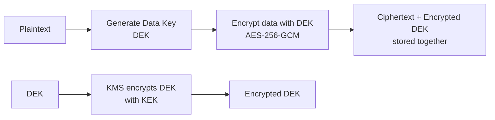

# Encryption at Rest & In Transit

> **TL;DR** — **Encryption in transit** protects data flowing over the network (TLS); **encryption at rest** protects data sitting on disk or in storage (AES-256 with a key from KMS). They defend against different threats: in-transit defeats network eavesdroppers; at-rest defeats stolen disks and rogue cloud-provider employees. They are not substitutes — production systems need both. The real complexity isn't the math: it's **key management** (rotation, scoping, access control) and the long tail of *forgotten* places where data lives unencrypted (backups, logs, message queues, intermediate caches). AES-GCM for symmetric encryption, TLS 1.3 in transit, envelope encryption with a KMS, hardware-backed root keys. Don't roll your own crypto.

---

## 1. The Two Domains

```
       in transit                            at rest
       ─────────────                         ───────────
       ┌──────────┐    TLS 1.3   ┌──────────┐         ┌──────┐
       │  Client  │ ◄──────────► │  Server  │ ◄──────►│ Disk │  AES-256-GCM
       └──────────┘              └──────────┘         └──────┘
              data flowing                       data stored
              threat: eavesdropper               threat: stolen disk
                       MITM                              insider
                       proxies                           leaked backup
```

These are independent defenses. A TLS-only system loses data if a disk is stolen. An at-rest-only system leaks every request over the wire.

---

## 2. Symmetric vs Asymmetric Encryption (the 30-second version)

| Type | Same key for enc/dec? | Speed | Use |
| --- | --- | --- | --- |
| **Symmetric** (AES, ChaCha20) | Yes | Fast (GB/s) | Bulk data — files, DB rows, traffic payloads |
| **Asymmetric** (RSA, ECDSA, ECDH) | No (public/private pair) | Slow (~1000x) | Key exchange, signatures, identity |

In practice you almost always use **both together**: asymmetric to exchange a fresh symmetric key, then symmetric to encrypt the actual data. TLS and JOSE both work this way. See [Public-Key Cryptography Basics →](./pki.md).

---

## 3. Encryption in Transit

The mainstream tool is **TLS** (Transport Layer Security, the protocol formerly known as SSL). Most TLS configurations look like:

```
TLS 1.3 with ECDHE key exchange, ECDSA or RSA cert, AES-256-GCM or ChaCha20-Poly1305
```

Walked through in detail in [HTTPS, TLS/SSL Handshake →](../02-networking/https-tls.md). The short story:

1. Client and server agree on a cipher suite.
2. They use asymmetric crypto (ECDHE) to derive a shared symmetric key.
3. They encrypt all subsequent traffic with that key.

### Where TLS belongs

- Between browser and server (HTTPS) — non-negotiable.
- Between any two services, even inside your VPC — modern best practice.
- Between client and database (MySQL/Postgres support TLS — turn it on).
- Between client and message broker (Kafka, RabbitMQ all support TLS).
- Between services and external APIs.

### The "we're inside the VPC, we don't need TLS" trap

For two decades, intra-data-center traffic was assumed safe. Then NSA documents (Snowden, 2013) revealed Google's intra-DC traffic was tapped. Google's response: encrypt everything inside their network. This is the foundation of **Zero Trust**. See [Zero Trust Architecture →](./zero-trust.md).

In a modern setup:
- **mTLS** between services (via service mesh — Istio, Linkerd, Consul Connect).
- TLS to every internal database and broker.
- TLS for backups and replication channels.

### TLS configuration that actually matters

```
TLS versions      1.3 (preferred), 1.2 (acceptable)
Disabled          1.1, 1.0, SSL 3.0, SSL 2.0
Ciphers (1.3)     TLS_AES_256_GCM_SHA384
                  TLS_AES_128_GCM_SHA256
                  TLS_CHACHA20_POLY1305_SHA256
Key exchange      ECDHE only (forward secrecy)
Certificates      ECDSA (P-256) or RSA-2048+
HSTS              Strict-Transport-Security: max-age=63072000; includeSubDomains; preload
OCSP stapling     enabled
Session tickets   rotated frequently
```

Use Mozilla's "intermediate" profile as a starting point unless you're locked to ancient clients.

### Forward secrecy

ECDHE (elliptic-curve Diffie-Hellman ephemeral) means: even if an attacker captures every encrypted packet and *later* steals the server's private key, they still can't decrypt past traffic. The session keys were ephemeral and discarded. This is one of the most important properties of modern TLS. Don't use cipher suites without ECDHE.

---

## 4. Encryption at Rest

"Encrypting data at rest" is a loose phrase. Be precise about *what* is encrypted *where*.

| Layer | Mechanism | Threats stopped |
| --- | --- | --- |
| **Disk / device** | Full-disk encryption (LUKS, BitLocker, FileVault, EBS encryption) | Stolen physical disk |
| **File system** | Per-file encryption (eCryptfs, EFS) | Stolen files |
| **Database** | TDE — Transparent Data Encryption (SQL Server, Oracle, Postgres) | Stolen DB file/backup |
| **Application column-level** | Encrypt specific fields (SSN, card numbers) with KMS | DB admin compromise, regulatory |
| **Object storage** | S3 SSE-S3 / SSE-KMS / SSE-C, GCS CMEK | Stolen bucket, AWS insider |

A common misconception: "S3 is encrypted, so my data is safe." S3 SSE-S3 protects against AWS losing your disks. It does **not** protect against:
- Your IAM keys leaking (the attacker downloads the data, decrypted, via the normal API).
- A misconfigured bucket exposing data publicly.
- An insider with bucket access exfiltrating data.

Encryption at rest is one control in a defense-in-depth strategy, not the only one.

### Disk-level encryption

Cheap, ubiquitous, transparent. Every cloud provider's default volume encryption uses AES-256 with provider-managed keys. Turn it on; the performance cost is single-digit percent.

Limitation: when the disk is mounted and the OS is running, all data is decrypted in memory. So if the attacker has access to the running system, disk encryption is moot.

### Database TDE

Encrypts the database files on disk. Same limitation as disk encryption — once the DB is running, data flows in plaintext. Useful for backups, dumps, decommissioned drives.

### Application-level / column-level encryption

You explicitly encrypt sensitive fields before writing them, decrypt after reading.

```python
def store_ssn(user_id, ssn):
    ciphertext = kms.encrypt(plaintext=ssn, key_id="alias/pii")
    db.execute("UPDATE users SET ssn_enc = %s WHERE id = %s", (ciphertext, user_id))
```

Advantages:
- DB compromise yields ciphertext, not plaintext.
- Different keys for different sensitivity levels — finer-grained access control.
- Auditability — every decrypt call is logged in KMS.

Disadvantages:
- Encrypted columns can't be queried directly (`WHERE ssn = ...`). Workarounds: deterministic encryption (loses semantic security), HMAC indexes, search-by-prefix patterns.
- Latency: every decrypt is a KMS call (cached, but still).

For PII, payment data, health data — this is the bar. PCI DSS, HIPAA, GDPR effectively require it.

---

## 5. Envelope Encryption (the standard pattern)

You almost never use a KMS key to encrypt data directly. Instead:



- **DEK** — Data Encryption Key. Random, used once, encrypts the actual data.
- **KEK** — Key Encryption Key. Held in KMS. Encrypts DEKs.

Why? Bulk data through KMS is slow and expensive. DEKs are generated locally and only the DEK goes through KMS (small, fast). Rotating the KEK doesn't require re-encrypting all data — just re-encrypt DEKs.

AWS SSE-KMS, GCP CMEK, Azure Customer-Managed Keys all use envelope encryption internally.

---

## 6. Key Management — Where Most Real Failures Happen

The crypto is not the hard part. **Key management is.** Where do keys live? Who can use them? How are they rotated? How are they audited?

### Use a KMS

- **AWS KMS, GCP Cloud KMS, Azure Key Vault** — cloud-native, HSM-backed.
- **HashiCorp Vault** — multi-cloud, on-prem.
- **HSMs** — hardware security modules (CloudHSM, on-prem Thales, YubiHSM). Tamper-resistant chips that hold root keys.

A KMS gives you:
- Keys that **never leave** the HSM in plaintext.
- IAM-controlled use of keys (`kms:Encrypt`, `kms:Decrypt`).
- Audit logs of every use.
- Programmatic rotation.

### Key rotation

- **Automatic rotation** (AWS KMS, ~yearly) generates a new key version. Old versions remain valid for decrypting existing ciphertext. New ciphertext uses the new version.
- **Manual rotation** for keys you control directly.
- **Post-incident rotation** — if a key may have been exposed, rotate immediately and re-encrypt.

The hardest case is when keys are stored *in your application*. Build re-encryption tooling from day one — you'll need it.

### Key hierarchy

```
Root Key (HSM, never exported)
   ↓ wraps
Service Keys (KMS, per service or tenant)
   ↓ wraps
Data Keys (DEKs, ephemeral, per object or batch)
   ↓ encrypts
Actual data
```

This is the model behind every major cloud's encryption.

### Bring Your Own Key (BYOK) / Customer-Managed Keys (CMK)

Some enterprise customers demand they control the keys, even when the data lives in your cloud. You provision them a CMK in your KMS; your service uses their key when handling their data; if they revoke it, their data is inaccessible (yours and theirs).

This is increasingly mainstream for SaaS sold to regulated industries.

---

## 7. Algorithms — What to Actually Use

| Use | Algorithm |
| --- | --- |
| Symmetric bulk encryption | **AES-256-GCM** (or ChaCha20-Poly1305 if AES-NI isn't available) |
| Key exchange | **ECDHE** (X25519 or P-256) |
| Public-key encryption | RSA-OAEP-SHA256 (legacy), or hybrid scheme with ECIES |
| Digital signatures | **ECDSA P-256** or **Ed25519** |
| Hashing (general) | **SHA-256** or SHA-3 |
| Password hashing | **Argon2id**, **bcrypt**, **scrypt** (NOT SHA-256) — see [Password Storage →](./password-storage.md) |
| MAC (message authentication) | **HMAC-SHA256** |
| Authenticated encryption | **AES-GCM** or **ChaCha20-Poly1305** (always use AEAD, not raw modes) |

### Things to never do

- **AES-ECB** — visible patterns in ciphertext (the famous penguin image). Don't.
- **AES-CBC without HMAC** — encrypts but doesn't authenticate. Padding oracle attacks loom. Use AEAD modes.
- **Static IVs** with AES-GCM — catastrophic. IV reuse breaks the entire scheme.
- **MD5 or SHA-1** for anything security-relevant — collisions feasible.
- **Custom crypto code.** Use a library: libsodium, BoringSSL, OpenSSL, Tink, Web Crypto API. Even Daniel Bernstein writes libraries; you should use them.

---

## 8. The Long Tail — Where Encryption Is Often Missing

Production systems encrypt the obvious places and then leak data through:

- **Backups.** Often unencrypted "for compatibility." A leaked backup = a leaked database. Always encrypt.
- **Logs.** Application logs frequently include request bodies, full headers, sometimes passwords. Encryption at rest helps; redaction in code helps more.
- **Message queues.** Kafka topics, SQS queues, Pub/Sub. Encrypt at rest (provider) **and** TLS in transit between producer/consumer.
- **Caches.** Redis often runs without TLS or auth. Sensitive data sits in Redis in plaintext. Turn on TLS and AUTH; consider encrypting sensitive values at the application layer.
- **Search indexes.** Elasticsearch storing customer PII. Encrypt at rest, restrict network access.
- **Analytics warehouses.** A copy of every important DB table sits in Snowflake/BigQuery. Encrypt, audit, and segregate access.
- **Replicas and read-slaves.** Same data, often less hardened.
- **Dev environments with production data.** The classic "test database is a 6-month-old snapshot of prod" — and unencrypted.
- **Email and webhooks.** Sending sensitive data via email or to customer webhook URLs is plaintext to anyone in the path.

Build a **data map**: every place data lives, every place it flows, marked encrypted/not-encrypted. Then fix the gaps.

---

## 9. Compliance Lens

Most regulations require some form of encryption:

- **PCI DSS** — cardholder data encrypted at rest and in transit; strong key management.
- **HIPAA** — PHI must be encrypted ("addressable" but in practice required).
- **GDPR** — encryption is a recommended safeguard; reduces breach-notification scope.
- **SOC 2** — encryption of data at rest and in transit is a standard control.
- **FedRAMP** — FIPS 140-2 / 140-3 validated cryptography.

Audit checklist:
- TLS 1.2+ everywhere.
- AES-256 at rest.
- Keys in HSM or FIPS-validated KMS.
- Documented key rotation.
- Audit log of key usage.
- No customer data in unencrypted backups.

---

## 10. Common Mistakes / Anti-Patterns

- **Rolling your own crypto.** The number of "secure custom encryption" implementations broken in week one is uncountable. Use a library.
- **Hardcoded keys in source.** Public on GitHub within hours. Use a KMS or secrets manager.
- **Storing keys next to ciphertext.** Whoever stole the data also stole the key. Separate them.
- **No key rotation strategy.** When the key leaks, you have no plan.
- **Encrypting only the database, not backups.** Backups are the most-leaked artifact in incidents.
- **Encrypting only the disk.** Doesn't protect against logical compromises — only stolen hardware.
- **Using AES-ECB.** Encrypts patterns. Don't.
- **Using static IVs with GCM.** Two ciphertexts with the same IV → keystream recoverable → game over.
- **Disabling TLS verification** (`InsecureSkipVerify`, `verify=False`). Reverts you to plaintext over a TLS-looking channel.
- **TLS to the load balancer, plaintext to the app.** Anyone in the network between them sniffs the data. Terminate TLS at the app or use mTLS internally.
- **Mistaking encoding for encryption.** base64 is encoding. Not encryption.
- **Not encrypting logs and metrics.** Sensitive data often ends up there.
- **Treating SSE-S3 as compliance.** It's a small piece. Audit IAM, bucket policy, access logs, alongside encryption.
- **Forgetting about removable media and laptops.** Devops engineer's laptop with `~/.aws/credentials` is unencrypted? You have a problem.

---

## 11. Cheat Card

```
IN TRANSIT     TLS 1.3 (1.2 acceptable), ECDHE, AES-256-GCM, HSTS
               mTLS for service-to-service
               TLS to databases, brokers, caches

AT REST        AES-256-GCM via KMS
               envelope encryption: KMS encrypts DEKs, DEKs encrypt data
               layers: disk · DB TDE · application column-level
               BACKUPS · LOGS · QUEUES · CACHES all included

KEY MGMT       KMS (AWS KMS / GCP Cloud KMS / Azure Key Vault / Vault)
               HSM-backed root keys; never export plaintext
               rotate yearly automatically; immediately on suspicion
               IAM-scoped access; audit every Encrypt/Decrypt call

ALGORITHMS     symmetric    AES-256-GCM or ChaCha20-Poly1305
               key exchange ECDHE (X25519 / P-256)
               signatures   Ed25519 or ECDSA P-256
               hashing      SHA-256/SHA-3
               passwords    Argon2id (NOT SHA-256)

NEVER          ECB · static IV · MD5/SHA-1 for security · custom crypto code
               keys in source · keys next to ciphertext · InsecureSkipVerify

RULE: use a library + a KMS. Encrypt the long tail. Plan rotation from day one.
```

---

## 12. Resources

### Books
- *Serious Cryptography* — Jean-Philippe Aumasson. Modern, accessible.
- *Cryptography Engineering* — Ferguson, Schneier, Kohno. The reference.
- *Real-World Cryptography* — David Wong. Practical implementation focus.

### Documentation
- **Mozilla TLS configurator** — <https://ssl-config.mozilla.org/>
- **AWS KMS docs** — <https://docs.aws.amazon.com/kms/>
- **GCP Cloud KMS** — <https://cloud.google.com/kms/docs>
- **OWASP Cryptographic Storage Cheat Sheet** — <https://cheatsheetseries.owasp.org/cheatsheets/Cryptographic_Storage_Cheat_Sheet.html>
- **NIST SP 800-57** — Key Management recommendations.

### Articles
- "The Cryptographic Doom Principle" — Moxie Marlinspike (read before designing protocols).
- "Cryptographic Right Answers" — Latacora: <https://www.latacora.com/blog/2018/04/03/cryptographic-right-answers/>
- "Stop using JWT for sessions" — context for choosing the right crypto primitive.

### Videos
- "Crypto 101" — Laurens Van Houtven (free book + talks).
- ByteByteGo — "How HTTPS works".

### Tools
- **libsodium** — modern, hard-to-misuse crypto library.
- **Google Tink** — multilingual, opinionated.
- **age** — file encryption (modern replacement for PGP).
- **OpenSSL / BoringSSL** — when you must.
- **testssl.sh** — audit TLS configurations.
- **SSL Labs Server Test** — <https://www.ssllabs.com/ssltest/>

### Adjacent reading
- [HTTPS, TLS/SSL Handshake →](../02-networking/https-tls.md)
- [Public-Key Cryptography Basics →](./pki.md)
- [Hashing, Salting, Password Storage →](./password-storage.md)
- [Secrets Management →](./secrets-management.md)
- [Zero Trust Architecture →](./zero-trust.md)
- [OWASP Top 10 →](./owasp-top-10.md)

---

*Previous:* [← RBAC, ABAC, ReBAC](./access-control.md)  |  *Next:* [Hashing, Salting, Password Storage →](./password-storage.md)
