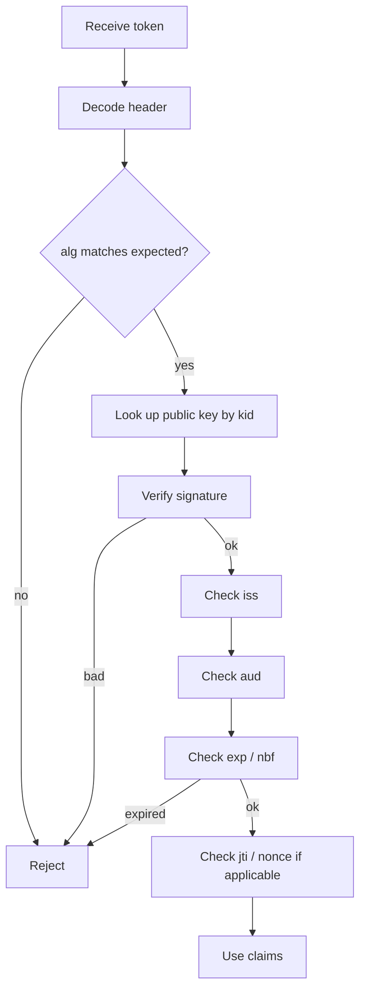

# JWT — JSON Web Tokens

> **TL;DR** — A **JWT** (JSON Web Token, pronounced "jot") is a compact, URL-safe string carrying signed JSON claims. The signature lets any party with the public key verify the token without contacting the issuer, which is why JWTs power stateless APIs and federated identity. JWTs are **not encrypted by default** — the payload is base64-encoded, fully readable. They're also famously easy to misuse: `alg=none` accept-anything bugs, weak keys, missing audience checks, and the impossibility of instant revocation have produced years of CVEs. Use a well-tested library, verify everything, keep them short-lived, and never use JWTs for session management when you could use a session cookie.

---

## 1. The Idea

A JWT is three base64url-encoded segments separated by dots:

```
eyJhbGciOiJSUzI1NiIsInR5cCI6IkpXVCJ9 .
eyJzdWIiOiIxMjM0IiwibmFtZSI6IkFsaWNlIn0 .
ZGVtby1zaWduYXR1cmU
```

Decoded:

```
HEADER  { "alg": "RS256", "typ": "JWT" }
PAYLOAD { "sub": "1234", "name": "Alice", "iat": 1719996399, "exp": 1719999999 }
SIGNATURE  RSA-SHA256( base64url(header) + "." + base64url(payload), private_key )
```

The signature proves two things:
1. The token was issued by someone who holds the signing key (integrity).
2. The header and payload have not been tampered with (authenticity).

Anyone with the **public** key (or the **shared secret**, for HMAC) can verify. No callback to the issuer required. This is the value proposition.

---

## 2. The JOSE Family

JWT is one member of a small family of specs collectively called **JOSE** (JSON Object Signing and Encryption):

| Spec | Purpose |
| --- | --- |
| **JWS** (RFC 7515) | JSON Web Signature — signed payloads |
| **JWE** (RFC 7516) | JSON Web Encryption — encrypted payloads |
| **JWK** (RFC 7517) | JSON Web Key — keys as JSON |
| **JWA** (RFC 7518) | Algorithms |
| **JWT** (RFC 7519) | JSON Web Token — claim set, often a JWS |

A "JWT" in the wild is almost always a JWS (signed but not encrypted). If you actually need confidentiality, you want JWE, which is **less commonly used and easier to misuse**.

---

## 3. Algorithms

| Family | Examples | Use |
| --- | --- | --- |
| **HMAC** | HS256, HS384, HS512 | Shared secret. Only when issuer = verifier. |
| **RSA** | RS256, RS384, RS512 | Public/private key. Default for OIDC. |
| **ECDSA** | ES256, ES384, ES512 | Public/private key. Smaller, faster than RSA. |
| **RSA-PSS** | PS256, PS384, PS512 | Modern RSA padding scheme. |
| **EdDSA** | Ed25519 | Modern, fast, recommended where supported. |
| **none** | — | **Never.** Means "no signature." Has caused real CVEs. |

**Pick one of:** RS256 (most compatible), ES256 (smaller), Ed25519 (newest, best).

**Never** use `alg=none` and never accept tokens where `alg` is determined by the *token itself* — always determine the expected algorithm from your server-side config, then verify the token's `alg` matches.

---

## 4. Standard Claims

The payload is just JSON, but a few claim names are reserved by RFC 7519:

| Claim | Meaning |
| --- | --- |
| `iss` | **Issuer** — who issued this token |
| `sub` | **Subject** — the principal (user ID) |
| `aud` | **Audience** — who this token is for |
| `exp` | **Expiration time** (Unix seconds) |
| `nbf` | **Not before** (Unix seconds) |
| `iat` | **Issued at** (Unix seconds) |
| `jti` | **JWT ID** — unique identifier, useful for revocation/replay protection |

Custom claims live alongside these. Conventional namespaces (`https://your-app.com/role`) avoid collisions with future RFCs.

---

## 5. Verifying a JWT — The Checklist



Every single step matters. The most common mistake is skipping `aud` (audience) — without it, a token issued for service A can be replayed against service B.

### Key lookup

OIDC providers expose their public keys at a JWKS endpoint:

```
GET https://accounts.google.com/.well-known/openid-configuration
  → jwks_uri: https://www.googleapis.com/oauth2/v3/certs
```

Keys are cached and rotated. Token headers include a `kid` (key ID) so verifiers know which key signed it.

**Caching rule:** cache JWKS for a few minutes; refresh on `kid` miss. Don't fetch JWKS on every request — that's a DDoS vector against your IdP.

---

## 6. Where JWTs Belong (And Where They Don't)

JWTs are great for:
- **OIDC ID tokens** — short-lived, single-purpose, exactly the use case.
- **Service-to-service tokens** — particularly with private_key_jwt or workload identity (SPIFFE).
- **Short-lived API access tokens** in OAuth.
- **Stateless authorization** when a service can't reach the IdP per request.

JWTs are wrong for:
- **Long-lived user sessions.** Without instant revocation, a stolen JWT works until expiry. Use a session cookie pointing to server-side state — see [Session-Based Authentication →](./sessions.md).
- **Storing sensitive data.** The payload is base64, not encrypted. Anyone with the token can read it.
- **Cross-tab / cross-tenant claims you'd want to revoke instantly.** Roles in JWTs mean role changes don't take effect until token expiry.
- **Replacing every cookie everywhere.** "JWT all the things" is a recurring bad take.

The rule from industry: *if the verifier and the issuer can share a database, use a session ID. If they cannot, use a JWT.*

---

## 7. The Revocation Problem

This is the central JWT tradeoff. Once issued, a JWT is valid until `exp`. There is no built-in "log this user out everywhere" button.

Mitigations, ordered from least to most expensive:

1. **Short expiry + refresh tokens.** Access token TTL ≤ 15 minutes, refresh token at the IdP. Logout = revoke refresh token; access token expires soon.
2. **Token versioning.** Each user has a `token_version` integer in your DB; embed it in tokens. Bump it to invalidate all of that user's tokens.
3. **Denylist / blocklist.** Store revoked `jti`s in Redis until they expire. Per-request lookup — defeats the stateless advantage but works.
4. **Introspection.** Use opaque tokens instead, calling `/introspect` per request. Not really a JWT anymore.

If logout-everywhere within seconds matters more than statelessness, JWTs may not be the right answer.

---

## 8. Storage in Browsers

Where to put a JWT on the browser side is a meaningful security choice.

| Storage | XSS-readable? | Sent automatically? | CSRF? | Verdict |
| --- | --- | --- | --- | --- |
| `localStorage` | **Yes** | No | No | Avoid — XSS reads it directly |
| `sessionStorage` | **Yes** | No | No | Avoid |
| JS variable | No (per page) | No | No | Lost on reload |
| `HttpOnly` cookie | **No** | Yes | **Yes** | Best — pair with `Secure`, `SameSite=Lax/Strict`, CSRF protection |

The widespread advice "store JWTs in `localStorage` so SPAs can send them as Bearer headers" is wrong from a security perspective. XSS becomes a session-takeover. Prefer `HttpOnly` cookies, even for SPAs — use the **BFF pattern**: a server-side proxy translates cookies to API calls so the front-end never sees the token. See [BFF →](../03-apis/bff.md).

---

## 9. Worked Example

A SaaS app issues a JWT after login:

**Issuer (your IdP / login service):**
```python
import jwt, time, uuid

claims = {
    "iss": "https://auth.example.com",
    "sub": "user_42",
    "aud": "api.example.com",
    "exp": int(time.time()) + 900,     # 15 min
    "iat": int(time.time()),
    "jti": str(uuid.uuid4()),
    "scope": "read:invoices write:invoices",
    "org": "org_7",
}
token = jwt.encode(claims, private_key, algorithm="RS256", headers={"kid": "2025-q2"})
```

**Verifier (the API):**
```python
import jwt
from jwt import PyJWKClient

jwks = PyJWKClient("https://auth.example.com/.well-known/jwks.json")
key = jwks.get_signing_key_from_jwt(token).key

claims = jwt.decode(
    token,
    key,
    algorithms=["RS256"],             # explicitly list — never trust header
    audience="api.example.com",       # mandatory check
    issuer="https://auth.example.com",
    options={"require": ["exp", "iat", "aud", "iss"]},
)
# Now claims["sub"] is trusted as the user ID.
```

If any check fails (signature, `aud`, `iss`, `exp`, missing claim), the library throws. Don't catch and ignore.

---

## 10. The Famous CVEs

JWT has a hall of fame of dumb-but-deadly bugs:

- **`alg=none` accepted.** Some libraries treated `none` as a valid algorithm, accepting unsigned tokens.
- **HMAC/RSA confusion.** A server expecting RS256 received `{alg: HS256}` and used the *public* key as the HMAC shared secret. Forging tokens then required only the published public key.
- **Weak `kid` lookup.** Token says `kid: ../../../dev/null` and the verifier reads the file as a key. Path traversal in key resolution.
- **Algorithm chosen by token header.** Always set the expected algorithm explicitly in the verifier.
- **JWKS URL controlled by token.** If the verifier blindly trusts the issuer claim and fetches that issuer's JWKS, an attacker can issue a token from an attacker-controlled URL.

Lesson: **never trust anything in the unverified part of a token.** Use a maintained library and configure it strictly.

---

## 11. JWT vs Opaque Tokens

| | JWT | Opaque (reference) |
| --- | --- | --- |
| Format | Self-contained signed JSON | Random string |
| Validation | Local, by signature | Remote, via `/introspect` |
| Network hops | 0 | 1 per request (cacheable) |
| Revocation | Hard (expiry-bound) | Instant |
| Size | 500–2000 bytes typical | 20–40 bytes |
| Carries claims | Yes (directly readable) | No (resolved at introspection) |

Pick JWT when low latency and offline verification matter. Pick opaque when revocation and confidentiality matter. Many systems use both — opaque refresh tokens, JWT access tokens.

---

## 12. Common Mistakes / Anti-Patterns

- **Not verifying the signature.** Sounds impossible, but libraries that "decode" without verifying exist. Always use `verify`/`decode` with key + algorithm.
- **Trusting `alg` from the token header.** Fix the algorithm on the verifier side.
- **Skipping `aud` check.** Replay across services.
- **Skipping `iss` check.** Attacker presents token from a different issuer.
- **Putting secrets in the payload.** Base64 is not encryption.
- **Long-lived JWTs as session cookies.** No revocation, persistent compromise.
- **`localStorage` storage in SPAs.** Trivial session theft via XSS.
- **Encoding huge user objects.** Token gets too big for headers, causes 431 errors at proxies.
- **No `exp` claim.** Forever-tokens. Always set `exp`.
- **No clock skew tolerance.** Distributed verifiers see slightly different times — allow ±30s.
- **No key rotation plan.** Build `kid`-aware verifiers from day one; rotate keys at least yearly.
- **Using JWT when a session cookie would do.** Don't import distributed-systems problems you don't have.

---

## 13. Cheat Card

```
JWT = header.payload.signature   (all base64url, dot-separated)

USE FOR    short-lived access tokens, OIDC ID tokens, S2S tokens
AVOID FOR  long sessions, secrets storage, revocation-sensitive AuthZ

ALG        prefer RS256 / ES256 / Ed25519.   NEVER none.
           Set expected alg server-side. Don't trust header.

VERIFY EVERY TIME
  signature  iss  aud  exp  (nbf)  (nonce/jti if applicable)

CLAIMS     iss · sub · aud · exp · iat · nbf · jti
STORAGE    HttpOnly cookie > localStorage. Always.
EXPIRY     access ≤ 15 min,   refresh = days (rotate on use)
REVOCATION not built in. Use short TTL + refresh-token rotation.

RULE: if issuer and verifier share a DB, use a session ID, not a JWT.
```

---

## 14. Resources

### Books
- *API Security in Action* — Neil Madden. Chapter on JOSE is the best treatment in print.
- *OAuth 2 in Action* — Justin Richer & Antonio Sanso. JWT chapter.

### Documentation
- **RFC 7519** — JSON Web Token.
- **RFC 7515** — JSON Web Signature.
- **RFC 8725** — JWT Best Current Practices: <https://datatracker.ietf.org/doc/html/rfc8725>
- **OWASP JWT Cheat Sheet** — <https://cheatsheetseries.owasp.org/cheatsheets/JSON_Web_Token_for_Java_Cheat_Sheet.html>

### Articles
- "Critical vulnerabilities in JWT libraries" — Auth0: <https://auth0.com/blog/critical-vulnerabilities-in-json-web-token-libraries/>
- "Stop using JWT for sessions" — Sven Slootweg: <http://cryto.net/~joepie91/blog/2016/06/13/stop-using-jwt-for-sessions/>
- "Using JSON Web Tokens as API Keys" — Auth0.

### Videos
- ByteByteGo — "JWT explained".
- OktaDev — "JWTs: They're not as cool as you think".

### Tools
- **jwt.io** — decode and verify tokens.
- **jose** (Node), **PyJWT** (Python), **jjwt** (Java), **golang-jwt** — mainstream libraries.

### Adjacent reading
- [OAuth 2.0 & OpenID Connect →](./oauth-oidc.md)
- [Session-Based Authentication →](./sessions.md)
- [Authentication vs Authorization →](./authn-vs-authz.md)
- [API Keys, HMAC Signing →](./api-keys-hmac.md)
- [Encryption at Rest & In Transit →](./encryption.md)
- [OWASP Top 10 →](./owasp-top-10.md)

---

*Previous:* [← OAuth 2.0 & OpenID Connect](./oauth-oidc.md)  |  *Next:* [Session-Based Authentication →](./sessions.md)
