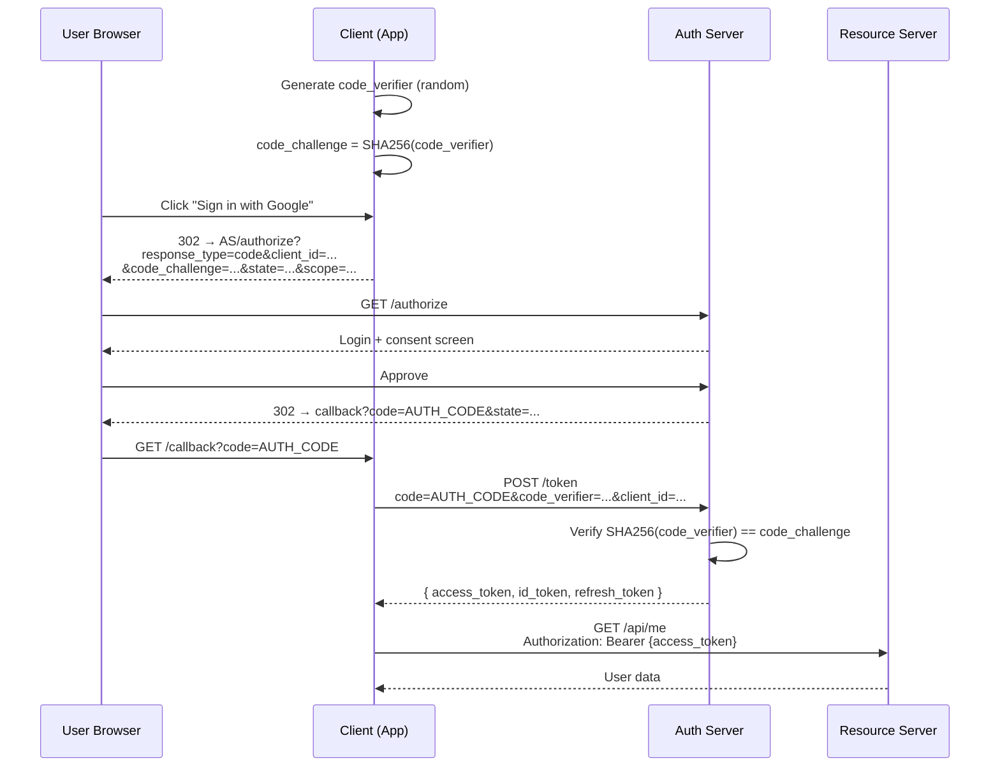
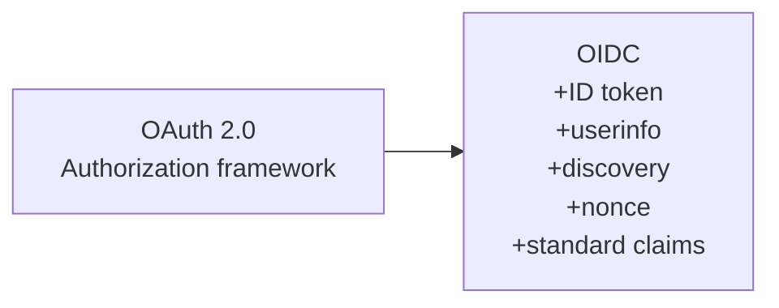

# OAuth 2.0 & OpenID Connect

> **TL;DR** — **OAuth 2.0** is a *delegation* framework: it lets a user grant a third-party app limited access to their data on another service, without sharing their password. It does **not** authenticate the user to the app — that's a common and dangerous confusion. **OpenID Connect (OIDC)** is a thin layer on top of OAuth 2.0 that adds proper authentication via an **ID token**. In practice: use OIDC when you want to log a user in ("Sign in with Google"); use OAuth alone when you need an app to call an API on the user's behalf ("read my GitHub repos"). The right flow is almost always **Authorization Code + PKCE**.

---

## 1. The Big Picture

OAuth and OIDC solve a problem older than the web: *how do I let one app act on another app's data, on my behalf, without giving away my password?*

The pre-OAuth world: paste your Gmail password into the contact-importer site. The post-OAuth world: the contact importer redirects you to Google, you approve, and the importer gets a scoped token.

Four actors:

```
┌─────────────┐    ┌────────────────────┐   ┌────────────────────┐
│   Resource  │    │   Authorization    │   │   Resource Server  │
│    Owner    │    │      Server        │   │      (API)         │
│   (user)    │    │      (IdP)         │   │                    │
└─────────────┘    └────────────────────┘   └────────────────────┘
                              ▲                       ▲
                              │ token request         │ API request + token
                              │                       │
                       ┌─────────────┐
                       │   Client    │
                       │    (app)    │
                       └─────────────┘
```

- **Resource Owner** — the human.
- **Client** — the app that wants access (your web app, mobile app, SPA, CLI).
- **Authorization Server (AS)** — issues tokens. Often called the IdP. Examples: Google, Okta, Auth0, Cognito, Keycloak.
- **Resource Server (RS)** — the API that holds the data and checks tokens. Often the same vendor as the AS, but not necessarily.

---

## 2. OAuth 2.0 ≠ Authentication

This is the single most important fact about OAuth.

> **OAuth gives you an access token. An access token says "this bearer can access these scopes for some user." It does not tell you *who* the user is.**

If you treat OAuth as login — "they came back from Google with a token, they must be Alice" — you can be tricked. An attacker can replay a token they obtained from another app (the **confused deputy** problem). This is why **OIDC** exists.

OIDC adds:
- An **ID token** — a JWT with claims about the user (`sub`, `email`, `name`, `aud`, `iss`, `iat`, `exp`).
- A standard `userinfo` endpoint.
- A `nonce` parameter to bind the token to the login attempt.
- Discovery: `/.well-known/openid-configuration`.

**Rule:** if you're logging users in, you want OIDC, not bare OAuth.

---

## 3. The Flows (a.k.a. Grant Types)

OAuth defines several flows. Some are obsolete; use the right one.

| Flow | Use when | Status |
| --- | --- | --- |
| **Authorization Code + PKCE** | Web apps, SPAs, mobile, CLI — almost everything | ✅ Default |
| **Client Credentials** | Service-to-service (no user) | ✅ |
| **Device Authorization** | TVs, CLIs without a browser | ✅ |
| **Refresh Token** | Get a new access token without re-login | ✅ (paired with above) |
| **Authorization Code (no PKCE)** | Legacy server-side web apps with a confidential client | Acceptable but PKCE is better |
| **Implicit** | SPAs — historical | ❌ Deprecated |
| **Resource Owner Password Credentials (ROPC)** | "User pastes password into client" | ❌ Avoid |

The IETF's OAuth 2.1 draft formalizes this: **PKCE everywhere, Implicit and ROPC out**.

---

## 4. Authorization Code + PKCE — The One Flow to Know

This is the default for every modern application. Walk through it once and you'll never get it wrong again.



### Why PKCE?

Without PKCE, an attacker who steals the authorization code (via a malicious app intercepting the redirect URL on a mobile device, or a logged URL in proxies) can swap it for tokens. PKCE binds the code to a secret only the original client knows — the `code_verifier`. Even if the code leaks, attackers can't redeem it.

PKCE was originally designed for mobile/SPA. It's now recommended for **every** client.

### The pieces

- **`state`** — random opaque value the client generates; the AS echoes it back. Protects against CSRF.
- **`nonce`** (OIDC) — random value bound to the login; appears in the ID token. Protects against replay.
- **`scope`** — space-separated permissions requested (`openid email read:repos`).
- **`code_challenge` / `code_verifier`** — the PKCE pair.
- **`redirect_uri`** — must exactly match a registered URI. Open redirects here = stolen tokens.

---

## 5. Tokens, Closely

OAuth defines two primary tokens; OIDC adds a third.

| Token | Format | Audience | Lifetime | Use |
| --- | --- | --- | --- | --- |
| **Access token** | Opaque or JWT | Resource Server | Short (5–60 min) | Authorize API calls |
| **Refresh token** | Opaque | Auth Server | Long (days–months) | Get new access tokens |
| **ID token** (OIDC) | JWT | Client | Short (5–60 min) | Authenticate user to client |

### Common confusion

- The **access token** is for the API, not for the client. Don't decode it for user info — it might not be a JWT, and its claims aren't standardized.
- The **ID token** is for the client, not the API. Don't send it as a bearer to the API.
- **Refresh tokens are credentials.** Treat them like passwords. Rotate them on use (refresh token rotation), bind to client, store in `HttpOnly` cookies in browsers.

### Token formats

- **JWT access tokens** — self-contained, stateless, validated by signature. Fast. But revocation is hard. See [JWT →](./jwt.md).
- **Opaque tokens (reference tokens)** — random strings; the RS calls the AS's `/introspect` endpoint to validate. Allows instant revocation but adds a network hop.

Pick based on revocation needs. Banks and payments tend to use opaque + introspection. Most SaaS use JWTs with short TTLs.

---

## 6. OpenID Connect — What It Adds

OIDC is OAuth 2.0 with a specific contract for authentication.



To request OIDC, the client includes `scope=openid` in the authorize request. The AS then issues an ID token alongside the access token.

### Standard claims in an ID token

```json
{
  "iss": "https://accounts.google.com",     // issuer
  "sub": "1234567890",                      // stable user ID at this issuer
  "aud": "your-client-id.apps.google.com",  // audience — must be your client
  "exp": 1719999999,                        // expiry
  "iat": 1719996399,                        // issued at
  "nonce": "abc123",                        // matches what you sent
  "email": "alice@example.com",
  "email_verified": true,
  "name": "Alice"
}
```

**Verification checklist** (every single time):
1. Signature verifies against the issuer's public keys (`jwks_uri`).
2. `iss` matches the expected issuer.
3. `aud` contains your client ID.
4. `exp` is in the future.
5. `nonce` matches the one you sent.

Get any of these wrong and your "login" becomes "anyone-logs-in-as-anyone".

### Discovery

`GET https://issuer.example.com/.well-known/openid-configuration` returns a JSON document listing the AS's endpoints, supported scopes, signing keys URL, etc. Every modern OIDC library uses this to autoconfigure.

---

## 7. Service-to-Service: Client Credentials

When there's no user — a backend job calling another backend — use the **Client Credentials** flow.

```
POST /token
  grant_type=client_credentials
  client_id=svc_billing
  client_secret=...
  scope=invoices:read

→ { access_token: "...", expires_in: 3600 }
```

No user, no redirects, no consent. The client is itself the resource owner. The token's `sub` is typically the client ID.

For higher security, replace `client_secret` with **private_key_jwt** (sign a JWT with your private key, the AS verifies with your public key) or **mTLS**.

---

## 8. Device Authorization Flow

For devices without a real browser — smart TVs, CLI tools, IoT.

```
1. CLI → AS: "I want a token"
2. AS → CLI: { user_code: "ABCD-WXYZ", verification_uri: "...", device_code: "..." }
3. CLI prints: "Visit https://login.example.com/device, enter ABCD-WXYZ"
4. User visits on phone, enters code, approves.
5. CLI polls AS with device_code until approved, gets token.
```

This is how `gh auth login`, `aws sso login`, and `gcloud auth login` work.

---

## 9. Scopes vs Permissions

A `scope` is what the user **consented** to. It is **not** the same as what the user is **authorized** to do.

Example: a user with read-only RBAC role in your billing app might still grant `scope=invoices:write` to an app. Your API must check **both**: the token has the scope, *and* the user has the underlying permission.

OAuth scopes:
- Are coarse-grained — "this app can read your repos."
- Are user-visible — they appear on the consent screen.
- Are decided at token issuance.

Application authorization (RBAC/ABAC):
- Is fine-grained — "this user can edit repo `acme/api` but not `acme/billing`."
- Is invisible to the user.
- Is decided per request.

Both must pass. See [RBAC, ABAC, ReBAC →](./access-control.md).

---

## 10. Real-World Choices

| Need | Use |
| --- | --- |
| Add "Sign in with Google/Microsoft/Apple" | OIDC with the provider |
| Let users connect their GitHub/Stripe to your app | OAuth 2.0 + Authorization Code + PKCE |
| Your own SaaS login | OIDC via Auth0, Okta, Cognito, Clerk, Keycloak, WorkOS |
| Service-to-service inside your org | Client Credentials or mTLS |
| Public API (developers integrate) | OAuth 2.0 + scopes |
| Enterprise SSO | SAML or OIDC — see [SSO →](./sso.md) |

**Don't roll your own.** The number of subtleties (PKCE, state, nonce, audience check, key rotation, scope validation, token revocation, refresh rotation) means handwritten implementations almost always have at least one critical bug. Use a library that's been audited (oauthlib, openid-client, Microsoft.Identity.Web, AppAuth) or a hosted IdP.

---

## 11. Common Mistakes / Anti-Patterns

- **Using OAuth (not OIDC) for login.** You're authenticating against an access token that wasn't meant for you. Add `scope=openid` and verify the ID token.
- **Skipping `state` or `nonce`.** Open invitation for CSRF and replay.
- **Wildcards in `redirect_uri` registration.** Allows attackers to redirect codes to themselves. Whitelist exact URIs.
- **Long-lived access tokens.** Compromise = months of access. Keep access tokens short (≤1 hour) and use refresh tokens.
- **Storing tokens in `localStorage` in browsers.** XSS-readable. Use `HttpOnly`, `Secure`, `SameSite=Lax` cookies, or BFF pattern.
- **Trusting ID token without verifying signature, `iss`, `aud`, `exp`, `nonce`.** Every library does this — make sure yours actually is.
- **Confusing the ID token with the access token.** Sending the wrong one to the API. Reading the wrong one for user info.
- **Using Implicit flow.** Deprecated. Migrate to Authorization Code + PKCE.
- **Trusting `email` claim as identity.** Use `sub` — emails can change or be reused across providers.
- **Treating OAuth scopes as authorization.** Scopes are user-granted consent, not server-side permissions. Both must be checked.
- **Refresh tokens that never rotate.** A stolen refresh token works forever. Use refresh token rotation; if the same RT is presented twice, invalidate the family (Auth0 / Okta pattern).
- **Sharing one IdP client across web + mobile + SPA.** Each platform has different security profiles — register separate clients with appropriate flows.

---

## 12. Cheat Card

```
OAUTH 2.0 — delegation.   OIDC — authentication on top.
Access token → for the API.   ID token → for the client.

THE ONE FLOW    Authorization Code + PKCE.   Everything else is an edge case.

PKCE
  code_verifier  = random URL-safe string (43–128 chars)
  code_challenge = base64url(SHA256(code_verifier))
  Client sends challenge in /authorize, verifier in /token.

ID TOKEN VERIFICATION (every time)
  signature (jwks)  |  iss  |  aud  |  exp  |  nonce

ANTI-PATTERNS
  - OAuth for login (use OIDC)
  - Implicit flow
  - localStorage for tokens in browsers
  - Wildcards in redirect_uri
  - Long-lived access tokens, non-rotating refresh tokens

PICK THE FLOW
  user + browser   → Authorization Code + PKCE
  service-to-svc   → Client Credentials (or mTLS)
  TV / CLI         → Device Authorization
  password paste   → don't
```

---

## 13. Resources

### Books
- *OAuth 2 in Action* — Justin Richer & Antonio Sanso. The canonical reference.
- *Solving Identity Management in Modern Applications* — Yvonne Wilson & Abhishek Hingnikar.

### Documentation
- **RFC 6749** — OAuth 2.0 Authorization Framework.
- **RFC 7636** — PKCE.
- **RFC 8252** — OAuth 2.0 for Native Apps.
- **OAuth 2.1 (draft)** — <https://datatracker.ietf.org/doc/draft-ietf-oauth-v2-1/>
- **OpenID Connect Core 1.0** — <https://openid.net/specs/openid-connect-core-1_0.html>
- **IETF OAuth Security Best Current Practice** — <https://datatracker.ietf.org/doc/draft-ietf-oauth-security-topics/>

### Articles
- "Diagrams of all the OAuth 2.0 flows" — Takahiko Kawasaki: <https://darutk.medium.com/>
- "OAuth 2.0 Simplified" — Aaron Parecki: <https://aaronparecki.com/oauth-2-simplified/>
- Auth0 docs — best practical explanations of each flow.

### Videos
- OktaDev — full OAuth/OIDC series.
- OAuth 2.0 explained — Nate Barbettini (best 1-hour intro on YouTube).

### Tools
- **Auth0 / Okta / Cognito / Clerk / WorkOS** — hosted IdPs.
- **Keycloak / Ory Hydra / Authentik** — self-hosted IdPs.
- **jwt.io** — decode JWTs.
- **oauth.tools** — interactive flow debugger.

### Adjacent reading
- [Authentication vs Authorization →](./authn-vs-authz.md)
- [JWT — JSON Web Tokens →](./jwt.md)
- [SSO — Single Sign-On →](./sso.md)
- [Session-Based Authentication →](./sessions.md)
- [RBAC, ABAC, ReBAC →](./access-control.md)
- [OWASP Top 10 →](./owasp-top-10.md)

---

*Previous:* [← Authentication vs Authorization](./authn-vs-authz.md)  |  *Next:* [JWT — JSON Web Tokens →](./jwt.md)
