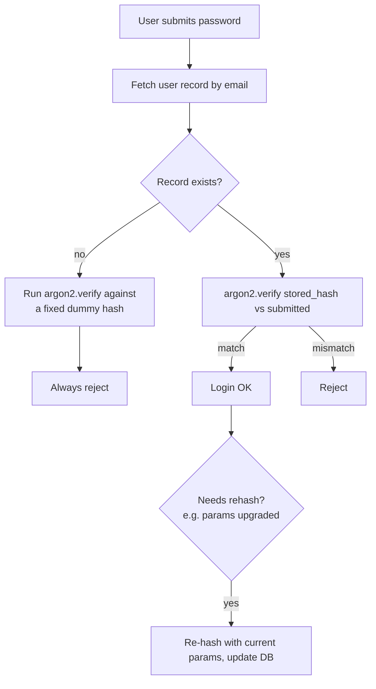

# Hashing, Salting, Password Storage (bcrypt, Argon2)

> **TL;DR** — Never store passwords. Store a **slow, salted, memory-hard hash** of the password. Use **Argon2id** for new systems; **bcrypt** is acceptable and ubiquitous; **scrypt** is fine. Never use SHA-256, MD5, or any fast hash for passwords — modern GPUs compute billions per second. Salt is per-password and stored alongside the hash; pepper is a global secret kept separately. Tune cost parameters so verification takes ~100–500 ms on your hardware. Limit password length sanely, allow long passphrases, enforce MFA on top, and never log or transmit passwords in plaintext beyond the request.

---

## 1. The Threat Model

When your user database leaks (it will, eventually, somewhere), the attacker gets:

- Usernames and emails.
- Password "hashes."

The question is: how hard does it have to be to recover the original passwords?

**Modern attackers** run cracking on GPUs and ASICs:

| Hash | Speed on commodity GPU |
| --- | --- |
| MD5 | ~30 billion/sec |
| SHA-1 | ~10 billion/sec |
| SHA-256 | ~5 billion/sec |
| bcrypt (cost=12) | ~200/sec |
| Argon2id (default params) | ~10/sec |

The point isn't "Argon2id is secure forever." It's that bcrypt and Argon2id make each guess **10⁷–10⁹× slower** than a fast hash. An 8-character password that cracks in seconds against MD5 takes years against Argon2id.

---

## 2. Password Hashing — The Four Properties

A password hashing function must be:

1. **One-way** — easy forward, infeasible backward.
2. **Salted** — same password → different hashes for different users.
3. **Slow / costly** — tunable work factor to slow brute force.
4. **Memory-hard** (modern algos) — large RAM footprint defeats GPU/ASIC parallelism.

General-purpose hashes (SHA-256) miss #3 and #4. Designed password hashes (bcrypt, scrypt, Argon2) hit all four.

---

## 3. Salting

A **salt** is a random per-password value mixed into the hash input:

```
hash = H( salt || password )
store: salt + hash
```

What salts buy you:

- **No pre-computed lookups (rainbow tables).** A rainbow table for SHA-256 of common passwords is useless if every password has a unique salt.
- **No "all users with the same password produce the same hash."** Without salt, finding one user's password reveals everyone who shares it.

Salt requirements:
- **Random** (CSPRNG).
- **At least 128 bits** (16 bytes).
- **Unique per password.**
- **Stored alongside the hash** — not secret, just unguessable.

Modern password hashes embed the salt in the output string. Example bcrypt:

```
$2b$12$N9qo8uLOickgx2ZMRZoMyeIjZAgcfl7p92ldGxad68LJZdL17lhWy
└┬┘ └┬┘ └─────────────┬────────────────┘└─────────┬──────────┘
 │   │                │                            │
 │   │              salt (22 chars)             hash (31 chars)
 │   cost factor (2^12 iterations)
 algorithm version
```

Everything needed to verify is in this single string.

---

## 4. Peppering (Optional but Nice)

A **pepper** is a global secret added to every password before hashing:

```
hash = bcrypt(password + pepper, salt)
```

Pepper lives **outside the database** — in a KMS, env var, or HSM. So even if the DB leaks, the attacker doesn't have the pepper and cannot test guesses.

Pros:
- Significantly raises the bar after a DB-only breach.
- Cheap to implement.

Cons:
- Rotating a pepper is hard — every existing hash is bound to the old one.
- If the pepper leaks, you're back to "just salted hashes."

OWASP recommends pepper for high-value applications. For most SaaS, it's optional but recommended.

---

## 5. Bcrypt

Created 1999, by Niels Provos and David Mazières. The default for two decades.

```python
import bcrypt
salt = bcrypt.gensalt(rounds=12)            # cost factor 12 → 2^12 iterations
hash = bcrypt.hashpw(password.encode(), salt)
# store hash in DB

# verify
bcrypt.checkpw(submitted.encode(), stored_hash)
```

Properties:
- Cost factor exponent: each +1 doubles the work.
- 72-byte input limit — anything past 72 bytes is silently truncated (a sharp edge).
- No memory-hardness — vulnerable to GPU/ASIC parallelism more than Argon2.

Recommended cost factor in 2026: **12** for typical web apps (≈300 ms on modern hardware), **13–14** for high-value (banks, password managers).

Bcrypt remains acceptable for new systems but Argon2id is the modern pick.

---

## 6. Argon2

Winner of the 2015 Password Hashing Competition. The current state of the art.

Three variants:
- **Argon2d** — data-dependent, GPU-resistant, but vulnerable to side-channel attacks.
- **Argon2i** — data-independent, side-channel-resistant, weaker against GPUs.
- **Argon2id** — hybrid, the recommended default for password hashing.

```python
from argon2 import PasswordHasher
ph = PasswordHasher(
    time_cost=3,        # iterations
    memory_cost=65536,  # 64 MB
    parallelism=4,      # threads
    hash_len=32,
    salt_len=16,
)
hash = ph.hash(password)

# verify
try:
    ph.verify(stored_hash, submitted)
except VerifyMismatchError:
    ...
```

Parameter guidance (OWASP, 2026):
- **memory_cost ≥ 19 MiB** (`19456`) for back-end use; 64–256 MiB if you can afford it.
- **time_cost ≥ 2**.
- **parallelism = number of cores** dedicated to hashing (typically 1–4).

Argon2id's memory-hardness is its key advantage: GPUs and ASICs are bad at large random-access memory; CPUs are fine. This levels the playing field.

---

## 7. Scrypt

Created 2009 by Colin Percival (Tarsnap). Memory-hard. Less common than bcrypt/Argon2 but still respectable.

```python
import hashlib, os
salt = os.urandom(16)
hash = hashlib.scrypt(password.encode(), salt=salt, n=2**16, r=8, p=1, dklen=32)
```

Used by Litecoin, Tarsnap, some legacy systems. If you have it, you're fine. New systems should use Argon2id.

---

## 8. PBKDF2

Pre-2010 standard, still in many compliance docs (FIPS 140-2 lists it).

Properties:
- Slow via iteration count, **not** memory-hard.
- GPU-friendly to attackers — significantly weaker than bcrypt/scrypt/Argon2 per dollar.
- Still better than nothing, much better than SHA-256.

Use PBKDF2 only when forced by FIPS / regulatory requirements with iteration count ≥ 600,000 (SHA-256) per OWASP guidance.

---

## 9. The "Don't" List

| Algorithm | Use for passwords? |
| --- | --- |
| **MD5** | ❌ Broken. Don't use for anything security-relevant. |
| **SHA-1** | ❌ Broken. Don't. |
| **SHA-256, SHA-512** | ❌ Fast hash — wrong tool for passwords. |
| **HMAC** | ❌ Same problem. |
| **AES** | ❌ Encryption, not hashing. Reversible. |
| **Anything you wrote** | ❌ |

If your codebase still has `sha256(password + salt)`, that's the highest-priority security task on your team.

### Migration plan from a fast hash

You can't reverse-hash to recover passwords, but you can upgrade:

1. Add an `algo_version` column. Existing rows say `sha256_v1`. New rows are `argon2id_v1`.
2. On successful login of an old-algo user: re-hash with the new algorithm and update the row.
3. Eventually, the long tail of inactive users → force a password reset.

Don't double-hash (`argon2id(sha256(password))`) — it works, but it's confusing and brittle. Migrate cleanly.

---

## 10. Verification Flow



Two subtle points:

1. **Dummy verify when user doesn't exist.** Without it, "no such user" returns in 1 ms and "wrong password" returns in 300 ms — a timing oracle for user enumeration. Always run a verify against a dummy hash so the response time is the same.

2. **Rehash on upgrade.** When you bump your cost parameters, existing users keep working but stay at the old cost until their next successful login.

---

## 11. Password Policy — What Modern Guidance Says

NIST SP 800-63B (the modern reference) and OWASP both diverged from the old "complex rules" school. Current best practice:

- **Allow long passwords** — 64+ characters minimum. Allow spaces.
- **Allow all Unicode** (normalize to NFKC before hashing).
- **Don't require special characters / numbers / mixed case.** These rules push users to `Password1!` patterns.
- **Block against known-leaked passwords.** Use Have I Been Pwned's API (or its `k-anonymity` model for privacy) on signup.
- **Don't require periodic password changes** unless there's evidence of compromise.
- **Length over complexity.** A long passphrase beats a short complex password.
- **Don't restrict by maximum length below ~64.** Some sites cap at 16 — pointless and harmful.
- **Cap input length to prevent DoS** — say, 256 bytes. Avoids attacks where Argon2 spends seconds on a 10 MB input.

### Account lockout vs rate limiting

Lockouts after N failed attempts:
- Were standard for decades.
- Now considered weaker than rate-limiting per IP + global account login throttling, since lockouts enable denial-of-service (lock all users by guessing their accounts).

Best practice: progressive backoff (retry after 1s, 2s, 5s, 30s, 5min...) plus IP-based rate limiting plus alerting on bursts.

---

## 12. Storage and Transit

- **In transit:** HTTPS only. Reject password submission over HTTP.
- **In logs:** never. Redact at logging middleware.
- **In the application:** held in memory briefly, then overwritten if possible (hard in garbage-collected languages but possible in Go/Rust).
- **In backups:** the hashes are in the DB backup — make sure the backup is encrypted at rest. See [Encryption at Rest & In Transit →](./encryption.md).
- **Recovery flows:** don't email passwords. Send a time-limited reset token (single-use, expires in 15 minutes, invalidates on use).

### "Forgot my password" link

```
1. User enters email → server generates token (32 random bytes → URL-safe).
2. Store hash of token (not the token itself) + user_id + expiry in DB.
3. Email link: https://app.example.com/reset?token=<plaintext>
4. User clicks → server hashes token, looks up, validates expiry, lets them set new password.
5. Mark token used (single-use).
6. Invalidate all sessions for that user.
```

The token is itself a password — treat it accordingly.

---

## 13. MFA: The Other Half

Password hashing protects you from offline cracking after a breach. **MFA protects you from online attacks on individual accounts.** Both are needed.

- **TOTP (Authenticator apps)** — phishable but solid baseline.
- **WebAuthn / Passkeys** — phishing-resistant, the future.
- **SMS** — better than nothing, vulnerable to SIM swap. Avoid for high-value accounts.

Even a perfect password hash is irrelevant if a user gets phished. Push users toward MFA, and consider going passwordless with passkeys.

---

## 14. Common Mistakes / Anti-Patterns

- **Using SHA-256 (or fast variants) for passwords.** Cracking is trivial on modern hardware.
- **No salt, or shared salt.** Rainbow tables. Same hash for identical passwords.
- **Truncating passwords at 8 / 16 characters silently.** Bcrypt truncates at 72 bytes — be aware.
- **Logging passwords or password hashes.** Either is dangerous; hashes leak if logs do.
- **Returning different errors for "wrong user" vs "wrong password".** User enumeration.
- **Timing leak between user-exists and not-exists.** Use dummy verify.
- **Storing the password reset token as plaintext.** Hash it; verify by hashing the submission.
- **Long-lived reset tokens / non-single-use.** 15-minute expiry, single use, invalidate on consumption.
- **Periodic forced password changes.** Drives users to `Spring2026!` patterns. NIST removed this guidance years ago.
- **Composition rules that drive predictable patterns.** Length over rules.
- **No rate-limit on /login.** A patient attacker brute-forces accounts online.
- **No re-hash on upgrade.** Cost parameters bumped → most users stay at the old cost forever.
- **Argon2 params too low or too high.** Too low: weak. Too high: server CPU/DoS risk. Aim for 100–500 ms per verify.
- **Not invalidating sessions on password change.** Stolen sessions outlive the credential rotation.
- **Encrypting passwords instead of hashing.** Encryption is reversible. If you can decrypt, so can the attacker.

---

## 15. Cheat Card

```
NEVER STORE PASSWORDS.  STORE HASHES.

ALGORITHMS (2026)
  Argon2id   memory_cost ≥ 19 MiB, time_cost ≥ 2, parallelism ~ cores
  bcrypt     cost = 12  (acceptable, 72-byte input limit)
  scrypt     N=2^16, r=8, p=1
  PBKDF2     only when FIPS-required, iter ≥ 600k

NEVER       MD5 · SHA-1 · SHA-256 (alone) · plain HMAC · AES · DIY

SALT        ≥ 128 bits, random (CSPRNG), per-password, stored with hash
PEPPER      global secret in KMS/env; optional, recommended for high-value

VERIFY      ~ 100–500 ms per attempt on production hardware
            dummy-verify when user not found (timing parity)
            rehash on login if params upgraded

POLICY (NIST 800-63B + OWASP)
  ≥ 8 chars min, allow 64+, allow Unicode + spaces
  check against breach list (HIBP k-anonymity)
  NO complexity rules, NO mandatory rotation
  rate-limit + progressive backoff; avoid lockout DoS

TRANSIT     HTTPS only. Never log. Never email a password.
RESET       single-use token, 15-min expiry, hashed in DB

PAIR WITH   MFA (TOTP / WebAuthn / passkeys). Hashing ≠ phishing defense.

RULE: use a library + tuned parameters. Don't write hash code.
```

---

## 16. Resources

### Documentation
- **OWASP Password Storage Cheat Sheet** — <https://cheatsheetseries.owasp.org/cheatsheets/Password_Storage_Cheat_Sheet.html>
- **NIST SP 800-63B** — Authenticator Assurance Levels: <https://pages.nist.gov/800-63-3/sp800-63b.html>
- **Argon2 RFC 9106** — <https://datatracker.ietf.org/doc/rfc9106/>
- **bcrypt original paper** — Provos & Mazières, USENIX 1999.

### Articles
- "Don't roll your own crypto" — every crypto blog ever.
- "How To Safely Store A Password" — Coda Hale (the classic post).
- "Cracking story: how I made $200k in a month cracking hashes" — research papers on cracking demonstrate why slow hashes matter.
- "Have I Been Pwned" — password breach lookup: <https://haveibeenpwned.com/Passwords>

### Videos
- ByteByteGo — "How to store passwords".
- Computerphile — "Password storage" with Mike Pound.

### Tools
- **Hashcat / John the Ripper** — try cracking your own hashes; tuning aid.
- **HIBP API** — check password breach status without sending the password.
- **libsodium** — provides Argon2id out of the box.
- **bcrypt / argon2-cffi (Python)**, **bcrypt / argon2 (Node)**, **golang.org/x/crypto/argon2**.

### Books
- *Serious Cryptography* — Aumasson. Chapter on password hashing is excellent.
- *Real-World Cryptography* — Wong.

### Adjacent reading
- [Encryption at Rest & In Transit →](./encryption.md)
- [Public-Key Cryptography Basics →](./pki.md)
- [Session-Based Authentication →](./sessions.md)
- [Authentication vs Authorization →](./authn-vs-authz.md)
- [Secrets Management →](./secrets-management.md)
- [OWASP Top 10 →](./owasp-top-10.md)

---

*Previous:* [← Encryption at Rest & In Transit](./encryption.md)  |  *Next:* [Public-Key Cryptography Basics →](./pki.md)
